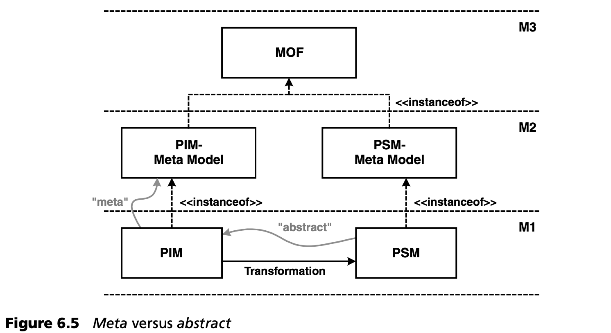

## 6.3 MOF 和 UML
UML 是 MOF 的一个实例，是 MOF 的一种应用。必须考虑各种细节。

首先，UML 存在于 MOF *之前*。UML 最初没有正式定义 -- 也就是说，它纯粹是口头定义的。后来才定义了 MOF，以便在 MOF 的基础上正式指定 UML。这一系列过程中出现的问题在后来的 UML 修订版中得到了解决，因此现在 UML 可以被诚恳地称为 MOF 语言。

MOF 模型的符号是 UML 的具体语法。这有时会导致混淆。从形式上讲，这个问题可以通过指定模型元素的命名空间/包来解决，但混淆的可能性仍然存在。

还应注意的是，MOF 包含的许多模型元素在 UML 中也有。例如，这两种语言都有一个叫做 *类 (Class)* 的元素。尽管这些元素具有相同的名称，而且表面上也经常描述相同的特征，但它们并不完全相同 -- 这仅仅是因为它们位于不同的元层次上。

