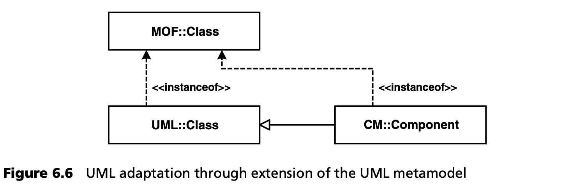
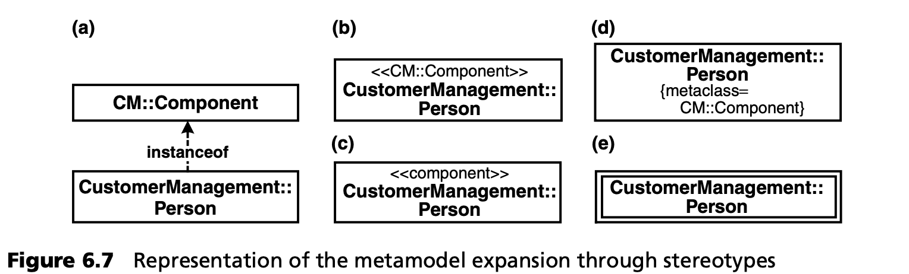
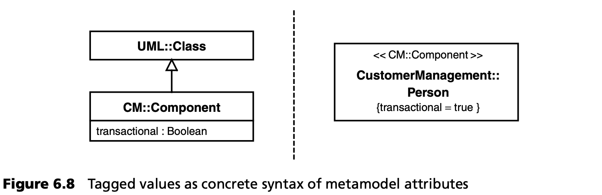
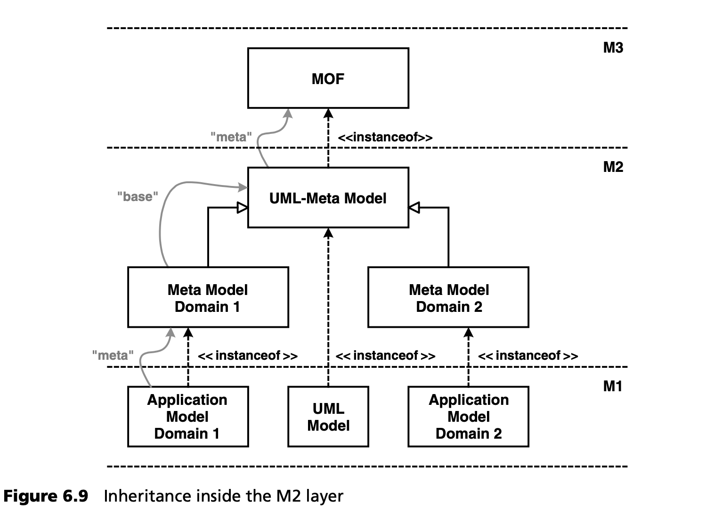
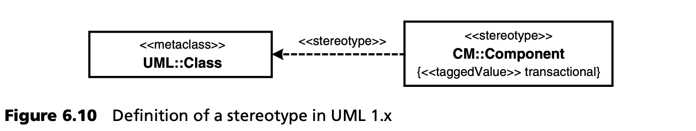
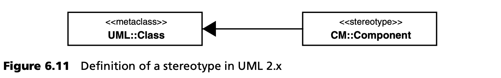
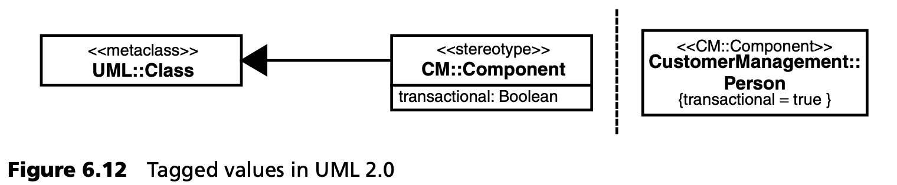

## 6.4 扩展 UML
在软件开发过程中，人们通常不会一开始就根据 MOF 定义一种全新的 M2 语言。相反，我们会从 UML 元模型开始，并根据需要对其进行扩展。要进行这种扩展，有三种选择：

* 基于 UML 正式的元模型进行扩展。
* 使用定型/配置文件进行扩展（通过 UML 1.x）。
* 使用定型/配置文件进行扩展（通过 UML 2）。

我们将在下面的章节中逐一介绍这些方法。在实践中，由于有许多可用的工具来定义基于 UML 的元模型，我们主要使用定型/配置文件机制。

### 6.4.1 基于元模型的扩展
这类扩展是对 UML 元模型的扩展。为此，我们将一如既往地在建模中使用更高层次的元语言，在这里就是 MOF。只有当一个工具拥有明确表示的、公开的、基于 MOF 的元模型时，这种扩展才能在该工具中进行。

例如，要定义自己的类，您需要创建一个继承自 UML 元类 UML::Class 的新 M2 类。图 6.6 展示了这个过程。

这里定义了一种新的语言结构 -- *CM::Component*。这是 UML 中 *Class* 元素的子类。正如我们在上一节所解释的，这里使用了 MOF 的继承机制，因为我们毕竟是在处理 UML 的 MOF 模型。

理论上可以为我们定义的每个语言元素指定一个图形表示法 -- 具体语法，如图 6.7 中的(e)所示。但在实践中这往往是不可能的，因为工具不支持。还可以使用其他类型的表示法，其中大多数都是基于定型的。

图 6.7 (a) 显示了作为元类 *CM::Component* 的直接实例的 *CustomerManagement::Person* 类。(b) 使用元类的名称作为定型，而 (c) 使用约定俗成的缩写，(d) 使用标记值说明元类，(e) 使用单独的图形符号。在现实生活中，(c) 方法已被证明是最可行的，而 (e) 如果工具允许，则是一个可行的替代方案。

*CM::Component* 除了形式上的类型外，无法与 UML 类区分开来，因为它既不添加也不覆盖任何属性和操作，也不定义约束。这并不一定总是正确的：我们可以为自己的元类定义新的属性。如图 6.8 所示，这些属性通常在目标模型中用标记值表示。

这里介绍的建模语言适应类型 --使用 MOF 扩展元模型-- 不仅适用于 UML，也适用于所有其他基于 MOF 的建模语言。下文将进一步介绍的基于配置文件的机制则仅限于 UML，因为它本身就是 UML 的一部分。

需要指出的是，当元模型通过继承扩展时，不能切换到另一个元级别。图 6.9 说明了这一点。

图 6.9 还显示，前缀 *meta* 原则上总是相对于模型[3](#3)
而言的。当一个元模型被扩展时，其原点被称为 *基本元模型 (basic metamodel)*。

### 6.4.2 在 UML 1.x 中使用定型的扩展
使用定型的扩展是 UML 特有的功能，被定义为 Profile 机制的一部分。这意味着 UML 本身是一种可以在一定程度上扩展 UML 元模型的方式，或者更准确地说，是一种不需要使用 MOF 提供的建模语言定义手段就可以进行专门化的方式。其中一个原因可能是，最初定义 UML 时，MOF 并不存在，所以必须提供其他扩展手段。这种扩展机制只适用于 UML，因此其他基于 MOF 的语言必须定义自己的扩展机制。

图 6.10 显示了 *CM::Component* 定型的定义，包括标记值 *transactional*。

值得注意的是，图 6.10 中的图在形式上是 MOF 层次的 M1 模型，因为它是一个 UML 模型，而不是 UML 元模型的一部分。从语义上讲，它属于 M2 层，因为很明显，这里专门有一个 UML 元类 (UML::Class)。

与通过 MOF 扩展元模型相比，这种方法的严重局限性在于标记值没有类型化（所有标记值都是字符串），而且不能在现有元模型类或定型之间定义新的元关联。不过，这种方法的优势在于它在通用 UML 工具领域的可用性。

### 6.4.3 在 UML 2 中用配置文件扩展
随着 UML 2.0 的定义，定型机制被扩展并置于更全面的配置文件机制中（另见第 6.5 节和第 12 章）。扩展的概念在这里至关重要。扩展是 UML 的一种新符号，因此也是一种新的语言结构。如图 6.11 所示，它呈现为一个填充的继承箭头。

需要强调的是，我们在这里处理的不是继承、实现、定型依赖或关联，而是一种全新的 UML 语言构造，它在 UML 元模型中也有正式定义。

定型可以有属性。在 UML 1.x 中，这些属性在使用定型的模型中被呈现为标记值（见图 6.12）。从 UML 2 开始，标记值可以分配类型，因此所有标记值本身不再是字符串。

UML 2.0 与 UML 1.x 的另一个区别是，一个模型元素现在可以同时拥有多个定型。它拥有所有定型的属性作为标记值[4](#4)。

---
#### 3
0-3 级只有在 OMG 中才有固定名称。

#### 4
严格地说，标签值不再是标签值，而是立体模型属性的表示。不过，由于它们看起来仍像标记值，所以仍被称为标记值。
