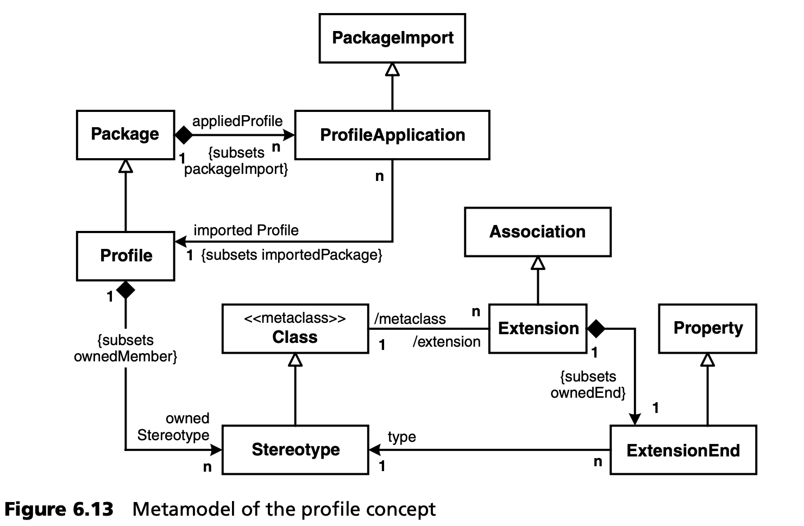
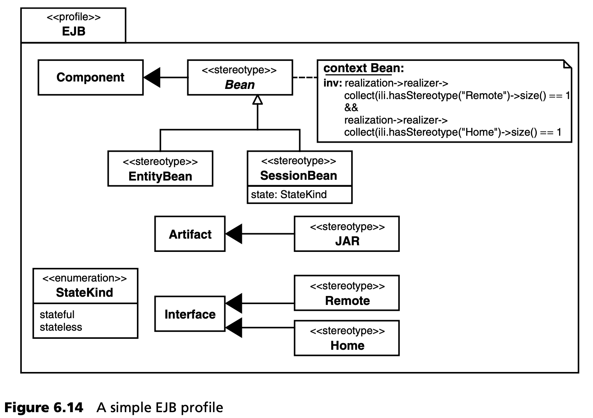

## 6.5 UML 配置文件
配置文件 (Profiles) 支持对 UML 进行调整或扩展，以适应专业或技术领域。也可以说，UML 不是一种语言，而是一个语系 (language *family*) ：在这种情况下，UML 配置文件是这个语系中的元素 -- 具体语言。目的是让 UML 工具和生成器能像处理插件一样处理配置文件：首先加载特定的配置文件，然后根据配置文件建模。为使其在实践中顺利运行，模型、profile、转换和工具之间必须明确分离。为此，OMG 为 UML 定义了一个 profile 机制。(在这里，我们也是在处理 UML 特有的机制）。

原则上，UML 配置文件由三种类组成：定型、标记值和约束[5](#5)。配置文件可以扩展 UML 的有效约束，即进一步约束它们，但不能放松它们的限制。在 UML 1.x 中，profile 的构造只是口头定义的。在 UML 2.0 中，正式定义了基于 UML 元模型的配置文件概念。在这里，我们还可以找到上一节提到的扩展概念的定义。

图 6.13 显示了 UML 2.0 规范中配置文件定义的元模型 -- 它本身就是元模型的一个例子。我们省略了明确标记每个元素的命名空间 (namespace) ，因为这都是 UML 元模型[6](#6)的一部分。

根据图 6.13，*proflie* 首先被定义为 *UML::Package* 的特殊化。Packages 可以通过使用 *ProfileApplication* (*PackageImport* 的特殊化）来配置。更宽泛地说，当一个包导入一个配置文件包 (profile package) 时，这意味着配置文件 (profile) 被应用到导入包中。一个配置文件包含许多定型 -- 定型是 *UML::Class* 的特殊化。在这种情况下，扩展（见第 6.4.2 节）是 *UML::Association* 的一种特殊化，其中 *UML::Association* 的一端必须引用一个定型。

现在，UML 提供了通过 UML 表达配置文件的语言选项，也提供了在应用模型中使用配置文件的语言选项。图 6.14 显示了 EJB[7](#7) 配置文件的定义（极其简化）。

经过上面的解释，该图应该不言自明了。不过，在此还应提及一些有趣的方面。一方面，定型可以是 *抽象的 (abstract)* ，这在概念上与抽象类的含义相同：它们不能直接注释为模型元素；它们只是作为进一步定型的基本（元）类。定型也可以相互继承。为定型定义的约束意味着这些约束必须对使用了定型的类有效。在图 6.14 的示例中，这意味着 *Bean* 必须实现一个 *RemoteInterface* 和一个 *HomeInterface*。此外，该示例还演示了如何对 *枚举 (Enumerations)* 进行建模，在本例中，枚举仅用于键入标记值。

配置文件不是独立的。相反，它总是依赖并使用 *参考元模型 (reference metamodel)* 。这个元模型可以是 UML 元模型，也可以是现有的配置文件。配置文件不能改变或删除参考元模型中的现有定义，但配置文件机制是一个定义明确的后门，通过它可以添加新的构造（定型）及其属性（标记值）。附加的建模规则（约束）也是如此，它们进一步限制了构造的相互作用，从而使特定语言模型的完备性正规化。

这也可以作为 *适应 (adaptation)* UML 工具的基础，使开发人员在建模过程中就能及早注意到特定配置文件的建模错误。一般来说，目前大多数可用的 UML 工具还没有这么先进。在许多工具中，建模规则仍然由脚本或插件等专有机制支持（如果有的话）。在这种情况改变之前，在实践中有以下处理配置文件的选择：

* 配置文件中的约束仅用于文档目的：如有必要，它们只是非形式化的记述。
* 配置文件约束的形式化（实现）是通过 UML 工具的特定机制来实现的。
* 由 MDA/MDSD 生成器来测试格式是否正确，如果需要，它可以独立于 UML 工具来验证配置文件模型。在这种情况下，建模规则必须 “传授” 给生成器。如果为此目的使用 OCL 解释器，甚至可以评估符合 OMG 的正式配置文件定义。

---
#### 5
UML 2.0 对这一点的正式定义略有不同--见下文。

#### 6
为简洁起见，省略了一些约束。

#### 7
该模型中用于约束的 OCL 将在后面解释。
