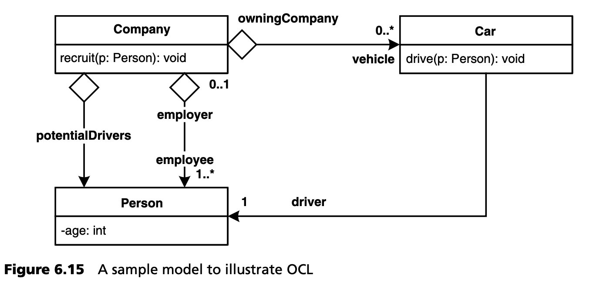
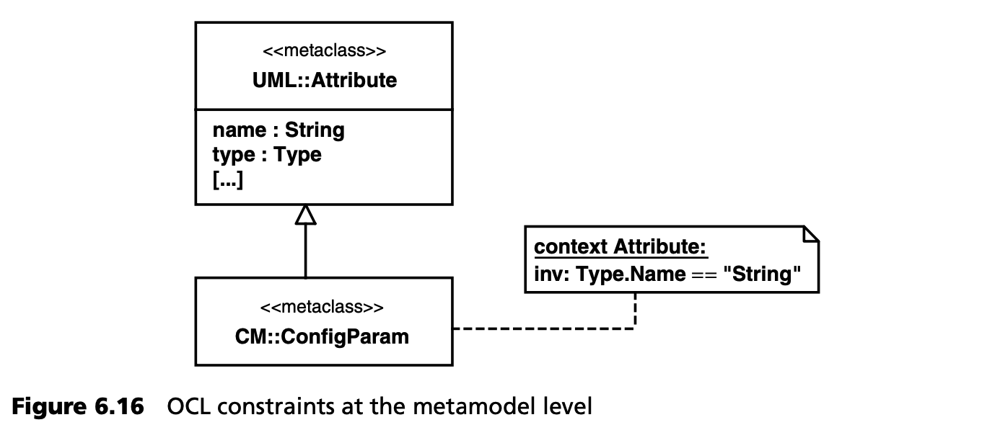

## 6.6 元建模和 OCL
OCL 是对象约束语言（Object Constraint Language）的缩写。这是一种无副作用的声明式语言，用于定义约束（限制），如基于 MOF 的建模语言的建模规则。约束为模型实例的有效性提供了附加信息，从而丰富了模型。约束既适用于 M1 层，也适用于 M2 层。

假设我们有一个 UML 模型，其中包含人和车之间的关联，如图 6.15 所示。人既可以是司机，也可以是乘客。虽然任何人都可以是乘客，但司机必须至少年满 18 岁并持有驾照。如何用 UML 表达呢？



除了定义一个名为 AdultPersonWithDriversLicense（有驾照的成年人）的子类及其驾驶员关联这个次优选项外，唯一的其他选项就是使用约束。在下面的示例中，将通过口头和 OCL 对约束进行描述。

对于 “汽车” 的所有实例，汽车驾驶员必须至少年满 18 周岁（不变式）。

```
Car
driver.age >= 18
```

对于 "公司" 的所有实例 ，它都认为公司的潜在驾驶员是所有 18 岁以上的员工。

```
Company
potentialDrivers = employees->select( age >= 18 )
```

对于汽车类的 drive() 操作来说，它被调用的前提条件是车内没有驾驶员，且作为参数传递的人年龄大于 18 岁（前置条件）。执行该操作后，作为参数传递的人将扮演驾驶员的角色（后置条件）。

```
Car::drive( p : Person )
pre : ( driver == null ) && ( p.age >= 18 )
post: driver = p
```

对于公司类的 recruit() 操作来说，在执行该操作后，雇员列表中的雇员人数增加了一名，而新增的人员现在是该列表的一部分。

```
Company::recruit(p : Person)
pre : -- none
post: (employee.size = employee@pre.size + 1) &&
    (employee.includes(p))
```

从这些例子中可以看出，用 OCL 编写的约束比自由文本更精确、更简洁。特别是，它们与模型是正式耦合的。OCL 在元建模中具有特殊意义。这是因为元模型应极其精确，并可由工具处理：用自然语言编写的约束无法由验证工具处理。

首先，OCL 约束与建模语言无关。这尤其意味着 OCL 约束可用于各种元级别。上面的例子在具体的 UML 模型中使用了 OCL，即在 M1 层。在这里，它影响该模型元素的实例：一般来说，Mn 中的约束会影响 Mn-1。OCL 对模型驱动开发尤其重要，因为它也可以在 M2 层使用，例如在元模型扩展中。图 6.16 展示了使用 OCL 约束的 UML 元模型扩展。


