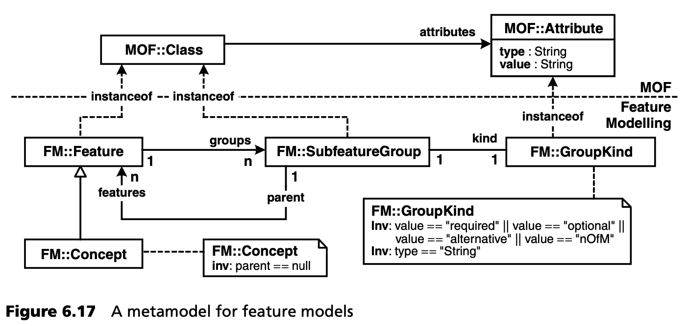
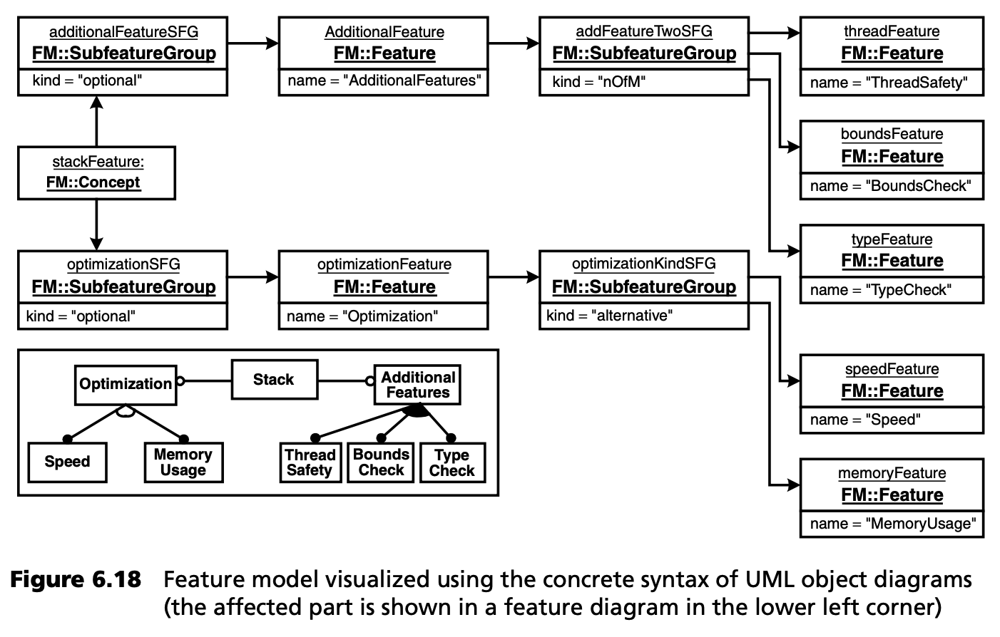
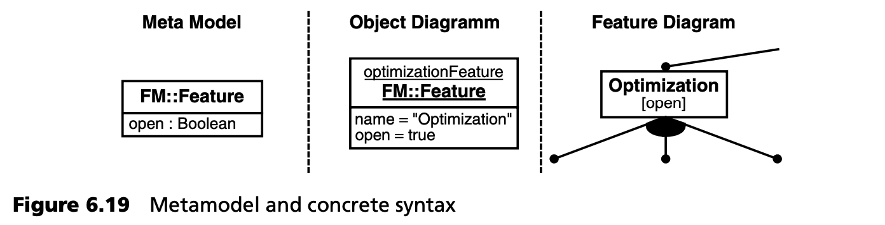

## 6.7 元建模： 例 1
现在，我们开发自己的元模型，用于演示与 UML 无关的元模型，即不扩展 UML 元模型的元模型。在我们的例子中，我们将使用生成式编程和 FODA 方法（[EC00](../ref.md#ec00), [FODA](../ref.md#foda)）中已知的特征模型 (feature models) 。第 [13.5](../ch13/5.md) 节将详细介绍这个例子。

图 6.17 显示了这种特征模型的元模型。请注意，这是特征模型的元模型。我们在此不讨论它的图解表示。

我们首先将 *Feature* 定义为 *MOF::Class* 的一个实例。一个特征可以有多个子特征组。*SubfeatureGroup* 也是一个 *MOF::Class*，包含各种 *子特征* 。子特征组有一个种类 (kind)，可以是 *required*, *optional*, *alternative* 或 *n-from-m* ，使用属性 *kind* 建模。在这里，*GroupKind* 通过从超元类 *MOF::Attribute* 继承获得属性 *Type* 和 *Value*。或者，我们也可以将 *SubfeatureGroup* 定义为抽象元类，将各种类型定义为具体子类。

图 6.18 是第 [13.5.3](../ch13/5.md#1353-方法) 节中的例子 - 特征模型的摘录，它是基于我们刚刚定义的元模型的 UML 对象图。这张图非常清楚地说明了为什么使用合适的图形符号很重要，在本例中就是使用特征图的符号。这比 UML 对象图（理论上足够）更易读，也更容易创建。特定领域建模能否被接受，通常主要取决于是否有合适的图形符号和匹配的工具支持。

特征模型可以通过进一步的信息来丰富。例如，我们可以确定某个特征是否被认为是 *final*，或者是否可能添加其他特征，如果需要的话，与新的 *SubfeatureGroup* 相关联。在后一种情况下，这种特征被称为 *open*。如图 6.19 所示，元模型可以很容易地扩展，其在实例图中的呈现也是显而易见的。

第 [13.5.3](../ch13/5.md#1353-方法) 节将深入讨论特征模型的使用。
