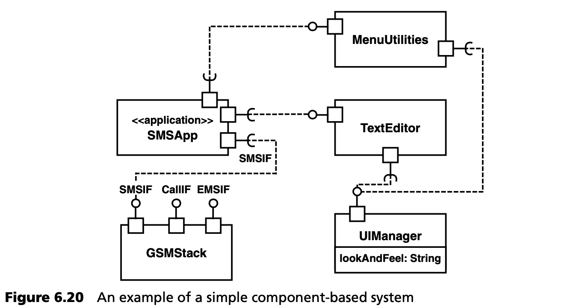
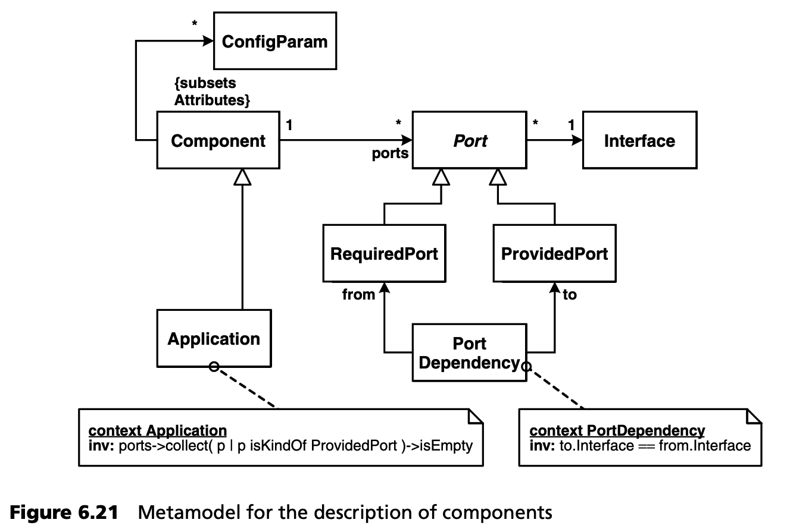
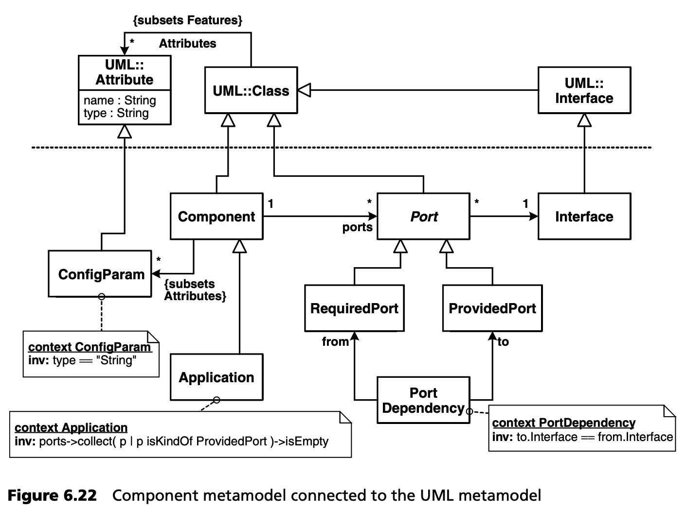

## 6.8 元建模： 实例 2
适用于小型设备和嵌入式系统的极其简化的组件基础架构 [VSW02]（见第 16 章和 [Voe02]）将作为元建模的另一个例子。基于该基础架构的应用程序的核心要素显然是组件。在架构定义过程中，定义什么是组件是很有意义的，这就是为什么我们首先要为该基础架构的组件定义元模型[8](#8)。

图 6.20 展示了一个使用组件概念的具体模型的简单示例。它显示了移动电话 SMS 短信应用程序中的组件依赖关系。首先，我们要表达这样一个事实，即一个组件可以提供许多服务，这些服务被定义为所提供的端口。所提供的端口与定义可用操作的接口相关联。此外，一个组件必须表达它需要哪些资源。这可以通过为组件分配一个所需的端口来实现。这个端口也有一个接口。在这种情况下，接口规定了组件需要其他组件提供哪些操作。

此外，组件还有一些配置参数。为简化起见，这些参数是组件类的属性，必须是字符串类型，因为它们是在系统启动时从配置文件中读取的。

最后，还有一些特殊类型的组件，它们只使用服务而不提供任何：应用程序。

图 6.20 中的示例中，应用程序 SMSApp 定义了三个所需的端口。这些端口与定义其他端口的接口相连。例如，用户需要 TextEditor 组件的服务接口来输入短信。TextEditor 和 MenuUtilities 需要 UIManager 才能访问屏幕。图 6.21 显示了该架构的元模型。

这个元模型正式表达了我们上面用文字描述的内容，至少是部分内容。实例图（图 6.20 所示的 SMS 应用程序）与元模型的耦合是通过定型和图形符号实现的：按照 UML 2.0，端口被建模为组件边缘上的小矩形。这种组件的属性顾名思义就是配置参数。作为组件，应用程序被赋予了 “应用程序”（Application）定型。

为了避免从头开始创建一个全新的元模型，我们将以 UML 元模型为基础创建自己的元模型。我们还记得 “配置参数是字符串类型的属性 ”这句话。换句话说：元类 Attribute 出现在 UML 元模型中。它有一个名为 Type 的属性。我们只是说元类 ConfigParam 是属性（Attribute）的子类，其属性 Type 的值必须是 String。图 6.22 中的图表说明了这一点，以及我们的元模型基于 UML 元模型的其他结果。注意使用 OCL 定义必要的约束。

现在我们可以对元模型的其他元素进行类似处理。图 6.22 显示了结果，同时我们分别引入了命名空间和包 CM（表示组件模型）。

这种显式元建模的实际好处是什么？一如既往，只有当模型不会最终被尘封在抽屉里时，建模才真正有意义：根据 MDSD 原则，这些模型必须能在软件开发中使用。这当然也适用于元模型。这些元模型应该是可实施的，并支持进一步的开发过程。因此，重要的不仅是以图表的形式 “绘制 ”元模型，还要使用元模型调整开发工具。

本章开头列出的几个方面--模型验证、转换、代码生成和工具适配--在这里都很重要。

接下来，我们将仔细研究其中的第一个方面，即模型验证。其余部分在第 16 章的案例研究中进行了说明，该案例扩展了上文的组件示例。

#### 8
由于我们在元模型中映射了目标架构的概念，因此这是一个以架构为中心、模型驱动开发的例子。
