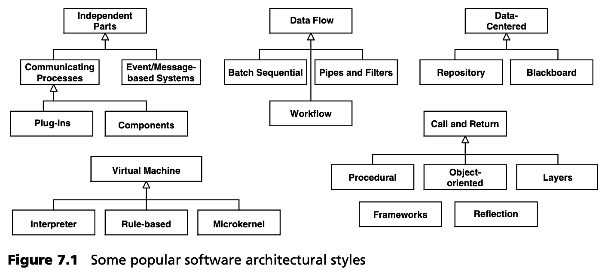

## 7.3 如何建立好的架构？
关于如何产生好的架构的问题 --无论是否产生-- 可以写成整整一本书，我们不想在这里讨论它的全部内容。不过，我们想讨论其中的一些方面。

### 7.3.1 架构模式与风格
在软件技术领域，只有少数运行良好的架构蓝图为人所知。这些蓝图有各种不同的描述形式：如模式 [POSA1](../ref.md#posa1) 或风格 [BCK98](../ref.md#bck98)。图 7.1 显示了一些典型的架构风格。

获得良好架构的一种行之有效的方法是使用一种经过检验和测试的架构模式或风格作为自己架构的基础。[POSA1](../ref.md#posa1)
对基本架构模式进行了相当详尽和广泛的描述。此外，还有许多书籍介绍了特定类型系统的架构。这里举几个例子：

- *并发和网络对象模式 (Patterns for Concurrent and Networked Objects)* 描述了分布式多线程系统 [POSA2](../ref.md#posa2)
。
- *资源管理模式 (Resource Management Patterns)* 描述了资源管理在架构上的重要性 [POSA3](../ref.md#posa3)。
- *服务器组件模式 (Server Component Patterns)* 描述了 EJB、CCM 或 COM+ 等组件基础架构的内部结构 [VSW02](../ref.md#vsw02)。
- *远程模式 (Remoting Patterns)* 描述了 CORBA、.NET Remoting 或 Web Services 等远程中间件的内部架构 [VKZ04](../ref.md#vkz04)。
- *企业架构模式 (Patterns of Enterprise Architecture)* 描述了大型企业系统的总体架构 [Fow04](../ref.md#fow04)。
- *企业集成模式 (Enterprise Integration Patterns )* 描述了 EAI 系统和消息中间件的体系结构 [Hor04](../ref.md#hor04)。

如今，J2EE 或 .NET 等参考架构和平台经常被用作架构的基础。使用这样的平台并不会自动产生一个坚实的架构，但它可以作为一个坚实的基础，特别是在非功能方面。我们仍需决定希望使用平台提供的哪些概念以及如何使用。

获得良好架构的一个行之有效的方法是在多个应用（最好是同一软件族）的运行过程中不断开发架构。从架构中积累的经验有助于改进架构的新版本或系统族的其他成员。在这方面，MDSD 对所创建应用的软件架构也有积极影响。
