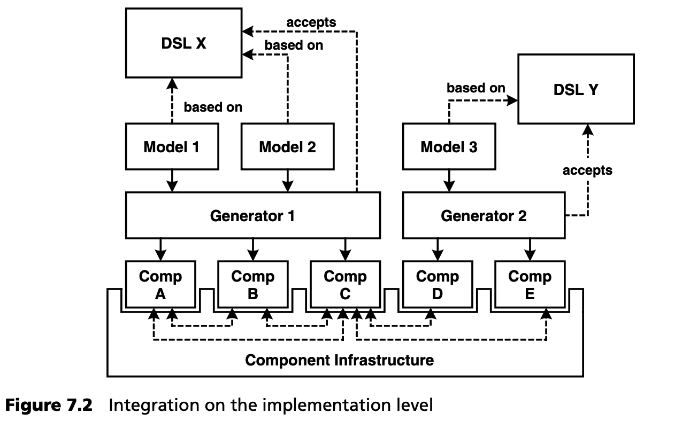

## 7.4 软件体系结构的基石
本节讨论软件架构的某些方面及其与 MDSD 的相关性。

### 7.4.1 框架
我们把任何可以通过系统扩展或配置进行调整或扩展的东西都称为框架。例如，使用框架的开发人员必须指定特定的配置参数、扩展超类或实现回调。通常情况下，为了实现特定功能（即特定特性），必须进行不止一种调整。重要的是，这些调整必须相互兼容。对于许多框架来说，做到这一点并不容易，这也是框架有时难以使用、名声不佳的主要原因之一。

MDSD 可以帮助您通过合适的 DSL 来指定所需的功能。然后，您就可以从使用 DSL 建立的模型中生成各种适应框架。因此，框架和 DSL 是一种理想的组合： 借助框架可以很好地实现 MDSD 平台。

### 7.4.2 中间件
中间件可以看作是一种框架。在大多数情况下，它是特定于某个技术领域（如分布式系统、消息传递或事务）的，并为目标架构提供技术基础。由于中间件侧重于技术方面，它适用于许多功能和专业领域[2](#2) ，因此常常被标准化。著名的例子有 CORBA、DCOM、MQSeries 和 CICS。

### 7.4.3 组件
组件基础架构是一种功能特别强大、非常流行的中间件类型。我们不想完全沉浸在如何定义 “组件” 一词的讨论中，这里只想做一个简要的解释。

*组件是一个独立的软件，具有明确定义的接口和明确声明的上下文依赖关系。*

因此，组件是整齐的模块化和可组装系统的基础。许多领域架构都用于定义组件或将预制组件组合在一起以构建应用程序。

组件的另一个重要方面是，由于系统中存在不同的子领域，因此组件是通过不同 DSL 指定的系统组成的 “最小公分母”。理想情况下，这种组合应该在模型层进行（见第 15 章），但在实践中并不总能获得或使用为此所需的工具（模型转换器）。因此，如图 7.2 所示，不同子系统的组合是在实现层面进行的。

容器基础架构（如 EJB、COM+ 或 .NET 企业服务）是 MDSD 的重要基础。毕竟，它们为组件提供了一个技术平台，而组件最好只包含与系统功能要求相关的代码。在这种情况下，容器从组件中提取技术方面的因素，并以标准化和可重复使用的形式提供。这种容器大多不是生成的，而只是由 MDSD 通过从模型生成配置文件（EJB 中的部署描述符）来配置的。用于嵌入式系统的组件基础架构是个例外，我们将在第 16 章对此进行讨论。

本章其余部分和第 17 章将进一步说明 MDSD 与基于组件的开发的集成。

--- 
#### 2
我们在全书中使用 “功能/专业 ”一词，作为德语单词 “fachlich ”的英语版本。该词在英语中没有直接对应词：在德语中，我们说的是技术领域（technischen domains），而 “专业领域”（fachlichen domains）则是它们的对立面。Technisch 显然涉及技术问题，如可扩展性、持久性、事务、负载平衡和安全性。功能/专业（fachlichen）域则是处理以应用为导向的问题，例如保险、射电天文学、税务计算、发动机管理等。
