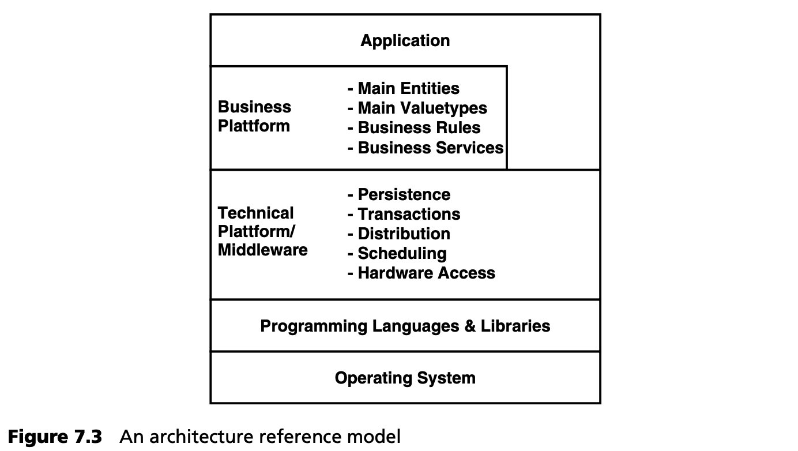

## 7.5 架构参考模型
在实践中，分层模型已被证明在软件架构中最为有用。在几乎所有结构良好的软件系统中都可以找到某种形式的这种结构。图 7.3 展示了这一点。

操作系统和编程语言形成了每种架构的基础。在此基础上，通常会有一个提供基本技术服务的技术框架，通常使用中间件来实现。这些服务可以是持久性、事务、分发、工作流、图形用户界面、调度或硬件访问功能。该层实际提供哪些服务的问题取决于技术领域，如实时嵌入式、业务或点对点领域。这类框架的典型例子是企业领域的 J2EE 和 .NET，以及嵌入式系统领域的 Osek + Standard Core（主要用于汽车领域）。

基于这一层的框架通常为功能/专业领域提供基础：

- *实体 (Entities)* 代表具有身份和生命周期的概念 -- 例如，每个客户都有一个身份，只要对象存在，就必须保留这个身份。
- *值对象 (Value objects)* 代表值。例如，银行业务中的金额或 GPS 应用中的坐标集就是值对象的很好例子。值对象没有标识：只有其值才是相关的，具有相同值的两个对象被认为是完全相同的。
- *业务规则和约束 (Business rules and Constraints)* 。例如，汽车司机的年龄必须始终大于 18 岁，或者交易中的金额永远不能为负数。
- *服务 (Services)* 。这里定义了不能分配给实体的基本服务，例如交易的执行或编辑系统中复杂文档结构的验证。

尽管本列表基于企业/业务系统，但这些陈述同样适用于技术或嵌入式系统，只是在这种情况下，术语和软件/技术实现方式有所不同。实际应用基于这些框架构建。
