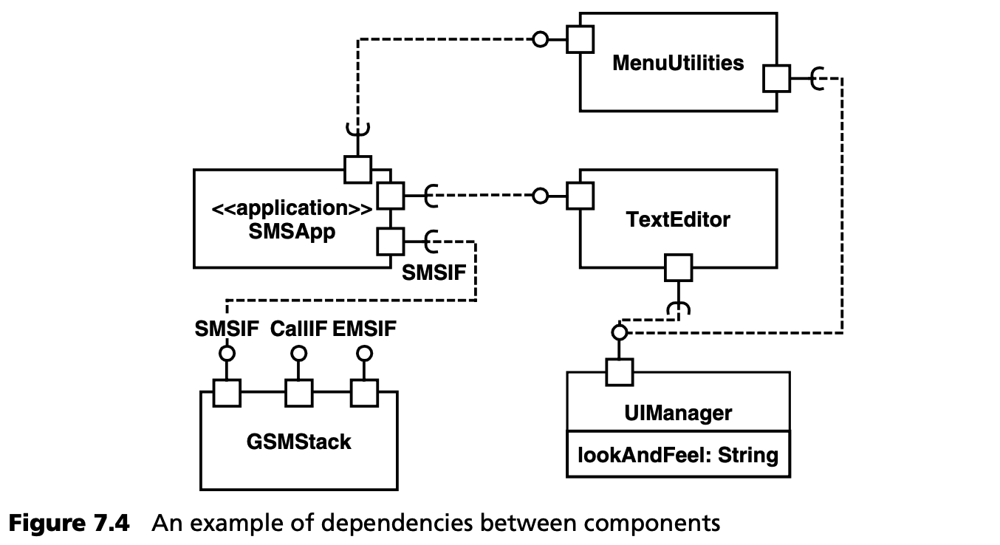

## 7.7 架构一致性
一个好的目标架构只有在日常项目工作中不被忽视或规避，才能发挥其优势。传统的方法，如审查和过多的文档，在与更大的团队合作时不容易扩展。对于生成的代码，MDSD 本身提供了解决方案，特别是因为使用模型描述的架构的各个方面是以转换规则的形式制定的。

第 [6](../ch6/0.md) 章和第 [16](../ch16/0.md) 章中描述的组件示例可以作为一个例子，<ins>说明如何在系统的手工编程部分中，强制执行或控制对目标架构特定特性的遵守 (observation)</ins>。我们可以展示使用这些选项会对目标架构产生哪些影响。图 7.4 可以进一步说明这个例子：



从图中可以看出，组件 *SMSApp* 通过接口依赖于组件 *MenuUtilities*、*TextEditor* 和 *GSMStack*。对这种依赖关系的明确描述及其管理是大型项目架构的一个重要方面。因此，组件或其实现代码不可能访问 *模型中未定义依赖关系的* 接口或组件。在大型项目中，必须确保这一点，最好是通过自动化来实现。MDSD 可以做到这一点，特别是通过其代码生成方面。下面的代码段展示了一个组件的 “经典” 实现：通过从中央组件工厂查询相应的引用来访问其他组件：

```java
public class SMSAppImpl {
  public void doSomething() {
    TextEditor editor = (TextEditor)
             Factory.getComponent(“TextEditor”);
    editor.setText( someText );
    editor.show();
  }
}
```
<ins>要确保开发人员不会非法从数据库中获取其他引用并不容易。这只能通过审查 (review) 或其他工具（如 AspectJ）来实现。不过，如果开发是模型驱动的，还有另一种选择：可以为每个组件生成一个 *组件上下文 (component context)* [VSW02](../ref.md#vsw02)，该上下文只允许访问那些在模型中给出了依赖关系的组件或接口</ins>。下面的代码说明了这一点：

```java
public interface SMSAppContext
        extends ComponentContext {
public TextEditorIF getTextEditorIF();
  public SMSIF getSMSIF();
  public MenuIF getMenuIF();
}
public class SMSAppImpl implements Component {
  private SMSAppContext context = null;
  public void init( ComponentContext ctx) {
    this.context = (SMSAppContext)ctx;
  }
  public void doSomething() {
    TextEditor editor = 
            context.getTextEditorIF();
    editor.setText( someText );
    editor.show();
  }
}
```
现在，开发人员不能再自主获取任意引用，他们只能访问组件上下文中存在访问操作的引用。这些访问操作由模型生成。如果开发人员希望访问其他接口，就必须在模型中包含这些接口，否则代码中将无法提供必要的访问方法。这就保证了一个组件只拥有它在模型中明确声明的那些依赖关系。当然，需要更完善的基础设施：例如，“某人” 必须调用 *init()* 操作并提供正确的上下文对象。在基于组件的系统中，这是 *容器 (container)* 的任务 -- 在这里是运行时系统，它负责组件的生命周期。

这种方法还有一个令人愉悦的副作用，那就是在现代 IDE 中，开发者可以通过代码补全功能方便地了解组件上下文中包含哪些操作 -- 因此，合法依赖关系的信息可以直接在代码中找到，从而使开发人员更容易遵守架构规则！

<ins>上面的例子还显示了使用 MDSD 对架构的影响。如果必须手工实现，开发人员绝不会想到为每个组件提供一个单独的上下文类 <sup>[note](#note)</sup>。因此，MDSD 的使用提供了更多的架构选择。在定义目标架构时，了解并使用这些替代方案至关重要。</ins>

---
#### note
译注：在 Spring 框架中，依赖注入已经可以完成类似的上下文功能，但对缺少 Spring 的环境，这种设计思路还是值得考虑的。
