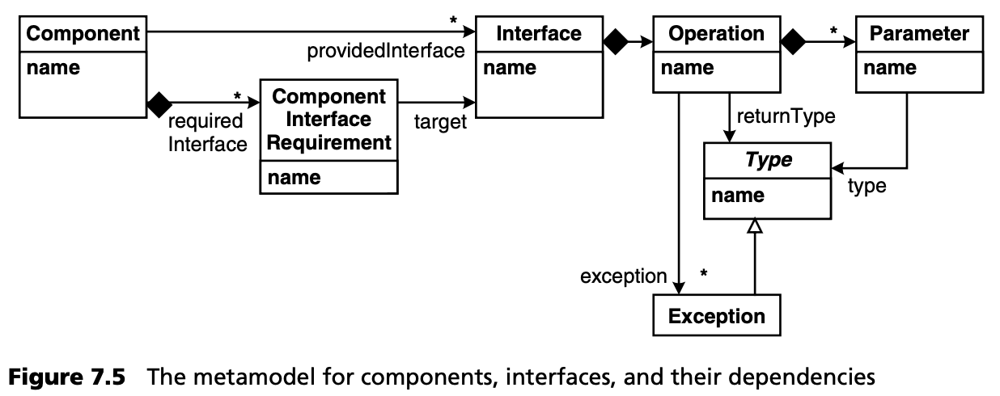
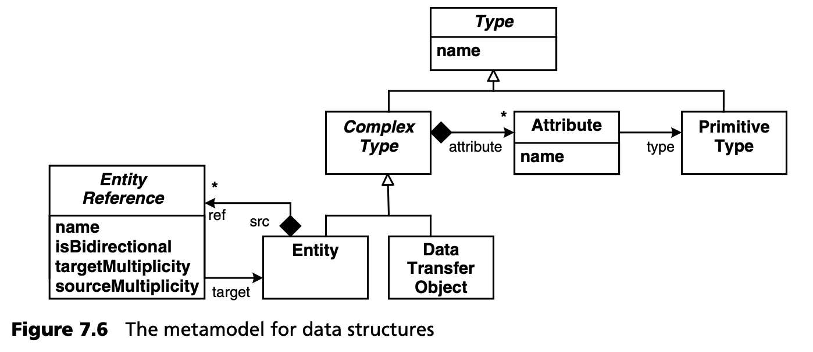
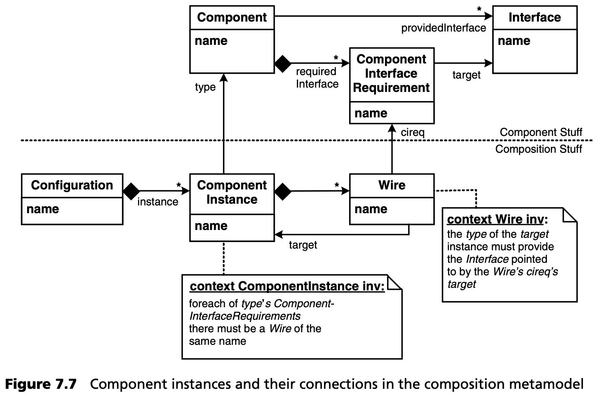
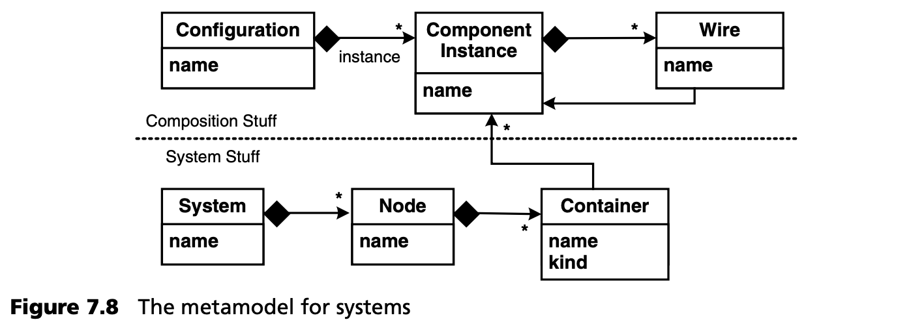
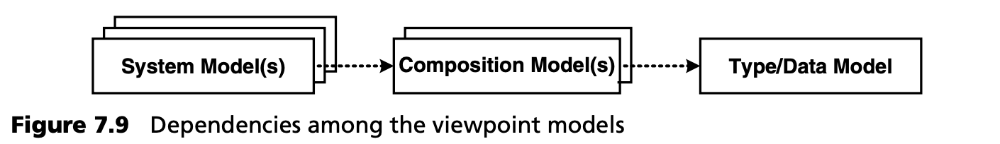
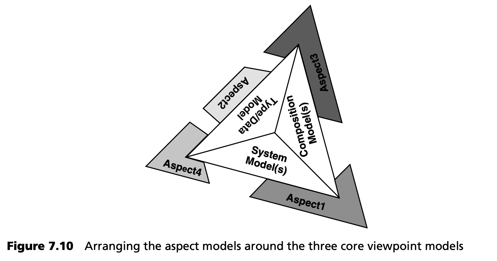
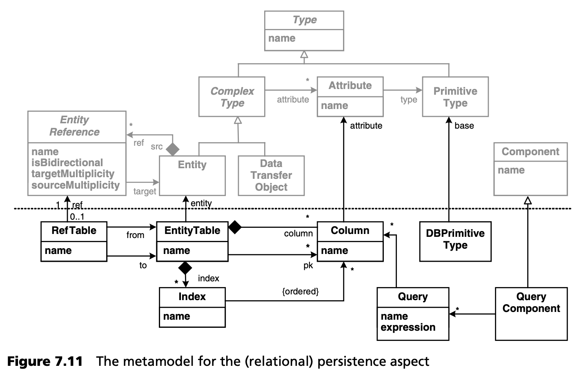
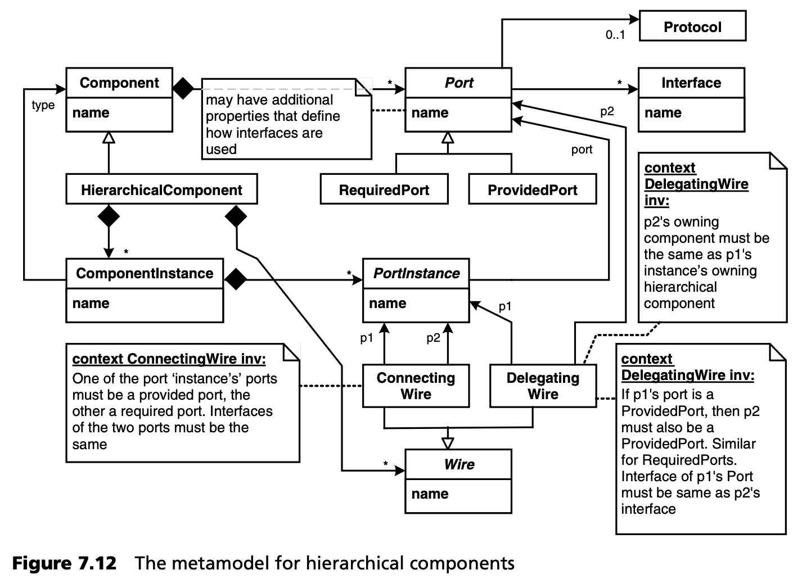
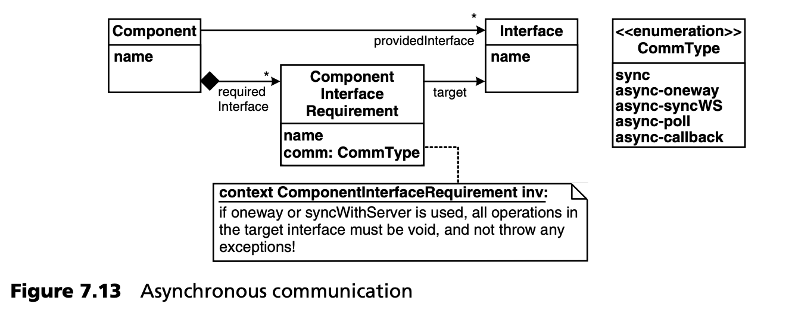
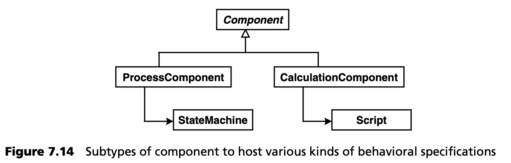

## 7.8 MDSD 和 CBD
组件化开发（CBD）是构建复杂系统的一种流行比喻，与面向服务的架构（SOA）类似，后者在第 [7.8](../ch7/8.md) 节中有所介绍。 在前面的章节中，我们已经介绍了 MDSD 和 CBD 之间相互影响的一些方面：在本节中，我们将进一步探讨这一点。根据我们在开发项目中的经验，我们发现我们几乎总是从建模，待建系统的组件结构开始。为此，我们首先要定义什么是组件，即定义基于组件的开发元模型。与开发项目所处的领域无关，这些元模型在保险、电子商务、射电天文学等应用领域（相对于持久性、事务处理、安全性等技术领域）都非常相似。因此，我们在此展示了这些元模型的部分内容，以便您在定义自己的组件架构时能先行一步。这与第 [13.4](../ch13/4.md) 节中提出的架构流程非常吻合。

### 7.8.1 三个视角
从三个视角来看待基于组件的系统是非常有用的，我们将在第 [17](../ch17/0.md) 章的企业系统案例研究中进一步阐述这一观点。

***类型视角***

*类型 (type)* 视角描述了组件类型、接口和数据结构。一个组件提供若干接口，并引用若干必要的接口。一个接口拥有许多操作，每个操作都有返回类型、参数和异常。图 7.5 展示了这一点。

为了描述组件使用的数据结构（图 7.6），我们从抽象类型 *Type* 开始。我们使用基本类型和复合类型。复合类型有许多命名和类型化的属性。复合类型有两种。*数据传输对象 (Data transfer objects)* 是简单的结构体，用于在组件间交换数据。*实体 (Entities)* 有一个唯一的 ID，并且可以持久化（元模型中看不到）。实体之间可以相互引用，从而构建更复杂的数据图。每个引用都必须指定它是只能在一个维度还是两个维度上导航。引用还指定了实体在各自两端的基数 (cardinalities)。

***组成视角***

图 7.7 所示的这一视角描述了组件实例及其连接方式。一个配置由多个组件实例组成，每个实例都知道自己的类型。一个实例有若干 *wire* ：一个 *wire* 就是一个组件接口要求的实例。请注意元模型中定义的约束条件：

- 对于实例类型中定义的每个组件接口要求，我们都需要提供一个 wire。
- wire 目标端的组件实例类型需要提供 wire 的组件接口要求所指向的接口。

使用类型视角和组成视角，可以定义组件类型及其协作。可以定义应用程序的逻辑模型。例如，可以使用 UML 渲染这两种模型，生成骨架类，然后在子类中实现应用逻辑。从组成的角度来看，你可以生成或配置一个容器来实例化组件实例。验证应用逻辑的单元测试可以在这里运行。

***系统视角***

第三个视角描述的是系统基础架构，前两个视角定义的逻辑系统就部署在这个基础架构上。

系统由多个节点组成，每个节点都承载着容器。一个容器承载多个组件实例。请注意，容器也定义了它的种类，如 CCM、J2EE、Eclipse 或 Spring。根据这些信息，你可以生成必要的 “粘合” 代码，以便在该类型的容器中运行组件。

节点信息与组合模型中定义的连接一起，可让您生成从远程通信基础架构代码和配置到构建和打包脚本等各种内容。

### 7.8.2 视角依赖

您可能已经观察到，模型之间的依赖关系结构良好。由于您希望能够使用相同的组件和接口定义 *多个* 组合体，并且希望能够在 *多个* 基础设施上运行相同的组合体，因此只有图 7.9 所示的方向上的依赖关系才是合法的。

### 7.8.3 切面模型
上述三种视角是建模和构建基于组件的系统的良好起点。然而，在大多数情况下，仅有这三种模型是不够的。系统的其他方面需要通过，围绕三个核心视图模型的特定切面 (aspect) 模型来描述，如图 7.10 所示。

以下切面通常用单独的切面模型来处理：
- 持久性
- 授权和认证（在企业系统中很重要）
- 表单、布局、页面流（用于 Web 应用程序）
- 定时、调度和其他服务质量切面（特别是在嵌入式系统中）
- 打包和部署
- 诊断和监控

切面模型的理念是，这些信息并不会添加到三个核心视角中，而是使用具有合适具体语法的单独模型来描述。同样，元模型的依赖性也很重要：切面可能依赖于核心视角模型，甚至可能相互依赖，但核心视角绝不能依赖于任何切面模型。图 7.11 展示了一个简化的持久性切面元模型。

### 7.8.4 变化
我们上面描述的元模型不可能在每个项目中都以完全相同的方式使用。而且，在许多情况下，构成组件的概念需要扩展。因此，这些元模型有许多变体。不过，从实践来看，即使是这些变化也是有限的。在本节中，我们将对其中的一些变化进行说明。

- 你可能不需要单独的接口。操作可以直接添加到组件中。因此，您当然不能独立于供应方或消费方组件，单独重复使用接口 contracts。
- 通常，您需要不同类型的组件，如域组件、数据访问（DAO）组件、流程组件或业务规则组件。根据组件分类，您可以在组件之间建立有效的依赖结构。根据组件类型的不同，您通常还需要使用不同的方式来实现组件功能（另请参见第 [7.8.5](#785-组件实现) 节）。
- 另一种管理依赖关系的方法是为每个组件标注一个 *layer* 标签，如 *domain*、*service*、*gui* 或 *facade*，并定义这些层中的组件如何相互依赖的约束条件。
- 如图 7.12 所示，层级 (Hierarchical) 组件是一种非常强大的工具。在这里，一个组件的内部结构是由其他组件实例组成的。端口定义了组件的连接方式：端口具有可选的协议定义，允许进行端口兼容性检查，而不仅仅是简单的接口相等。这种方法虽然功能强大，但也不简单，因为它模糊了以前类型视角和组成视角之间的明显区别。

- 一个组件可能有许多配置参数（类似于命令行程序中的参数），这些参数有助于配置组件的行为。参数及其类型是在类型模型中定义的，参数值可以在以后指定，例如在组合模型或系统模型中。
- 您可能需要说明组件是无状态的还是有状态的，是否线程安全，以及它们的生命周期应该是怎样的（例如，它们是被动的还是主动的，是否希望收到生命周期事件（如激活）的通知，等等）。
- 使用简单的同步通信并不总是足够的。相反，各种异步通信模式（如 [VKZ04](../ref.md#vkz04) 中描述的模式）之一可能会适用。由于使用这些模式会影响组件的 API，因此必须在类型模型中标明要使用的模式，如图 7.13 所示。

- 除了通过接口进行通信外，您可能还需要使用，静态或动态发布者/订阅者基础架构，进行（异步）事件通信。这些事件的 “流动方向” 通常与上文讨论的使用依赖性相反，这一点非常有用。
- 组合模型以静态方式连接组件实例。这并不总是可行的。如果需要动态连接，最好的办法是将决定运行时连接哪个实例的信息嵌入到静态 wire 模型中。因此，与其在模型中指定实例 A 必须与实例 B 布线，不如在模型中只指定 A 需要与具有以下属性的组件连接：需要提供特定的接口，例如提供特定的可靠性。在运行时，使用实例存储库将 (repository) 将 wire "递延 (deferenced)“ 到合适的实例。这种方法类似于 CORBA’s trader service。
- 最后，通常有必要为复杂系统的结构化提供额外的手段。通常使用的术语是 *业务组件或子系统 (business component or subsystem)* 。这种更高层次的结构由若干组件组成。可以选择使用约束条件来定义哪类组件可以包含在特定的高层结构中。例如，您可能希望定义一个业务组件总是由一个 facade 组件和任意数量的领域组件组成。

### 7.8.5 组件实现
组件的实现通常是手工完成的。这意味着开发人员要在组件骨架中添加手工编写的代码，要么直接将代码添加到生成的类中，要么 --一种更好的方法-- 使用其他组合方式，如继承或部分类。其主要原因是，支持在模型层面对应用逻辑进行通用表述的操作语言 (action languages) 仍未得到广泛支持。然而，使用通用操作语言来描述结构工件的行为（如类的操作或状态的动作）只是一种选择。还有其他一些描述应用程序逻辑的方法，我们将在下文概述其中一些。所有这些方法的共同点是，它们不是提供一种 *通用 (generic)* 的方法来对模型中的所有行为进行建模，而是使用特定于 *某种 (kind)* 指定的行为符号。

- 在模型中通过设置少量定义明确的变化点进行参数化后，可以使用生成器实现非常规则的行为。特征模型善于表达需要确定的变异点，以便生成实现。
- 对于基于状态的行为，可以使用状态机。
- 对于业务规则等内容，可以定义一个 DSL 来直接表达这些规则，然后使用规则引擎对其进行评估。有几种现成的规则引擎可供使用。
- 对于特定领域的计算（如保险领域常见的计算），您可能需要提供一种特定的文本符号，以直接支持该领域所需的数学运算。这类语言通常是解释型的：从技术上讲，其实现由一个解释器组成，解释器的参数是它应该运行的程序。

请注意，我们一般并不反对动作语义语言 (Action Semantics Languages,ASL) ，我们只是想指出，它们并不提供特定领域的抽象，而是一种通用语言，就像 UML 是一种通用建模语言一样。不过，即使您使用了更具体的符号，可能仍然需要以通用方式指定行为的小片段。状态机中的动作就是一个很好的例子。

为了将指定行为的各种方法与组件符号结合起来，我们可以在元层使用子类型定义各种组件，每种组件都有自己的指定行为的符号。第 [17](../ch17/0.md) 章中的案例研究说明了这种方法，图 7.14 也阐述了这一思想。

由于组件的实现与行为有关，因此从技术上讲，在组件内部封装一个解释器通常是非常有用的。这种 “解释器组件” 与其他组件一样，仍然是一个组件。然而，它们的引入提出了一个需要解决的问题： 解释器如何知道要执行哪个脚本？

对此，基本上有三种不同的方法。要么组件始终执行相同的脚本，要么将整个脚本作为参数传递给组件，要么将脚本的某种标识符传递给组件。这可以在创建组件时作为配置过程的一部分进行，也可以在每次方法调用时进行。有关解释的更多详情，请参见第 [8.4](../ch8/4.md) 节。

最后需要注意的是，本节的讨论只与 *特定于应用程序 (application-specific)* 的行为相关，而与所有的实现代码无关。大量的实现代码与应用程序的技术基础架构有关，如远程化、持久化、工作流等，这些代码可以从（结构）模型中导出。
