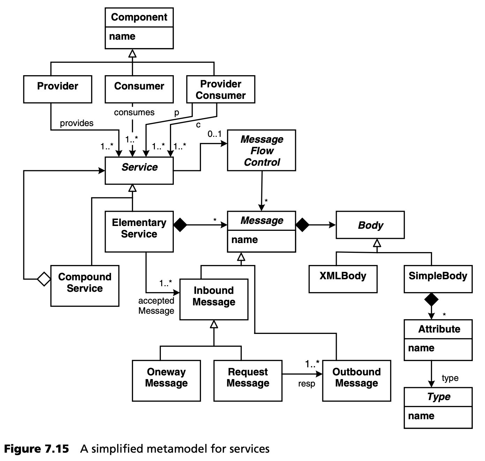

## 7.9 SOA、BPM 和 MDSD
面向服务的架构 (Service-Oriented Architectures, SOA) 和业务流程管理 (Business Process Management, BPM) 是当今信息技术领域两个热门话题。本节将以 MDSD 为中心的视角来看待它们，并讨论它们之间可能存在的协同作用。

### 7.9.1 SOA
关于 SOA 的实际含义，目前还没有一个公认的定义。有些人把 SOA 仅仅等同于 “使用 Web 服务”。事实上，SOA 至少是由 Web 服务技术，包括业务流程执行语言 (Business Process Execution Language, BPEL) 驱动的。<ins>从我们的角度来看，SOA 与特定的技术（WSDL、SOAP、HTTP）毫无关系，而是一套用于构建大型、可扩展和可组合系统的架构最佳实践</ins>。一个结构合理、基于组件、接口定义清晰、组件责任明确的架构，完全可以被视为 SOA。组件是提供和消费服务的构件的自然选择。业界意识到了这一点，目前正在定义服务组件架构 (Service-Component Architectures, SCA) 标准。

不过，如果对 SOA 再仔细研究一下，就能发现一些重要特性，而这些特性在（大多数）基于组件的系统中是找不到的：

- 服务交互以消息为导向，或以文档为中心。不定义严格类型化的接口，而是定义作为交互基础的文档结构 (schema) 。如果方法得当，这将使消息结构的演变和版本控制变得更加简单。
- 交互模式 --信息的有效序列-- 是明确定义的。交互通常是会话式的 -- 服务交互的 “双方” 都保留会话会话状态。这些特性是服务间协调 (orchestration) 的基础。交互通常是异步的。
- 服务质量问题得到明确解决。服务提供商不仅要提供特定的服务功能，还要提供在性能和可靠性方面达到规定服务水平的功能。
- 服务描述和特征可在运行时获得。利用服务注册表，系统可以动态组装。
- 通常情况下，服务具有互操作性 -- 在不同平台上实现的系统都可以使用它们。

除了这些特点外，服务的设计还应该是粗粒度的，并能封装与业务相关的功能 -- 尽管没有人说得清这到底意味着什么！服务通常由明确建模的业务流程使用，但绝不仅限于此。最后，与任何优秀的 IT 系统一样，服务也具有安全性、事务性和可管理性。

至于这些特性是否真的与当今结构良好的企业系统有如此大的区别，众说纷纭。不过，我们认为显而易见的是，模型在面向服务系统的定义和运行中发挥着核心作用：

- 报文模式 (Message schemas) 是一种数据结构模型，它规定了所需和可选的内容，以及报文格式在服务演进过程中的变化方式。
- 服务之间的交互模式是用模型定义的：例如，通信状态机是描述有效信息序列和异常情况的有用符号。
- 服务提供商提供的质量等级，和服务消费者要求的质量等级，基本上都是经过评估和兼容性检查的模型。
- 运行时存储库 (runtime repository ) 基本上使得模型信息可在运行时被查询。
- 最后，从同一权威模型为不同平台生成实现和绑定，可以实现互操作性。

<ins>因此，我们认为 SOA 的核心理念是首先建立接口契约 (interface contract) ！在开发系统时，首先要指定的是通信伙伴如何实际互动，这与通信技术和实现平台 *无关* 。相反，你需要在抽象和正式的层面上指定信息格式、交互模式和服务质量契约</ins>。这基本上意味着：根据第 [13.4](../ch13/4.md) 节所述的架构流程使用 MDSD。

图 7.15 显示了一个简化的服务元模型。它还显示了如何将 SOA “世界” 与上一节所述的组件 “世界” 联系起来。

在 SOA 的背景下，你经常会看到两幅图片，一边是一个像意大利面条一样的系统，所有这些相互连接都被标注为 “旧的”；另一边是一组排列有序的组件，它们通过一条总线连接在一起，所有组件都连接到这条总线上，并被标注为 “面向服务的”。<ins>这使人们认为，在 SOA 中，所有系统都必须通过单一的技术基础设施（通常是 Web 服务）进行物理连接。这是大错特错的！如果通过相同的基础设施连接各种系统，就很难满足吞吐量、互操作性或性能等非技术性要求。您在此类 PowerPoint 幻灯片上经常看到的总线必须被理解为 “逻辑总线”，即一种基于模型的通用通信基础设施，通过它可以将消息 (messages) 映射到各种通信技术，并在各种平台上实现服务端点 (service endpoint)。</ins>

### 7.9.2 BPM
与 SOA 一样，BPM 也没有一个共同认可的定义，但业界领袖们似乎达成了某种共识：

- BPM 处理（快速变化的）业务流程的设计和控制，这就导致了这些工件的结构化、自动化和优化任务。
- 业务流程将人与现有的信息技术和材料 (material) 联系在一起。
- 流程的定义和实施必须具有灵活性，这样才能根据业务的价值创造链进行更改。
- BPM 尊重业务流程的完整生命周期，包括 *定义*（基于标准的图形建模、流程模拟、业务规则）、*创建*（代码生成）、*执行*（集成、自动化和工作流）、*监控*（业务活动监控、仪表板）和 *优化*（动态调整业务规则的能力）。
- BPM 不是一种产品，以下单一产品类别都不能说完全涵盖了 BPM：工作流、企业应用集成（EAI）、业务活动监控（BAM）、规则引擎、流程模拟。理想情况下，它们可以是支持 BPM 的系统（BPMS）的一部分。

有些标准已经存在，如 [OASIS](../ref.md#oasis) 的 [BPMN](../ref.md#bpmn) (Business Process Modeling Notation) 和 [BPML](../ref.md#bpml) (Business Process Modeling Language)，或 [WfMC](../ref.md#wfmc) 的 (XML Process Definition Language)。在实践中，我们发现了相当大的混乱，因为各工具供应商经常试图用 BPM 标签来 “改进” 自己的产品。因此，BPM 产品基本上没有可比性。

<ins>从孤立的 MDSD 角度看 BPM 应该是显而易见的：为了实现 BPM 的目标，模型和转换已经是 BPM 的基本概念。</ins>

### 7.9.3 SOA 和 BPM
SOA 和 BPM 之间存在交叉：一方面是业务流程的建模和规范，另一方面是各自的基础设施软件（中间件）。SOA 通过 BPEL (业务流程执行语言，Business Process Execution Language) 涵盖业务流程建模，BPEL 以 Web 服务技术为基础并与 Web 服务技术相结合。BPM 则通过更抽象的语言概念和（图形）符号（BPML/N）来涵盖业务流程建模。因此，从具体的角度来看，我们可以说 SOA 是一种自下而上的演进，而 BPM 则是一种自上而下的演进。SOA 交叉点上的中间件主要指 ESB（企业服务总线），正如我们在第 [7.9.1](#791-soa) 节中指出的那样，它应被视为用于消息传递、服务组合和协调的逻辑总线。而 BPM 则与 BPE（业务流程引擎）或 BPMS（见上文）一起出现。

仅仅说这些学科之间的交叉不是空洞的还不够：它们之间的交叉甚至存在概念上的不匹配。例如，BPEL（目前）缺乏工作流中涉及的人力资源的概念，因此 BPMN/L 本质上还不能映射到 BPEL。

当然，我们希望并期待这些不匹配现象有朝一日能通过适当的标准化过程得以消除。至少在此之前，<ins>一种独特的方法可以为 SOA 和 BPM 找到一种有用的综合方法，即关注点分离原则 (the principle of Separation of Concerns)。BPM 需要 SOA 来实现所需的灵活性，而不是相反。如果贵公司决定在企业架构中将这两种架构概念结合起来，那么在业务流程层使用 BPM 概念和相应的中间件，在业务服务/组件层使用 SOA 概念和相应的中间件（在逻辑上位于业务流程层之下）可能是合理的。在这种情况下，您不需要使用 SOA（例如 BPEL）来建模和维护业务流程。</ins>

在本节的最后，我们将尝试把 MDSD/MDA 放在 SOA 和 BPM 的综合背景下：

- MDSD/MDA 可以提供基于标准的业务流程建模（即标准化的、基于 MOF 的 BPM 元模型定义）和相应的 “通用” 符号（例如作为 UML 配置文件的 BMPN）。OMG 已经开展了相应的活动。
- MDSD/MDA 可以提供以架构为中心的健全而完整的 MDSD 生产线，以一致和明确的方式支持企业架构的所有层（业务流程、服务/组件、实体、持久性）。它可以利用所有这些层的知识和它们之间的交互，检查全面的约束条件，甚至在各层之间生成基础架构代码。可生成用于服务或业务流程定义版本处理的钩子，并支持交易或补偿。可以实现不同的模型到代码转换，以实现能够采用不同平台技术的 “扇出 (fan out)”。但是，在实现架构自动化之前，必须先定义和构建架构 -- 至少是部分定义和构建（见第 [13.4](../ch13/4.md) 节）。
- 有些人声称，MDSD 对于 *服务启用 (service enabling)* （即对单体传统应用的面向 SOA 的再设计 (SOA-oriented reengineering)，使其可用于 BPM）非常有用，因为从现有应用中提取的模型可以作为这些应用的基础 (essence)。我们认为，这个想法相当宏大，但至少值得一提。
