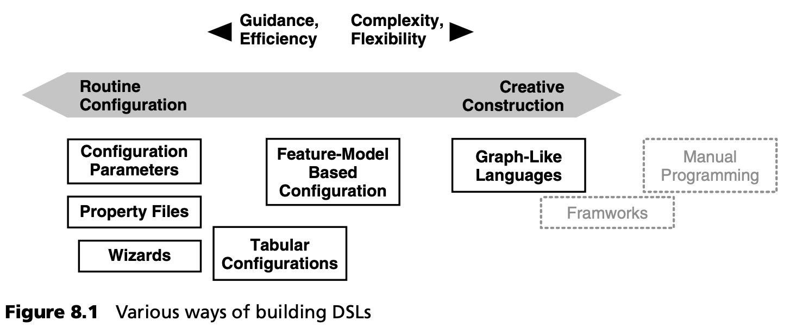
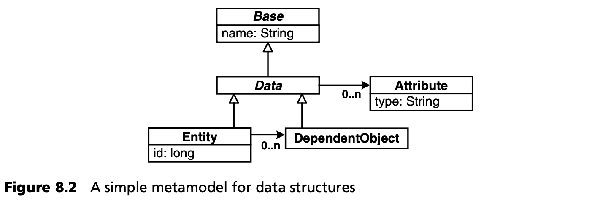
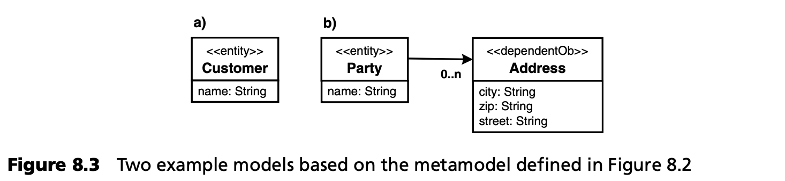
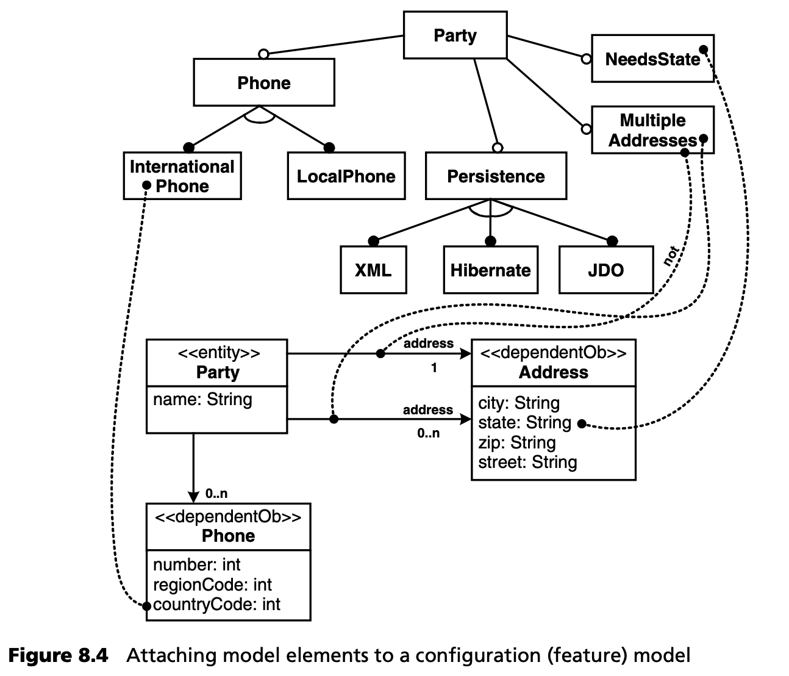
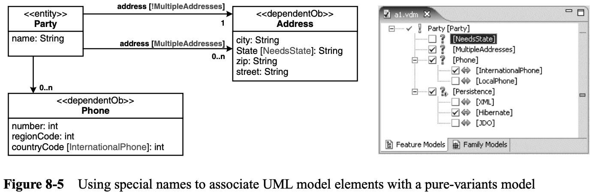
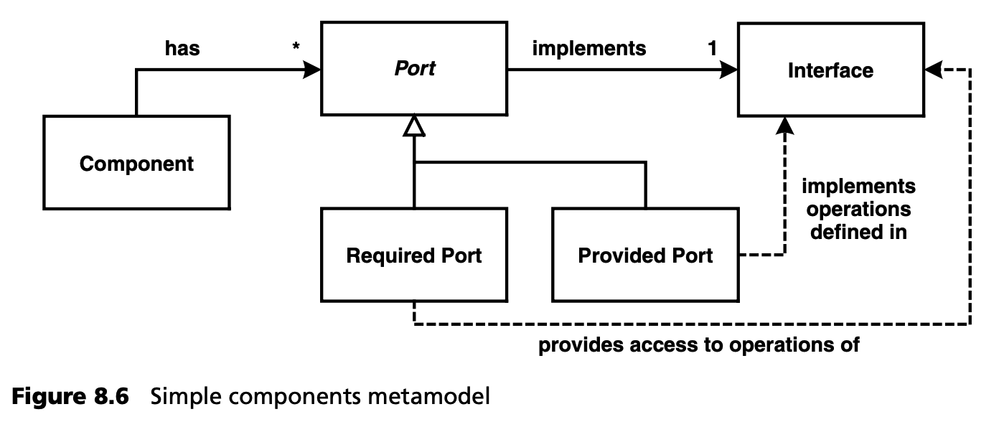

## 8.1 DSL 构建
本节包含一些有关构建 DSL 本身的提示。请注意，除了本节列出的项目外，您还可以在全书中找到大量 DSL 示例。构建 DSL 的一个重要因素当然是元建模，第 6 章已对此进行详细介绍。

### 8.1.1 选择合适的 DSL
在为某个领域寻找 DSL 时，应始终考虑到所需表达的可变性。因此，在开始使用完全成熟的、类似于图形的文本或图形 DSL 之前，先问问自己较简单的 DSL 形式是否足够。图 8.1 显示了根据 Krzysztof Czarnecki 的著作改编的替代方案。

如果只需要进行常规配置，那么简单的属性文件或向导可能就足以表达描述产品所需的可变性。如果您需要更大的自由度--您必须从中选择的可变性空间更大--那么基于表格或树形的配置就更合适了，特征模型（第 13.5.3 节）是主要采用面向配置方法的 DSL 中最强大的。到此为止，使用 DSL 基本上就是从一些选项中进行选择，也就是配置工作。

如果这还不够，您还必须采用一种创造性的建模方法，即使用功能强大的图形或文本语言，创造性地实例化、排列和连接 DSL 中可用的建模元素。这种方法当然功能强大得多，但为开发人员提供的指导也少得多。如果需要表达结构上的可变性，尤其是 “我需要一个 A 类型连接到这个 B 类型的实例，然后我还需要三个 C 类型的实例” ，那么面向配置的方法很快就会变得笨拙，您必须重新采用创造性的构建方法。

通常情况下，你会使用这些 DSL 的组合来描述一个完整的系统。例如，在第 16.3.3 节的案例研究中，我们使用基于图形和 XML 的类图语言来定义系统结构，但使用从特征模型导出的简单配置参数来描述通信特征。

请注意，在图 8.1 中类图语言的右侧是框架，一般来说是手动编程。它们提供了最大的自由度和灵活性，但也需要最大的努力，提供最少的指导，因此是最复杂的方法。

### 8.1.2 配置和构造--变体
我们现在可以看到两种 “类型” 的 DSL：支持创造性构造的 DSL 和提供配置手段的 DSL。将两者结合起来是非常有趣的。请看图 8.2 中的元模型，它是描述数据结构的创造性构造 DSL 的基础。

使用这个元模型，你可以定义各种数据结构，如图 8.3 中定义的数据结构。

现在，假设您想描述模型的变体。例如，在人和地址的上下文中，以下变体可能是有意义的：

- 一party可能有一个或多个地址
- 一party可以存储或不存储电话号码
- 如果有电话号码，可能需要存储国家代码
- 地址可能有一个州字段，通常在美国

要表达这些变体，您可以在使用创意构建 DSL 建立的模型上覆盖一个功能模型（常规配置 DSL）。在特征模型中选择或取消选择某些特征，就会导致包含或移除特定的模型元素。您必须将结构模型中的特定模型元素与配置模型中的特征关联起来： 图 8.4 举例说明了这一点。

然而，要使这种方法成为现实，必须有工具支持。作者建立了一个原型，使用以下组件：

- 结构模型可使用任何 UML 工具构建。
- 特征模型用 pure::variants 建立，这是一种基于特征模型的变体管理工具 [PV](../ref.md#pv)。
- openArchitectureWare [OAW](../ref.md#oaw) 用于处理和 “关联” 这两个模型。

读取两个模型后，openArchitectureWare 会根据特征模型中的特征修改结构 UML 模型。UML 模型元素和特征之间的关联是基于名称中的特殊符号（也可以使用标记值或定型）。图 8.5 是一个例子。

滑铁卢大学的 Krzysztof Czarnecki 和他的团队基于他们的特征建模插件 [FMP](../ref.md#fmp) 和 Rational Software Modeller UML 工具，建立了一个类似（但更复杂）的工具。他们在同一工具（Eclipse Platform）中提供了良好的模型集成，并对模型变体的正确性进行了各种验证。

### 8.1.3 行为建模
本书以及其他大多数有关 MDSD 的出版物中介绍的大多数 DSL 示例都描述了软件系统的结构方面，如组件结构、持久性映射或输入表单等。然而，大多数系统也有需要建模的行为方面。在本节中，我们将就如何进行建模提供一些提示。

行为建模最简单的方法是尽可能将行为简化为简单的描述性标记。例如，如果您需要描述组件之间的通信方式（如同步、异步），如果您能确定数量有限的定义明确的行为替代方案，那么只需用相应的替代方案标记即可描述行为。您无需实际描述行为，只需标出您需要的替代方案，转换器或代码生成器就能确保生成的系统确实按照指定的方式运行。选择有效选项可以像指定特定属性一样简单，也可以像根据特征图进行复杂选择一样复杂。这是使用常规配置（见前几节）进行行为分析的一个例子。这种方法的示例见第 16.3.3 节。

另一种相对简单的行为描述方法是使用著名的形式主义来指定特定类型的行为。这种方法的经典例子是状态图，其他例子包括一阶谓词逻辑和业务规则引擎。当然，这种方法只有在所需行为可以用选定的形式主义来描述时才有效。这样做有很多好处：行为的描述和语义通常非常清晰，而且可以使用编辑器和其他工具。如何为特定的形式主义实现 “引擎” 以执行规范，通常也有详细的记录。

在所选形式主义的限制下，这种方法已经构成了创造性的构建，而不是配置。这种方法的一个例子见第 17.4.3 节，其中使用了状态图来描述业务流程。

如果给定的形式主义行不通，你可能想发明自己的形式主义。例如，在保险领域，你可能想使用文本语言来指定保险合同的验证约束条件，或者用来定义与该领域相关的某些数学算法。在这种情况下，你必须自己定义形式主义（语言），并构建所有工具。编写引擎可能并不总是那么容易，因为要正确理解 “发明” 的形式主义的语义并非易事。

最后一种选择是使用现有的图灵完备语言，如 3GL 或 UML 动作语义语言（第 12.2.6 节）。在这里，你可以指定任何类型的行为--尽管使用的是一种非常通用的语言，而不是针对当前行为类型的特定领域。

您应该使用哪种替代方案？上述替代方案按灵活性和复杂性的递增顺序排列。如果您能清楚地确定行为替代方案，那么使用简单配置来选择其中一种当然是最好的。如果无法做到这一点，而需要重新进行创造性的构造，则仍应使用尽可能接近您需要指定的行为类型的 DSL。只有在万不得已的情况下，才可以使用动作语言或一般的 3GL 语言。

请注意，总是有必要将单个行为与结构元素联系起来。例如，状态机可以作为组件的一部分来实现，与保险相关的数学算法也可以定义为在其他地方以结构形式描述的操作或活动的实现。结构 “行为包装器” 为结构模型和行为模型提供了一个自然的整合点。再次考虑到使用最具体的方式来指定行为的想法（如上段所述），您应该定义结构元素的某些子类型，这些子类型通过某种形式主义来实现其行为，而不是仅仅允许开发人员 “实现” 结构元素。

为了说明这个想法，请看第 17 章中的例子。主要的结构元素是组件。你不能只说 “组件有操作，你可以用动作语言来实现它们” ，你可以确定以下子类型：

- 流程组件代表业务流程：使用状态机对行为进行建模。
- 业务规则组件捕捉（经常变化的）业务规则：行为使用谓词逻辑建模。
- 保险合同计算组件使用特定的文本 DSL 实现。
- 3GL 用于实现其余组件的行为，这些组件的数量应该有限。

关于实现行为的最后一句话：结构模型生成的代码几乎总是以这样或那样的方式与建模的结构相类似，而行为则往往适合解释。因此，您可以在业务流程组件中运行一个解释器来解释 XML 中指定的状态机，而不是生成状态机实现：您只需根据模型生成 XML 表示即可。另一个例子是保险合同计算的解释器。在这种情况下，您可以将解释器嵌入到相应的组件中。(第 8.4 节更详细地介绍了 MDSD 中的解释器）。

### 8.1.4 具体语法问题！
从模型转换或代码生成的角度来看，DSL 的具体语法其实并不重要，只要有办法将其转换为生成器工作所需的抽象表示法，只要元模型适当地表示了应该用 DSL 建模的概念。然而，DSL 是元模型的 “用户界面” --也就是说，应用程序开发人员必须能够正确地读取、编写和理解模型。这是一个不容忽视的重要问题。毕竟，MDSD 的理念是提供更有效的方法来表达领域概念：这种效率在很大程度上取决于具体的语法。这就是为什么我们认为 UML + 配置文件对 MDSD 来说是不够的。

在理论上或挂图上提出一个合适的具体语法相对容易。然而，特别是对于图形语法，建立必要的编辑器可能需要大量的工作。因此，在决定具体语法的具体形式时，应始终考虑可以用来构建相应编辑器的工具。第 11.3 节提供了一些这方面的提示。

在考虑具体语法时，请记住您通常不是在挂图上 “绘制” 模型，而是在交互式编辑器中。这意味着您可以使用缩放、平移、上下文菜单和按钮或折叠等功能。与图表交互的方式以及 “使图表适应特定视图/部分” 的方法是编辑器设计的一个重要方面，可以使在纸上看起来很拥挤的 DSL 完全可行。

### 8.1.5 元模型的持续验证
通过一个简单的示例（见图 8.6），可以最好地说明对领域的正式元模型进行持续验证和演化的重要性。

元模型必须在领域专家的帮助下进行检查。开发团队必须能够顺利使用元模型，并且不会产生误解。为此，在与利益相关者的所有讨论中使用元模型的术语是非常有用的--元模型可以被视为在相应领域中构建有效句子的语法。在大多数情况下，元模型中潜藏的错误和不一致很容易被发现。在与利益相关者讨论时，可以使用如下句子：

- 一个组件有任意数量的端口。
- 每个端口正好实现一个接口。
- 有两种端口：required端口和provided端口。
- provided端口实现其接口的操作。
- required端口提供对其接口中定义的操作的访问。

一旦元模型的词汇表无法简单地表达某些内容，这就意味着表述与元模型不符、元模型存在错误或不精确。

这种技术在领域建模中非常流行。埃里克-埃文斯（Eric Evans）在其关于领域驱动设计的书中称这种技术为 “无处不在的语言” [Eva03](../ref.md#eva03)。他在书中描述了许多设计特定领域框架的有用技术。
