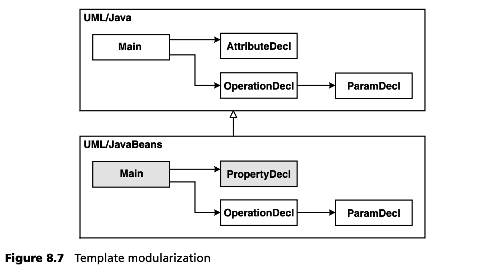
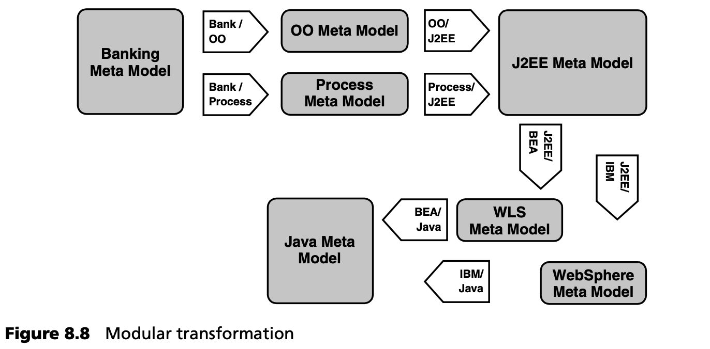
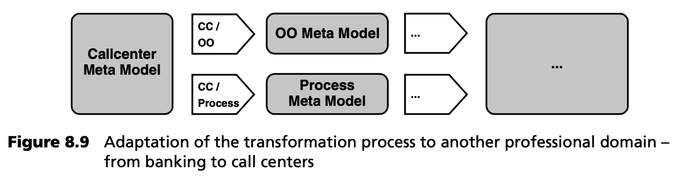
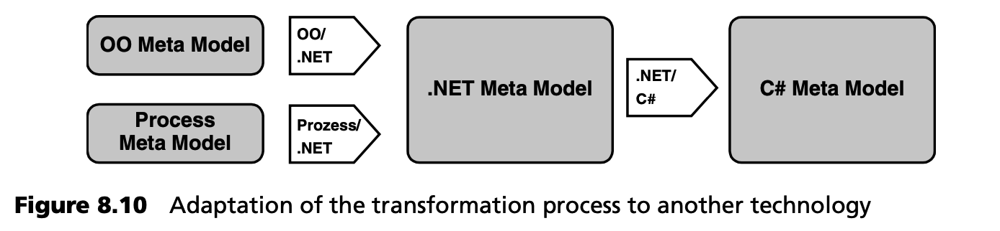
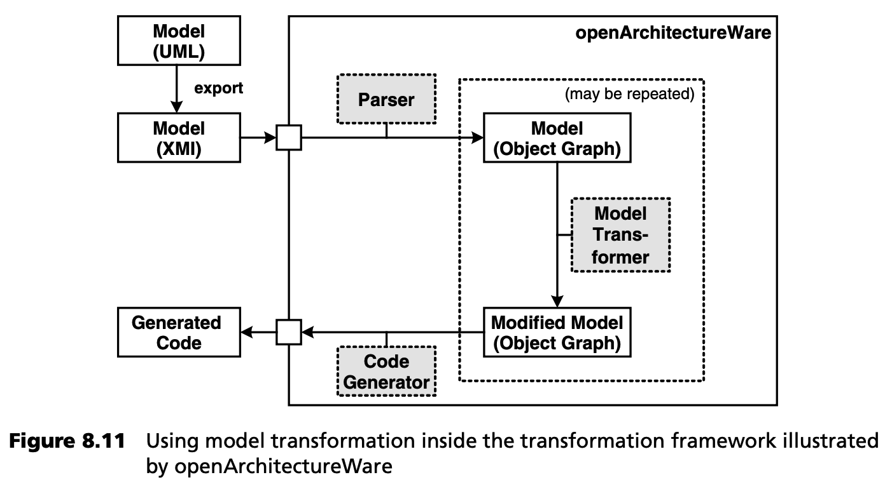
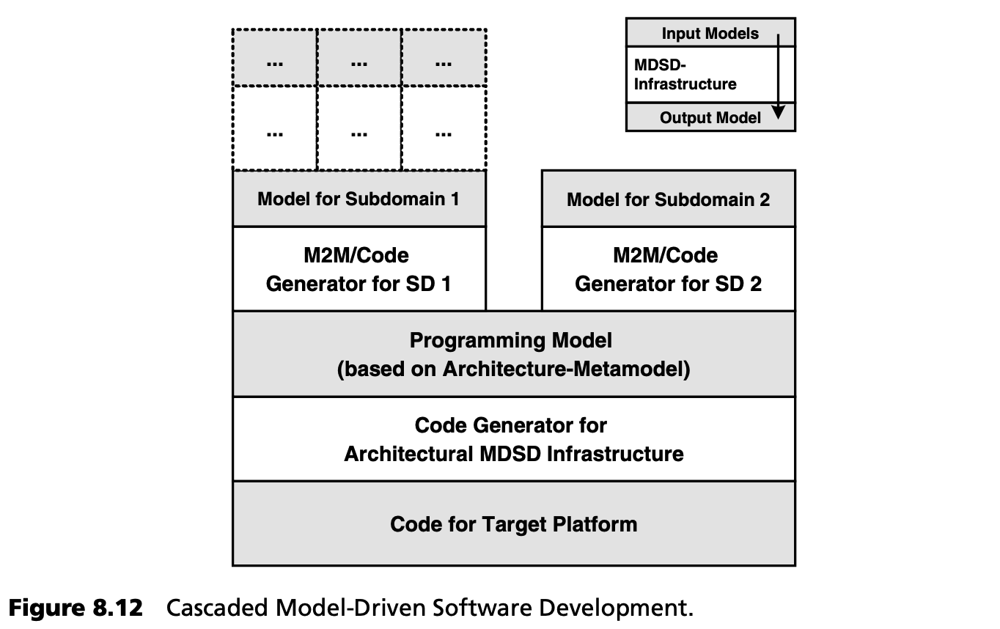
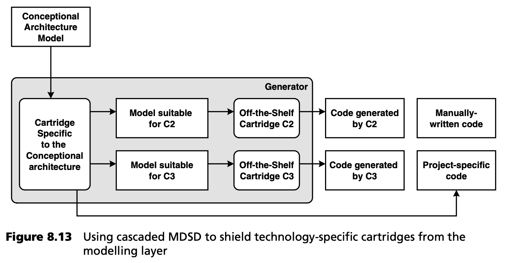

## 8.2 通用转换架构

### 8.2.1 应该生成目标架构的哪些部分？
我们在上一章中详细讨论了 MDSD 领域、MDSD 平台及其目标架构之间的关联和平衡。现在，我们只需划定生成代码与手动编程代码之间的分界线。

在领域架构的背景下，我们总是会生成那些一方面不在平台覆盖范围内，另一方面又无法使用 DSL 进行良好、紧凑描述的工件。

在 DSL 中引入典型的基于编程语言的构造（如循环），通常是生成过程走得太远的可靠标志<sup>[1](#1)</sup>。DSL 应该主要是声明性的，而不是变异为经典的编程语言 -- 如果出现这种情况，我们应该使用编程语言，并将手工编写的代码整合到生成的代码中。

### 8.2.2 相信轮回
最终实现的应用程序应使用全自动构建流程创建，其中包括所有生成/转换工件的再生。一旦在构建过程中需要一个单独的手动步骤，或者在再生后必须手动调整一行源代码，那么放弃 MDSD 而采用传统的非生成式开发方式就只是时间问题了，因为手动调整生成的工件既乏味又容易出错。

这并不意味着您应该 --或必须-- 100% 生成应用程序。只要 3GL 适用于这一目的，继续在 3GL 中实现部分应用是完全可以的。本最佳实践仅规定，生成的部分必须 *全部* 生成，以便一次性重新创建完整的系统。对已生成的工件进行后续改编是不受限制的！

### 8.2.3 利用模型
应尽可能利用模型中包含的信息，以避免重复并最大限度地减少手工工作量。这意味着您通常会生成比源代码更多的内容：构建和部署脚本、组件测试的骨架/夹具，甚至可能是测试实现、测试数据和模拟对象、数据库生成脚本、数据迁移和迁移脚本、用于主数据和测试数据维护的用户界面，或部分文档。所有这些都能在日常项目工作中为您省去很多麻烦和精力。在自动化努力与手动重复执行相同步骤的努力之间，应基于 “可持续性” 考虑找到合适的平衡点 -- 即在极限编程 (三次违规就自动化 three strikes and you automate) 的意义上，基于长期来看合理且经济的做法。 在此适用的一条经验法则是：比较实现特定目标所需的键盘输入和用户手势的粗略估算，然后选择所需工作量最小的方法。需注意，手动创建的制品往往需要重新创建或适应。

请不要误解这一建议，去生成市场上已有的东西。你需要在购买、创建和使用开源软件之间做出选择。通常情况下，别人已经完成了必要的工作，你可以省去很多思考和打字的时间，如果你重新发明一个众所周知的轮子，那么这些思考和时间就是必须的。

***组件配置的生成***

在上一章中，我们解释了框架和 DSL 之间的互补性，因为 DSL 可以用作框架的 “配置语言” 。对于复杂的平台来说，这些配置文件通常不是源代码，而是广义上的配置文件，如今通常以 XML 格式呈现。在大多数情况下，这些配置文件可以很容易地从模型中生成，因为模型中通常已经包含了必要的信息。下面是一些例子：

- 如果定义了一些额外的注释，例如定义了操作的事务行为，那么 EJB 部署描述符就可以从模型中创建出来。
- Struts 页面流 (page flow) 框架的定义可以从状态图或活动图中生成。这些配置也是用 XML 指定的。
- Java 持久化框架 Hibernate 也使用基于 XML 的配置文件来描述要持久化的类和属性。这些配置文件也很容易生成。
- CORBA IDL 是另一种候选方法。为模型元素创建 IDL 定义也很容易实现自动化。由此，CORBA 工件可在进一步的生成步骤中衍生出来。

CORBA 的例子很有意思，因为它证明了生成的工件本身可以作为其他生成器 --级联-- 的输入（模型）。当然，我们也可以直接从我们的模型生成 CORBA 存根和骨架，但可重用性的理念禁止这种做法。这表明，使用定义明确的中间格式（这里是 CORBA IDL）对多个转换进行排序是一种非常有用的方法。(级联在第 [8.2.8](#828-级联模型驱动开发) 节中有解释，第 [17](../ch17/0.md) 章末尾有一个例子）。

***支持系统架构***

任何系统都不能只关注 *软件* 架构。系统架构总是需要对现有的机器、进程和软件分配作出说明。尽管在 MDSD 领域取得了进展，但我们还无法生成硬件，但我们可以为软件部署提供重要支持。

假设我们希望在一个服务器群中运行一个包含许多组件的复杂系统。为此，必须做到以下几点：

- 必须在相应的机器上安装组件。
- 必要时，必须在正确的数据库实例上创建和初始化正确的表。
- 必要时，必须配置基础架构。负载平衡器就是一个典型的例子。

相应的系统结构可以简单地建模，例如使用 UML 部署图。根据这些模型，就可以生成所需的工件，如安装和配置脚本。

这里有一个例子：在分布式嵌入式系统的基础架构中（见第 [16](../ch16/0.md) 章），分布式系统的拓扑结构是在模型中定义的。此外，还描述了单个节点之间的网络连接。然后，生成器会为所需节点创建完整的 image，可以直接部署并在相应的系统节点上运行。

### 8.2.4 尽可能生成美观的代码
假设开发人员永远不会看到生成的代码是不现实的。即使开发人员不需要修改生成的代码，例如插入手动编写的部分，但如果他们使用传统工具调试生成的应用程序，或者需要检查生成器配置，也会遇到这种情况。如何确保应用程序开发人员能够理解生成的代码，并且不害怕使用它呢？

认为生成的代码无法正确阅读、理解或调试的偏见根深蒂固。在某些情况下，这种偏见被用作根本不应用模型驱动软件开发的借口。如果尝试生成 “好” 代码，就可以避免这种情况。请考虑以下几点：

- 可以生成注释。在模板中，您手头有大部分（如果不是全部）必要信息来生成合理的注释。通常情况下，生成的注释不是静态文本，而是像其他模板一样基于从模型中获取的信息。
- 由于在代码生成模板中处理 whitespace 的选项通常非常有限，您必须决定是正确缩进模板还是正确缩进生成的代码：生成器通常无法区分缩进是为了结构化模板还是结构化生成的代码。在很多情况下，最好关注模板的可读性，并使用能正确格式化代码的下游 pretty-printer / beautifier。pretty-printer 适用于大多数编程语言和 XML。
- 第三种非常有用的技术是应用位置字符串 (location strings) ，它标示出所使用的转换或模板，以及生成代码中的底层模型元素。位置字符串可能是这样的

```
[2003-10-04 17:05:36]
GENERATED FROM TEMPLATE SomeTemplate
MODEL ELEMENT aPackage::aClass::SomeOperation().
```

使用这种最佳实践对于提高开发人员对代码生成的接受程度非常重要。从本质上讲，它旨在对生成代码采用与非生成代码相同的质量标准和风格指南。逻辑上正确的控制结构缩进尤为重要。如果将高质量的应用程序原型转换为模板，则应准备好所有必要的注释，以便将其集成到模板中。

这一最佳实践的唯一限制/例外涉及性能优化代码的生成。在这种情况下，通常必须使用有损代码可读性的构造。应明确识别和描述这些情况，并将生成的代码与所有其他代码分开管理。当然，手动实现也可能需要牺牲结构来节省性能。

这一最佳实践背后的基本声明不仅适用于生成的代码，也适用于手工编写的代码：源代码不再主要是为机器编写的，而是为其他源代码用户（即人类）阅读而编写的。

### 8.2.5 模型驱动的集成
在许多情况下，您必须将使用 MDSD 开发的系统与现有系统和基础设施集成。在实践中，孤立进行的软件项目很少见。在大多数情况下，软件都是在现有系统环境的背景下开发的，而这些系统环境仍具有一定的使用寿命。此外，开发人员通常希望用更新、更合适的功能逐步取代旧系统，而这些功能应随着时间的推移通过现代技术来实现。

集成通常包括各种应用程序接口的系统映射，以及这些应用程序接口之间所需的数据和协议转换。根据不同的集成策略，集成代码必须添加到待开发的应用程序中，或添加到待集成的现有遗留应用程序中。所需工件通常还包括一次性使用的适当的数据转换脚本。

系统间的数据和接口映射如果能映射到一个模型中，则最有价值。因此，您需要将集成问题作为 MDSD 的一部分来处理。不要忽视它！为模型驱动的集成定义一个技术子域（特定的 DSL）。如果事情变得更加复杂，可以考虑为每个要集成的系统使用一个技术子域。在这些子域中定义 DSL，以支持对模型元素与现有遗留应用程序之间映射规则的精确描述。利用自动化技术简化遗留系统的关闭流程，使该步骤无需任何专业知识即可完成。与现有系统集成是 MDSD 的优势，而不是某些人所说的弱点。

在集成两个不同的模型驱动系统的情况下，合理的集成代码结构可以避免在两个系统的模板源代码中不必要地重复所需的实现技术知识。

在处理简单的集成任务时，技术子域可能会不必要地复杂化，在用于建模实际应用的模型中，可能只需使用UML标记的值或其他类似方法即可。然而，只有当集成信息不会不必要地损害模型的清晰度，并且集成是永久性的，而不是应用于寿命有限的遗留系统时，才应使用这种方法。在后一种情况下，应确保一旦不再需要集成代码，就能立即轻松删除。否则，“死代码” 只会造成架构污染。使用抗干扰层 (anti-corruption layer) [Eva03](../ref.md#eva03) ，并通过外部模型标记 --为模型添加特定切面的叠加模型-- 来指定映射。

尝试将逐步关闭遗留系统的工作自动化，以至于可以在 DSL 中标注要关闭的部分。这将使后代（开发人员）的生活更加轻松，因为三年后关闭遗留系统最后部分的人可能对集成代码的细节知之甚少。

### 8.2.6 生成代码与非生成代码的分离
当应用程序中只有部分代码被生成时（在当今的许多应用场景中经常出现这种情况），就必须用手工编写的代码来填补空白。然而，修改生成的代码存在大量问题，尤其是在一致性、构建管理、版本管理以及模型和生成源代码之间的一致性方面，特别是由于重复生成，尽管从纯粹的技术角度来看，现代生成器已经掌握了后者。

如果包含生成代码的文件从未被修改过，那么在必要时只需删除生成的代码，就可以实现完全的再生。如果必须手动修改生成的代码，则只能在特别指定的区域（通常称为 *保护区域 protected regions* ）进行修改，这些区域在再生过程中不会被覆盖。

因此，应将生成的代码和非生成的代码分别保存在不同的文件中：在大多数情况下，甚至最好使用不同的目录。切勿修改生成的代码！设计一种架构，明确定义哪些工件是生成的，哪些必须手动创建。在此架构下，您还应根据目标架构定义生成代码和非生成代码的组合方式。在面向对象领域，接口、抽象类、委托和设计模式（如 Factory, Strategy, Bridge 或 Template Method [GHJ+94](../ref.md#ghj94) ）都是合适的手段。在非面向对象的语言中，可以使用包含 (includes) 等方法。

生成代码和非生成代码的分离迫使架构师选择一种能非常干净地分离各个方面的设计 -- 在我们看来，这是一种非常理想的副作用。这种最佳做法的结果是，生成的源代码可以被视为一次性产品，甚至不需要进行版本控制，从而减少了一致性问题。然而，在所有手工实现的代码和生成的代码一起使用的情况下，如果模型被改变，在结构上或语义上不再与手写代码兼容，即使手写代码已经完全委托给不同的类，也会出现不一致的情况。

如果出于性能考虑，或者由于目标语言不提供任何连接不同工件的选项，必须将手写代码直接插入生成的代码中，那么引入保护区域是不可避免的。只有在这种特殊情况下需要采用这种方法时，才请这样做！

这里描述的最佳做法可以推广到使用不同的生成器生成系统的不同部分，如各种技术子域。在这种情况下，可以将手写代码视为一种非常特殊的 “生成器” --人类程序员-- 的结果。当然，系统架构必须考虑到所有这些不同的方面。

### 8.2.7 模块化转换
为实现转换（部分）的重复使用，最好将转换模块化。根据所使用的转换语言，可以（也应该）使用结构化或面向对象编程的原则来实现模块化，就像在经典编程中一样。其中包括子程序/过程、类或松耦合组件（通常称为盒），它们负责生成目标架构的不同层或方面。它们也可以单独交换。这种结构化方法通常是特定工具（见第 11 章），但却非常重要--使用它们！

图 8.7 展示了这种方法在基于模板的方法中的应用。这个例子是关于扩展标准的 UML-Java 映射，从而生成 JavaBeans。对于模型中的每个属性，都应生成 Java 类中的属性以及相应的获取器和设置器。



在本示例中，Bean 的主模板是新定义的，因此它使用新定义的 PropertyDecl 代替 “旧” 的 AttributeDecl 来处理每个属性。其他模板保持原样，即没有变化。

模块化的一种形式超出了本示例的范围，即把一个转换分解成几个转换，然后按顺序执行。请看图 8.8 中的示例：



在该图中，银行应用程序的模型被转换为在 J2EE 上运行的应用程序，特别是在 BEA WLS 和 IBM Websphere 这两个不同的应用程序服务器上运行的应用程序。不过，转换不是一步完成的，而是分几个阶段进行的：

- 首先，将银行领域的流程方面映射到流程模型，其余方面映射到 OO 模型。
- 下一步，将这两个模型映射到 J2EE。
- 然后，将 J2EE 模型映射到特定于应用服务器的模型。
- 最后一步，将这两个模型转换成代码。

现在设想一下，我们希望为呼叫中心应用程序创建 J2EE 代码。由于转换是模块化的，我们只需交换转换的第一部分。随后的转换可以重复使用，无需更改，这为我们节省了大量工作（见图 8.9）。



如果我们现在希望将这两个软件系列移植到 .NET，我们只需交换转换的第二部分，如图 8.10 所示



如果我们现在希望将这两个软件系列移植到 .NET，我们只需交换转换的第二部分，如图 8.10 所示

如果我们只使用单一的直接转换，这种重用将是不可想象的。

与 OMG 的意见相反，我们建议不要手动修改中间模型或添加更多标记。它们只需作为各个转换步骤之间的 “接口” ，一个约定俗成的数据模型。

如果我们需要额外的信息来控制或配置后续转换，我们应该以外部模型标记的形式来实现这些标记。这种方法不仅在分隔关注点（“面向切面的建模”）方面很简洁，而且在当前可用的工具中也更实用。图 8.11 说明了原因：转换只在生成工具中使用，也就是说，转换结果在建模工具中不可编辑。多步骤）转换仅用于将转换过程模块化。生成器内部的 JUnit 测试用于验证转换是否按预期运行。



上述讨论还表明，一个人的目标模型就是另一个人的源模型。因此，多步骤转换是重复使用转换步骤的基础。级联式、模型驱动的开发也是这个方向。

### 8.2.8 级联模型驱动开发
我们在上一节中看到，使用模型到模型的转换将转换过程模块化是非常有用的。然而，问题仍然是，一个潜在的复杂转换过程应该分解成哪些步骤。MDA 使用 PIM 和 PSM 的隐喻来指导这些决策：您应该在 PIM 中为业务逻辑建模，然后将其转换到 PSM 中，最后从中生成代码。在实践中，我们发现这一指导原则往往不够具体。根据我们自己的经验，我们推荐一种不同的方法。

我们从以架构为中心的 MDSD 开始（见第 4.3 节）。这意味着您要为（技术）软件架构提供 MDSD 支持。元模型包含架构构件，模型从技术角度描述系统。如图 8.12 所示，一旦建立了这个基础架构，就可以在其上层层叠加 MDSD 基础架构。



这些附加层通常涉及更有限的（子）领域，每一层的技术含量都较低，因此功能性更强。我们的想法是，更具体的高层将更具体的概念映射到低层已定义的更一般（架构）的概念上。这将自动引导你进入 “正确” 的模块化步骤，因为你会根据需要添加更具体的层。最终，您将得到一个完全非技术性的功能模型，您的领域专家能够对其进行指定。您可以在第 17.4.3 节的案例研究中看到这种方法的实际应用。

级联 MDSD 还可以帮助您摆脱另一个困境。如果您使用的是主流平台，如 J2EE 或 Spring+Hibernate，您往往有机会使用第三方现成的插件（插件是某个架构方面的 “生成器” ）。这样一来，问题往往就变成了如何组合这些不同的盒，尤其是如果这些盒是独立开发的，因而使用了不同的元模型--不同的定型、标记值等。您肯定不希望仅仅为了能够使用各种不兼容的模块而多次建模。

我们推荐使用图 8.13 所示的方法。像往常一样，首先要定义自己的以架构为中心的特定项目元模型。应用程序使用该层中定义的概念建模。您的项目专用盒使用模型到模型转换来创建所需的模型，作为第三方盒的输入。这些软件包反过来又为其特定的架构方面生成代码。您的软件盒生成代码，将各种第三方软件盒生成的工件粘合在一起。



---
#### 1
可执行的 UML 是个例外 -- 见第 [12](../ch12/0.md) 章。
