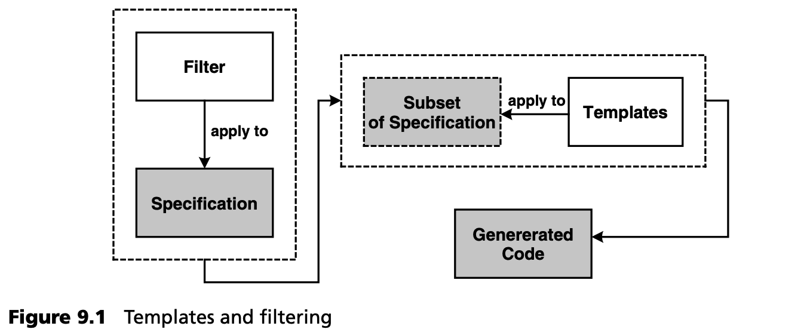
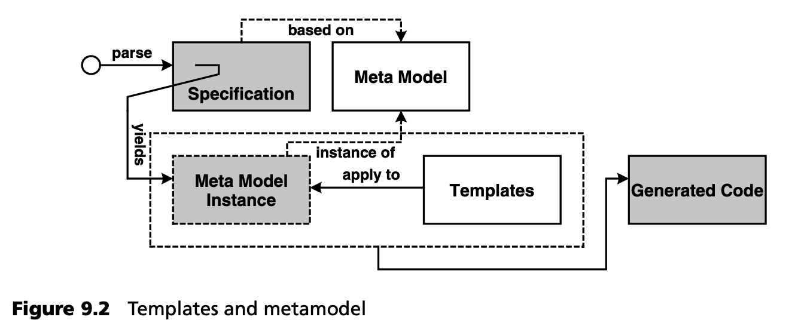
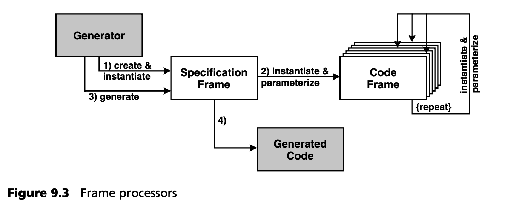
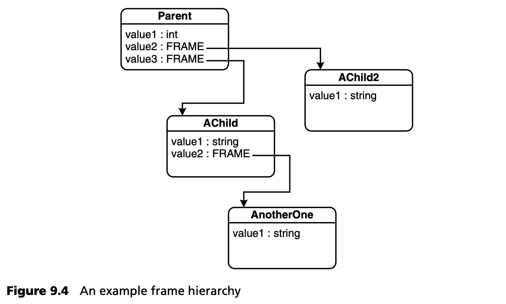
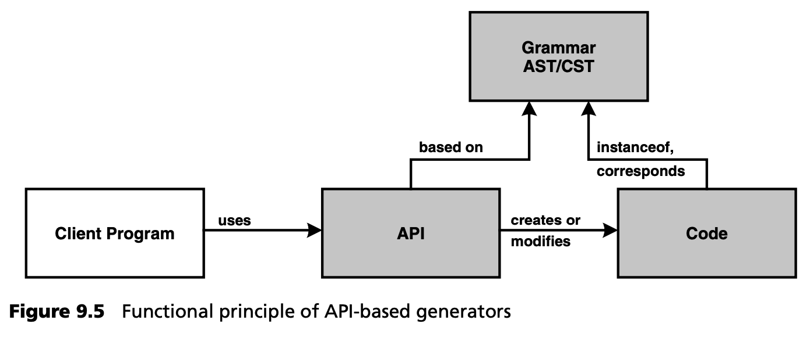
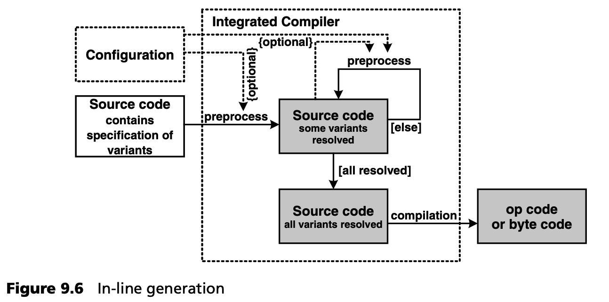
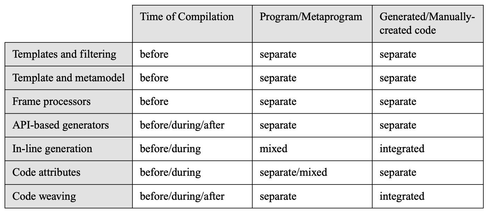

## 9.3 生成技术
本节将介绍经过验证的代码生成技术，包括一些代码示例。我们将代码生成技术分为不同类别：

- 模板 + 过滤 (Templates + filtering)
- 模板 + 元模型 (Template + metamodel)
- 框架处理器 (Frame processors)
- 基于 API 的生成器 (API-based generators)
- 内联生成 (In-line generation)
- 代码属性 (Code attributes)
- 代码编织 (Code weaving)

我们将简要介绍所有这些技术，并举例说明。除了内联生成（以及某种程度上的代码属性）外，所有这些方法都需要显式集成。

尽管各种生成技术之间存在一些重要的差异，但它们都有以下共同点：

- 元模型或抽象语法总是存在的，至少是隐含的。
- 建立在元模型基础上的转换总是存在的。
- 存在某种读取模型（规范）并将其提供给转换的前端。

### 9.3.1 模板和过滤
这种生成技术描述了代码生成的最简单情况。如图 9.1 所示，我们使用模板来遍历文本表示模型的相关部分，例如通过 XML 使用 XSLT。



要生成的代码可以在模板中找到。模板中的变量可以绑定到模型中的值。下面，我们将介绍一个简单的示例，其中 Java Bean *Person* 是根据 XML 规范生成的（为简化起见，我们不使用 XMI 作为模型表示法，而是使用自定义的 schema ）。这就是规范：

```xml
<class name=“Person” package=“com.mycompany”>
  <attribute name=“name” type=“String”/>
  <attribute name=“age” type=“int”/>
</class>
```

生成的代码应如下所示：

```java
package com.mycompany;
public class Person {
  private String name;
  private int age;
  public String get_name() {return name;}
  public void set_name( String name) {this.name = name;}
  public int get_age() {return age;}
  public void set_age( int age ) {this.age = age;}
}
```

执行这种转换的 XSLT 样式表大致如下：

```xml
<xsl:template match=“/class">
  package <xsl:value-of select=“@package”/>;
  public class <xsl:value-of select=“@name”/> {
    <xsl:apply-templates select=“attribute”/>
  }
</xsl:template>
 
<xsl:template match=“attribute">
 
  private <xsl:value-of select=“@type”/> 
    <xsl:value-of select=“@name”/>;
  public <xsl:value-of select=“@type”/>
    get_<xsl:value-of select=“@name”/>() {
    return <xsl:value-of select=“@name”/>;
  }
 
  public void set_<xsl:value-of select=“@name”/> (
    <xsl:value-of select=“@type”/>
    <xsl:value-of select=“@name”/>) {
      this.<xsl:value-of select=“@name”/> = <xsl:value-of select=“@name”/>;
  }
</xsl:template>
```

使用模板和过滤进行生成是相当直接和可移植的，但样式表很快就会变得非常复杂。因此，这种方法完全不适合大型系统，尤其是在规范是基于 XMI 的情况下。

如果分几个步骤进行工作，XMI 的问题可以得到一定程度的缓解：最初的转换将 XMI 转换为具体的、特定领域的 XML schema。接下来的转换步骤可以根据该 schema 生成代码。这样，模板与具体的 XMI 语法就有了一定程度的解耦，而实际的代码生成（即第二步）就变得容易多了。不过，我们仍然要在 XML 元模型的抽象层上工作，而这个问题显然可以通过接下来介绍的方法来解决。

### 9.3.2 模板和元模型
为了避免从（XML）模型直接生成代码的问题，我们可以实现一个多级生成器，它首先解析 XML，然后实例化一个元模型（可由用户调整），最后将其与模板一起用于生成。图 9.2 演示了这一原理。



这种方法的优势在于，一方面，它可以更大程度地独立于模型的具体语法，例如 UML 及其不同的 XMI 版本。另一方面，我们可以将更强大的模型验证逻辑 --约束-- 集成到元模型中。与模板不同的是，这可以用 Java 等真正的编程语言来实现。正如我们在第 [6](../ch6/0.md) 章中指出的，这种代码生成在 MDSD 中具有特殊意义。

openArchitectureWare 生成器的一个有趣的实现方面就属于这一工具类别，不应忽略：从编译器构建的角度来看，元模型实现（例如用 Java） *和* 模板是转换的一部分。元模型承担了抽象语法的角色。由于抽象语法和转换是编译器的参数，因此我们实际上是在处理一个开放的编译器框架。值得注意的是，语法的构造 --即元模型元素-- 能够自行编译。换句话说，编译器是面向对象的，这有助于避免繁琐的类型转换。从概念上看，模板是元模型的编译器方法，就像 Java 中实现的帮助方法一样。这一点可以从模板定义（ *«DEFINE method FOR metaclass»* ）中看出。与 Java 一样，模板语言也支持多态性和覆盖 (overwriting) --两者都是构建面向对象编译器所必须的-- 只有类的定义被委托给 Java 部分。这就是为什么我们认为模板语言是面向对象的，尽管在模板语言中不能直接定义任何类。

### 9.3.3 框架处理器
Frame 是 frame processors 的核心元素，基本上是应生成代码的规格 (specifications)。与面向对象语言中的类一样，frame 可以多次实例化。在实例化过程中，变量（称为 *slots* ）被绑定到具体的值上。每个实例都可以拥有自己的 slot 值，就像类一样。在随后的步骤中，可以生成 frame 实例，从而生成实际的源代码。



分配给 slot 的值可以是字符串，也可以是其他 frame 实例。在运行时，这将产生一个由 frame 实例组成的树形结构，最终代表要生成的程序的结构。图 9.4 显示了一个示例。



下面的示例使用了 ANGIE 处理器 [DSTG](../ref.md#dstg)。首先，我们展示一个简单成员声明的生成过程，如下所示：

```java
short int aShortNumber = 100;
```

这个代码片段已经包含了变量的许多方面 (variable aspects) ：变量名、变量类型以及一个可选的初始化参数。下面的 frame 生成了这段代码：

```c
.Frame GenNumberElement(Name, MaxValue)
  .Dim vIntQual = (MaxValue > 32767) ? “long” : “short”
  .Dim sNumbersInitVal
  <!vIntQual!> int <Name!> <? = <!sNumbersInitVal!>?>;
.End Frame
```

第一行代码声明了 frame，它基本上是一个带有两个参数的构造函数：*NumberElement* 的名称和最大值。基于最大值，第二行将决定我们需要的是 *short int、long int* 还是普通 *int* 。第四行定义了在代码生成过程中最终生成的 *host code* 。 *<!...!>* 语法访问 frame 实例的 slot 值。*\<?...?>* 之间的代码，只有在其包含的 slot 值不是未定义时，才会生成。下面这段代码实例化了 frame：

```c
.myNumbElm = CreateFrame("GenNumberElement","aShortNumber",100)
```

需要注意的是，这个实例化过程不会生成任何代码，只会创建一个 frame 实例并将其分配给变量 *.myNumbElm* 。该实例保存在生成器内部的实例库中。如果最终执行:

```c
.Export(myNumbElm)
```

实例被 “执行” 并生成代码。与其直接导出实例（从而立即生成代码），还可以将实例作为值，分配到另一个 frame 实例的 slot 中，以构建更复杂的结构。下一 frame 就是一个例子，它生成了一个简单的 Java 类：

```c
.Frame ClassGenerator(fvClassName)
  .Dim fvMembers = CreateCollection()
  public class <!fvClassName!> {
    <!fvMembers!>
  }
.End Frame
```

该 frame 接受要生成的类的名称作为参数。此外，还创建了一个多值 slot（集合）。外部脚本（或其他 frame ）现在可以设置值，如其他 frame 实例。例如，可以设置上面的 *NumberElements* 。

```c
.Static myGeneratedClass As ClassGenerator
.Function Main(className)
  .myGeneratedClass =
        CreateFrame(“ClassGenerator”, className)
    .Add(myGeneratedClass.fvMembers,
      CreateFrame(“GenNumberElement”, “i”, 1000)) .Add(myGeneratedClass.fvMembers,
        CreateFrame(“GenNumberElement”, “j”, 1000000))
.End Function
```

在导出 *myGeneratedClass* 的过程中，会生成一个包含两个成员 *i* 和 *j* 的简单 Java 类。

### 9.3.4 基于 API 的生成器
最常见的代码生成器可能是基于 API 的生成器。这些生成器只需提供一个 API，即可生成目标平台或语言的元素。从概念上讲，这些生成器基于目标语言的抽象语法（元模型），因此总是特定于一种语言，或者更准确地说，特定于目标语言的抽象语法。



下面的示例是从.NET世界中截取的。应生成以下代码：

```c
public class Vehicle : object {
}
```

下面的 C# 代码片段可以生成它：

```c
CodeNamespace n = …
CodeTypeDeclaration c = new CodeTypeDeclaration (“Vehicle”);
c.IsClass = true;
c.BaseTypes.Add (typeof (System.Object) );
c.TypeAttributes = TypeAttributes.Public;
n.Types.Add(c);
```

上图所示的代码建立了代码的内部表示形式，通常是抽象语法树（AST）的形式。对辅助函数的调用将启动实际的代码生成过程，此处未作显示。

这种生成器相当直观，易于使用。此外，还可轻松确保仅能生成语法正确的代码，这由生成器代码的编译器与API的结合来保证。不过，这种生成器的问题在于，必须对潜在的大量常量代码（不依赖于模型的代码）进行编程，而不是简单地复制到模板中。

当您在 *生成器级别* 使用众所周知的面向对象概念，来构建特定领域的生成器类，那么使用此类生成器就会变得非常高效。在下面的示例中，使用工具 *Jenerator* 定义了一个 Java 类和（空）主方法：

```java
public class HelloJenerator {
  public static void main( String[] args ) {
    CClass createdClass =
        new CClass(“demo”, “HelloWorld” );
    CMethod mainMethod =
          new CMethod( CVisibility.PUBLIC,
            CType.VOID, “main” );
    mainMethod.addParameter(
      new CParameter( CType.user( “String[]” ), “args” )
    );
    mainMethod.setOwnership( COwnership.STATIC );
    createdClass.addMethod( mainMethod );
  }
}
```

这个程序很长。一个有用的重构方法是创建一个生成器类 *MainMethod* - Java 的主方法根据定义总是具有相同的签名：

```java
public class MainMethod extends CMethod {
  public MainMethod() {
    super(CVisibility.PUBLIC, CType.VOID, “main” );
    setOwnership( COwnership.STATIC );
    addParameter(
      new CParameter( CType.user( “String[]” ),
        “args” ) );
  }
}
```

正如您所看到的，上面的 HelloJenerator 示例已大大简化：

```java
public class HelloJenerator {
  public static void main( String[] args ) {
    CClass createdClass =
      new CClass( “demo”, “HelloWorld” );
    createdClass.addMethod( new MainMethod() );
  }
}
```

可以想象，使用这些生成器类可以构建高效的、特定领域的生成器。通过对生成器类进行适当的参数化，可以实现灵活性。

这种生成器显然是针对目标语言的抽象语法的，而不一定是针对其具体语法的。如果有抽象语法相同的不同语言，只需交换代码生成器后台，就能生成不同的目标语言。例如，在 .NET 框架中就可以做到这一点。使用 CodeDM，我们可以根据通用语言运行时（CLS）中为 .NET 语言预定义的抽象语法来定义抽象语法树。通过选择合适的 *ICodeGenerator* 实现，可以为任何 .NET 语言（C#、VB、C++）生成具体语法。

字节码 (Byte code) 修改器是 Java 领域特别流行的一种工具，通常也是基于 API 的生成器。它们通常在 JVM 字节代码的抽象层次上运行，尽管有些工具提供了更高层次的抽象，但在技术上仍在处理字节码。.NET IL 代码也可以用 .NET 的 CodeDOM 直接生成。

### 9.3.5 内联生成
内联 (In-line) 生成是指 “常规” 源代码中包含的构造在编译或某种预处理过程中会生成更多的源代码或字节/机器码。例如 C++ 预处理器指令或 C++ 模板。



下面是一个基于 C++ 预处理器的微不足道的例子：

```c
#if defined (ACE_HAS_TLI)
static ssize_t t_snd_n (ACE_HANDLE handle,
  const void *buf, size_t len, int flags,
  const ACE_Time_Value *timeout = 0,
  size_t *bytes_transferred = 0);
#endif /* ACE_HAS_TLI */
```

在这里，只有定义了 ACE_HAS_TLI 标志，才会编译 *\#if* 和 *\#endif* 之间的代码。还可以使用更复杂的参数传递表达式：

```c
#define MAX(x,y) (x<y ? y : x) 
#define square(x) x*x
```

如果应用程序代码包含 *MAX (v1, v2)* 语句，则会根据前面定义的规则进行文本替换。因此，预处理器将 *MAX (v1, v2)* 替换为 *(v1<v2 ? v1 : v2)* 。所有这些都纯粹基于文本替换，不遵守类型约束或优先规则。因此，这种方法只适用于简单的情况。

相比之下，模板元编程允许采用一种结构性更强的方法，因为编译器对模板的处理提供了一种图灵完备的函数式编程语言，可对 C++ 类型和 literals 进行操作。因此，我们可以编写在编译过程中运行的整个程序。下面的代码在编译时计算整数的阶乘：

```c
#include <iostream>
using namespace std;
 
#include “../meta/meta.h”
using namespace meta;
struct Stop
{ enum { RET = 1 };
};
 
template<int n>
struct Factorial
{ typedef IF<n==0, Stop, Factorial<n-1> >::RET
  PreviousFactorial;
  enum { RET = (n==0) ? PreviousFactorial::RET :
  PreviousFactorial::RET * n };
};
 
void main()
{ cout « Factorial<3>::RET « endl;
}
```

要弄清它是如何工作的，我们把这个工作留给读者去做 -- 如果你想作弊，可以在 [EC00](../ref.md#ec00) 中查找。由于笨拙的语法和偶尔出现的非常奇怪的错误信息，只有在特殊情况下才建议使用这种方法，它并不适合更复杂的模型驱动项目。这主要是因为实际运行元程序的编译器既不是为这些目的而创建的，也不是为这些目的而优化的。

### 9.3.6 代码属性
我们将继续讨论另一种在 Java 领域非常流行的机制：代码属性 (code attributes)。在 Java 世界中，*JavaDoc* 最早使用了代码属性，在 *JavaDoc* 中，特殊注释用于自动生成 HTML 文档。*JavaDoc* 的可扩展架构使得插入自定义标记和代码生成器成为可能。最流行的例子可能是 *XDoclet* [XDOC](../ref.md#xdoc) 。除其他用途外，XDoclet 还可用于生成 EJB *远程/本地接口* 以及部署描述符。开发人员手动编写实现类，并在类中添加所需的 XDoclet 注释，然后 XDoclet 代码生成器读取这些注释。此外，生成器还能访问添加了注释的源代码语法树。这样，生成器就能从注释和代码本身获取信息。

下面是一个用 XDoclet 注释补充的 Java 类的示例。

```java
/**
  * @ejb:bean type="Stateless”
  *      name=“vvm/VVMQuery”
  *      local-jndi-name=“/ejb/vvm/VVMQueryLocal”
  *      jndi-name=“/ejb/vvm/VVMQueryRemote”
  *      view-type=“both”
  */
public abstract class VVMQueryBean
    /**
    * @ejb:interface-method view-type=“both”
    */
    public List getPartsForVehicle( VIN theVehicle ) {
      return super.getPartsForVehicle( theVehicle );
    }
}
```

这种方法的核心思想是，生成器所需的大部分信息已经存在于代码中。开发人员只需添加一些特殊注释。生成器可以使用代码的 AST 和附加注释。

在这种情况下，经常听到的一种批评是，之所以需要这种工具，只是因为 J2EE（主要是 EJB）需要的代码冗余太多，以至于无法再手工处理。这当然是事实 -- 然而，通过代码属性生成并不局限于生成 EJB 基础架构代码。我们可以通过 XDoclet 为 *Hibernate* [HIBE](../ref.md#hibe) 或类似的框架创建持久性映射。

.NET提供的属性机制是.NET平台的一个不可分割的概念。各种源代码元素 --方法、属性、类-- 都可以分配属性，如下例所示：

```c
[QoSServicePriority(Prio.HIGH)]
class SomeService : ServiceBase {
    [QoSTimeLimit(100, Quantity.MS)]
    public void processRequest( Request r ) {
      .…
    }
}
```

在这里，我们以纯声明的方式规定，该类实例的服务优先级为 *HIGH* ，且执行 *processRequest()* 操作的最长时间为 100 毫秒。这样做的目的是让服务在一个能测量服务操作执行时间等参数的框架中执行。例如，如果超过了属性设定的限制，它就会记录日志条目，或者停止接受客户端请求，以降低系统负载，并向客户端抛出异常。

框架对属性的访问（以及对所定义的时间限制的访问）是通过反射实现的。技术上是这样实现的：属性只是可序列化的 .NET 类，编译器在编译时将其实例化并序列化到相应的程序集中。然后可以通过反射访问这些对象。代码生成器可以从编译后的 .NET 程序集中读取这些信息，并与 XDoclet 一样，将其作为生成代码的基础。

请注意，从 Java 第 5 版开始，Java 中也有此类功能。注释可以添加到许多源（代码）元素中，如类、属性或操作。从技术上讲，这与 .NET 的工作方式相同，即编译器实例化与字节码一起存储的数据，随后可以使用反射进行查询。

### 9.3.7 代码编织
代码编织 (Code weaving) 描述的是独立但语法完整的代码片段的混合 (intermixing) 。为此，我们必须定义如何将这些不同的部分组合在一起：这种位置被称为 *join points or hooks* 。*AspectJ* [ASPJ](../ref.md#aspj) 就是这种生成器的一个著名例子：常规 OO 程序代码和切面代码在源代码或字节码级别上相互交织。切面描述的是横向关注 (cross-cutting concerns) 的问题，也就是说，使用面向对象编程的现有构造无法充分描述和定位的功能。

以下示例演示了一个切面，该切面会在调用 *Account* 类实例的方法的所有代码位置插入日志语句。对于每次方法调用，日志会记录该 *Account* 方法是从 *哪个方法* 中被调用的<sup>[3](#3)</sup>：

```java
aspect Logger {
  public void log( String className, String methodName ) {
  System.out.println( className+”."+methodName );
  }
  pointcut accountCall(): call(* Account.*(*));
  before() calling: accountCall() {
    log( thisClass.getName(), thisMethod.getName() );
  }
}
```

在将此功能应用于系统后 --即通过编织器 (weaver) 将其与常规代码交织在一起-- 将生成如下所示的代码，假设编织操作在源代码级别进行：

```java
public class SomeClass {
  private Account someAccount = …;
  public someMethod( Account account2, int d ) {
    // aspect Logger
    System.out.println(“SomeClass.someMethod”);
    someAccount.add( d );
    // aspect Logger
    System.out.println(“SomeClass.someMethod”);
    account2.subtract(d );
  }
  public void anotherMethod() {
    //aspect Logger
    System.out.println(“SomeClass.anotherMethod”);
    int bal = someAccount.getBalance();
  }
}
```
另一个源代码 *侵入性组合 (invasive composition)* 的例子是 *Compost Library* [COMP](../ref.md#comp) 。该库最终提供了一个根据程序 AST 更改程序结构的 API。Compost 以 Java 实现，也在 Java 源代码上运行。另外一个库，即 *Boxology Framework* ，允许通过钩子对源代码进行系统修改。在这里，我们必须区分：由要修改的源代码的原始开发者声明的显式钩子 (hooks) 和隐式钩子 (hooks)。隐式钩子是程序 AST 中特定的、定义良好的位置，例如 *implements* 钩子。通过扩展该钩子，可以实现更多接口。因此，这个框架可以作为各种源代码修改工具的基础。

### 9.3.8 不同技术的组合
不同代码生成技术的组合也是可能的。开源工具 *AndroMDA* [ANDR](../ref.md#andr) 通过模板创建源代码。这些源代码同样包含代码属性。使用 *Velocity* [VELO](../ref.md#velo) 生成基于模板的代码，并使用 XDoclet 进行进一步处理。下面是一个带有 XDoc 注释的 Velocity 模板示例：

```velocity
// -------------- attributes --------------
#foreach ( $att in $class.attributes )
#set ($atttypename = transform.findFullyQualifiedName($att.type))
    private $atttypename ${att.name};
 
    /**
  #generateDocumentation ($att “ “)
      *
#set ($attcolname = $str.toDatabaseAttriName(${att.name}, “_”))
#set ($attsqltype = $transform.findAttributeSQLType($att))
#if ($transform.getStereotype($att.id) == “PrimaryKey”)
    * @hibernate.id
    *    generator-class=“uuid.string”
#else
    * @hibernate.property
#end
    *    column=“$attcolname”
    *
    * @hibernate.column
    *    sql-type=“$attsqltype
```

另一种流行的组合是基于 API 的生成器，它可以选择读取模板，以简化对应用程序接口的处理。

### 9.3.9 不同方法的共性与差异
首先，我们根据第 9.2 节列出的标准对不同方法进行分类：



本表需要进行解释，尤其是那些列出多个选项的部分：

- 基于 API 的生成可以在实际编译前通过集成预处理器进行，也可以在编译期间使用编译时元对象协议进行，还可以在运行时使用运行时元对象协议进行。
- 内联生成可以在实际编译前通过集成预处理器进行，也可以在编译过程中进行，例如通过 Lisp 的引用机制、C++ 模板等。
- 代码属性可以在编译过程中进行评估（例如在 .NET 中），也可以事先使用预处理器（如 XDoclet）进行评估。根据生成器的不同，生成的代码可以直接嵌入源代码中，也可以写入单独的工件中。
- 代码编织也可以在编译前的单独运行过程中、编译过程中（使用完全面向方面的语言）和运行时（使用动态方面编织）进行。在 Java 中，通过特殊类加载器在加载时进行代码编织很常见。

在这一点上，我们需要解决一些额外的特性、差异和共性问题。原则上，框架处理器和基于 API 的生成器都会建立一个待创建系统的 AST。对于这两种方法，都可以通过插入特定领域的生成器构造（例如生成 JavaBeans 属性的框架）来提高与问题领域的一致性，从而提高抽象程度和效率。通常，我们总是从目标语言/平台的 AST 开始。

如果使用 “模板和元模型” 方法，生成器会在运行时构建模型的 AST（问题空间的表示），这取决于元模型，因此从更高的抽象层开始。模板负责向目标平台的翻译工作。这种生成器特别适用于问题空间元模型已经非常复杂的情况。

一个经常出现的问题是，在这种情况下，基于 API 的生成器更好，还是基于模板的生成器更好。我们认为，当需要创建大量可识别代码时，基于模板的系统更为合适。而当需要创建细粒度代码（如状态机或算法）时，基于 API 的生成器则更为高效。在以架构为中心的 MDSD 环境中，基于模板的生成器更为可取。

代码属性可被视为内联生成的一种形式。代码可以直接生成到基础程序源代码中规范（属性）所在的位置。然而，几乎在所有情况下都不会出现这种情况：在大多数情况下，从基础程序和属性生成的代码都是外部的、完整的，无需与手写代码整合，因为它通常涉及持久性或 EJB “胶水” 代码等技术方面。如果您的工作 *并非* 完全由模型驱动，但仍希望生成特定的工件，则建议使用代码属性。这种方法有其局限性，因为它只有在使用源代码结构和属性中的附加信息合理地指定生成器的必要输入时才有效。

内联生成与代码编织之间的主要区别在于，后者可用于以非侵入方式定位横向关注点：无需手动修改要修改的代码：而是由编织器从外部进行修改。如果您只处理代码而不处理模型，这两种方法都特别有用。

### 9.3.10 其他系统
在代码生成领域还有许多其他系统。然而，它们与 MDSD 并不十分相关。关于此类系统的简短概述可参见 [Voe03](../ref.md#voe03) 。我们在此仅列举两个例子：

- 元对象协议（MOPs, Meta object protocols）允许访问编译器结构 -- 编译时 MOPs（如 *OpenC++* [OC++](../ref.md#oc) ）改变编译后的程序，而运行时系统 MOPs（如 *CLOS* [KRB91](../ref.md#krb91) ）改变运行中的程序。
- 一些工具主要存在于 Java 环境中，允许修改生成的字节码。例如，可以将对 OO 数据库的透明访问生成到字节码中的相关位置。这方面的例子包括 *BCEL* [BCEL](../ref.md#bcel) 和 *Javassist* [JASS](../ref.md#jass)。

---
#### 3
AspectJ 的语法在不断发展。因此，此处所示的语法很可能无法在最新版本中使用。
