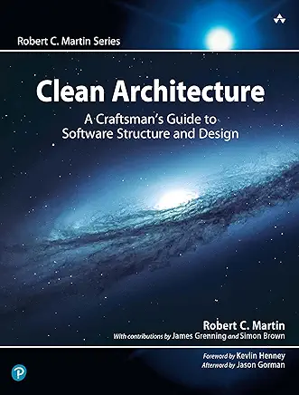

## 整洁架构 - 软件结构与设计匠人指南

 
Robert C. Martin (2018)

----

### 目录
* [序言](foreword.md)
* [前言](preface.md)
* [致谢](acks.md)
* [关于作者](author.md)
* [第 1 部分](part1.md)
  - [1 什么是设计与架构？](ch1/0.md)
  - [2 两种价值](ch2/0.md)
* [第 2 部分](part2.md)
  - [3 范式概述](ch3/0.md)
  - [4 结构化编程](ch4/0.md)
  - [5 面向对象编程](ch5/0.md)
  - [6 函数式编程](ch6/0.md)
* [第 3 部分 设计原则](part3.md)
  - [7 SRP：单一职责原则](ch7/0.md)
  - [8 OCP：开闭原则](ch8/0.md)
  - [9 LSP：里氏替换原则](ch9/0.md)
  - [10 ISP：接口隔离原则](ch10/0.md)
  - [11 DIP：依赖反转原则](ch11/0.md)
