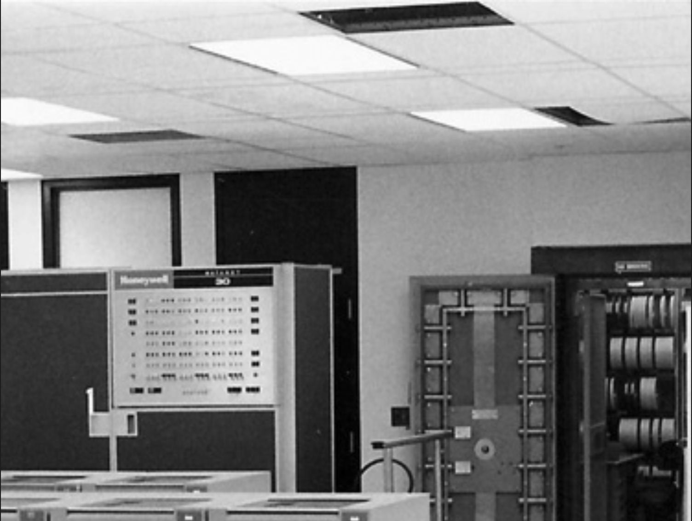
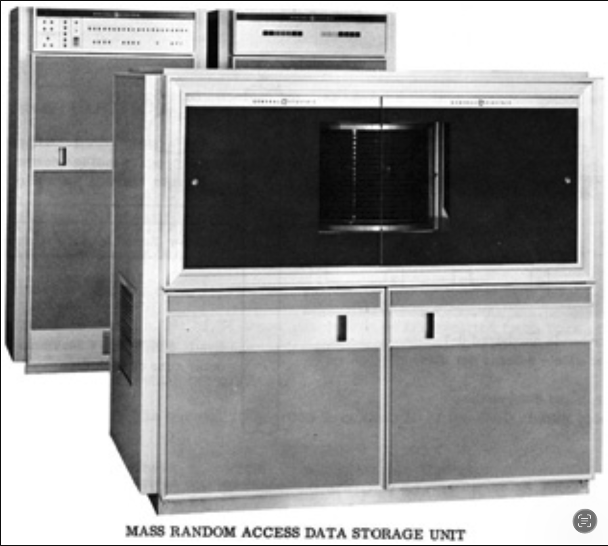
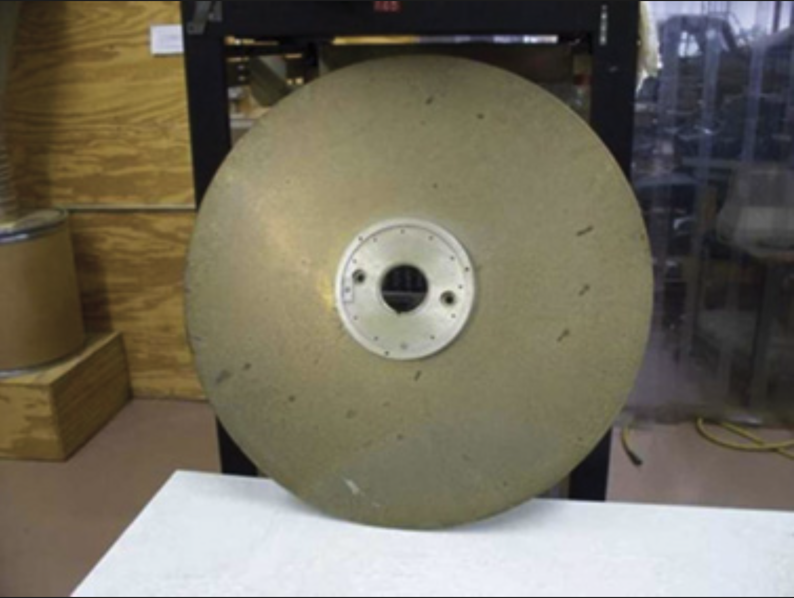
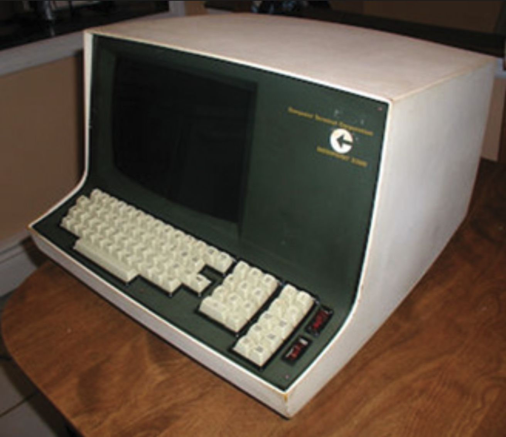
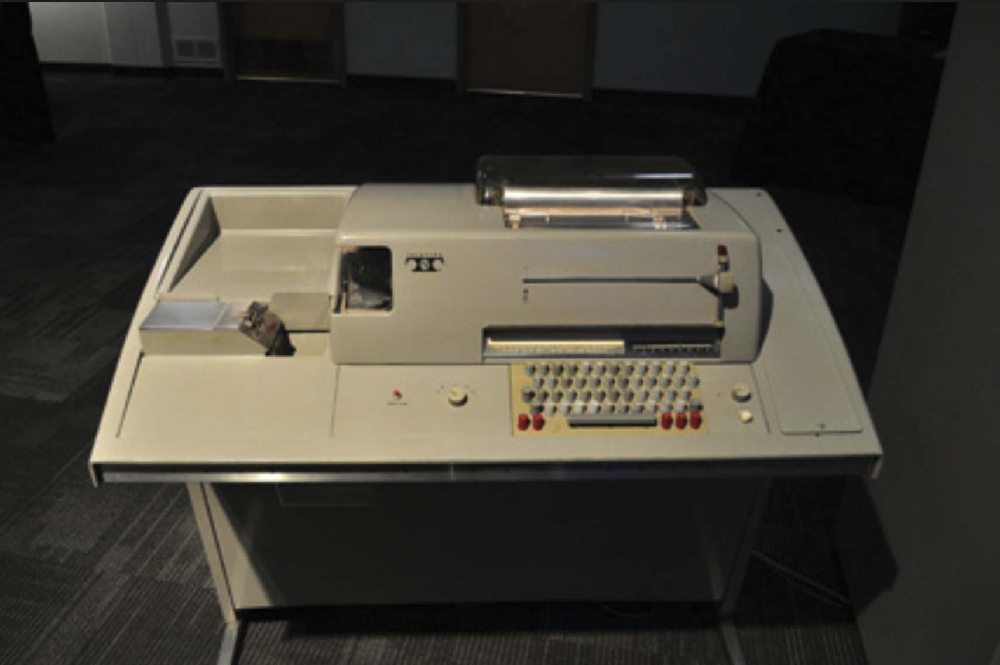
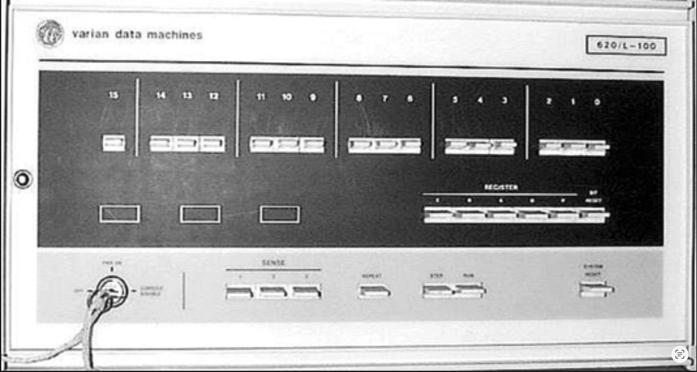
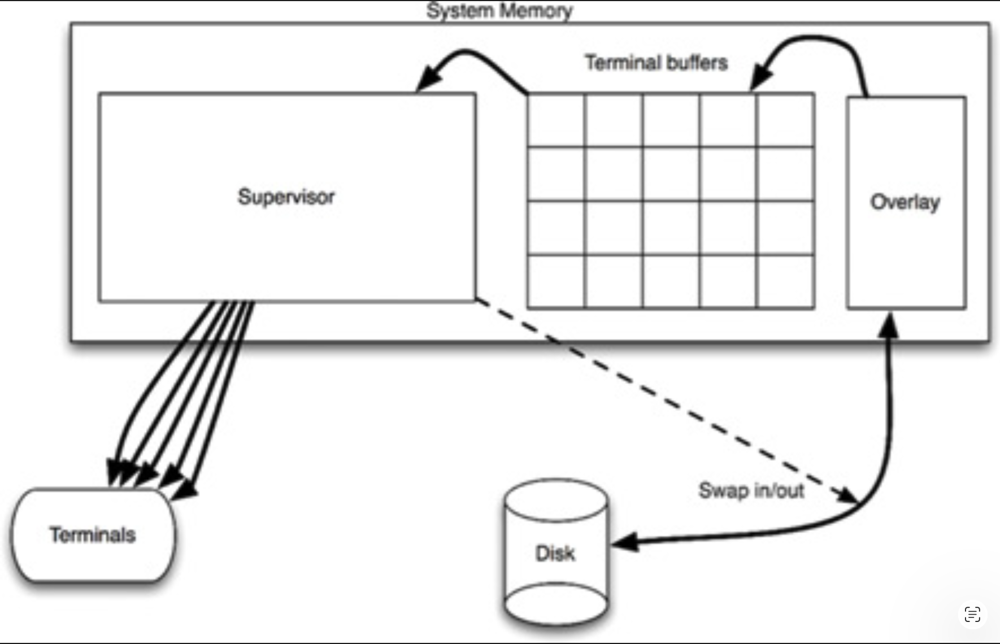
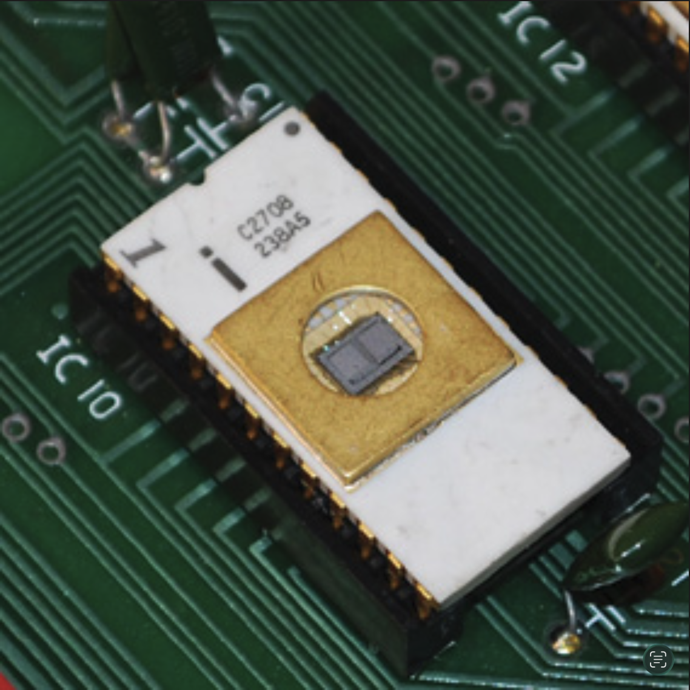
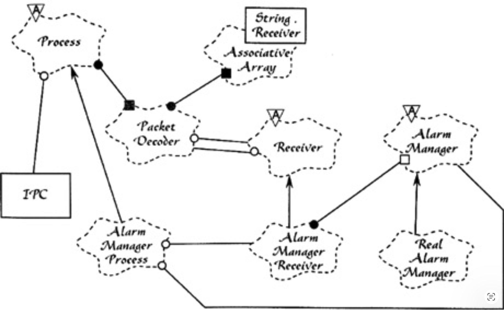

# A 架构考古学

---
<center></center><br/>

为了发掘良好架构的原则，让我们踏上一段历时 45 年的旅程，回顾我自 1970 年以来参与过的一些项目。
其中某些项目从架构角度来看很有趣；
另一些项目则因其带来的经验教训以及它们如何影响后续项目而引人入胜。

这篇附录带有一点自传性质。
我尽量使讨论紧扣架构主题；但正如任何自传性质的内容一样，其他因素有时难免会穿插进来。
；-)

## 工会会计系统

在 20 世纪 60 年代末，一家名为 ASC Tabulating 的公司与卡车司机工会 Local 705 签订了一份合同，为其提供一个会计系统。
ASC 选择用来实现该系统的计算机是 GE Datanet 30，如 [Fig A.1](#fig-a1) 所示。

#### Fig A.1
<br/>
*Fig A.1 GE Datanet 30*

*承蒙 Ed Thelen, ed-thelen.org 提供*

从图片中可以看出，这是一台巨大的 <sup>[1](#1)</sup> 机器。
它占据了一个房间，并且该房间需要严格的环境控制。

这台计算机是在集成电路出现之前制造的。
它由分立晶体管构成。
里面甚至还有一些真空管（尽管仅限于磁带驱动器的读出放大器）。

按照今天的标准，这台机器巨大、缓慢、小巧且原始。
它拥有 16K × 18 位的磁芯，周期时间约为 7 微秒。<sup>[2](#2)</sup>
它占据了一个需要环境控制的大房间。
它有 7 个轨磁带驱动器和一个容量约为 20 兆字节的磁盘驱动器。

那个磁盘是一个庞然大物。
你可以从 [Fig A.2](#fig-a2) 中看到它 —— 但这并不能完全展现这个庞然大物的规模。
那个机柜的顶部比我的头还高。
盘片直径为 36 英寸，厚度为 3/8 英寸。
其中一张盘片如 [Fig A.3](#fig-a3) 所示。

现在数一数第一张图片中的盘片。
有十几个。
每一个都有自己的寻道臂，由气动执行器驱动。
你可以看到那些寻道磁头在盘片上移动。
寻道时间大概在 0.5 秒到 1 秒之间。

当这个庞然大物启动时，听起来像喷气发动机。
地板会隆隆作响并震动，直到它达到全速。<sup>[3](#3)</sup>

#### Fig A.2
<br/>
*Fig A.2 带有盘片的数据存储单元*

*承蒙 Ed Thelen, ed-thelen.org 提供*

Datanet 30 最大的亮点是其能够以相对较高的速度驱动大量异步终端。
这正是 ASC 所需要的。

ASC 位于伊利诺伊州 Lake Bluff，芝加哥以北 30 英里。
Local 705 办公室位于芝加哥市中心。
工会希望他们十几个数据录入员使用 CRT <sup>[4](#4)</sup> 终端（ [Fig A.4](#fig-a4) ）将数据输入系统。
他们将在 ASR35 电传打字机（ [Fig A.5](#fig-a5) ）上打印报告。

#### Fig A.3
<br/>
*Fig A.3 该磁盘的一张盘片：3/8 英寸厚，直径 36 英寸*

*承蒙 Ed Thelen, ed-thelen.org 提供*

CRT 终端以每秒 30 个字符的速度运行。
这在 20 世纪 60 年代末已经算是相当不错的速度了，因为当时的调制解调器还相对不那么先进。

ASC 从电话公司租用了十几条专用电话线和两倍数量的 300 波特调制解调器，将 Datanet 30 连接到这些终端。

这些计算机没有配备操作系统。
它们甚至没有文件系统。
你得到的只是一个汇编器。

如果你需要在磁盘上存储数据，你就在磁盘上存储数据。
不是在文件中。
不是在目录中。
你要计算出数据应该放入哪个磁道、盘片和扇区，然后操作磁盘将数据放在那里。
是的，这意味着我们编写了自己的磁盘驱动程序。

#### Fig A.4
<br/>
*Fig A.4 Datapoint CRT 终端*

*承蒙 Bill Degnan, vintagecomputer.net 提供*

工会会计系统有三种记录：代理人、雇主和会员。
该系统是对这些记录进行 CRUD 操作的系统，但也包括缴纳会费、计算总账变动等操作。

原始系统由一位顾问用汇编器编写，他以某种方式将整个系统塞进了 16K 中。

正如你可能想象的那样，那台巨大的 Datanet 30 是一台运行和维护成本都很高的机器。
维护软件运行的软件顾问也很昂贵。
此外，小型计算机正变得流行，而且便宜得多。

#### Fig A.5
<br/>
*Fig A.5 ASR35 电传打字机*

*Joe Mabel 授权使用*

1971 年，我 18 岁时，ASC 雇佣了我和另外两个极客朋友，
用一个基于 Varian 620/f 小型计算机（ [Fig A.6](#fig-a6) ）的系统来替换整个工会会计系统。
这台计算机很便宜。
我们也很便宜。
所以对 ASC 来说，这似乎是一笔好交易。

Varian 机器有一个 16 位总线和 32K * 16 位的磁芯存储器。
它的周期时间约为 1 微秒。
它比 Datanet 30 强大得多。
它使用了 IBM 大获成功的 2314 磁盘技术，
使我们能够在直径仅为 14 英寸的盘片上存储 30 兆字节，而且不会穿透混凝土砌块墙爆炸！

当然，我们仍然没有操作系统。
没有文件系统。
没有高级语言。
我们只有一个汇编器。
但我们照样应付过来了。

#### Fig A.6
<br/>
*Fig A.6 Varian 620/f 小型计算机*

*小型计算机孤儿院*

我们没有试图将整个系统塞进 32K 中，而是创建了一个覆盖系统。
应用程序会从磁盘加载到一块专用于覆盖的内存中。
它们会在该内存中执行，并被抢先交换回磁盘，连同它们的本地 RAM，以允许其他程序执行。

程序会被交换到覆盖区，执行到足以填满输出缓冲区，然后被交换出去，以便另一个程序可以被交换进来。

当然，当你的 UI 以每秒 30 个字符的速度运行时，你的程序会花很多时间在等待上。
我们有充足的时间将程序换入和换出磁盘，以使所有终端尽可能快地运行。
从来没有人抱怨过响应时间问题。

我们编写了一个抢占式管理程序来管理中断和 IO。
我们编写了应用程序；我们编写了磁盘驱动程序、终端驱动程序、磁带驱动程序以及该系统中的所有其他东西。
在那个系统中，没有一个比特不是我们没有编写的。
尽管这是一场涉及太多 80 小时工作周的艰苦斗争，但我们还是在 8 或 9 个月的时间里让这个庞然大物启动并运行起来了。

该系统的架构很简单（ [Fig A.7](#fig-a7) ）。
当一个应用程序启动时，它会生成输出，直到其特定的终端缓冲区满为止。
然后管理程序会将应用程序换出，并换入一个新的应用程序。
管理程序会继续以每秒 30 个字符的速度缓慢输出终端缓冲区的内容，直到缓冲区几乎为空。
然后它会将应用程序换回，以再次填充缓冲区。

#### Fig A.7
<br/>
*Fig A.7 系统架构*

这个系统中有两个边界。
第一个是字符输出边界。
应用程序不知道它们的输出是发送到每秒 30 个字符的终端。
实际上，从应用程序的角度来看，字符输出完全是抽象的。
应用程序只是将字符串传递给管理程序，而管理程序负责加载缓冲区、将字符发送到终端，以及将应用程序换入和换出内存。

这个边界是依赖正常的 —— 也就是说，依赖关系与控制流方向一致。
应用程序对管理程序有编译时依赖，并且控制流从应用程序流向管理程序。
该边界防止了应用程序知道输出要发送到哪种设备。

第二个边界是依赖反转的。
管理程序可以启动应用程序，但对它们没有编译时依赖。
控制流从管理程序流向应用程序。
反转依赖的多态接口很简单：每个应用程序都是通过跳转到覆盖区内的同一个内存地址来启动的。
该边界除了起始点之外，阻止了管理程序了解应用程序的任何其他信息。

## 激光调阻

1973 年，我加入了芝加哥一家名为 Teradyne Applied Systems (TAS) 的公司。
这是总部位于波士顿的 Teradyne Inc. 的一个部门。
我们的产品是一个系统，使用功率相对较高的激光器将电子元件微调到非常精细的公差。

在那个年代，制造商会将电子元件丝网印刷到陶瓷基板上。
这些基板大约 1 英寸见方。
这些元件通常是电阻器 —— 即抵抗电流流动的器件。

电阻器的电阻取决于许多因素，包括其成分和几何形状。
电阻器越宽，其电阻就越小。

我们的系统会将陶瓷基板定位在一个带有探针的夹具中，探针与电阻器接触。
系统会测量电阻器的电阻，然后使用激光烧蚀掉电阻器的部分，使其越来越细，直到达到所需的电阻值，误差在十分之一个百分点左右。

我们将这些系统销售给制造商。
我们还使用一些内部系统为小型制造商小批量进行调阻。

计算机是 M365。
那是在许多公司都制造自己计算机的时代：Teradyne 制造了 M365，并将其供应给其所有部门。
M365 是 PDP-8 的增强版 —— 当时流行的一种小型计算机。

M365 控制定位台，该定位台在探针下移动陶瓷基板。
它控制测量系统和激光器。
激光器使用 X-Y 反射镜进行定位，这些反射镜可以在程序控制下旋转。
计算机还可以控制激光器的功率设置。

M365 的开发环境相对原始。
没有磁盘。
大容量存储使用磁带盒，看起来像旧的 8 轨音频磁带盒。
磁带和驱动器由 Tri-Data 制造。

与当时的 8 轨音频磁带一样，磁带呈环形定向。
驱动器只朝一个方向移动磁带 —— 没有倒带！
如果你想把磁带定位到开头，你必须将其向前送到其 “加载点”。

磁带以大约每秒 1 英尺的速度移动。
因此，如果磁带环长 25 英尺，将其送到加载点可能需要长达 25 秒。
因此，Tridata 制造了多种长度的磁带盒，范围从 10 英尺到 100 英尺。

M365 前面有一个按钮，可以将一个小型引导程序加载到内存中并执行它。
该程序会从磁带读取第一个数据块并执行它。
通常，该块包含一个加载器，用于加载驻留在磁带其余部分的操作系统。

操作系统会提示用户输入要运行的程序名称。
这些程序存储在磁带上，紧跟在操作系统之后。
我们会输入程序名称 ——例如，ED-402 编辑器—— 然后操作系统会在磁带上搜索该程序，加载并执行它。

控制台是一个 ASCII CRT，绿色荧光粉，72 个字符宽 <sup>[5](#5)</sup>，24 行。
所有字符都是大写。

要编辑程序，你会加载 ED-402 编辑器，然后插入存放你源代码的磁带。
你会将源代码的一个磁带块读入内存，并显示在屏幕上。
该磁带块可能包含 50 行代码。
你可以通过移动光标在屏幕上进行编辑，以类似于 vi 的方式输入。
完成后，你会将该块写入另一盘磁带，并从源磁带读取下一个块。
你会一直这样做，直到完成。

没有滚动回之前块的功能。
你从开始到结束直线编辑你的程序。
要回到开头，你被迫将源代码复制到输出磁带，然后在那盘磁带上开始一个新的编辑会话。
鉴于这些限制，不足为奇的是，我们会将程序打印在纸上，用红笔手动标记所有编辑，然后通过查阅列表上的标记逐块编辑程序。

程序编辑完成后，我们回到操作系统并调用汇编器。
汇编器读取源代码磁带，并写入一个二进制磁带，同时在我们的数据产品行式打印机上生成一份列表。

磁带并非 100% 可靠，因此我们总是同时写两盘磁带。
这样，至少有一盘有很高的概率没有错误。

我们的程序大约有 20,000 行代码，编译耗时近 30 分钟。
在此期间出现磁带读取错误的概率大约是十分之一。
如果汇编器遇到磁带错误，它会在控制台上响铃，然后开始在打印机上打印一连串错误信息。
你可以在整个实验室听到那令人抓狂的铃声。
你还可以听到那位可怜的程序员的咒骂声，他刚刚得知需要重新开始这 30 分钟的编译。

该程序的架构在当时很典型。
有一个主操作程序，被恰当地称为 “MOP”。
它的工作是管理基本的 IO 功能，并提供控制台 “shell” 的雏形。
Teradyne 的许多部门共享 MOP 源代码，但每个部门都为了自己的用途而对其进行了分支。
因此，我们会以带标记的列表形式相互发送源代码更新，然后手动（并且非常小心地）进行整合。

一个专用的工具层控制测量硬件、定位台和激光器。
该层与 MOP 之间的边界充其量是模糊的。
虽然工具层调用了 MOP，但 MOP 已经为该层进行了专门修改，并且经常回调到该层中。
实际上，我们并不真正认为这两层是分开的。
对我们来说，这只是我们以高度耦合的方式添加到 MOP 中的一些代码。

接下来是隔离层。
该层为应用程序提供了一个虚拟机接口，这些应用程序是用一种完全不同的、特定于领域的数据驱动语言（DSL）编写的。
该语言具有移动激光器、移动工作台、进行切割、进行测量等操作。
我们的客户会使用这种语言编写他们的激光调阻应用程序，而隔离层则会执行它们。

这种方法并不是为了创建一种独立于机器的激光调阻语言。
实际上，该语言有许多与下层深度耦合的特殊性。
相反，这种方法为应用程序程序员提供了一种比 M356 汇编器 “更简单” 的语言来编写他们的调阻任务。

调阻任务可以从磁带加载并由系统执行。
从本质上讲，我们的系统是一个用于调阻应用程序的操作系统。

该系统是用 M365 汇编器编写的，并在一个单一的编译单元中编译，生成绝对二进制代码。

该应用程序中的边界充其量是松散的。
即使是系统代码与用 DSL 编写的应用程序之间的边界也没有得到很好的强制执行。
到处都存在耦合。

但这在 20 世纪 70 年代初期的软件中是典型的。

## 铝压铸监控

20 世纪 70 年代中期，当欧佩克对石油实施禁运，汽油短缺导致愤怒的司机在加油站大打出手时，我开始在 Outboard Marine Corporation (OMC) 工作。
这是 Johnson Motors 和 Lawnboy 割草机的母公司。

OMC 在伊利诺伊州沃基根市拥有一个大型工厂，为该公司所有的发动机和产品制造压铸铝部件。
铝在巨大的熔炉中熔化，然后由大桶运送到数十台独立操作的铝压铸机。
每台机器都有一名操作员，负责设置模具、使机器循环运转并取出新铸件。
这些操作员的薪酬是根据他们生产的零件数量来支付的。

我被雇佣从事车间自动化项目。
OMC 购买了一台 IBM System/7 —— 这是 IBM 对小型计算机的回应。
他们将这台计算机与车间里所有的压铸机连接起来，这样我们就可以计数并计时每台机器的循环周期。
我们的角色是收集所有这些信息，并将其显示在 3270 绿屏显示器上。

语言是汇编器。
而且，在这台计算机中执行的每一点代码都是我们编写的。
没有操作系统，没有子程序库，也没有框架。
只有原始代码。

这也是中断驱动的实时代码。
每当一台压铸机完成一个循环，我们都必须更新一批统计数据，
并向天空中那台巨大的 IBM 370 发送消息，该机器运行着一个 CICS-COBOL 程序，在绿屏上显示那些统计数据。

我讨厌这份工作。
哦，天哪，我真的很讨厌。
哦，工作本身很有趣！
但是企业文化……只能说，我被要求打领带。

哦，我试过了。
我真的试过了。
但我显然在那工作得不开心，我的同事们也知道。
他们知道，因为我记不住关键日期，或者无法早起参加重要会议。
这是我唯一一份被炒掉的编程工作 —— 我活该。

从架构的角度来看，这里没什么好学的，除了一件事。
System/7 有一条非常有趣的指令，叫做设置程序中断（SPI）。
这允许你触发处理器的中断，让它处理任何其他排队的低优先级中断。
如今，在 Java 中我们称之为 `Thread.yield()`。

## 4-TEL

1976 年 10 月，在被 OMC 解雇后，我回到了 Teradyne 的一个不同部门 —— 一个我将在此工作 12 年的部门。
我从事的产品名为 4-TEL。
其目的是每天晚上测试电话服务区域内的每条电话线，并生成一份所有需要维修线路的报告。
它还允许电话测试人员详细测试特定的电话线路。

该系统在其生命周期之初采用了与激光调阻系统相同的架构。
它是一个用汇编语言编写的单体应用程序，没有任何重要的边界。
但在我加入公司时，这种情况即将改变。

该系统由位于服务中心（SC）的测试人员使用。
一个服务中心覆盖多个中心局（CO），每个中心局可以处理多达 10,000 条电话线。
拨号和测量硬件必须位于中心局内。
所以这就是 M365 计算机所在的地方。
我们称这些计算机为中心局线路测试器（COLT）。
另一台 M365 放置在服务中心，称为服务区计算机（SAC）。
SAC 拥有多个调制解调器，可用于拨号连接 COLT 并以 300 波特（每秒 30 个字符）的速度进行通信。

起初，COLT 计算机完成所有工作，包括所有的控制台通信、菜单和报告。
SAC 只是一个简单的多路复用器，接收 COLT 的输出并将其显示在屏幕上。

这种设置的问题在于每秒 30 个字符真的很慢。
测试人员不喜欢看着字符在屏幕上缓慢显示，尤其是因为他们只对少数关键数据感兴趣。
此外，在那些日子里，M365 的磁芯存储器很昂贵，而且程序很大。

解决方案是，将软件中拨号和测量线路的部分与分析结果并打印报告的部分分离开。
后者将移到 SAC 中，而前者仍留在 COLT 中。
这将使 COLT 成为一台更小的机器，内存需求大大减少，并且由于报告将在 SAC 中生成，终端的响应速度将大大提高。

结果非常成功。
屏幕更新非常快（一旦拨通了相应的 COLT），并且 COLT 的内存占用大大减少。

该边界非常清晰且高度解耦。
SAC 和 COLT 之间交换的数据包非常简短。
这些数据包是一种非常简单的 DSL 形式，代表诸如 “拨号 XXXX” 或 “测量” 之类的原始命令。

M365 从磁带加载。
那些磁带驱动器很昂贵，而且不太可靠 —— 尤其是在电话中心局的工业环境中。
此外，相对于 COLT 内的其他电子设备，M365 也是一台昂贵的机器。
因此，我们启动了一个项目，用基于 8085 微处理器的微型计算机来替换 M365。

新计算机由一块容纳 8085 的处理器板、一块容纳 32K RAM 的 RAM 板和三块 ROM 板组成，每块 ROM 板容纳 12K 的只读存储器。
所有这些板都安装在与测量硬件相同的机箱中，从而消除了容纳 M365 的笨重额外机箱。

ROM 板容纳了 12 个 Intel 2708 EPROM（可擦除可编程只读存储器）芯片。<sup>[6](#6)</sup>
[Fig A.8](#fig-a8) 展示了这种芯片的一个示例。
我们将这些芯片插入称为 PROM 烧录器的特殊设备中加载软件，这些设备由我们的开发环境驱动。
芯片可以通过暴露在高强度紫外线下进行擦除。<sup>[7](#7)</sup>

我的哥们 CK 和我将 COLT 的 M365 汇编语言程序翻译成了 8085 汇编语言。
这项翻译工作是手工完成的，花了我们大约 6 个月的时间。
最终结果是大约 30K 的 8085 代码。

我们的开发环境有 64K 的 RAM 而没有 ROM，因此我们可以快速将编译好的二进制文件下载到 RAM 中并进行测试。

一旦程序正常运行，我们就转向使用 EPROM。
我们烧录了 30 块芯片，并将它们插入三块 ROM 板中相应的插槽。
每块芯片都贴有标签，以便我们知道哪块芯片插入哪个插槽。

这个 30K 的程序是一个单一的二进制文件，长度为 30K。
为了烧录芯片，我们只需将该二进制映像分割成 30 个不同的 1K 段，并将每个段烧录到贴有相应标签的芯片上。

#### Fig A.8
<br/>
*Fig A.8 EPROM 芯片*

这种方法效果很好，我们开始批量生产硬件并将系统部署到现场。

但软件是“软”的。<sup>[8](#8)</sup>
需要添加功能。
需要修复错误。
随着安装基数的增长，通过为每次安装烧录 30 块芯片来更新软件，以及让现场服务人员在每个站点更换全部 30 块芯片的后勤工作变成了一场噩梦。

出现了各种各样的问题。
有时芯片会贴错标签，或者标签脱落。
有时现场服务工程师会错误地更换了错误的芯片。
有时现场服务工程师会不小心弄断一块新芯片的引脚。
因此，现场工程师必须携带全部 30 块芯片的备件。

为什么我们必须更换全部 30 块芯片？
每次我们从 30K 可执行文件中添加或删除代码时，每条指令加载的地址都会改变。
它还会改变我们调用的子程序和函数的地址。
因此，无论更改多么微小，每块芯片都会受到影响。

有一天，我的老板来找我，让我解决这个问题。
他说我们需要一种方法，在不每次更换全部 30 块芯片的情况下对固件进行更改。
我们就此问题集思广益了一段时间，然后开始了 “向量化” 项目。
它花了我三个月的时间。

这个想法非常简单巧妙。
我们将 30K 程序划分为 32 个可独立编译的源文件，每个文件小于 1K。
在每个源文件的开始，我们告诉编译器在哪个地址加载生成的结果程序（例如，对于要插入 C4 位置的芯片，使用 `ORG C400`）。

同样在每个源文件的开始，我们创建了一个简单的、固定大小的数据结构，其中包含该芯片上所有子程序的所有地址。
这个数据结构长 40 个字节，因此最多可容纳 20 个地址。
这意味着每个芯片不能有超过 20 个子程序。

接下来，我们在 RAM 中创建了一个称为 “向量表” 的特殊区域。
它包含 32 个 40 字节的表 —— 正好有足够的 RAM 来保存每个芯片开头的指针。

最后，我们将对每个芯片上每个子程序的每次调用都改为通过相应的 RAM 向量进行间接调用。

当我们的处理器启动时，它会扫描每块芯片，并将每块芯片开头的向量表加载到 RAM 向量中。
然后它会跳转到主程序。

这种方法效果非常好。
现在，当我们修复错误或添加功能时，我们可以简单地重新编译一两个芯片，并只将这些芯片发送给现场服务工程师。

我们使芯片变得可独立部署。
我们发明了多态分发。
我们发明了对象。

这实际上是一个插件架构。
我们将那些芯片插进去。
我们最终设计得如此巧妙，以至于可以通过将带有该功能的芯片插入一个空的芯片插座来将功能安装到我们的产品中。
菜单控制会自动出现，并且与主应用程序的绑定也会自动发生。

当然，我们当时并不了解面向对象原则，对将用户界面与业务规则分离也一无所知。
但基本原理已经存在，而且非常强大。

这种方法带来的一个意想不到的附带好处是，我们可以通过拨号连接来修补固件。
如果我们在固件中发现了一个错误，我们可以拨号连接到我们的设备，并使用板载监控程序来修改错误子程序的 RAM 向量，使其指向一块空的 RAM。
然后我们以十六进制机器码的形式，将修复后的子程序输入到那个 RAM 区域。

这对我们的现场服务运营和我们的客户来说是一个巨大的福音。
如果他们遇到了问题，不需要我们寄送新的芯片并安排紧急的现场服务呼叫。
系统可以被修补，然后在下次定期安排的维护访问中安装新的芯片。

## 服务区计算机

4-TEL 服务区计算机（SAC）基于 M365 小型计算机。
该系统通过专用调制解调器或拨号调制解调器与现场的所有 COLT 通信。
它会命令这些 COLT 测量电话线，接收回原始结果，然后对这些结果进行复杂分析，以识别和定位任何故障。

### 派工判定

该系统的一个经济基础在于对维修技工的正确分配。
根据工会规定，维修技工分为三类：中心局、电缆和引入线。
中心局技工负责修复中心局内部的问题。
电缆技工负责修复将中心局连接到客户的电缆设备中的问题。
引入线技工负责修复客户场所内部以及将外部电缆连接到该场所的线路（即 “引入线” ）中的问题。

当客户投诉问题时，我们的系统可以诊断该问题并确定应派遣哪种类型的技工。
这为电话公司节省了大量资金，因为错误的派遣意味着客户的延误和技工白跑一趟。

负责编写派工判定代码的人非常聪明，但极其不善于沟通。
编写代码的过程被描述为：“三个星期盯着天花板，然后两天代码从他身体的每一个孔洞中喷涌而出 —— 之后他就辞职了。”

没有人理解这段代码。
每次我们试图添加功能或修复缺陷时，都会以某种方式破坏它。
由于我们系统的主要经济效益之一就建立在这段代码之上，每一个新的缺陷都令公司深感尴尬。

最终，我们的管理层只是告诉我们锁定那段代码，永远不要修改它。
那段代码正式变得僵化。

这次经历让我深刻体会到了优秀、整洁代码的价值。

### 架构

该系统于 1976 年用 M365 汇编器编写。
它是一个约 60,000 行的单一单体程序。
操作系统是一个基于轮询的自制非抢占式任务切换器。
我们称之为 MPS，即多处理系统。
M365 计算机没有内置堆栈，因此特定于任务的数据保存在内存的一个特殊区域中，并在每次上下文切换时被换出。
共享数据使用锁和信号量进行管理。
可重入问题和竞态条件是持续存在的问题。

设备控制逻辑或 UI 逻辑与系统的业务规则之间没有隔离。
例如，调制解调器控制代码散落在大量的业务规则和 UI 代码中。
没有尝试将其收集到一个模块中或抽象其接口。
调制解调器是在比特级别上由遍布系统各处的代码控制的。

终端 UI 也是如此。
消息和格式控制代码没有被隔离。
它们遍布在 60,000 行代码库中。

我们使用的调制解调器模块设计用于安装在 PCB 上。
我们从第三方购买这些单元，并将它们与其他电路集成到一块板上，该板适合我们的定制背板。
这些单元很昂贵。
因此，几年后，我们决定设计自己的调制解调器。
我们软件组恳求硬件设计人员使用相同的位格式来控制新调制解调器。
我们解释说，调制解调器控制代码散布在各处，并且我们的系统将来必须处理两种调制解调器。
因此，我们又求又哄：“请从软件控制的角度，让新调制解调器看起来和旧调制解调器一模一样。”

但当我们拿到新调制解调器时，控制结构完全不同。
不只是有点不同，而是完全彻底的差异。

谢谢，硬件工程师。

我们该怎么办？
我们并不是简单地将所有旧调制解调器替换为新调制解调器。
相反，我们在系统中混合使用旧的和新的调制解调器。
软件需要能够同时处理两种类型的调制解调器。
我们注定要在代码中操作调制解调器的每个地方都用标志和特殊情况来处理吗？
这样的地方有数百处！

最终，我们选择了一个甚至更糟的解决方案。

有一个特定的子程序将数据写入串行通信总线，该总线用于控制我们所有的设备，包括我们的调制解调器。
我们修改了该子程序，让它识别旧调制解调器特有的位模式，并将其转换为新调制解调器所需的位模式。

这并不简单。
发送给调制解调器的命令包括向串行总线上不同 IO 地址的写入序列。
我们的 hack 必须按顺序解释这些命令，并使用不同的 IO 地址、时序和位位置将它们转换为不同的序列。

我们让它工作了，但这是你能想象到的最糟糕的 hack。
正是由于这场惨败，我学到了将硬件与业务规则隔离以及抽象接口的价值。

### 天空中的大重构

到 20 世纪 80 年代，生产自己的小型计算机和自己计算机架构的想法开始过时。
市场上有许多微型计算机，让它们工作比继续依赖 60 年代末的专有计算机架构更便宜、更标准。
这一点，加上 SAC 软件糟糕的架构，促使我们的技术管理层开始对 SAC 系统进行完全的重构。

新系统将用 C 语言编写，使用磁盘上的 UNIX 操作系统，运行在 Intel 8086 微型计算机上。
我们的硬件人员开始研发新的计算机硬件，并委托一个精选的软件开发团队 “老虎队” 负责重写工作。

我不会用最初的惨败细节来烦你。
只需说，第一个老虎队在花费了两到三年的人年之后完全失败了，没有交付任何东西。

一两年后，大概是 1982 年，这个过程再次启动。
目标是在我们自己新设计的、功能强大得令人印象深刻的 80286 硬件上，用 C 和 UNIX 对 SAC 进行完全彻底的重构。
我们称那台计算机为 “Deep Thought”。

花了几年，然后又几年，再然后又是几年。
我不知道第一个基于 UNIX 的 SAC 最终是什么时候部署的；我想我当时已经离开了公司（1988 年）。
实际上，我完全不确定它是否真的被部署了。

为什么延迟？
简而言之，重构团队很难赶上大量积极维护旧系统的程序员。
以下是他们遇到的困难的一个例子。

### 欧洲

大约在 SAC 用 C 语言重构的同时，公司开始将销售扩展到欧洲。
他们不能等待重构软件完成，因此，他们当然将旧的 M365 系统部署到了欧洲。

问题在于，欧洲的电话系统与美国的电话系统非常不同。
技工和官僚机构的组织方式也不同。
因此，我们最优秀的程序员之一被派往英国，领导一个英国开发团队修改 SAC 软件以处理所有这些欧洲问题。

当然，没有认真尝试将这些更改集成到美国的软件中。
这远在网络使跨洋传输大型代码库变得可行之前。
这些英国开发人员只是将美国代码分支并按照需要进行修改。

这当然会造成困难。
大西洋两岸都发现了需要对方修复的错误。
但模块已经有了显著变化，因此很难确定在美国进行的修复是否能在英国工作。

经过几年的煎熬，并在美国和英国办事处之间安装了高吞吐量的线路连接之后，人们认真尝试将这两个分支重新整合在一起，使差异成为配置问题。
这项尝试在第一、第二和第三次都失败了。
这两个代码库虽然非常相似，但差异仍然太大，无法重新整合 —— 尤其是在当时快速变化的市场环境中。

与此同时，“老虎队” 试图用 C 和 UNIX 重写所有内容，也意识到它必须处理这种欧洲/美国的二分法。
而且，这当然无助于加速他们的进度。

### SAC 结论

关于这个系统，我还可以告诉你许多其他故事，但对我来说继续下去太令人沮丧了。
只需说，我软件生涯中的许多惨痛教训，都是在我沉浸在 SAC 那糟糕的汇编代码中时学到的。

## C 语言

我们在 4-Tel Micro 项目中使用的 8085 计算机硬件，为许多可以嵌入工业环境的不同项目提供了一个相对低成本的计算平台。
我们可以为其配备 32K 的 RAM 和另外 32K 的 ROM，并且我们有一个极其灵活和强大的方案来控制外围设备。
我们所没有的是一种灵活、方便的语言来为这台机器编写程序。
用 8085 汇编器编写代码根本不好玩。

除此之外，我们使用的汇编器是我们自己的程序员编写的。
它运行在我们的 M365 计算机上，使用 “激光调阻” 部分中描述的磁带操作系统。

命运使然，我们的首席硬件工程师说服了我们的 CEO，我们需要一台真正的计算机。
他实际上并不知道他会用它做什么，但他有很多政治影响力。
于是我们购买了一台 PDP-11/60。

我，当时一个低微的软件开发人员，欣喜若狂。
我非常清楚我想用那台计算机做什么。
我下定决心，这将是属于我的机器。

当手册在机器交付前几个月到达时，我把它们带回家并如饥似渴地阅读。
到计算机交付时，我已经深入了解了硬件和软件的操作 —— 至少，像居家自学所能达到的那样深入。

我帮助撰写了采购订单。
特别是，我指定了新计算机将拥有的磁盘存储。
我们决定购买两台磁盘驱动器，它们可以使用可移动的磁盘组，每个磁盘组容量为 25 兆字节。<sup>[9](#9)</sup>

五十兆字节！
这个数字似乎是无限的！
我记得深夜在办公室的走廊里走着，像西方女巫一样咯咯地笑：“五十兆字节！哈哈哈哈哈哈哈哈！”

我让设施经理建了一个小房间，容纳六台 VT100 终端。
我用太空图片装饰了它。
我们的软件开发人员将使用这个房间来编写和编译代码。

当机器到达时，我花了几天时间进行设置，连接所有终端，并让一切正常工作。
这是一种喜悦 —— 一种充满爱的劳动。

我们从 Boston Systems Office 购买了 8085 的标准汇编器，并将 4-Tel Micro 代码翻译成该语法。
我们构建了一个交叉编译系统，允许我们将编译后的二进制文件从 PDP-11 下载到我们的 8085 开发环境和 ROM 烧录器。
而且 ——一切顺利—— 它就像一个冠军一样运行。

### C 语言

但这让我们仍然面临使用 8085 汇编器的问题。
这不是我满意的情况。
我听说贝尔实验室广泛使用一种 “新” 语言。
他们称之为 “C”。
于是我购买了一本 Kernighan 和 Ritchie 的《C 程序设计语言》。
就像几个月前的 PDP-11 手册一样，我如饥似渴地读完了这本书。

我对这种语言简洁优雅感到震惊。
它没有牺牲汇编语言的任何能力，并通过一种更方便的语法提供了对该能力的访问。
我被它征服了。

我从 Whitesmiths 购买了一个 C 编译器，并让它运行在 PDP-11 上。
编译器的输出是汇编语法，与 Boston Systems Office 的 8085 编译器兼容。
因此，我们有了从 C 到 8085 硬件的路径！
我们上路了。

现在唯一的问题是要说服一群嵌入式汇编语言程序员，他们应该使用 C。
但那是一个改天再说的噩梦故事……

## BOSS

我们的 8085 平台没有操作系统。
我在 M365 的 MPS 系统和 IBM System 7 的原始中断机制方面的经验，让我确信我们需要一个用于 8085 的简单任务切换器。
于是我想出了 BOSS：基本操作系统和调度器。<sup>[10](#10)</sup>

BOSS 的绝大部分是用 C 编写的。
它提供了创建并发任务的能力。
这些任务不是抢占式的 —— 任务切换不是基于中断发生的。
相反，就像 M365 上的 MPS 系统一样，任务切换基于一个简单的轮询机制。
每当一个任务因某个事件而阻塞时，就会进行轮询。

BOSS 中阻塞任务的调用看起来像这样：

```c
block(eventCheckFunction);
```

这个调用挂起当前任务，将 `eventCheckFunction` 放入轮询列表，并将其与新阻塞的任务关联起来。
然后它会在轮询循环中等待，调用轮询列表中的每个函数，直到其中一个返回 `true`。
与该函数关联的任务随后被允许运行。

换句话说，正如我之前所说，它是一个简单的、非抢占式的任务切换器。

这个软件在接下来的几年里成为了大量项目的基础。
但其中最早的项目之一是 pCCU。

## pCCU

20 世纪 70 年代末和 80 年代初，对电话公司来说是一个动荡的时期。
这种动荡的来源之一是数字革命。

在上个世纪，中心交换局和客户电话之间的连接是一对铜线。
这些电线被捆绑成电缆，形成覆盖乡村的巨大网络。
它们有时架设在电线杆上，有时埋在地下。

铜是一种贵金属，而电话公司拥有覆盖全国的成吨（字面意义上的成吨）铜。
资本投资是巨大的。
通过以数字形式传输电话通话，可以回收其中大部分资本。
一对铜线可以以数字形式承载数百个通话。

作为回应，电话公司开始了用现代数字交换机替换其旧的模拟中心交换设备的过程。

我们的 4-Tel 产品测试的是铜线，而不是数字连接。
在数字环境中仍然有大量铜线，但它们比以前短得多，并且位于客户电话附近。
信号将以数字方式从中心局传输到本地分配点，在那里它将转换回模拟信号，并通过标准铜线分配给客户。
这意味着我们的测量设备需要位于铜线开始的地方，但我们的拨号设备需要保留在中心局。
问题是，我们所有的 COLT 都将拨号和测量功能集中在了同一个设备中。
（如果我们几年前就认识到那个明显的架构边界，我们本可以省下一大笔钱！）

因此，我们构思了一个新的产品架构：CCU/CMU（COLT 控制单元和 COLT 测量单元）。
CCU 将位于中心交换局，负责拨打要测试的电话线路。
CMU 将位于本地分配点，负责测量通向客户电话的铜线。

问题在于，对于每个 CCU，都有许多 CMU。
关于每个电话号码应使用哪个 CMU 的信息由数字交换机本身持有。
因此，CCU 必须询问数字交换机以确定与哪个 CMU 通信和控制。

我们向电话公司承诺，我们将在他们的过渡期间及时让这种新架构工作。
我们知道他们可能需要数月甚至数年时间，所以我们并不感到紧迫。
我们也知道开发新的 CCU/CMU 硬件和软件将需要数人年的努力。

### 进度陷阱

随着时间的推移，我们发现有总是有紧急事务要求我们推迟 CCU/CMU 架构的开发。
我们对这个决定感到放心，因为电话公司一直在推迟数字交换机的部署。
当我们查看他们的进度表时，我们对自己有充足时间感到自信，因此我们不断地推迟我们的开发。

然后有一天，我的老板把我叫到他的办公室说：“我们的一个客户下个月要部署一台数字交换机。
到那时我们必须有一个能工作的 CCU/CMU。”

我惊呆了！
我们怎么可能在一个月内完成需要数人年的开发工作？
但我的老板有一个计划……

实际上，我们并不需要一个完整的 CCU/CMU 架构。
将要部署数字交换机的电话公司规模很小。
他们只有一个中心局，也只有两个本地分配点。更重要的是，这些 “本地” 分配点并不是特别本地。
它们实际上有普通的旧式模拟交换机，为数百名客户提供服务。
更好的是，这些交换机是一种可以由普通 COLT 拨号的类型。
更好的是，客户的电话号码包含决定使用哪个本地分配点所需的所有信息。
如果电话号码在某个特定位置有 5、6 或 7，则转到分配点 1；否则，转到分配点 2。

因此，正如我的老板向我解释的那样，我们实际上并不需要 CCU/CMU。
我们需要的只是在中心局放置一台简单的计算机，通过调制解调器线路连接到分配点的两台标准 COLT。
SAC 将与我们在中心局的计算机通信，该计算机将解码电话号码，然后将拨号和测量命令中继到相应分配点的 COLT。

于是 pCCU 诞生了。

这是第一个用 C 编写并使用 BOSS、部署给客户的产品。
我花了大约一周时间开发它。
这个故事没有深刻的架构意义，但它为下一个项目做了一个很好的铺垫。

## DLU/DRU

20 世纪 80 年代初，我们的一个客户是德克萨斯州的一家电话公司。
他们的地理覆盖区域很大。
实际上，区域之大，以至于一个服务区需要几个不同的办公室来派遣技工。
这些办公室有测试人员，他们需要终端连接到我们的 SAC。

你可能认为这是一个简单的问题 —— 但请记住，这个故事发生在 20 世纪 80 年代初。
远程终端并不常见。
更糟糕的是，SAC 的硬件假设所有终端都是本地的。
我们的终端实际上位于一个专有的高速串行总线上。

我们有远程终端能力，但它是基于调制解调器的，在 20 世纪 80 年代初，调制解调器通常限制在每秒 300 比特。
我们的客户对那种低速不满意。

高速调制解调器是可用的，但非常昂贵，而且需要在 “经调节的” 永久连接上运行。
拨号质量肯定不够好。

我们的客户要求解决方案。
我们的回应是 DLU/DRU。

DLU/DRU 代表 “显示本地单元” 和 “显示远程单元”。
DLU 是一块插入 SAC 计算机机箱的电脑板，并伪装成终端管理器板。
然而，它不是为本地终端控制串行总线，而是获取字符流，并通过一个 9600 bps 的经调节调制解调器链路进行多路复用。

DRU 是一个放置在客户远程位置的盒子。
它连接到 9600 bps 链路的另一端，并拥有控制我们专有串行总线上的终端的硬件。
它将从 9600 bps 链路接收到的字符解复用，并将其发送到适当的本地终端。

很奇怪，不是吗？
我们不得不设计一个解决方案，而如今这种方案如此普遍，我们甚至从未想过它。
但在那时……

我们甚至不得不发明我们自己的通信协议，因为在那些日子里，标准通信协议并不是开源共享软件。
实际上，这远在我们有任何种类的互联网连接之前。

### 架构

这个系统的架构非常简单，但我想强调一些有趣的怪癖。
首先，两个单元都使用了我们的 8085 技术，并且都是用 C 编写的，都使用了 BOSS。
但相似之处仅此而已。

我们项目中有两个人。
我是项目负责人，Mike Carew 是我的亲密伙伴。
我负责 DLU 的设计和编码；Mike 负责 DRU。

DLU 的架构基于一个数据流模型。
每个任务执行一个小的、专注的工作，然后使用队列将其输出传递给流水线上的下一个任务。
可以想象 UNIX 中的管道和过滤器模型。
该架构很复杂。
一个任务可能供给一个队列，而许多其他任务会处理它。
其他任务会供给一个只有一个任务处理的队列。

想象一条装配线。
装配线上的每个位置都有一个单一的、简单的、高度专注的工作要执行。
然后产品移动到流水线上的下一个位置。
有时装配线会分叉成许多条线。
有时这些线会合并回一条线。
这就是 DLU。

Mike 的 DRU 使用了一种明显不同的方案。
他为每个终端创建一个任务，并在该任务中为该终端完成所有工作。
没有队列。
没有数据流。
只是许多相同的大型任务，每个任务管理自己的终端。

这与装配线相反。
在这个类比中，是许多专家建造者，每个人构建一个完整的产品。

当时我认为我的架构更优越。
Mike 当然认为他的更好。
我们对此进行了许多有趣的讨论。
当然，最终两者都运行得很好。
我因此认识到，软件架构可以截然不同，但同样有效。

## VRS

随着 20 世纪 80 年代的发展，更新更先进的技术不断出现。
其中一项技术是计算机对语音的控制。

4-Tel 系统的一项功能是让技工能够定位电缆中的故障。
步骤如下：

- 中心局的测试人员会使用我们的系统确定到故障的大致距离（以英尺为单位）。
精度在 20% 左右。
测试人员会派遣电缆维修技工到该位置附近的合适接入点。

- 电缆维修技工到达后，会致电测试人员并要求开始故障定位过程。
测试人员会调用 4-Tel 系统的故障定位功能。
系统将开始测量该故障线路的电子特性，并在屏幕上打印消息，要求执行某些操作，例如打开电缆或短路电缆。

- 测试人员会告诉技工系统想要哪些操作，技工会告诉测试人员操作何时完成。
然后测试人员会告诉系统操作已完成，系统会继续进行测试。

- 经过两三次这样的交互后，系统会计算到故障的新距离。
电缆技工随后会驱车前往该位置，并再次开始这个过程。

想象一下，如果那些在电线杆上或站在基座旁的电缆技工能够自己操作这个系统，那该有多好。
而这正是新的语音技术让我们能够做到的。
电缆技工可以直接拨入我们的系统，使用按键音指挥系统，并听取以悦耳声音读回给他们的结果。

### 命名

公司举办了一个小型比赛，为这个新系统选择名称。
其中最有创意的建议之一是 SAM CARP。
这代表 “依然压抑无产阶级的资本主义贪婪的另一种体现”。
不用说，这个名字没有被选中。

另一个是 Teradyne 交互式测试系统。
那个也没有被选中。

还有一个是服务区测试接入网络。
那个也没有被选中。

最终获胜者是 VRS：语音响应系统。

### 架构
我没有参与这个系统，但我听说了发生的事情。
我将要告诉你的这个故事是二手的，但在很大程度上，我相信它是正确的。

那是微型计算机、UNIX 操作系统、C 和 SQL 数据库的繁荣时期。
我们决心全部使用它们。

在众多数据库供应商中，我们最终选择了 UNIFY。
UNIFY 是一个与 UNIX 协同工作的数据库系统，对我们来说非常完美。

UNIFY 还支持一种称为嵌入式 SQL 的新技术。
该技术允许我们将 SQL 命令作为字符串直接嵌入到 C 代码中。
于是我们就这样做了 —— 到处都是。

我的意思是，你可以把 SQL 放在代码中任何你想放的地方，这太酷了。
我们想放在哪里？
到处！
因此，SQL 散布在那段代码的整个主体中。

当然，在那些日子里，SQL 很难说是稳定的标准。
有许多特定于供应商的特殊怪癖。
因此，特殊的 SQL 和特殊的 UNIFY API 调用也散布在代码中。

这效果很好！
系统取得了成功。
技工们使用了它，电话公司也很喜欢它。
生活充满欢笑。

然后，我们使用的 UNIFY 产品被取消了。

哦。哦。

所以我们决定切换到 SyBase。
或者 Ingress？
我不记得了。
只需说，我们不得不搜索所有那段 C 代码，找到所有嵌入的 SQL 和特殊的 API 调用，并用新供应商的相应操作替换它们。

经过大约三个月的努力，我们放弃了。
我们无法让它工作。
我们对 UNIFY 的耦合如此之深，以至于没有希望在合理的成本下重构代码。

因此，我们根据维护合同，雇佣了第三方来为我们维护 UNIFY。
当然，维护费率年复一年地上涨。

### VRS 结论

这是我学到数据库是细节、应该与系统整体业务目的隔离的方式之一。
这也是我不喜欢与第三方软件系统强耦合的原因之一。

## 电子接待员

1983 年，我们的公司处于计算机系统、电信系统和语音系统的交汇点。
我们的 CEO 认为这可能是一个开发新产品的有利位置。
为了实现这个目标，他委托了一个三人团队（包括我）为公司构思、设计和实现一个新产品。

我们很快就想出了 *电子接待员（ER）* 。

这个想法很简单。
当你打电话给一家公司时，ER 会接听并询问你想和谁通话。
你将使用按键音来拼写那个人的名字，然后 ER 会为你接通。
ER 的用户可以拨入，并通过简单的按键音命令，告诉它希望联系的人可以在世界任何地方的哪个电话号码被找到。
实际上，该系统可以列出几个备用号码。

当你拨打 ER 并拨 RMART（我的代码）时，ER 会拨打我列表上的第一个号码。
如果我没有接听并确认身份，它会拨打下一个号码，然后再下一个。
如果仍然找不到我，ER 会记录来电者的留言。

然后，ER 会定期尝试找到我，以传递那条留言，以及其他人留给我的任何其他留言。

这是有史以来第一个语音邮件系统，我们 <sup>[11](#11)</sup> 持有其专利。

我们为这个系统构建了所有的硬件 —— 计算机板、内存板、语音/电信板，一切。
主计算机板是 Deep Thought，我之前提到的 Intel 80286 处理器。

每个语音板支持一条电话线。
它们由一个电话接口、一个语音编码器/解码器、一些内存和一个 Intel 80186 微型计算机组成。

主计算机板的软件是用 C 编写的。
操作系统是 MP/M-86，一个早期的命令行驱动的多处理磁盘操作系统。
MP/M 是穷人的 UNIX。
语音板的软件是用汇编器编写的，并且没有操作系统。
Deep Thought 和语音板之间的通信通过共享内存进行。

这个系统的架构今天会被称作 *面向服务* 。
每条电话线由一个在 MP/M 下运行的监听进程监控。
当有电话进来时，会启动一个初始处理进程，并将呼叫传递给它。
随着呼叫从一个状态推进到另一个状态，会启动相应的处理进程并接管控制。

这些服务之间通过磁盘文件传递消息。
当前运行的服务会确定下一个服务应该是什么；
将必要的状态信息写入一个磁盘文件；
发出启动该服务的命令行；然后退出。

这是我第一次构建这样的系统。
实际上，这是我第一次成为整个产品的主要架构师。
与软件有关的一切都是我的 —— 而且它像冠军一样运行。

我不会说这个系统的架构在本书意义上是 “整洁” 的；
它不是一个 “插件” 架构。
然而，它肯定显示出真正边界的迹象。
服务是独立可部署的，并且存在于它们自己的责任领域内。
有高层进程和低层进程，并且许多依赖关系运行在正确的方向上。

### ER 的消亡

不幸的是，这个产品的市场营销进展得并不顺利。
Teradyne 是一家销售测试设备的公司。我们不知道如何打入办公设备市场。

经过两年多的反复尝试，我们的 CEO 放弃了，并且 ——不幸的是—— 放弃了专利申请。
该专利被在我们提交三个月后提交的公司获得；
因此我们拱手让出了整个语音邮件和电子呼叫转移市场。

哎哟！

另一方面，你不能因为那些现在困扰我们生活的烦人机器而责怪我。

## 技工调度系统

ER 作为产品失败了，但我们仍然拥有所有这些硬件和软件，可以用来增强我们现有的产品线。
此外，我们在 VRS 上的营销成功使我们确信，我们应该提供一个不依赖于我们测试系统的、与电话技工交互的语音响应系统。

于是诞生了 CDS，即技工调度系统。
CDS 本质上就是 ER，但特别聚焦于管理现场电话维修人员调度的非常狭窄的领域。

当电话线路中发现问题时，会在服务中心生成一张故障单。
故障单保存在一个自动化系统中。
当现场维修人员完成一项工作后，他会致电服务中心获取下一项任务。
服务中心操作员会调出下一张故障单并读给维修人员听。

我们着手自动化这个过程。
我们的目标是让现场维修人员拨打 CDS 并请求下一项任务。
CDS 会查询故障单系统，并读出结果。
CDS 会跟踪哪个维修人员分配到了哪张故障单，并将维修状态告知故障单系统。

这个系统有许多有趣的功能，涉及与故障单系统、设备管理系统以及任何自动化测试系统的交互。

在 ER 的面向服务架构方面的经验让我想更积极地尝试同样的想法。
故障单的状态机比处理 ER 呼叫的状态机复杂得多。
我开始着手创建现在会被称为 *微服务架构* 的东西。

任何呼叫的任何状态转换，无论多么微不足道，都会导致系统启动一个新服务。
实际上，状态机被外部化到系统读取的一个文本文件中。
从电话线进入系统的每个事件都会转化为该有限状态机中的一个转换。
现有进程会启动状态机指定的一个新进程来处理该事件；
然后现有进程要么退出，要么在队列上等待。

这种外部化的状态机允许我们更改应用程序的流程而无需更改任何代码（开闭原则）。
我们可以轻松地添加一个新服务，独立于任何其他服务，并通过修改包含状态机的文本文件将其连接到流程中。
我们甚至可以在系统运行时执行此操作。
换句话说，我们实现了热交换和一个有效的 BPEL（业务流程执行语言）。

旧的 ER 方法使用磁盘文件在服务之间通信，对于这种更快速的服务切换来说太慢了，因此我们发明了一种共享内存机制，我们称之为 3DBB。<sup>[12](#12)</sup>
3DBB 允许通过名称访问数据；
我们使用的名称是分配给每个状态机实例的名称。

3DBB 非常适合存储字符串和常量，但不能用于保存复杂的数据结构。
原因是技术性的，但很容易理解。
MP/M 中的每个进程都驻留在自己的内存分区中。
一个内存分区中指向数据的指针在另一个内存分区中没有意义。
因此，3DBB 中的数据不能包含指针。
字符串没问题，但树、链表或任何带有指针的数据结构都无法工作。

故障单系统中的故障单来自许多不同的来源。
有些是自动化的，有些是手动的。
手动条目由正在与客户交谈其故障的操作员创建。
当客户描述他们的问题时，操作员会以结构化的文本流输入他们的投诉和观察结果。
它看起来像这样：

```
/pno 8475551212 /noise /dropped-calls
```

你明白这个意思了。`/` 字符开始一个新的主题。
斜杠后面是一个代码，代码后面是参数。
有成千上万个代码，并且一张故障单的描述中可能有几十个这样的代码。
更糟糕的是，由于它们是手动输入的，它们常常拼写错误或格式不当。
它们是为了让人类解读，而不是为了让机器处理。

我们的问题是解码这些半自由格式的字符串，解释并修复任何错误，然后将它们转换为语音输出，
以便我们在电线杆上、手持听筒的维修人员可以读给他们听。
这尤其需要一种非常灵活的数据解析和表示技术。
该数据表示必须通过 3DBB 传递，而 3DBB 只能处理字符串。

于是，在一次飞往客户之间的飞机上，我发明了一种我称之为 FLD（字段标记数据）的方案。
如今我们会称之为 XML 或 JSON。
格式不同，但想法是一样的。
FLD 是关联名称与数据的递归层次结构的二叉树。
FLD 可以通过一个简单的 API 进行查询，并且可以转换为一种方便的字符串格式，该格式非常适合 3DBB。

所以，微服务通过共享内存（类似 socket）通信，使用类似 XML 的东西 —— 在 1985 年。

太阳底下无新事。

## Clear Communications

1988 年，一群 Teradyne 员工离开公司，成立了一家名为 Clear Communications 的初创公司。
几个月后我加入了他们。
我们的使命是为一个系统构建软件，该系统将监控 T1 线路的通信质量 —— 这些数字线路承载着全国的长途通信。
愿景是一个巨大的监控器，上面有一张美国地图，被 T1 线路纵横交错，如果线路性能下降，它们会闪烁红色。

请记住，图形用户界面在 1988 年还是全新的。
Apple Macintosh 才问世五年。
Windows 在当时还是个笑话。
但 Sun Microsystems 正在构建具有可靠的 X-Windows GUI 的 Sparcstation。
所以我们选择了 Sun —— 因此选择了 C 和 UNIX。

这是一家初创公司。
我们每周工作 70 到 80 小时。
我们有愿景。
我们有动力。
我们有意志。
我们有精力。
我们有专业知识。
我们有股权。
我们梦想成为百万富翁。
我们满嘴都是……废话。

C 代码从我们身体的每一个孔洞中喷涌而出。
我们把它猛砸在这里，猛塞在那里。
我们在空中建造了巨大的城堡。
我们拥有进程、消息队列，以及宏伟、卓越的架构。
我们从头开始编写了一个完整的七层 ISO 通信栈 —— 一直到数据链路层。

我们编写了 GUI 代码。
黏糊糊的代码！天哪！
我们编写了黏糊糊的代码。

我个人编写了一个 3000 行的 C 函数，名为 `gi()`；它的名字代表图形解释器。
它是一个粘性杰作。
这不是我在 Clear 写的唯一粘性代码，但却是最臭名昭著的。

架构？
你在开玩笑吗？
这是一家初创公司。
我们没有时间考虑架构。
只管代码，该死！为你的生命而编码！

于是我们编码。
我们编码。
我们编码。
但是，三年后，我们没能做到的是销售。
哦，我们有一两个安装点。
但市场对我们的宏大愿景并不特别感兴趣，我们的风险资本投资人也相当厌倦了。

此时我讨厌我的生活。
我看到我所有的努力和梦想正在崩溃。
我在工作中有冲突，因为工作在家里有冲突，并且与自己有冲突。

然后我接到了一个改变了一切的电话。

### 铺垫

在那通电话的两年之前，发生了两件重要的事情。

首先，我设法建立了一个 uucp 连接到附近一家公司，那家公司又通过 uucp 连接到另一个接入互联网的设施。
当然，这些连接都是拨号的。
我们主要的 Sparcstation（我桌上的那台）每天使用 1200 bps 的调制解调器两次呼叫我们的 uucp 主机。
这给了我们电子邮件和 Netnews（一个早期的社交网络，人们在那里讨论有趣的问题）。

其次，Sun 发布了一个 C++ 编译器。
自 1983 年以来，我一直对 C++ 和 OO 感兴趣，但编译器很难获得。
所以当机会出现时，我立刻换了语言。
我离开了那些 3000 行的 C 函数，开始在 Clear 编写 C++ 代码。我学到了……

我阅读书籍。
当然，我读了《C++ 程序设计语言》和 Bjarne Stroustrup 的《带注释的 C++ 参考手册》（ARM）。
我读了 Rebecca Wirfs-Brock 关于职责驱动设计的可爱书籍：《设计面向对象软件》。
我读了 Peter Coad 的 OOA、OOD 和 OOP。
我读了 Adele Goldberg 的 Smalltalk-80。
我读了 James O. Coplien 的《高级 C++ 编程风格与习惯》。
但也许最重要的是，我读了 Grady Booch 的《面向对象设计与应用》。

多么响亮的名字！
Grady Booch。谁能忘记这样一个名字呢。
更重要的是，他是一家名为 Rational 公司的首席科学家！
我多么想成为一名首席科学家！
于是，我读了他的书。
我学习，学习，再学习……

在我学习的同时，我也开始在 Netnews 上进行辩论，就像现在人们在 Facebook 上辩论一样。
我的辩论主题是 C++ 和 OO。
两年来，我通过与 Usenet 上的数百人辩论最佳语言特性和最佳设计原则，来缓解工作中积累的挫败感。
过了一段时间，我甚至开始说出了些道理。

正是在其中一场辩论中，SOLID 原则的基础被奠定了。

所有这些辩论，也许还有其中的一些道理，让我受到了关注……

### Uncle Bob

Clear Communications 的一位工程师是个名叫 Billy Vogel 的年轻人。
Billy 给每个人都起了绰号。
他叫我 Uncle Bob。
我怀疑，尽管我的名字是 Bob，他可能是随口提到了 J. R. “Bob” Dobbs（参见 https://en.wikipedia.org/wiki/File:Bobdobbs.png ）。

起初我容忍了这个称呼。
但随着几个月过去，在初创公司的压力和失望背景下，他不停地念叨 “Uncle Bob……Uncle Bob……”，开始让我忍无可忍。

然后，有一天，电话响了。

### 电话

是一个招聘人员。
他通过我作为了解 C++ 和面向对象设计的人得到了我的名字。
我不确定他是怎么知道的，但我怀疑这与我在 Netnews 上的活跃有关。

他说他在硅谷有一份机会，在一家名为 Rational 的公司。
他们正在寻找帮助构建 CASE <sup>[13](#13)</sup> 工具的人。

我的脸色瞬间变得苍白。
我知道这是什么。
我不知道我是怎么知道的，但我知道。
这是 Grady Booch 的公司。
我看到了与 Grady Booch 联手的机会！

## ROSE

1990 年，我作为一名合同程序员加入了 Rational。
我参与的是 ROSE 产品的工作。
这是一个允许程序员绘制 Booch 图 ——即 Grady 在《面向对象分析与设计》中写到的那些图—— 的工具（ [Fig A.9 ](#fig-a9) 展示了一个示例）。

#### Fig A.9
<br/>
*Fig A.9 一个 Booch 图*

Booch 表示法非常强大。
它预示了像 UML 这样的表示法。

ROSE 有一个架构 —— 一个真正的架构。
它被构建在真正的层中，层之间的依赖关系得到了恰当的控制。
该架构使其可发布、可开发，并可独立部署。

哦，它并不完美。
关于架构原则，我们还有很多不了解的地方。
例如，我们没有创建真正的插件结构。

我们还落入了当时最不幸的时尚之一 —— 我们使用了一个所谓的面向对象数据库。

但总体而言，这是一次很棒的经历。
我在 Rational 团队中度过了美好的一年半，从事 ROSE 的工作。
这是我职业生涯中在智力上最受启发的经历之一。

### 辩论继续

当然，我并没有停止在 Netnews 上的辩论。
事实上，我大大增加了我的网络活跃度。
我开始为《C++ Report》撰写文章。
并且，在 Grady 的帮助下，我开始着手写我的第一本书：《使用 Booch 方法设计面向对象的 C++ 应用程序》。

有一件事困扰着我。
这很反常，但却是真的。
没有人再叫我 “Uncle Bob” 了。
我发现我怀念这个称呼。
于是我犯了一个错误，将 “Uncle Bob” 放进了我的电子邮件和 Netnews 签名中。
这个名字就这样固定了下来。
最终我意识到，这是一个相当不错的品牌。

### ……换了其他名字

ROSE 是一个庞大的 C++ 应用程序。
它由多个层组成，并有一条严格执行的依赖规则。
那条规则并不是我在本书中描述的那条规则。
我们并没有将依赖指向高层策略。
相反，我们将依赖指向了更传统的控制流方向。
GUI 指向表示层，表示层指向操作规则层，操作规则层指向数据库。
最终，正是这种未能将依赖指向策略方向的失败，促成了该产品的最终消亡。

ROSE 的架构类似于一个好的编译器的架构。
图形符号被 “解析” 成一种内部表示；然后该表示被规则操作并存储在面向对象数据库中。

面向对象数据库是一个相对较新的概念，OO 界对其含义议论纷纷。
每个面向对象程序员都想在他们的系统中拥有一个面向对象数据库。
这个想法相对简单，并且非常理想化。
数据库存储对象，而不是表。
数据库应该看起来像 RAM。
当你访问一个对象时，它只是出现在内存中。
如果那个对象指向另一个对象，另一个对象也会在你访问它时出现在内存中。
这就像魔法一样。

那个数据库可能是我们最大的实际错误。
我们想要魔法，但我们得到的却是一个庞大、缓慢、侵入性、昂贵的第三方框架，它在几乎每个层面上阻碍我们的进度，使我们的生活变得痛苦。

那个数据库并不是我们犯的唯一错误。
事实上，最大的错误是过度架构。
这里描述的层比实际要多得多，每一层都有自己的通信开销。
这大大降低了团队的生产力。

确实，经过许多人年的工作、巨大的努力和两次不温不火的发布后，整个工具被废弃，取而代之的是一个由威斯康星州一个小团队编写的可爱的小应用程序。

于是，我学到了伟大的架构有时会导致巨大的失败。
架构必须足够灵活，以适应问题的规模。
当你真正需要的只是一个可爱的小桌面工具时，为企业进行架构设计，是通向失败的配方。

## 建筑师注册考试

在 20 世纪 90 年代初，我成为了一名真正的顾问。
我周游世界，向人们教授这种新的面向对象的东西是什么。
我的咨询工作主要集中在面向对象系统的设计和架构上。

我最早的咨询客户之一是教育考试服务中心（ETS）。
它与国家建筑师注册委员会（NCARB）签约，为新的建筑师候选人进行注册考试。

任何希望在美国或加拿大成为注册建筑师（即设计建筑的那种）的人都必须通过注册考试。
这项考试要求考生解决一些涉及建筑设计的建筑问题。
考生可能会被赋予一套针对公共图书馆、餐厅或教堂的要求，然后被要求绘制适当的建筑图。

结果将被收集并保存，直到能够召集一组资深建筑师作为评审员来对提交的作品进行评分。
这些聚会是大型、昂贵的事件，并且是大量模糊和延迟的源头。

NCARB 希望自动化这个过程，让考生使用计算机参加考试，然后让另一台计算机进行评估和评分。
NCARB 要求 ETS 开发该软件，ETS 则雇佣我组建一个开发团队来生产该产品。

ETS 将问题分解为 18 个独立的测试片段。
每个片段都需要一个类似 CAD 的 GUI 应用程序，考生将使用它来表达他或她的解决方案。
一个独立的评分应用程序将接收解决方案并产生分数。

我的搭档 Jim Newkirk 和我意识到，这 36 个应用程序有大量的相似性。
18 个 GUI 应用程序都使用了类似的交互方式和机制。
18 个评分应用程序都使用了相同的数学技术。
鉴于这些共享元素，Jim 和我决心为所有 36 个应用程序开发一个可复用的框架。
实际上，我们向 ETS 推销这个想法时说，我们会花很长时间开发第一个应用程序，
但其余的应用程序每隔几周就会自动 “蹦” 出来。

此时，你应该捂脸或拿头撞书了。
你们中年长一些的可能还记得 OO 的 “复用” 承诺。
那时，我们都相信，只要编写好的、整洁的面向对象 C++ 代码，你就会自然而然地产生大量可复用的代码。

于是我们开始着手编写第一个应用程序 —— 这是这批中最复杂的一个。
它被称为 Vignette Grande。

我们两人全职在 Vignette Grande 上工作，着眼于创建一个可复用的框架。
这花了一年时间。
在那一年结束时，我们有了 45,000 行的框架代码和 6,000 行的应用程序代码。
我们将这个产品交付给了 ETS，而他们与我们签约，要求我们尽快编写其他 17 个应用程序。

于是 Jim 和我招募了一个由三名其他开发人员组成的团队，我们开始着手下几个测试片段。

但出了些问题。
我们发现我们创建的可复用框架并不是特别可复用。
它并不能很好地适应正在编写的新应用程序。
存在一些细微的摩擦，就是行不通。

这非常令人沮丧，但我们相信我们知道该怎么做。
我们去了 ETS，告诉他们会有延迟 —— 那个 45,000 行的框架需要重写，或者至少需要调整。
我们告诉他们，完成这项工作需要更长的时间。

不用我说，ETS 对这个消息特别不高兴。

于是我们重新开始。
我们把旧框架放在一边，开始同时编写四个新的测试片段。
我们会从旧框架中借用想法和代码，但会重写它们，使它们无需修改就能适用于所有四个片段。
这项工作又花了一年时间。
它产生了另一个 45,000 行的框架，加上四个测试片段，每个大约 3,000 到 6,000 行。

不用说，GUI 应用程序和框架之间的关系遵循了依赖规则。
测试片段是框架的插件。
所有高层的 GUI 策略都在框架中。测试片段代码只是胶水。

评分应用程序和框架之间的关系稍微复杂一些。
高层的评分策略在测试片段中。
评分框架插入到评分测试片段中。

当然，这两个应用程序都是静态链接的 C++ 应用程序，所以插件概念从未出现在我们的脑海中。
然而，依赖关系的运行方式与依赖规则是一致的。

交付了这四个应用程序之后，我们开始着手接下来的四个。
这一次，它们开始每隔几周就从后端 “蹦” 出来，正如我们预测的那样。
延迟使我们的进度损失了将近一年，因此我们雇佣了另一个程序员来加快进程。

我们按期完成了任务，履行了承诺。
我们的客户满意。
我们满意。
生活很美好。

但我们学到了一个很好的教训：<ins>在你首先制作一个可用的框架之前，你无法制作一个可复用的框架。
可复用框架要求你与多个复用它的应用程序协同构建它</ins>。

## 结论

正如我在开头所说，这篇附录带有自传性质。
我重点讲述了那些我认为具有架构影响的项目的高光时刻。
当然，我也提到了一些与本书技术内容不完全相关、但仍然重要的小插曲。

当然，这只是部分历史。
几十年来，我还参与了许多其他项目。
我也故意在 20 世纪 90 年代初停止了这段历史 —— 因为我还有另一本书要写关于 90 年代末的事件。

我希望你喜欢这段沿着我记忆之路的小旅行；
并且希望你能在此过程中学到一些东西。

---
#### 1
我们听说的关于 ASC 那台特定机器的故事之一是，它和一屋子家具一起用一辆大型半挂卡车运输。
途中，卡车高速撞上了一座桥。
计算机完好无损，但它向前滑动，把家具撞成了碎片。

#### 2
今天我们会说它的时钟频率是 142 kHz。

#### 3
想象一下那个磁盘的质量。
想象一下它的动能！有一天我们进去，看到机柜按钮下方有小小的金属碎屑掉出来。
我们叫来了维修工。
他建议我们关闭设备。
当他来修理时，他说其中一个轴承已经磨损了。
然后他给我们讲了这些磁盘的故事：如果不修理，它们可能会从固定装置上挣脱，穿透混凝土砌块墙，并嵌入停车场的汽车里。

#### 4
阴极射线管：单色、绿屏、ASCII 显示。

#### 5
数字 72 来自霍勒里斯穿孔卡片，每张卡片容纳 80 个字符。
最后 8 个字符 “保留” 用于序列号，以防你掉落卡片组。

#### 6
是的，我知道这是一个矛盾修饰法。

#### 7
它们有一个小的透明塑料窗口，让你可以看到里面的硅芯片，并允许紫外线擦除数据。

#### 8
是的，我知道当软件被烧录到 ROM 中时，它被称为固件 —— 但即使固件实际上仍然是 “软” 的。

#### 9
RKO7。

#### 10
后来被重命名为 Bob 唯一成功的软件。

#### 11
我们公司持有该专利。
我们的雇佣合同明确规定，我们发明的任何东西都属于公司。
我的老板告诉我：“你以一美元的价格把它卖给了我们，而我们没有付给你那一美元。”

#### 12
三维黑板。
如果你出生在 20 世纪 50 年代，你很可能会理解这个典故：Drizzle, Drazzle, Druzzle, Drone。

#### 13
计算机辅助软件工程。
