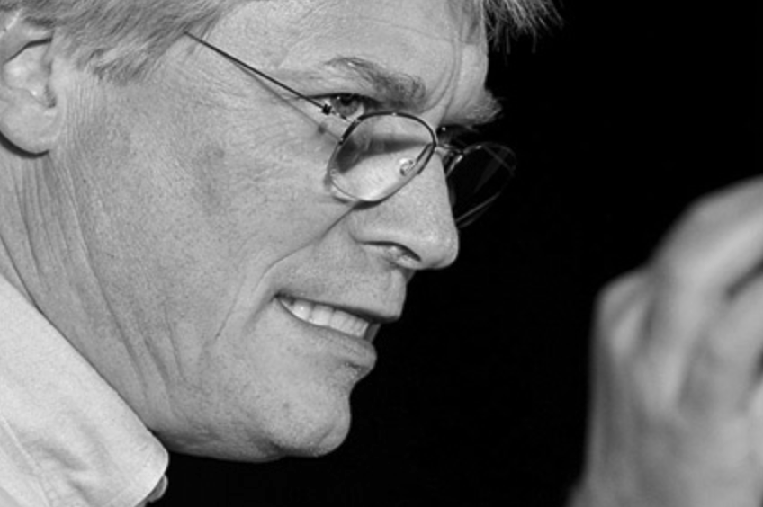

# 关于作者

---

Robert C. Martin（Uncle Bob）自 1970 年起便成为一名程序员。
他是 cleancoders.com 的联合创始人，该网站为软件开发人员提供在线视频培训；
他还是 Uncle Bob Consulting LLC 的创始人，这家公司为全球各大企业提供软件咨询、培训和技能开发服务。
他曾担任 8th Light, Inc.（一家总部位于芝加哥的软件咨询公司）的技术工匠大师。
他在各种行业期刊上发表了数十篇文章，并经常在国际会议和行业展会上发表演讲。
他曾担任《C++ Report》的主编三年，并曾担任 Agile Alliance 的首任主席。

Martin 撰写并编辑了多部书籍，包括《The Clean Coder》、《代码整洁之道》、《UML for Java Programmers》、《敏捷软件开发》、《Extreme Programming in Practice》、《More C++ Gems》、《Pattern Languages of Program Design 3》以及《Designing Object Oriented C++ Applications Using the Booch Method》。
