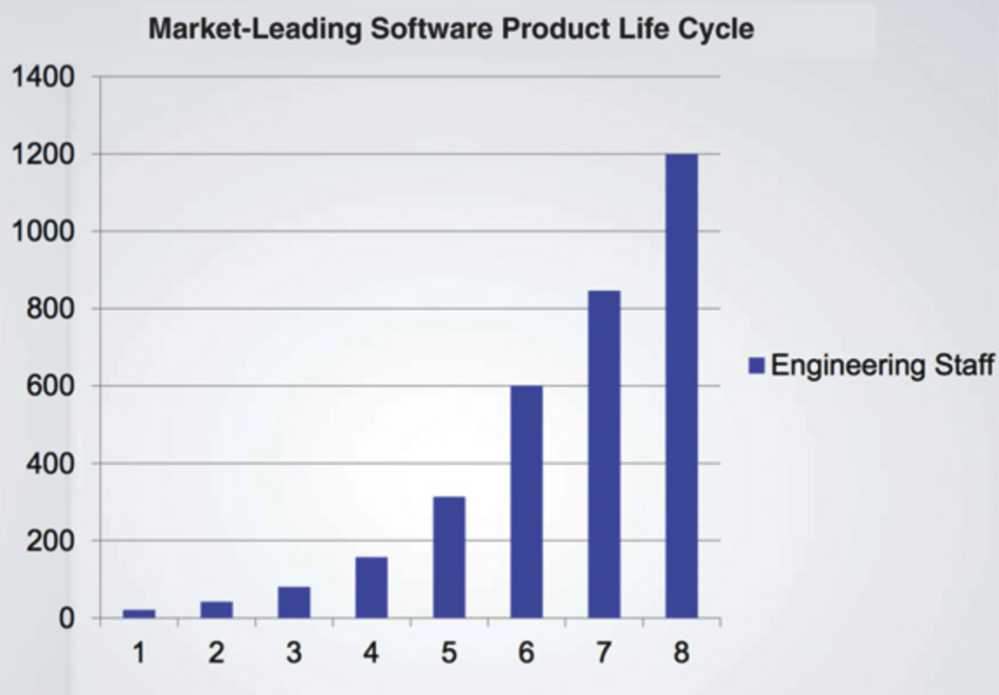
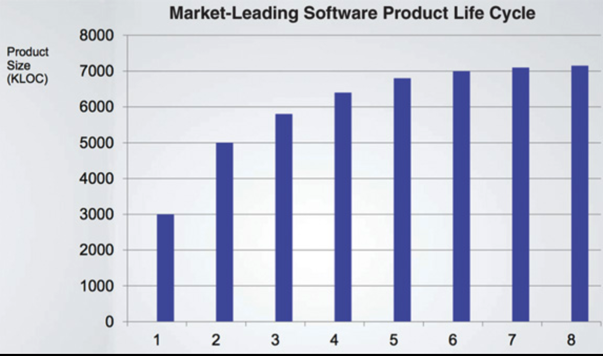
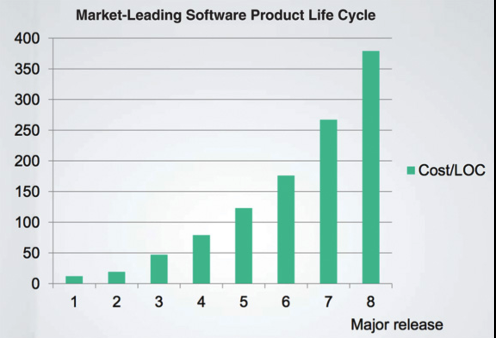
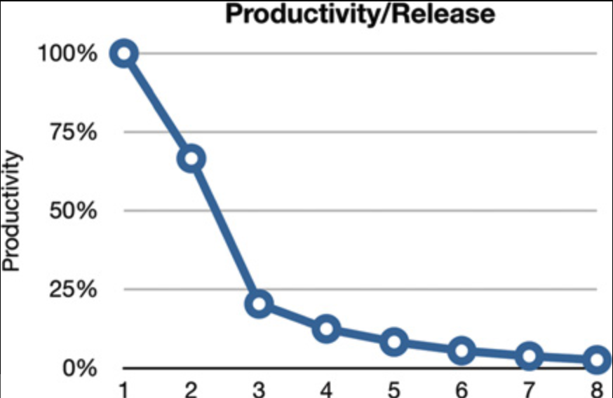
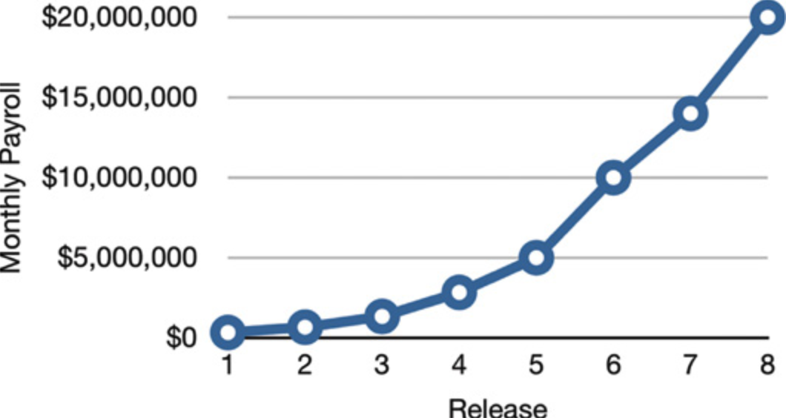
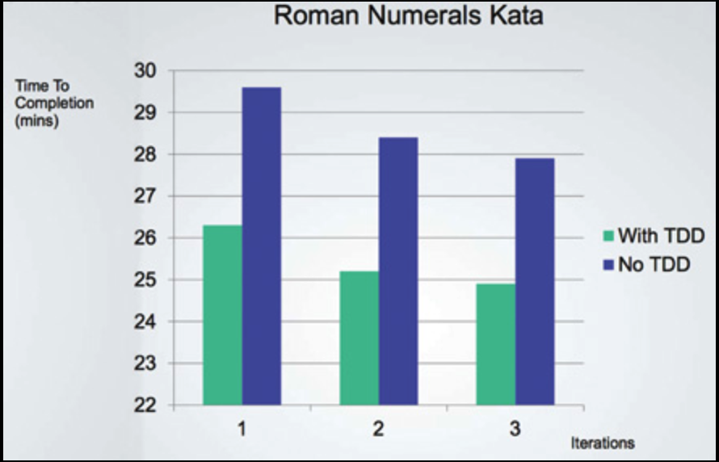

# 1 什么是设计与架构？

---

 

多年来，关于设计和架构一直存在很多混淆。
什么是设计？
什么是架构？
两者之间的区别是什么？

<ins>本书的目标之一就是厘清所有这些混淆，并一劳永逸地定义设计与架构究竟是什么。
首先，我要断言：两者之间没有区别。
完全没有</ins>。

“架构” 这个词通常用于指代某种高层次的东西，与低层次的细节相分离；
而 “设计” 则似乎更常暗示较低层次的结构和决策。
但当你观察一位真正的建筑师所做的工作时，这种用法是站不住脚的。

以设计我新家的那位建筑师为例。
这个家有架构吗？
当然有。
那么这个架构是什么呢？
它便是家的形状、外观、立面图以及空间和房间的布局。
但当我翻阅建筑师所绘制的图纸时，我看到了大量的低层细节。
我看到每个插座、每个灯开关以及每盏灯将被放置的位置。
我看到哪些开关控制哪些灯。
我看到炉子的位置，以及热水器和污水泵的尺寸与安放位置。
我还看到关于墙壁、屋顶和地基将如何建造的详细描绘。

简而言之，我看到了支撑所有高层决策的所有细节。
我也看到，这些低层细节与高层决策共同构成了房子设计的整体。

<ins>软件设计亦是如此。
低层细节与高层结构都是同一个整体的一部分</ins>。
它们共同构成一块连续的织物，定义了系统的形态。
两者缺一不可；
<ins>实际上，并不存在一条明确的分界线将它们分开。
从最高层到最低层，只不过是一个连续的决策谱系</ins>。

## 目标？

这些决策的目标是什么？
良好软件设计的目标又是什么？
这个目标恰恰就是我所描绘的乌托邦图景：

> 软件架构的目标，是最小化构建和维护系统所需的人力资源。

设计质量的衡量标准，就是满足客户需求所需付出的努力。
如果这种努力很低，并且在系统的整个生命周期中始终保持很低，那么设计就是好的。
如果随着每个新版本的发布，这种努力不断增长，那么设计就是差的。
就这么简单。

## 案例研究

举个例子，请看下面的案例研究。
其中包含了来自某家真实公司（该公司不愿透露名称）的真实数据。

首先，我们来看一下工程人员的增长情况。
我相信你会同意，这一趋势非常令人鼓舞。
如 [Fig 1.1](#fig-11) 所示的增长，必定是巨大成功的标志！

#### Fig 1.1
 
*Fig 1.1 工程人员的增长*

*经 Jason Gorman 的幻灯片演示授权转载*

现在，让我们看看同一时期该公司的生产力，以简单的代码行数来衡量（ [Fig 1.2](#fig-12) ）。

#### Fig 1.2
 
*Fig 1.2 同一时间段内的生产力*

显然这里出了问题。
尽管每个版本都有越来越多的开发人员支持，但代码的增长却似乎正在接近一条渐近线。

现在来看真正可怕的图表：[Fig 1.3](#fig-13) 显示了每行代码的成本随时间的变化情况。

这些趋势是不可持续的。
无论这家公司目前有多么盈利，这些曲线都将灾难性地耗尽商业模式中的利润，使公司陷入停滞，甚至彻底崩溃。

是什么导致了生产力如此显著的变化？
为什么第 8 个版本中每行代码的生产成本比第 1 个版本高了 40 倍？

#### Fig 1.3
 
*Fig 1.3 每行代码成本随时间的变化*

### 混乱的征兆

你正在看到的就是混乱的征兆。
当系统草率拼凑而成，当程序员的数量成为产出的唯一驱动力，当代码的整洁性或设计的结构很少或根本没有被考虑时，你就可以预见到会沿着这条曲线走向其丑陋的终点。

[Fig 1.4](#fig-14) 展示了这条曲线在开发者眼中的样子。
他们开始时生产力接近 100%，但随着每个版本的发布，他们的生产力不断下降。
到第四个版本时，他们的生产力显然将趋近于零。

#### Fig 1.4
 
*Fig 1.4 各版本生产力*

从开发者的角度来看，这极其令人沮丧，因为每个人都在努力工作，没有人减少自己的付出。

然而，尽管他们做出了种种英勇的努力、加班和奉献，他们却再也无法完成多少实际工作了。
他们所有的精力都已从功能开发上转移开，现在全部消耗在应对这片混乱之中。
他们的工作 ——或者说现状— —已经变成了把混乱从一个地方挪到另一个地方，再挪到下一个地方，如此反复，只为能添加一个微不足道的小功能。

### 高管的视角

如果你觉得那已经很糟糕了，不妨想象一下这幅图景在高管眼中是什么样子！
请看 [Fig 1.5](#fig-15) ，它描绘了同一时期每月的开发人员薪酬支出。

#### Fig 1.5
 
*Fig 1.5 各版本每月开发人员薪酬支出*

第 1 个版本交付时，每月薪酬支出为几十万美元。
第 2 个版本又增加了几十万。
到第 8 个版本时，每月薪酬支出达到了 2000 万美元，并且还在攀升。

仅这张图表就足以令人恐惧。
显然，某种惊人的情况正在发生。
人们希望收入能够超过成本，从而证明这些支出的合理性。
但无论你如何看待这条曲线，它都令人担忧。

然而，现在将 [Fig 1.5](#fig-15) 中的曲线与 [Fig 1.2](#fig-12) 中每个版本编写的代码行数进行对比。
最初每月几十万美元买到了大量的功能 —— 而最后那 2000 万美元几乎什么都没买到！
任何一位 CFO 看到这两张图表都会知道，必须立即采取行动以阻止灾难的发生。

但可以采取什么行动呢？
到底哪里出了问题？
是什么导致了生产力如此惊人的下降？
除了跺脚和向开发者发怒之外，高管们还能做些什么？

### 哪里出了问题？

大约 2600 年前，Aesop 讲了龟兔赛跑的故事。
这个故事的寓意以多种不同的方式被反复阐述：
- “慢而稳者胜。”
- “比赛不属于跑得快的人，战斗不属于强壮的人。”
- “欲速则不达。”

故事本身揭示了过度自信的愚蠢。
兔子对自己天生的速度过于自信，没有认真对待比赛，在乌龟越过终点线时却在睡觉。

现代的开发者正处于类似的竞赛中，并表现出类似的过度自信。
哦，他们并不睡觉 —— 远非如此。
大多数现代开发者都拼了命地工作。
但他们大脑的某一部分确实在睡觉 —— 那部分知道良好、整洁、设计完善的代码至关重要。

<ins>这些开发者相信一个熟悉的谎言：“我们可以以后再清理代码；我们只需先抢占市场！”
当然，后来代码永远得不到清理，因为市场压力从未减轻</ins>。
抢先进入市场只意味着你现在有一大群竞争对手紧追不舍，你必须尽可能快地奔跑才能保持在他们的前面。

于是开发者们永远无法切换模式。
他们无法回头去清理代码，因为他们必须完成下一个特性，再下一个，再下一个，再下一个。
于是混乱不断累积，生产力继续趋近于零。

正如兔子对自己的速度过度自信一样，开发者们也对自己保持生产力的能力过度自信。
但那些蚕食生产力的日益混乱的代码从不休息，也从不松懈。
如果任其发展，它会在几个月内将生产力降至零。

<ins>开发者们所相信的更大的谎言，是认为编写混乱的代码在短期内能让他们更快，只是从长期来看会拖慢他们</ins>。
接受这个谎言的开发者，表现出兔子那种对自己在未来某个时刻从制造混乱切换到清理混乱的能力的过度自信，但同时也犯了一个简单的事实错误。
<ins>事实是，无论你采用哪种时间尺度，制造混乱总是比保持整洁更慢</ins>。

来看一下 Jason Gorman 进行的一项卓越实验的结果，如 [Fig 1.6](#fig-16) 所示。
Jason 在六天的时间里进行了这项测试。
每天他都会完成一个将整数转换为罗马数字的简单程序。
当他预定义的验收测试集通过时，他就知道自己的工作完成了。
每天的任务都需要不到 30 分钟的时间。
Jason 在第一天、第三天和第五天使用了一种著名的整洁性实践方法，即测试驱动开发（TDD）。
在其他三天里，他则在没有该实践方法的情况下编写代码。

#### Fig 1.6
 
*Fig 1.6 按迭代次数及是否使用TDD划分的完成时间*

首先，注意 [Fig 1.6](#fig-16) 中明显的学习曲线。
后期的工作完成得比前期更快。
同时注意，使用 TDD 的天数比不使用 TDD 的天数快大约 10%，而且即使是使用 TDD 中最慢的一天，也比不使用 TDD 中最快的一天要快。

有些人看到这个结果可能会认为这是一个非凡的成果。
但对于那些没有被兔子的过度自信所蒙蔽的人来说，这个结果是意料之中的，因为他们知道软件开发中这个简单而朴素的真理：

> 走得快的唯一方法，就是走得好。

而这正是对高管们所面临困境的答案。
<ins>扭转生产力下降和成本上升的唯一方法，就是让开发者们不再像过度自信的兔子那样思考，并开始为他们所造成的混乱承担责任</ins>。

开发者们可能认为答案是从头开始，重新设计整个系统 —— 但这又是兔子在说话。
当初导致混乱的同样是那种过度自信，现在又告诉他们，只要能重新开始比赛，他们就能构建得更好。
现实并没有那么美好：

他们的过度自信将把重新设计推向与原始项目同样的混乱境地。

## 结论

在任何情况下，<ins>最佳选择都是让开发组织认识到并避免自身的过度自信，开始认真对待其软件架构的质量</ins>。

要真正重视软件架构，你需要知道什么是好的软件架构。
要构建一个能够最小化工作量、最大化生产力的设计和架构，你需要知道系统架构的哪些属性能够实现这一目标。

这正是本书的主题。
它描述了良好、整洁的架构和设计是什么样的，以便软件开发人员能够构建出拥有长久、盈利寿命的系统。
