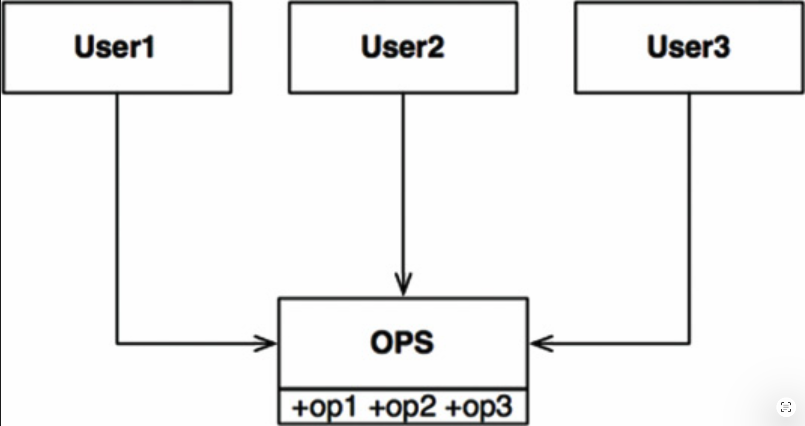
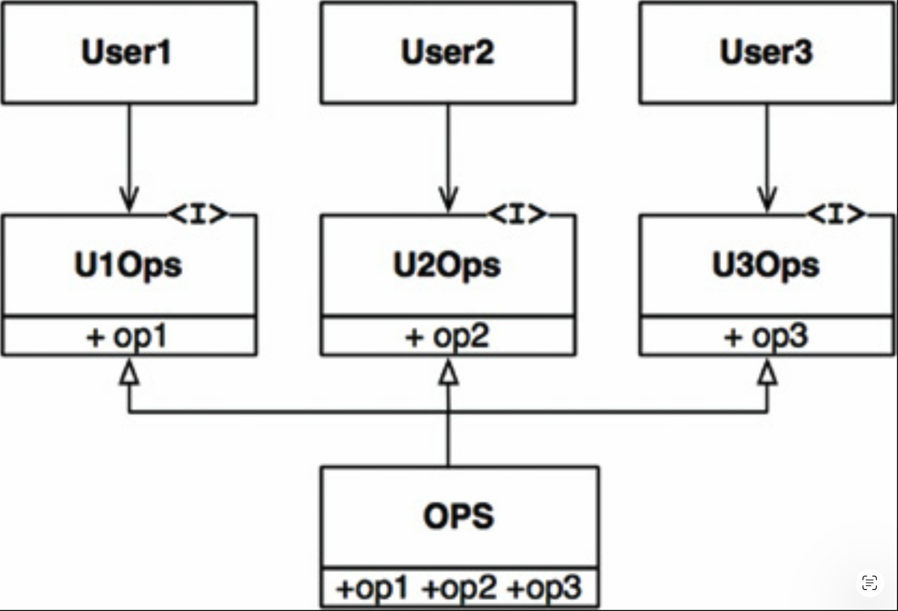
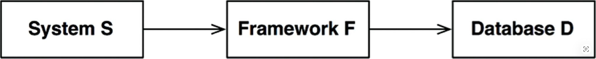

# 10 ISP：接口隔离原则

---

 

接口隔离原则（Interface Segregation Principle, ISP）得名于 [Fig 10.1](#fig-101) 所示的示意图。

#### Fig 10.1
 
*Fig 10.1 接口隔离原则*

在 [Fig 10.1](#fig-101) 所示的情形中，有多个用户使用了 `OPS` 类的操作。
假设 `User1` 只使用 `op1`，`User2` 只使用 `op2`，`User3` 只使用 `op3`。

现在假设 `OPS` 是一个用 Java 这类语言编写的类。
显然，在这种情况下，`User1` 的源代码会不经意地依赖于 `op2` 和 `op3`，即使它并不调用它们。
这种依赖意味着，对 `OPS` 中 `op2` 源代码的更改将迫使 `User1` 重新编译和重新部署，尽管它关心的内容实际上并没有发生变化。

这个问题可以通过将操作分离到接口中来解决，如 [Fig 10.2](#fig-102) 所示。

再次假设这是在 Java 这样的静态类型语言中实现的，那么 `User1` 的源代码将依赖于 `U1Ops` 和 `op1`，但不会依赖于 `OPS`。因此，`OPS` 中 `User1` 不关心的更改不会导致 `User1` 被重新编译和重新部署。

#### Fig 10.2
 
*Fig 10.2 隔离后的操作*

## ISP 与语言

显然，上述描述在很大程度上依赖于语言类型。
<ins>像 Java 这样的静态类型语言迫使程序员创建声明，而用户必须导入、使用或以其他方式包含这些声明。
正是源代码中包含的这些声明创建了源代码依赖，从而迫使重新编译和重新部署</ins>。

而在像 Ruby 和 Python 这样的动态类型语言中，源代码中不存在这样的声明。
相反，它们是在运行时被推断出来的。
因此，不存在强制重新编译和重新部署的源代码依赖关系。
这就是为什么动态类型语言创建的系统比静态类型语言更灵活、耦合度更低的主要原因。

这一事实可能导致你得出结论：`ISP` 是一个语言问题，而不是架构问题。

## ISP 与架构

<ins>如果你退后一步，审视 `ISP` 的根本动机，就会发现其中潜藏着更深层次的关切。
一般来说，依赖超出你所需内容的模块是有害的</ins>。
对于可能导致不必要的重新编译和重新部署的源代码依赖关系而言，这显然成立 —— 但在更高的架构层面上，这一点同样成立。

例如，考虑一位正在构建系统 S 的架构师。
他希望将某个框架 F 纳入系统中。
现在假设框架 F 的作者将其与某个特定的数据库 D 绑定在一起。
于是，S 依赖于 F，而 F 又依赖于 D（ [Fig 10.3](#fig-103) ）。

#### Fig 10.3
 
*Fig 10.3 一个有问题的架构*

现在假设 D 包含了 F 不使用、因而 S 也不关心的某些特性。
D 中这些特性的更改很可能迫使 F 重新部署，从而也迫使 S 重新部署。
更糟糕的是，D 中某个特性的故障可能导致 F 和 S 也发生故障。

## 结论

<ins>这里的教训是：依赖一个带有你不需要的额外累赘的东西，可能会给你带来意想不到的麻烦</ins>。

在讨论第 [13 组件内聚](../ch13/0.md) 中的共同复用原则 (CRP) 时，我们将更详细地探讨这一思想。
