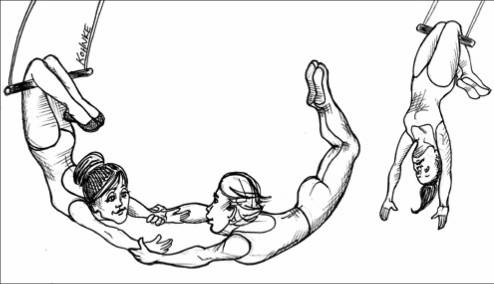
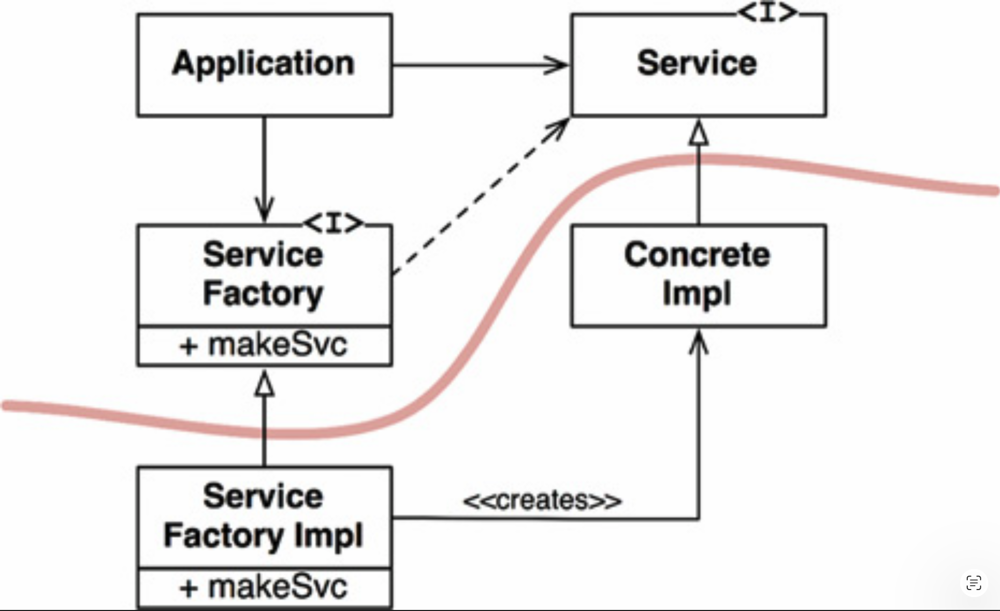

# 11 DIP：依赖反转原则

---

 

<ins>依赖反转原则（`DIP`）告诉我们，最灵活的系统是那些源代码依赖关系仅指向抽象（而非具体实现）的系统</ins>。

在像 Java 这样的静态类型语言中，这意味着 `use`、`import` 和 `include` 语句应该只引用包含接口、抽象类或其他某种抽象声明的源模块。
不应该依赖任何具体的东西。

同样的规则也适用于 Ruby 和 Python 等动态类型语言。
源代码依赖关系不应指向具体的模块。
然而，在这些语言中，定义什么是具体模块稍微困难一些。
具体来说，任何其中所调用的函数被实现的模块，都可视为具体模块。

<ins>显然，将这一思想当作硬性规则是不现实的，因为软件系统必须依赖许多具体的设施</ins>。
例如，Java 中的 `String` 类是具体的，试图强迫它变成抽象是不现实的。
对具体的 `java.lang.String` 的源代码依赖无法（也不应该）被避免。

相比之下，`String` 类非常稳定。
对该类的更改非常罕见且受到严格控制。
程序员和架构师不必担心 `String` 会频繁而随意地变化。

<ins>因此，考虑 `DIP` 时，我们倾向于忽略操作系统和平台设施这些稳定的背景。
我们容忍这些具体的依赖，因为我们知道可以依赖它们不会发生变化</ins>。

<ins>我们想要避免依赖的是系统中的 *不稳定的具体元素* 。
那些是我们正在积极开发、并且经历频繁变更的模块</ins>。

## 稳定的抽象

对抽象接口的每一次更改，都对应着对其具体实现的更改。
反之，对具体实现的更改并不总是（甚至通常不）要求更改它们所实现的接口。
因此，接口比实现具有更低的易变性。

事实上，优秀的软件设计师和架构师努力降低接口的易变性。
他们试图找到在不修改接口的情况下向实现添加功能的方法。
这是软件设计的基础。

那么，<ins>其含义是：稳定的软件架构是那些避免依赖不稳定的具体实现、并倾向于使用稳定的抽象接口的架构。
这一含义可以归结为一套非常具体的编码实践</ins>：

- <ins>**不要引用不稳定的具体类**</ins>。
应引用抽象接口。
这条规则适用于所有语言，无论是静态类型还是动态类型。
它还对对象的创建施加了严格约束，通常会强制使用 *抽象工厂 (Abstract Factories)* 模式。

- <ins>**不要从不稳定的具体类派生**</ins>。
这是前一条规则的推论，但值得特别提及。
在静态类型语言中，继承是所有源代码关系中最强、最僵化的；
因此，使用它必须格外谨慎。
在动态类型语言中，继承的问题较小，但它仍然是一种依赖 —— 谨慎永远是最明智的选择。

- <ins>**不要覆盖具体函数**</ins>。
具体函数通常要求源代码依赖。
当你覆盖这些函数时，你并没有消除这些依赖 —— 实际上，你继承了它们。
为了管理这些依赖，你应该将函数设为抽象，并创建多个实现。

- <ins>**永远不要提及任何具体且不稳定的东西的名称**</ins>。
这实际上只是对原则本身的重申。

## 工厂

<ins>为了遵守这些规则，创建不稳定的具体对象需要特殊处理</ins>。
这种谨慎是必要的，因为在几乎所有语言中，创建对象都需要对该对象的具体定义产生源代码依赖。

<ins>在大多数面向对象语言（如 Java）中，我们会使用 *抽象工厂 (Abstract Factory)* 模式来管理这种不受欢迎的依赖</ins>。

[Fig 11.1](#fig-111) 展示了其结构。
`Application` 通过 `Service` 接口使用 `ConcreteImpl`。
然而，`Application` 必须以某种方式创建 `ConcreteImpl` 的实例。
为了在不产生对 `ConcreteImpl` 的源代码依赖的情况下实现这一点，`Application` 调用了 `ServiceFactory` 接口的 `makeSvc` 方法。
该方法由 `ServiceFactoryImpl` 类实现，而 `ServiceFactoryImpl` 派生自 `ServiceFactory`。
该实现实例化 `ConcreteImpl` 并将其作为 `Service` 类型返回。

#### Fig 11.1
 
*Fig 11.1 使用抽象工厂模式管理依赖关系*

<ins>[Fig 11.1](#fig-111) 中的曲线是一条架构边界。
它将抽象与具体分隔开来。
所有跨越该曲线的源代码依赖都指向相同的方向 —— 抽象</ins>。

这条曲线将系统划分为两个组件：一个抽象组件，另一个具体组件。
抽象组件包含应用程序的所有高层业务规则。
具体组件包含这些业务规则所操控的所有实现细节。

<ins>请注意，控制流跨越曲线的方向与源代码依赖相反。
源代码依赖与控制流的方向相反 —— 这就是为什么我们称此原则为依赖反转 (Dependency Inversion)</ins>。

## 具体组件

[Fig 11.1](#fig-111) 中的具体组件包含一个依赖，因此它违反了 `DIP`。
这是典型情况。
<ins>`DIP` 的违规无法完全消除，但它们可以被集中到少数几个具体组件中，并与系统的其余部分分离开来</ins>。
*「这条 `ServiceFactoryImpl` → `ConcreteImpl` 就是原文所说的、具体组件内部那条违反 DIP 的依赖。」*

大多数系统将包含至少一个这样的具体组件 —— 通常称为 `main`，因为它包含 `main` 函数 [1](#1)。
在 [Fig 11.1](#fig-111) 所示的例子中，`main` 函数将实例化 `ServiceFactoryImpl`，并将该实例放入一个类型为 `ServiceFactory` 的全局变量中。
然后 `Application` 通过该全局变量访问工厂。

## 结论

随着我们在本书中继续探讨更高级的架构原则，`DIP` 将反复出现。
它将成为我们架构图中最显著的组织原则。
[Fig 11.1](#fig-111) 中的曲线将在后续章节中成为架构边界。
<ins>依赖关系单向跨越该曲线、指向更抽象实体的方式，将成为一条新的规则，我们称之为 *依赖规则 (Dependency Rule)* </ins>。

---

#### 1
换句话说，就是应用程序首次启动时由操作系统调用的那个函数。
