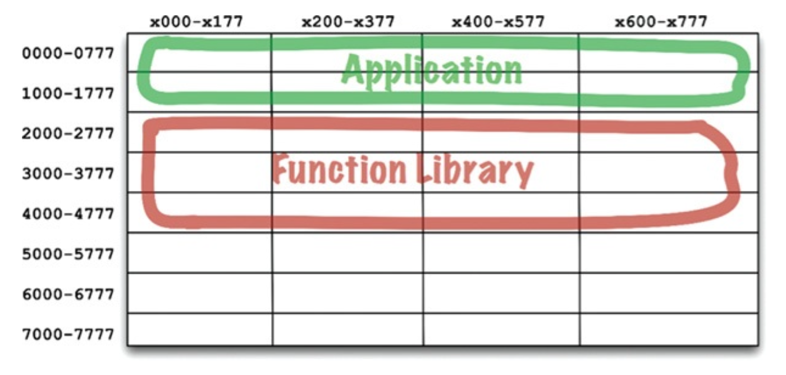
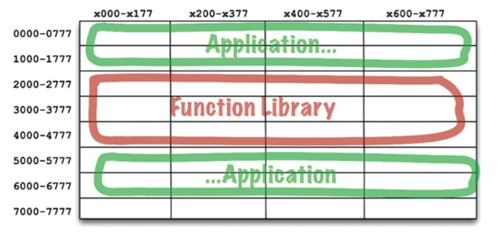

# 12 组件

---
<center></center><br/>


<ins>组件是部署的单元。
它们是作为系统的一部分，可以被部署的最小实体</ins>。
在 Java 中，它们是 jar 文件；在 Ruby 中，它们是 gem 文件；在 .Net 中，它们是 DLL 文件。
在编译型语言中，它们是二进制文件的集合；
在解释型语言中，它们是源文件的集合。
在所有语言中，它们都是部署的粒度单位。

<ins>组件可以被链接在一起形成一个单独的可执行文件</ins>。
或者它们可以被聚合在一起形成一个单独的归档文件，例如 `.war` 文件。
或者它们可以作为独立的动态加载插件被单独部署，例如 `.jar`、`.dll` 或 `.exe` 文件。
<ins>无论它们最终以何种方式部署，设计良好的组件始终保留着被（独立部署）的能力</ins>。

## **组件的简史**

在软件开发的早期，程序员需要控制程序的内存位置和布局。
程序中的第一行代码往往是起始语句（origin statement），用于声明程序将被加载的地址。

考虑下面这个简单的 PDP-8 程序。
它由一个名为 `GETSTR` 的子程序组成，该子程序从键盘输入一个字符串并将其保存到缓冲区中。
此外，它还有一个小型的单元测试程序来检验 `GETSTR` 的功能。

```
          *200
          TLS
START,    CLA
          TAD BUFR
          JMS GETSTR
          CLA
          TAD BUFR
          JMS PUTSTR
          JMP START
BUFR,     3000

GETSTR,   0
          DCA PTR
NXTCH,    KSF
          JMP -1
          KRB
          DCA I PTR
          TAD I PTR
          AND K177
          ISZ PTR
          TAD MCR
          SZA
          JMP NXTCH

K177,     177
MCR,      -15
```

请注意该程序开头的 `*200` 指令。
它告诉编译器生成将在地址 `200`<sub>8</sub> 处加载的代码。

> 这里的地址是八进制（PDP-8 的地址空间是 4K，12 位字）。
`200` 八进制等于 `128` 十进制，这是内存地址的开始。
有关详细信息，请参阅下文关于 “重定位” 的讨论。

这种编程方式对当今大多数程序员来说是一个相当陌生的概念。
他们很少需要考虑程序加载到计算机内存中的什么位置。
但在早期，这是程序员需要做出的首要决策之一。
在那个年代，程序是不可重定位的。

在那些旧日子里，你是如何访问库函数的？
前面的代码展示了一种使用的方法。
程序员将库函数的源代码与他们的应用程序代码放在一起，然后将它们全部编译成一个单独的程序。<sup>[1](#1)</sup>
库是以源代码形式保存的，而不是二进制形式。

这种方法的问题在于，在那个时代，设备速度慢，内存昂贵且因此非常有限。
编译器需要对源代码进行多次处理，但内存太小，无法容纳所有源代码。
因此，编译器不得不通过慢速设备多次读取源代码。

这需要很长时间 —— 你的函数库越大，编译器花费的时间就越长。
编译一个大型程序可能需要数小时。

为了缩短编译时间，程序员将函数库的源代码与应用程序分离开来。
他们单独编译函数库，并将生成的二进制文件加载到一个已知的地址 —— 比如 `2000`<sub>8</sub>。他
们为函数库创建了一个符号表，并将其与应用程序代码一起编译。
当想要运行应用程序时，他们会先加载二进制函数库，<sup>[2](#2)</sup> 然后加载应用程序。
内存布局如 [Fig 12.1](#fig-121) 所示。

#### Fig 12.1
<br/>
*Fig 12.1 早期内存布局*

只要应用程序能容纳在 `0000`<sub>8</sub> 到 `1777`<sub>8</sub> 的地址空间内，这种方案就能正常工作。
但很快应用程序变得比分配给它们的空间更大。
此时，程序员不得不将应用程序拆分成两个地址段，并围绕函数库进行跳转（ [Fig 12.2](#fig-122) ）。

#### Fig 12.2
<br/>
*Fig 12.2 将应用程序拆分成两个地址段*

显然，这种情况是不可持续的。
随着程序员向函数库中添加更多函数，函数库超出了其边界，他们不得不为其分配更多空间（在本例中，大约在 `7000`<sub>8</sub> 附近）。
随着计算机内存的增长，程序和库的这种碎片化必然会持续下去。

显然，必须采取一些措施。

## **可重定位性**

解决方案是可重定位的二进制文件。
其背后的思想非常简单。

编译器被修改为输出可以在内存中由智能加载器进行重定位的二进制代码。
加载器会被告知将可重定位代码加载到何处。
可重定位代码中带有标志，告诉加载器加载数据中的哪些部分需要根据选定的加载地址进行修改。
通常，这仅仅意味着将起始地址加到二进制文件中的所有内存引用地址上。

现在，程序员可以告诉加载器将函数库加载到哪里，将应用程序加载到哪里。
实际上，加载器可以接受多个二进制输入，并简单地将它们一个接一个地加载到内存中，在加载的同时对它们进行重定位。
这使得程序员可以只加载他们需要的那些函数。

编译器也被修改为将函数名作为元数据输出到可重定位的二进制文件中。
如果一个程序调用了某个库函数，编译器会将该名称作为 *外部引用 (external reference)* 。
如果一个程序定义了一个库函数，编译器会将该名称作为 *外部定义 (external definition)* 。
然后，加载器在确定了这些定义被加载到何处之后，便可以将外部引用链接到外部定义。

至此，链接加载器 (linking loader) 诞生了。

## **链接器**

链接加载器允许程序员将他们的程序划分成可独立编译和加载的段。
当相对较小的程序与相对较小的库链接时，这很有效。
然而，到了 20 世纪 60 年代末和 70 年代初，程序员变得更加雄心勃勃，他们的程序也变得大得多。

最终，链接加载器变得慢到难以忍受。
函数库存储在像磁带这样的慢速设备上。即使是当时的磁盘，也相当慢。
使用这些相对较慢的设备，链接加载器必须读取几十个（如果不是几百个）二进制库才能解析外部引用。
随着程序变得越来越大，库中积累的函数也越来越多，一个链接加载器仅加载程序就可能花费一个多小时。

<ins>最终，加载和链接被分离成两个阶段。
程序员把慢的部分 ——即执行链接的部分—— 拿出来，放进一个独立的应用程序中，称之为 *链接器 (linker)* </ins>。
链接器的输出是一个已链接的可重定位文件，重定位加载器可以非常快速地加载它。这使得程序员可以使用慢速的链接器来准备一个可执行文件，然后可以在任何时间快速加载它。

随后进入了 20 世纪 80 年代。
程序员们使用 C 语言或其他某种高级语言进行工作。
随着他们的雄心壮志不断增长，他们的程序也随之增长。
拥有数十万行代码的程序并不罕见。

源模块从 `.c` 文件编译成 `.o` 文件，然后送入链接器以创建可快速加载的可执行文件。
编译单个模块相对较快，但编译所有模块则需要一些时间。
而链接器甚至需要更多时间。
在许多情况下，周转时间再次增长到一个小时或更长时间。

程序员们似乎注定要无休止地原地打转。
在整个 20 世纪 60 年代、70 年代和 80 年代，所有为了加快工作流程所做的改动都被程序员的雄心和他们所编写程序的规模所挫败。
他们似乎无法摆脱长达一小时的周转时间。
加载时间仍然很快，但编译-链接时间成了瓶颈。

当然，我们正在经历 Murphy 的程序规模定律：

> 程序会不断增长，直到填满所有可用的编译和链接时间。

但 Murphy 并非唯一的竞争者。
摩尔 <sup>[3](#3)</sup> 来了，在 20 世纪 80 年代末，两者展开了较量。
摩尔赢得了那场战斗。
磁盘开始缩小并且速度显著提高。
计算机内存变得极其便宜，以至于磁盘上的许多数据都可以缓存在 RAM 中。
计算机时钟频率从 1 MHz 提高到 100 MHz。

到 20 世纪 90 年代中期，链接所花费的时间开始比我们雄心壮志所能推动的程序增长更快地缩短。
在许多情况下，链接时间减少到了几秒钟。
对于小型任务来说，链接加载器的想法再次变得可行。

这是 Active-X、共享库以及 `.jar` 文件初现的时代。
计算机和设备变得如此之快，以至于我们可以再次在加载时进行链接。
我们可以在几秒钟内将多个 `.jar` 文件或多个共享库链接在一起，并执行生成的程序。
于是，组件插件架构诞生了。

今天，我们通常将 `.jar` 文件、DLL 或共享库作为插件部署到现有应用程序中。
例如，如果你想为 Minecraft 创建一个 Mod，只需将自定义的 `.jar` 文件放入某个特定文件夹即可。
如果你想将 Resharper 插件集成到 Visual Studio 中，只需包含相应的 DLL 文件即可。

## 结论

<ins>这些可以在运行时动态链接在一起的文件，就是我们架构中的软件组件</ins>。
这经历了 50 年的时间，但我们已经到达了一个阶段：组件插件架构可以成为一种随意的默认选择，而不再像曾经那样需要付出巨大的努力。

---
#### 1
我的第一个雇主在架子上存放了几十叠子程序库的源代码。
当你编写一个新程序时，只需拿起其中一叠，直接拍到你自己的那叠卡片后面即可。

#### 2
实际上，那些旧机器大多使用磁芯内存，这种内存在计算机关机后数据不会丢失。
我们常常让函数库一次保持加载状态好几天。

#### 3
摩尔定律：计算机速度、内存和密度每 18 个月翻一番。这条定律从 1950 年代一直持续到 2000 年，但之后——至少在时钟频率方面——戛然而止。


