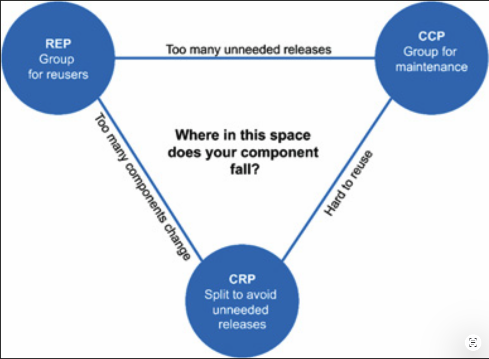

# 13 组件内聚

---

 

<ins>哪些类应该归属于哪些组件？这是一个重要的决策，需要来自优秀软件工程原则的指导</ins>。
不幸的是，多年来，这个决策往往是临时性的，几乎完全基于具体情境。

在本章中，我们将讨论组件内聚的三条原则：

- REP：复用/发布等同原则 (Reuse/Release Equivalence Principle)
- CCP：共同闭包原则 (Common Closure Principle)
- CRP：共同复用原则 (Common Reuse Principle)

## 复用/发布等同原则

> 复用的粒度就是发布的粒度。

过去十年间，涌现了各种各样的模块管理工具，例如 Maven、Leiningen 和 RVM。
这些工具的重要性日益增长，因为在此期间，人们创建了大量的可复用组件和组件库。
我们现在正生活在软件复用的时代 —— 这是面向对象模型最古老的承诺之一得以实现。

复用/发布等同原则（REP）看起来显而易见，至少事后看来如此。
人们如果想要复用软件组件，除非这些组件通过发布过程被追踪并赋予发布版本号，否则他们不可能、也不会去复用它们。

这不仅仅是因为没有版本号就无法确保所有被复用的组件彼此兼容。
它还反映了这样一个事实：软件开发者需要知道新版本何时发布，以及这些新版本会带来哪些变化。

开发者常常会收到新版本发布的通知，并根据该版本中的变更决定是否继续使用旧版本。
<ins>因此，发布过程必须产生适当的通知和发布文档，以便用户能够就何时以及是否集成新版本做出明智的决策</ins>。

<ins>从软件设计和架构的角度来看，这条原则意味着：被组合成一个组件的类与模块必须属于一个内聚的群体。
组件不能仅仅是类与模块的随机大杂烩；相反，这些模块必须共享某种统一的主题或目的</ins>。

当然，这应该是显而易见的。
然而，还有另一种看待这个问题的方式，可能不那么明显。
<ins>被组合成一个组件的类与模块应该能够 *一起发布* 。
它们共享相同的版本号、相同的发布跟踪，并被包含在相同的发布文档中，这一事实对作者和用户来说都应该是有意义的</ins>。

这是一个薄弱的建议：说某件事应该 “有意义”，只是一种挥挥手、试图显得权威的方式。
这个建议之所以薄弱，是因为很难精确解释将类与模块粘合成一个单一组件的 “胶水” 究竟是什么。
尽管这个建议可能薄弱，但原则本身是重要的，因为违反它很容易被察觉 —— 它们 “没有意义”。
如果你违反了 REP，你的用户会知道，并且他们不会对你的架构能力留下好印象。

<ins>这条原则的薄弱之处，将通过接下来两条原则的强有力而得到充分弥补</ins>。
实际上，CCP 和 CRP 会强烈地定义这条原则 —— 尽管是以一种否定的方式。

## 共同闭包原则

> 将那些因相同原因、并在相同时间发生变化（会改变）的类聚集到同一个组件中。
将那些在不同时间、以不同原因发生变化的类分离到不同的组件中。

<ins>这是 SRP 在组件层面的重述。
正如 SRP 所说，一个类不应该包含多个需要改变的理由，共同闭包原则（CCP）同样指出，一个组件不应该有多个需要改变的理由</ins>。

对于大多数应用程序而言，可维护性比可复用性更重要。
如果应用程序中的代码必须发生变更，你更希望所有变更都发生在同一个组件中，而不是分散在多个组件中。[1](#1)
如果变更被限制在单个组件内，那么我们只需要重新部署那个被更改的组件。其他不依赖于被更改组件的组件则无需重新验证或重新部署。

CCP 提示我们将那些很可能因相同原因发生变更的所有类聚集在一起。
如果两个类在物理上或概念上紧密绑定，以至于它们总是同时发生变更，那么它们就应属于同一个组件。
这可以最大程度地减少与发布、重新验证和重新部署软件相关的工作量。

该原则与开闭原则（OCP）密切相关。
实际上，CCP 所处理的正是 OCP 意义上的 “闭包”。
OCP 指出，类应该对修改关闭，对扩展开放。
由于 100% 的闭包是无法实现的，因此闭包必须是策略性的。
我们设计类的方式是：让它们对我们所预期或已经经历过的最常见变更类型保持关闭。

CCP 通过将对相同类型变更保持关闭的那些类聚集到同一个组件中，来强化这一教训。
因此，当需求发生变化时，该变更很可能被限制在最小数量的组件内。

### 与 SRP 的相似性

如前所述，CCP 是 SRP 的组件形式。
SRP 告诉我们，如果方法因不同的原因而变更，则应将它们分离到不同的类中。
CCP 告诉我们，如果类因不同的原因而变更，则应将它们分离到不同的组件中。
这两条原则都可以用下面这句简洁的话来概括：

> <ins>将那些同时发生、且因相同原因而变更的事物聚集在一起。
将那些在不同时间发生、或因不同原因而变更的事物分离开来</ins>。

## 共同复用原则

> 不要强迫一个组件的用户依赖他们不需要的东西。

<ins>共同复用原则（CRP）是又一条帮助我们决定哪些类和模块应该放入一个组件的原则。
它指出，倾向于一起被复用的类与模块属于同一个组件</ins>。

类很少被孤立地复用。
更典型的情况是，可复用的类与作为可复用抽象一部分的其他类相互协作。
CRP 指出，这些类应该一起归属于同一个组件。
在这样的组件中，我们会期望看到彼此之间有很多依赖关系的类。

一个简单的例子是容器类 (container) 及其关联的迭代器 (iterator)。
这些类因为彼此紧密耦合而一起被复用。
因此，它们应该位于同一个组件中。

但 CRP 告诉我们的不仅仅是哪些类应该组合在一起成为一个组件：它还告诉我们哪些类不应该一起放在一个组件中。
当一个组件使用另一个组件时，组件之间就建立了一种依赖关系。
也许使用组件只使用了被使用组件中的一个类 —— 但这并不会削弱该依赖关系。
使用组件仍然依赖于被使用组件。

由于这种依赖关系，每当被使用的组件发生变更时，使用组件很可能需要进行相应的变更。
即使使用组件不需要做任何修改，它通常仍然需要被重新编译、重新验证和重新部署。
即便使用组件并不关心被使用组件中所做的变更，情况也是如此。

因此，当我们依赖一个组件时，我们希望确保自己依赖的是该组件中的每一个类。
<ins>换句话说，我们希望确保放入一个组件中的类是不可分割的 —— 即不可能只依赖其中一部分类而不依赖其他类。
否则，我们将不得不重新部署比实际需求更多的组件，从而浪费大量精力</ins>。

因此，CRP 在 “哪些类不应该放在一起” 方面，比在 “哪些类应该放在一起” 方面提供了更多的指导。
CRP 指出，彼此之间没有紧密耦合的类不应该放在同一个组件中。

### 与 ISP 的关系

<ins>CRP 是 ISP 的通用版本。
ISP 建议我们不要依赖包含我们不会使用的方法的类。
CRP 则建议我们不要依赖包含我们不会使用的类的组件</ins>。

所有这些建议可以归结为一句简洁的话：

> <ins>不要依赖你不需要的东西</ins>。

## 组件内聚张力图

你可能已经意识到，这三条内聚原则往往会相互冲突。
REP 和 CCP 是包容性原则：两者都倾向于使组件变大。
CRP 是排他性原则，推动组件变小。
优秀的架构师寻求解决的正是这些原则之间的张力。

[Fig 13.1](#fig-131) 是一个张力图 [2](#2) ，展示了三条内聚原则如何相互影响。
该图的每条边描述了舍弃对角顶点上的原则所付出的代价。

#### Fig 13.1
 
*Fig 13.1 内聚原则张力图*

只关注 REP 和 CRP 的架构师会发现，当进行简单变更时，受影响的组件数量过多。
相比之下，过于关注 CCP 和 REP 的架构师会导致产生过多不必要的发布。

优秀的架构师会在这个张力三角中找到符合当前开发团队关注点的位置，同时也要意识到这些关注点会随着时间而改变。
例如，在项目的早期开发阶段，CCP 比 REP 重要得多，因为可开发性比可复用性更重要。

通常，项目往往从三角形的右侧开始，此时唯一被牺牲的是可复用性。
随着项目逐渐成熟，其他项目开始从中复用组件时，项目会向左滑动。
这意味着一个项目的组件结构会随着时间和成熟度的变化而变化。
这与项目的开发和使用方式的关系，比与项目实际功能的关系更为密切。

## 结论

<ins>在过去，我们对内聚的看法比 REP、CCP 和 CRP 所暗示的要简单得多。
我们曾认为内聚仅仅是 “一个模块执行一个且仅一个功能” 这样的属性。
然而，组件内聚的三条原则描述了一种复杂得多的内聚形态。
在选择将哪些类分组到组件中时，我们必须考虑可复用性和可开发性之间相互对抗的力量</ins>。
将这些力量与应用程序的需求相平衡并非易事。
而且，这种平衡几乎总是动态的。
也就是说，今天合适的分区，明年可能就不再合适。
因此，组件的构成很可能会随着时间推移而演变和抖动，因为项目的关注点会从可开发性转向可复用性。

---

#### 1
参见 [27 服务：大与小](ch27/0.md) 中的 [小猫问题](ch27/0.md#小猫问题) 一节。

#### 2
感谢 Tim Ottinger 提出这个想法。
