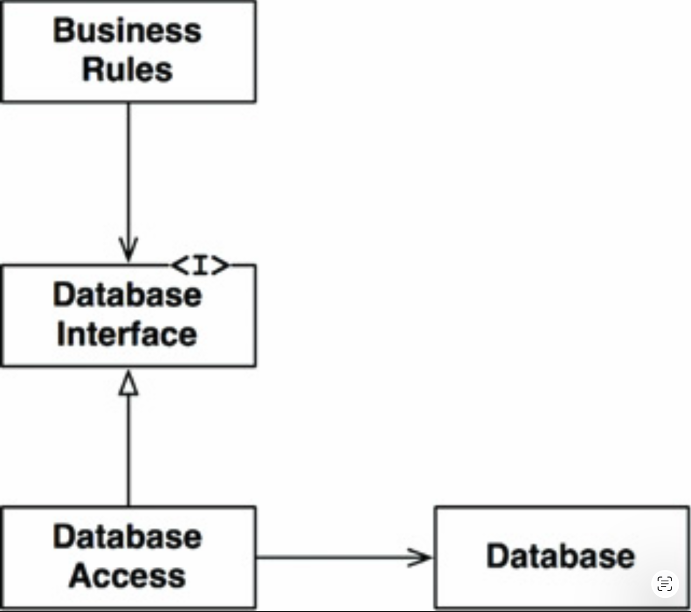
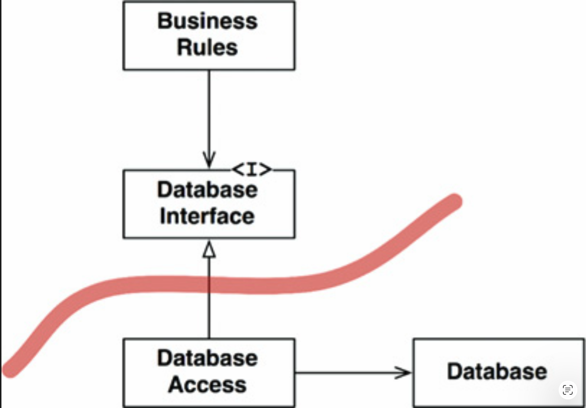
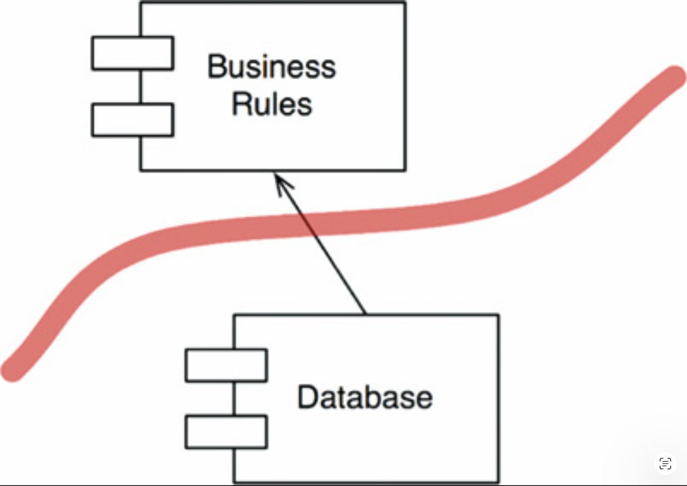
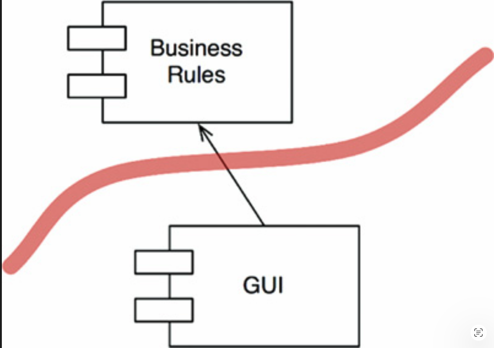
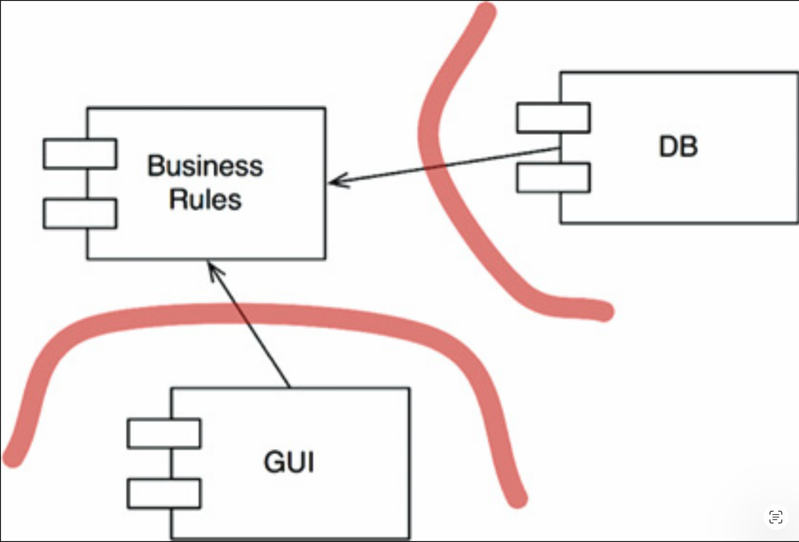
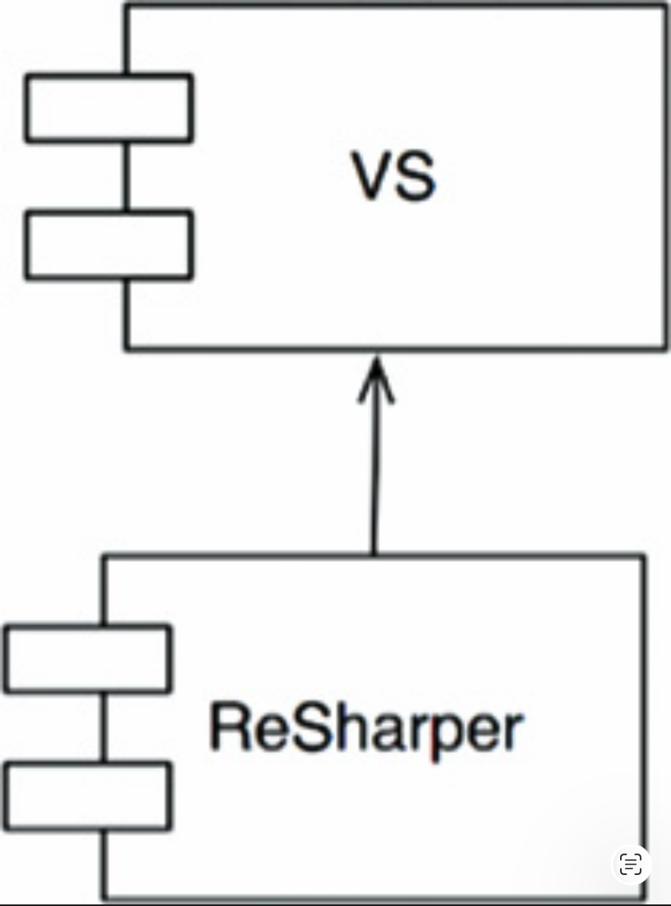

# 17 边界：画线

---

 

软件架构是一门画线的艺术。
<ins>我称这些线为 *边界 (boundaries)*。
这些边界将软件元素彼此分隔开来，并限制一侧的元素知晓另一侧的内容</ins>。
其中一些线在项目生命周期的非常早期就被画下 —— 甚至在任何代码编写之前。
另一些线则画得晚得多。那些早期画下的线，其目的是尽可能长时间地推迟决策，并防止这些决策污染核心业务逻辑。

回想一下，架构师的目标是最小化构建和维护所需系统的人力资源。
是什么消耗了这种人力？<ins>*耦合* —— 尤其是与过早决策的耦合</ins>。

<ins>哪些类型的决策是过早的？
那些与系统的业务需求（用例）无关的决策。
这些决策包括关于框架、数据库、Web 服务器、工具库、依赖注入等。
一个好的系统架构是这样的：像这样的决策是辅助性的、可推迟的。
一个好的系统架构不依赖于这些决策。
一个好的系统架构允许这些决策在最晚的可能时刻做出，且不会产生重大影响</ins>。

## 两个悲伤的故事

这里讲的是 P 公司的悲伤故事，作为一个关于做出过早决策的警示。
20 世纪 80 年代，P 公司的创始人编写了一个简单的单体桌面应用程序。
他们获得了巨大的成功，并在 90 年代将产品发展成为一个流行且成功的桌面 GUI 应用程序。

但随后，在 90 年代末，Web 作为一股力量崛起。
突然间，每个人都必须有一个 Web 解决方案，P 公司也不例外。
P 公司的客户强烈要求一个基于 Web 的产品版本。
为了满足这一需求，公司聘请了一帮二十多岁的 Java 明星程序员，并启动了一个将其产品 Web 化的项目。

Java 程序员们脑海中浮现着服务器集群的梦想，于是他们采用了一个丰富的三层 “架构” [1](#1) ，以便可以通过这样的集群进行分布。
会有 GUI 服务器、中间件服务器和数据库服务器。
当然。

这些程序员在非常早期就决定：所有领域对象都将有三个实例：一个在 GUI 层，一个在中间件层，一个在数据库层。
由于这些实例位于不同的机器上，因此建立了一套复杂的处理器间 (interprocessor) 和层间通信系统。
层之间的方法调用被转换为对象、序列化，并通过网络进行编码 (marshaled)。

现在想象一下，要实现一个像向现有记录添加新字段这样简单的功能，需要做多少工作。
该字段必须被添加到所有三个层的类中，以及几个层间消息中。
由于数据双向传输，需要设计四个消息协议。
每个协议都有发送端和接收端，因此需要八个协议处理器 (handlers)。
需要构建三个可执行文件，每个文件包含三个更新的业务对象、四个新消息和八个新处理器 (handlers)。

再想想这些可执行文件为了实现最简单的功能必须做什么。
想想所有的对象实例化、所有的序列化、所有的编组和解组、所有的消息构建和解析、所有的 socket 通信、超时管理器、重试场景，以及所有其他额外的东西 —— 只为了完成一件简单的事情。

当然，在开发过程中，程序员们并没有服务器集群。
实际上，他们只是在一台机器上的三个不同进程中运行这三个可执行文件。
他们以这种方式开发了好几年。
但他们坚信自己的架构是正确的。
因此，即使它们在一台机器上执行，他们仍然继续着所有的对象实例化、所有的序列化、所有的编码 (marshaling) 和解码 (de-marshalin)、所有的消息构建和解析、所有的 socket 通信，以及所有在一台机器上进行的额外工作。

具有讽刺意味的是，P 公司从未销售过需要服务器集群的系统。
他们部署的每个系统都是单服务器。
而在那台单服务器上，所有三个可执行文件仍然继续着所有的对象实例化、所有的序列化、所有的编组和解组、所有的消息构建和解析、所有的 socket 通信，以及所有那些额外工作 —— 为了一个从未存在、也永远不会存在的服务器集群做准备。

<ins>悲剧在于，架构师过早的做出决策，极大地增加了开发工作量</ins>。

P 公司的故事并非孤例。
我曾在许多地方、多次看到过这种情况。
实际上，P 公司是所有这些地方的一个叠加。

但还有比 P 公司更糟糕的命运。

考虑一下 W 公司，一家管理公司车队的地方企业。
他们最近聘请了一位 “架构师” 来控制他们那混乱的软件工作。
而且，让我告诉你，“控制” 是这家伙的中间名。
他很快意识到，这个小公司需要的是一个成熟的、企业级的、面向服务的 “架构”。
他为业务中所有不同的 “对象” 创建了一个庞大的领域模型，设计了一套服务来管理这些领域对象，并把所有开发人员推向了一条通往地狱的道路。
举一个简单的例子：假设你想将一个联系人的姓名、地址和电话号码添加到一个销售记录中。
你必须前往 `ServiceRegistry` 索取 `ContactService` 的服务 ID。
然后你必须向 `ContactService` 发送一个 `CreateContact` 消息。
当然，这个消息有几十个字段，它们都必须包含有效的数据 —— 而程序员无法访问这些数据，因为程序员只拥有姓名、地址和电话号码。
在伪造了数据之后，程序员必须将新创建的 contact 的 ID 塞入销售记录中，并向 `SaleRecordService` 发送 `UpdateContact` 消息。

当然，为了测试任何东西，你必须逐一启动所有必要的服务，还要启动消息总线、BPEL 服务器，以及……然后，当这些消息在服务之间来回反弹并在各个队列中排队等待时，还会产生传播延迟。

然后，如果你想添加一个新功能 —— 嗯，你可以想象所有这些服务之间的耦合，以及需要更改的大量 WSDL，还有这些更改所迫需的所有重新部署……

相比之下，地狱似乎都变成了一个不错的地方。

一个围绕服务构建的软件系统本身并没有什么问题。
<ins>W 公司的错误在于过早采用并强制执行了一套承诺 SOA 的工具 —— 也就是说，过早采用了一套庞大的领域对象服务</ins>。
这些错误的代价是纯粹的人时 ——大量的人时—— 被冲进了 SOA 的漩涡。

我可以继续一个接一个地描述架构失败。
但让我们反过来谈论一个架构成功的故事吧。

## FitNesse

2001 年，我和我的儿子 Micah 开始开发 FitNesse。
这个想法是创建一个简单的 wiki，包装 Ward Cunningham 的 FIT 工具，用于编写验收测试。

那是在 Maven “解决” jar 文件问题之前的时代。
我坚持认为，我们生产的任何东西都不应该要求人们下载超过一个 jar 文件。
我称这条规则为 “下载即运行”。
这条规则驱动了我们的许多决策。

最早的决定之一就是编写一个专门针对 FitNesse 需求的 Web 服务器。
这听起来可能很荒谬。
即使在 2001 年，也有大量开源 Web 服务器可供我们使用。
然而，自己编写被证明是一个非常正确的决定，因为一个最基本的 Web 服务器是一个非常简单的软件，它允许我们将任何关于 Web 框架的决策推迟到很久以后。[2](#2)
*「这并不像听起来那么难。只需要处理 socket、解析简单 HTTP 协议并产生一些字节流。全部代码也不过几页而已」*。

另一个早期决定是避免考虑数据库。
我们心里想着 MySQL，但我们故意推迟了这个决策，采用了一种使该决策变得无关紧要的设计。
那个设计就是：在所有的数据访问和数据存储库本身之间放置一个接口。

我们将数据访问方法放入一个名为 `WikiPage` 的接口中。
这些方法提供了我们查找、获取和保存页面所需的所有功能。
当然，最初我们并没有实现这些方法；在我们处理不涉及获取和保存数据的功能时，我们只是将它们以桩代码形式存在。

实际上，在三个月的时间里，我们只是专注于将 wiki 文本翻译成 HTML。
这根本不需要任何数据存储，因此我们创建了一个名为 `MockWikiPage` 的类，只是将数据访问方法留空（以桩代码形式）。

最终，这些桩代码对于我们想要编写的功能来说变得不够用了。
我们需要真正的数据访问，而不是桩代码。
于是，我们创建了一个名为 `InMemoryPage` 的 `WikiPage` 新派生类。
这个派生类实现了数据访问方法，以管理一个存储在 RAM 中的 wiki 页面哈希表。

这让我们能够整整一年不断地开发一个又一个功能。
实际上，我们用这种方式让整个 FitNesse 程序的第一个版本运行起来了。
我们可以创建页面、链接到其他页面、完成所有花哨的 wiki 格式化，甚至用 FIT 运行测试。
我们唯一不能做的就是保存我们的任何工作。

当需要实现持久化时，我们再次考虑了 MySQL，但认为短期内没有必要，因为将哈希表写出到平面文件非常容易。
于是我们实现了 `FileSystemWikiPage`，它只是将功能迁移到了平面文件上，然后我们继续开发更多功能。

三个月后，我们得出结论：平面文件的解决方案已经足够好了；
我们决定完全放弃 MySQL 的想法。
我们将那个决策推迟到了不存在，再也没有回头。

要不是我们的一位客户出于自己的目的决定将 wiki 放入 MySQL，故事可能就此结束了。
我们向他展示了允许我们推迟决策的 `WikiPage` 架构。
一天后，他带着在 MySQL 中工作的整个系统回来了。
他只是编写了一个 `MySqlWikiPage` 派生类并使其工作。

我们曾经将那个选项与 FitNesse 捆绑在一起，但再也没有其他人使用过它，所以最终我们将其移除了。
即使是编写该派生类的那位客户，最终也放弃了它。

在 FitNesse 开发早期，我们在业务规则和数据库之间画了一条边界线。
这条线使业务规则对数据库一无所知 —— 除了简单的数据访问方法之外。
这个决定让我们能够将数据库的选择和实现推迟了一年多。
它让我们尝试了文件系统方案，并且当看到更好的解决方案时，允许我们改变方向。
然而，当有人想要原始方向（MySQL）时，它并没有阻止甚至妨碍朝那个方向前进。

我们在 18 个月的开发中没有运行数据库，这意味着在这 18 个月里，我们没有遇到过 schema 问题、查询问题、数据库服务器问题、密码问题、连接超时问题，以及当你启动数据库时会冒出来的所有其他讨厌的问题。
这也意味着我们所有的测试都运行得很快，因为没有数据库拖慢它们。

<ins>简而言之，边界画线帮助我们推迟和延后决策，并最终节省了大量的时间和头痛。
而这正是一个好的架构应该做的</ins>。

## 你画哪些线，以及何时画？

<ins>你在重要的事物和不重要的事物之间画线。
GUI 对业务规则不重要，因此它们之间应该有一条线。
数据库对 GUI 不重要，因此它们之间应该有一条线。
数据库对业务规则不重要，因此它们之间应该有一条线</ins>。

你们中的一些人可能不同意上述一个或多个说法，特别是关于业务规则不关心数据库的部分。
我们中的许多人被教导相信数据库与业务规则密不可分。
有些人甚至被说服认为数据库就是业务规则的体现。

但是，正如我们将在另一章中看到的，这种想法是被误导的。
数据库是业务规则可以间接使用的工具。
业务规则不需要知道 schema、查询语言或任何其他关于数据库的细节。
业务规则只需要知道存在一组可以用来获取或保存数据的函数。
这允许我们将数据库放在一个接口之后。

你可以在 [Fig 17.1](#fig-171) 中清楚地看到这一点。
`BusinessRules` 使用 `DatabaseInterface` 来加载和保存数据。
`DatabaseAccess` 实现该接口并指导实际 `Database` 的操作。

#### Fig 17.1
 
*Fig 17.1 位于接口之后的数据库*

此图中的类和接口是象征性的。
在一个真实的应用程序中，会有许多业务规则类、许多数据库接口类和许多数据库访问实现。
然而，所有它们都大致遵循相同的模式。

边界线在哪里？
边界画在继承关系上，就在 `DatabaseInterface` 的下方（ [Fig 17.2](#fig-172) ）。

#### Fig 17.2
 
*Fig 17.2 边界线*

注意离开 `DatabaseAccess` 类的两个箭头。
这两个箭头指向远离 `DatabaseAccess` 类的方向。
这意味着没有一个类知道 `DatabaseAccess` 类的存在。

现在让我们稍微退后一步。
我们将查看包含许多业务规则的组件，以及包含数据库及其所有访问类的组件（ [Fig 17.3](#fig-173) ）。

#### Fig 17.3
 
*Fig 17.3 业务规则和数据库组件*

注意箭头的方向。
`Database` 知道 `BusinessRules`。
`BusinessRules` 不知道 `Database`。
这意味着 `DatabaseInterface` 类位于 `BusinessRules` 组件中，而 `DatabaseAccess` 类位于 `Database` 组件中。

<ins>这条线的方向很重要。
它表明 `Database` 对 `BusinessRules` 无关紧要，但 `Database` 离开了 `BusinessRules` 就无法存在</ins>。

如果这对你来说似乎很奇怪，请记住这一点：`Database` 组件包含的代码，负责将 `BusinessRules` 发出的调用转换为数据库的查询语言。
正是这段转换代码知道 `BusinessRules` 的存在。

在两个组件之间画了这条边界线，并将箭头方向指向 `BusinessRules` 之后，我们现在可以看到：`BusinessRules` 可以使用任何类型的数据库。
`Database` 组件可以被许多不同的实现所替换 —— `BusinessRules` 不在乎。

<ins>数据库可以用 Oracle、MySQL、Couch、Datomic、甚至平面文件来实现。
业务规则根本不在乎。
这意味着数据库的决策可以被推迟，你可以专注于在不得不做出数据库决策之前，先编写和测试业务规则</ins>。

## 输入和输出呢？

开发人员和客户常常对系统是什么感到困惑。
他们看到 GUI，就认为 GUI 就是系统。
他们用 GUI 来定义系统，因此认为 GUI 应该立即开始工作。
<ins>他们没有意识到一个至关重要的原则： *IO 是无关紧要的* </ins>。

一开始这可能很难理解。
我们常常根据 IO 的行为来思考系统的行为。
例如，考虑一个视频游戏。
你的体验主要被界面所主导：屏幕、鼠标、按钮和声音。
你忘记了在界面的背后有一个模型 ——一组复杂的数据结构和函数—— 在驱动它。
更重要的是，那个模型不需要界面。
它会愉快地履行自己的职责，对游戏中的所有事件进行建模，而游戏甚至不需要显示在屏幕上。
界面对于模型 ——业务规则—— 来说无关紧要。

因此，我们再次看到 `GUI` 和 `BusinessRules` 组件被一条边界线分隔开（ [Fig 17.4](#fig-174) ）。
我们再次看到，较不相关的组件依赖于较相关的组件。
箭头显示了哪个组件知道另一个组件，从而哪个组件关心另一个组件。
`GUI` 关心 `BusinessRules`。

#### Fig 17.4
 
*Fig 17.4 `GUI` 和 `BusinessRules` 组件之间的边界*

<ins>画了这条边界和这个箭头之后，我们现在可以看到：`GUI` 可以被任何其他类型的界面所替换 —— 而 `BusinessRules` 不会在乎</ins>。

## 插件架构

综合来看，关于数据库和 GUI 的这两个决策为其他组件的添加创造了一种模式。
这种模式与允许第三方插件的系统所使用的模式相同。

实际上，软件开发技术的历史就是关于如何便捷地创建插件以建立可扩展、可维护的系统架构的故事。
核心业务规则与那些要么是可选的、要么可以以多种不同形式实现的组件保持分离且独立（ [Fig 17.5](#fig-175) ）。

#### Fig 17.5
 
*Fig 17.5 向业务规则插入插件*

由于此设计中的用户界面被视为一个插件，我们就有可能插入许多不同类型的用户界面。
它们可以基于 Web、基于客户端/服务器、基于 SOA、基于控制台i (console)，或基于任何其他类型的用户界面技术。

数据库也是如此。
既然我们选择将其视为一个插件，我们就可以用各种 SQL 数据库、或 NoSQL 数据库、或基于文件系统的数据库、或任何其他将来可能认为必要的数据库技术来替换它。

这些替换可能并非微不足道。
如果我们系统的初始部署是基于 Web 的，那么为客户端/服务器 UI 编写插件可能具有挑战性。
业务规则和新 UI 之间的一些通信很可能需要重新设计。
即便如此，通过从插件结构的假设开始，我们至少已经使这样的更改变得可行。

## 插件论证

考虑 ReSharper 和 Visual Studio 之间的关系。
这些组件由完全不同的公司、完全不同的开发团队所产生。
实际上，ReSharper 的制造商 JetBrains 位于俄罗斯。
而微软当然位于华盛顿州的 Redmond 。
很难想象比这更分离的两个开发团队了。

哪个团队可以伤害另一个团队？
哪个团队对另一个团队免疫？
依赖结构说明了问题（ [Fig 17.6](#fig-176) ）。
ReSharper 的源代码依赖于 Visual Studio 的源代码。
因此，ReSharper 团队无法做任何事情来干扰 Visual Studio 团队。
但是，如果 Visual Studio 团队愿意，他们可以完全禁用 ReSharper 团队。

#### Fig 17.6
 
*Fig 17.6 ReSharper 依赖于 Visual Studio*

这是一种深度非对称的关系，也是我们希望在自己的系统中拥有的关系。
我们希望某些模块对其他模块免疫。
例如，当有人更改网页的格式或数据库的模式时，我们不希望业务规则崩溃。
我们不希望系统某一部分的更改导致其他不相关部分的崩溃。
我们不希望我们的系统表现出那种脆弱性。

## 结论

<ins>要在软件架构中画出边界线，你首先需要将系统划分为组件。
其中一些组件是核心业务规则；其他组件是插件，包含与核心业务不直接相关的必要功能。
然后，你安排这些组件中的代码，使得它们之间的箭头指向一个方向 —— 朝向核心业务</ins>。

你应该认识到，这是依赖反转原则 (DIP) 和稳定抽象原则 (SAP) 的应用。
依赖箭头被安排为从较低层的细节指向较高层的抽象。

---

#### 1
此处 “架构” 一词带引号，是因为三层不是一种架构；它是一种拓扑结构。
这正是良好架构努力推迟的那种决策。

#### 2
许多年后，我们才得以将 Velocity 框架塞进 FitNesse。
