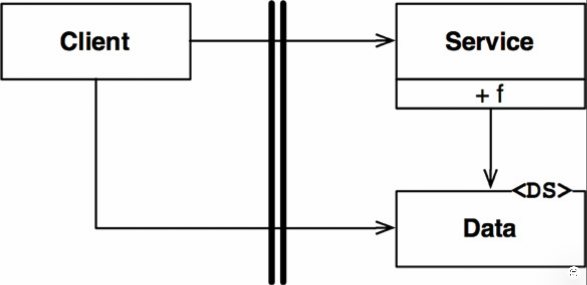
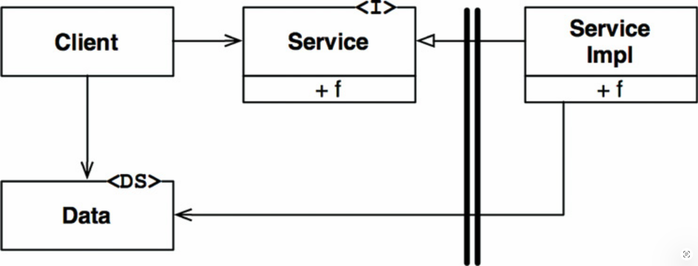

# 18 边界剖析

---

 

<ins>系统的架构由一组软件组件以及分隔它们的边界来定义</ins>。
这些边界有许多不同的形式。
在本章中，我们将探讨其中一些最常见的形式。

## 边界跨越

<ins>在运行时，边界跨越 (boundary crossing) 不过是边界一侧的函数调用另一侧的函数，并传递一些数据。
创建适当的边界跨越的技巧在于管理源代码依赖关系</ins>。

为什么是源代码？
<ins>因为当一个源代码模块发生变化时，其他源代码模块可能必须随之改变、重新编译，然后重新部署。
管理并建立抵御这种变化的防火墙，正是边界的全部意义所在</ins>。

## 令人畏惧的单体

最简单、最常见的架构边界没有严格的物理表现形式。
它仅仅是在单个处理器和单个地址空间内，对函数和数据进行有纪律的隔离。
在之前的章节中，我称之为源代码级解耦模式。

从部署的角度来看，这无非就是一个单一的可执行文件 —— 所谓的单体 (monolith)。
这个文件可能是一个静态链接的 C 或 C++ 项目、一组绑定到可执行 jar 文件中的 Java 类文件、一组绑定到单个 `.EXE` 文件中的 .NET 二进制文件，等等。

<ins>在单体部署过程中边界不可见这一事实，并不意味着它们不存在或不重要。
即使被静态链接到单个可执行文件中，独立开发和编排各个组件以进行最终组装的能力仍然具有巨大的价值</ins>。

此类架构几乎总是依赖某种形式的动态多态 (dynamic polymorphism) [1](#1) 来管理其内部依赖关系。
这就是近几十年来面向对象开发成为如此重要范式的原因之一。
没有 OO 或等效的多态形式，架构师必须退回到使用函数指针的危险做法来实现适当的解耦。
大多数架构师认为大量使用函数指针过于冒险，因此他们被迫放弃任何形式的组件分区。

最简单可能的边界跨越是从低层客户端到高层服务的函数调用。
运行时依赖和编译时依赖都指向同一方向 —— 朝向高层组件。

在 [Fig 18.1](#fig-181) 中，控制流从左向右跨越边界。
`Client` 调用 `Service` 上的函数 `f()`。
它传递一个 `Data` 的实例。
`<DS>` 标记仅表示一个数据结构。
`Data` 可以作为函数参数或通过其他更复杂的方式传递。
<ins>注意，`Data` 的定义位于边界的被调用侧</ins>。

#### Fig 18.1
 
*Fig 18.1 控制流从低层向高层跨越边界*

当高层客户端需要调用低层服务时，使用动态多态来反转依赖关系，使其与控制流方向相反。
运行时依赖与编译时依赖相对立。

在 [Fig 18.2](#fig-182) 中，控制流像之前一样从左向右跨越边界。
高层 `Client` 通过 `Service` 接口调用低层 `ServiceImpl` 的 `f()` 函数。
<ins>但请注意，所有依赖关系都从右向左跨越边界， *指向高层组件* 。
另外注意，数据结构的定义位于边界的调用侧</ins>。

#### Fig 18.2
 
*Fig 18.2 逆控制流方向跨越边界*

即使在单体、静态链接的可执行文件中，这种有纪律的分区也能极大地帮助项目的开发、测试和部署工作。
团队可以在各自的组件上独立工作，而不会相互干扰。
高层组件保持独立于底层细节。

单体中组件之间的通信非常快速且开销低廉。
它们通常只是函数调用。
因此，跨越源代码级解耦边界的通信可以非常频繁（“闲聊型”）。

<ins>由于单体的部署通常需要编译和静态链接，这些系统中的组件通常以源代码形式交付</ins>。

## 部署组件

<ins>架构边界最简单的物理表现形式是动态链接库，例如 .NET DLL、Java jar 文件、Ruby Gem 或 UNIX 共享库。
部署不涉及编译</ins>。
<ins>相反，组件以二进制或某种等效的可部署形式交付。
这就是部署级解耦模式</ins>。
部署的行为只是将这些可部署单元以某种方便的形式（如 WAR 文件，甚至仅仅是一个目录）汇集在一起。

除了这一例外，部署级组件与单体相同。
函数通常都存在于同一个处理器和同一个地址空间中。
用于隔离组件和管理其依赖关系的策略是相同的。[2](#2)

与单体一样，跨越部署组件边界的通信仍然是函数调用，因此非常廉价。
可能会在动态链接或运行时加载时产生一次性开销，但跨越这些边界的通信仍然可以非常频繁（“闲聊型”）。

## 线程

单体与部署组件都可以使用线程。
<ins>线程不是架构边界或部署单元，而是一种组织执行调度和执行顺序的方式</ins>。
它们可以完全包含在一个组件内，也可以分布在许多组件之间。

## 本地进程

<ins>一种强得多的物理架构边界是本地进程</ins>。
本地进程通常通过命令行或等效的系统调用来创建。
本地进程运行在同一个处理器上，或者同一个多核处理器的一组内核上，但运行在独立的地址空间中。
内存保护通常阻止此类进程共享内存，尽管共享内存分区也经常被使用。

大多数情况下，本地进程通过 socket 或某些其他类型的操作系统通信设施（如邮箱或消息队列）相互通信。

每个本地进程可以是一个静态链接的单体，也可以由动态链接的部署组件组成。
在前一种情况下，多个单体进程可能将相同的组件编译并链接到它们内部。
在后一种情况下，它们可能共享相同的动态链接部署组件。

可以将本地进程视为一种超组件 (uber-component)：该进程由较低层的组件组成，这些组件通过动态多态来管理它们的依赖关系。

<ins>本地进程之间的隔离策略与单体和二进制组件相同。
源代码依赖关系跨越边界指向同一方向，并且始终指向较高层的组件</ins>。

对于本地进程而言，这意味着高层进程的源代码中不得包含低层进程的名称、物理地址或注册表查找键。
请记住，架构目标是：低层进程应该是高层进程的插件。

<ins>跨越本地进程边界的通信涉及操作系统调用、数据编码 (marshaling) 与解码 (decoding) 以及进程间上下文切换，这些操作成本中等偏高。
应谨慎限制通信的频繁程度</ins>。

## 服务

<ins>最强的边界是服务。
服务是一个进程，通常通过命令行或等效的系统调用启动</ins>。
服务不依赖于它们的物理位置。
<ins>两个相互通信的服务可能运行在同一个物理处理器或多核处理器上，也可能不是。
服务假设所有通信都通过网络进行</ins>。

<ins>与函数调用相比，跨越服务边界的通信非常缓慢。
周转时间可能从几十毫秒到几秒不等。
必须注意尽可能避免闲聊式的通信。
在这一级别的通信必须处理高延迟</ins>。

否则，适用于本地进程的同样规则也适用于服务。
低层服务应该 “插入” 到高层服务中。
高层服务的源代码不得包含任何低层服务的特定物理知识（例如 URI）。

## 结论

<ins>除单体之外，大多数系统会使用不止一种边界策略</ins>。
一个使用服务边界的系统可能同时也有一些本地进程边界。
实际上，一个服务通常只是一组交互的本地进程的 facade 。
一个服务或一个本地进程，几乎肯定要么是一个由源代码组件组成的单体，要么是一组动态链接的部署组件。

---

#### 1
静态多态（例如泛型或模板）有时在单体系统中是一种可行的依赖管理手段，尤其是在 C++ 等语言中。
然而，泛型所提供的解耦无法像动态多态那样保护你免受重新编译和重新部署的需要。

#### 2
尽管静态多态在这种情况下不是一个选项。
