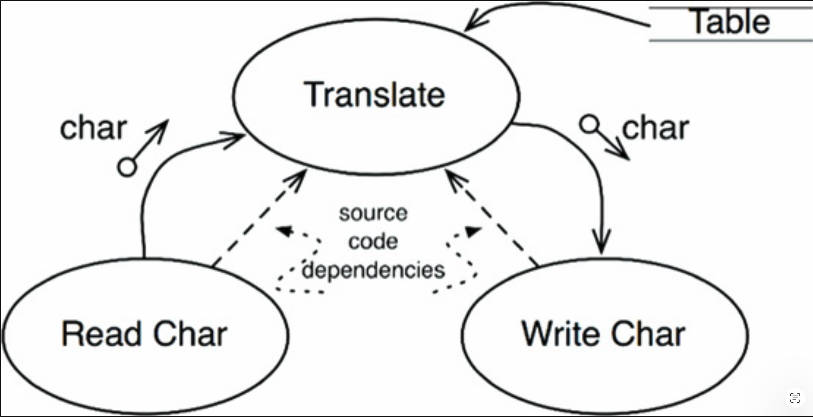
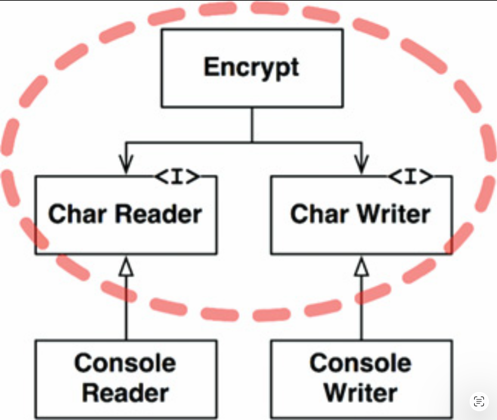
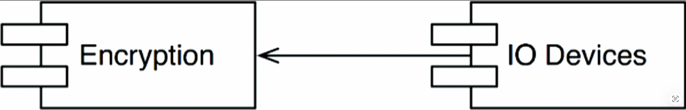

# 19 策略与层次

---
<center></center><br/>

软件系统就是策略的陈述。
实际上，在核心层面上，计算机程序的全部内容就是这个。
一个计算机程序是对将输入转换为输出的策略的详细描述。

在大多数非平凡系统中，该策略可以被分解为许多不同的、更小的策略陈述。
其中一些陈述将描述如何计算特定的业务规则。
其他陈述将描述如何格式化某些报告。
还有一些将描述如何验证输入数据。

开发软件架构的艺术之一，就是将这些策略彼此仔细地分离开，并根据它们变化的方式进行重新分组。
因相同原因、在相同时间变化的策略，处于相同的层次，并且应该一起归属于同一个组件。
因不同原因或在不同时间变化的策略，处于不同的层次，应该被分离到不同的组件中。

架构的艺术通常涉及将重新分组的组件形成一张有向无环图。
图的节点是包含同一层次策略的组件。
有向边是这些组件之间的依赖关系，它们连接处于不同层次的组件。

这些依赖关系是源代码级别的编译时依赖。
在 Java 中，它们是 `import` 语句；在 C# 中，它们是 `using` 语句；在 Ruby 中，它们是 `require` 语句。
它们是编译器运行所必需的依赖关系。

在一个良好的架构中，这些依赖的方向取决于它们所连接的组件的层次。
在任何情况下，低层组件的设计都是为了让它们依赖于高层组件。

## 层次

“层次” 的严格定义是：距离输入和输出的距离。
一个策略距离系统的输入和输出越远，它的层次就越高。
管理输入和输出的策略是系统中最低层的策略。

[Fig 19.1](#fig-191) 的数据流图描绘了一个简单的加密程序：它从输入设备读取字符，使用转换表翻译字符，然后将翻译后的字符写入输出设备。
数据流以弯曲的实线箭头表示。
设计良好的源代码依赖关系以直的虚线箭头表示。

#### Fig 19.1
<br/>
*Fig 19.1 一个简单的加密程序*

`Translate` 组件是此系统中层次最高的组件，因为它距离输入和输出最远。<sup>[1](#1)</sup>

请注意，数据流和源代码依赖关系并不总是指向同一方向。
这同样是软件架构的艺术的一部分。
我们希望源代码依赖关系与数据流解耦，并与层次耦合。

如果按照下面的方式编写加密程序，很容易产生错误的架构：

```java
function encrypt() {
  while(true)
    writeChar(translate(readChar()));
}
```

这是一个错误的架构，因为高层的 `encrypt` 函数依赖于较低层的 `readChar` 和 `writeChar` 函数。

该系统的更好的架构如 [Fig 19.2](#fig-192) 的类图所示。
请注意围绕 `Encrypt` 类的虚线边框，以及 `CharWriter` 和 `CharReader` 接口。
跨越该边框的所有依赖都指向内部。
该单元是系统中层次最高的元素。

#### Fig 19.2
<br/>
*Fig 19.2 展示了系统更好架构的类图*

`ConsoleReader` 和 `ConsoleWriter` 在此处显示为类。
它们是低层的，因为它们靠近输入和输出。

注意这种结构如何将高层的加密策略与较低层的输入/输出策略解耦。
这使得加密策略能够在广泛的应用场景中使用。
当输入和输出策略发生变化时，它们不太可能影响加密策略。

回想一下，策略是根据它们变化的方式被分组到组件中的。
因相同原因、在相同时间变化的策略，通过 `SRP` 和 `CCP` 被组合在一起。
高层策略 ——那些距离输入和输出最远的策略—— 与低层策略相比，往往变化不那么频繁，且因更重要的原因而变化。
低层策略 ——那些最接近输入和输出的策略—— 往往变化频繁，且更加紧急，但原因却没那么重要。

例如，即使在加密程序这个微不足道的例子中，IO 设备发生变化的可能性也远大于加密算法发生变化。
如果加密算法真的发生了变化，其原因很可能比某个 IO 设备的变化更实质性。

将这些策略分开，并将所有源代码依赖关系指向高层策略的方向，可以降低变更的影响。
系统最底层琐碎但紧急的变更，对更重要的高层几乎不产生影响。

看待这个问题的另一种方式是：低层组件应该是高层组件的插件。
[Fig 19.3](#fig-193) 的组件图展示了这种安排。
`Encryption` 组件对 `IODevices` 组件一无所知；`IODevices` 组件依赖于 `Encryption` 组件。

#### Fig 19.3
<br/>
*Fig 19.3 低层组件应该插入高层组件*

## 结论

至此，关于策略的讨论混合运用了单一职责原则、开闭原则、共同闭包原则、依赖反转原则、稳定依赖原则和稳定抽象原则。
请回头看看，你是否能识别出每条原则在何处被使用，以及为什么被使用。

---
#### 1
Meilir Page-Jones 在其著作《结构化系统设计实用指南》第二版（Yourdon Press, 1988）中将此组件称为 “中央变换”。
