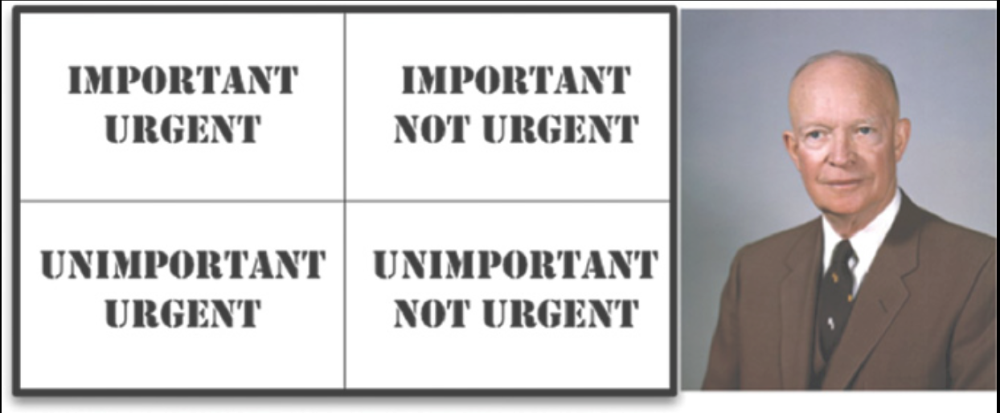

# 2 两种价值

---

 

每个软件系统都为其利益相关者提供两种不同的价值：行为与结构。
软件开发人员负责确保这两种价值都保持在较高水平。
不幸的是，他们常常专注于其中一个而忽略了另一个。
更不幸的是，他们常常专注于两者中价值较低的那个，最终导致软件系统变得毫无价值。

## 行为

软件的第一个价值是其行为。程序员被雇佣来让机器的行为以某种方式为利益相关者赚钱或省钱。我们通过帮助利益相关者制定功能规格说明或需求文档来实现这一点。然后我们编写代码，使利益相关者的机器满足这些需求。

当机器违反这些需求时，程序员会拿出调试器来修复问题。

许多程序员认为这就是他们工作的全部。
他们认为自己的工作就是让机器实现需求并修复任何缺陷。
他们大错特错了。

## 架构

软件的第二个价值与 “software” 这个词有关 —— 它是由 “soft”（柔软的）和 “ware”（产品）组成的复合词。“Ware” 意为 “产品”；而“soft”……嗯，第二个价值就藏在其中。

软件被发明出来就是为了 “软”的。
它的本意是一种能够轻松改变机器行为的方式。
如果我们希望机器的行为难以改变，那我们就会称它为硬件了。

为了实现其目的，软件必须是软的 —— 也就是说，它必须易于更改。
<ins>当利益相关者改变对某个特性的想法时，这种变更应该简单且容易实施。
进行这种变更的难度应该仅与变更的范围成比例，而不应与变更的形状（具体形式）成比例</ins>。

正是这种范围与形状之间的差异，常常导致软件开发成本的增长。
这就是为什么成本的增长与所请求变更的规模不成比例。
这也是为什么开发的第一年比第二年便宜得多，而第二年又比第三年便宜得多的原因。

从利益相关者的角度来看，他们只是提供了一系列范围大致相似的变更。
而从开发者的角度来看，利益相关者给了他们一系列拼图碎片，必须将这些碎片嵌入到一个日益复杂的拼图之中。
每一个新的请求都比上一个更难嵌入，因为系统的形状与请求的形状不匹配。

这里我以非常规的方式使用 “形状” 这个词，但我认为这个比喻是恰当的。
软件开发人员常常感觉像是被迫把方形的木桩塞进圆形的孔洞里。

<ins>问题的根源当然在于系统的架构</ins>。
架构越是偏好某一种形状而非另一种，新特性就越难嵌入到那种结构之中。
因此，架构应当尽可能做到与形状无关。

## 更大的价值

功能还是架构？
这两者哪一个提供了更大的价值？
<ins>是让软件系统正常工作更重要，还是让软件系统易于更改更重要</ins>？

<ins>如果你问业务经理，他们常常会说让软件系统正常工作更重要。
而开发人员往往也认同这种态度。
但这是错误的态度</ins>。
我可以用一个简单的逻辑工具 —— 极端情况分析法来证明它是错误的。

- 如果你给我一个运行完美但无法更改的程序，那么当需求变更时它就无法工作，而我也无法让它正常工作。因此，这个程序将变得毫无用处。
- 如果你给我一个不能正常工作但易于更改的程序，那么我可以让它正常工作，并且在需求变更时也能让它持续工作。因此，这个程序将保持持续有用。

你可能觉得这个论点没有说服力。
毕竟，不存在完全无法更改的程序。
然而，确实存在一些实际上几乎无法更改的系统，因为更改的成本超过了更改带来的收益。
许多系统在其某些特性或配置上就达到了那种程度。

如果你问业务经理是否希望能够进行变更，他们当然会说希望，但随后可能会补充说当前的功能比未来的任何灵活性都更重要，以此限定他们的回答。
相反，如果业务经理向你提出一个变更请求，而你对那个变更的预估成本高得无法承受，那么业务经理很可能会因为你们让系统发展到变更变得不切实际的地步而暴怒。

## 艾森豪威尔矩阵

考虑 Dwight D. Eisenhower 总统关于重要性与紧迫性的矩阵（ [Fig 2.1](#fig-21) ）。
对于这个矩阵，Eisenhower 曾说过：

> 我有两类问题：紧迫的和重要的。紧迫的并不重要，而重要的从来都不紧迫。

#### Fig 2.1
 
*Fig 2.1 艾森豪威尔矩阵*

这句古老的格言蕴含着很大的道理。
那些紧迫的事情很少具有重大重要性，而那些重要的事情很少具有高度紧迫性。

软件的第一个价值 ——行为—— 是紧迫的，但并非总是特别重要。

软件的第二个价值 ——架构—— 是重要的，但从来都不是特别紧迫。

当然，有些事情既紧迫又重要。
另一些事情既不紧迫也不重要。
最终，我们可以将这四对组合按优先级排列：

1. 紧迫且重要
2. 不紧迫但重要
3. 紧迫但不重要
4. 不紧迫也不重要

<ins>请注意，代码的架构 ——那些重要的事情—— 位于此列表的前两位，而代码的行为则占据第一位和第三位</ins>。

业务经理和开发人员常犯的错误是将第 3 位的事项提升到第 1 位。
换句话说，他们未能将那些紧迫但不重要的特性与那些真正紧迫且重要的特性区分开来。
这种失败导致他们忽略系统中重要的架构，而偏重于那些不重要的特性。

软件开发人员面临的困境在于，业务经理不具备评估架构重要性的能力。
这正是软件开发人员被雇来做的事情。
<ins>因此，软件开发团队有责任坚持架构的重要性高于特性的紧迫性</ins>。

## 为架构而战

履行这一责任意味着要投身于一场战斗 —— 或者也许更恰当的词是 “斗争”。
坦率地说，事情从来都是这样做的。
开发团队必须为他们认为对公司最有利的东西而斗争，管理团队、市场团队、销售团队、运营团队也是如此。
这始终是一场斗争。

高效的软件开发团队会直面这种斗争。
他们毫不避讳地与其他所有利益相关者平等地争论。
请记住，作为一名软件开发人员，你就是利益相关者。
你对所开发的软件拥有需要维护的权益。
这是你职责的一部分，也是你义务的一部分，并且是当初雇佣你的一个重要原因。

如果你是软件架构师，这一挑战则加倍重要。
软件架构师由于其职位描述的特性，比系统特性和功能更关注系统的结构。
架构师创建一种架构，使得那些特性和功能能够被容易地开发、容易地修改以及容易地扩展。

请记住：如果把架构放在最后，那么系统的开发成本将变得越来越高，最终系统的部分或全部将变得几乎无法更改。
如果任由这种情况发生，那就意味着软件开发团队没有为他们认为必要的事情进行足够坚决的斗争。
