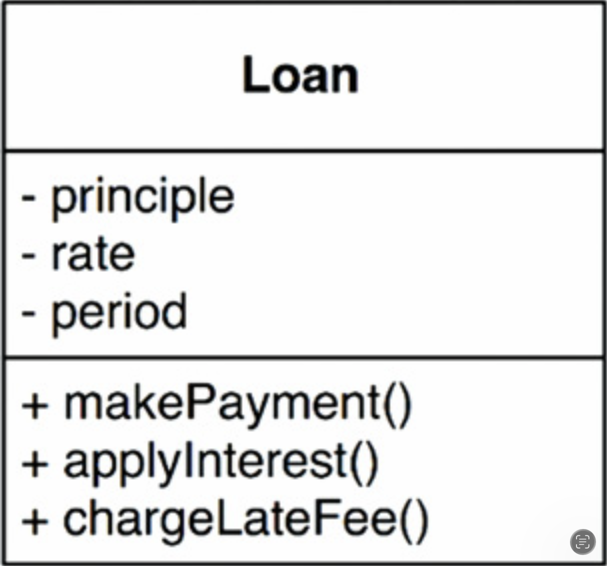

## 20 业务规则

---

 

如果我们要将应用程序划分为业务规则和插件，那么我们最好清楚地理解业务规则到底是什么。
事实证明，它们有几种不同的类型。

严格来说，业务规则是为企业赚钱或省钱的规则或流程。
更严格地说，这些规则无论是否在计算机上实现，都会为企业赚钱或省钱。
即使它们被手动执行，也仍然会赚钱或省钱。

银行对贷款收取 N% 的利息这一事实，是使银行赚钱的业务规则。
无论是由计算机程序计算利息，还是由使用算盘的职员计算利息，都没有区别。

我们将这些规则称为 *关键业务规则 (Critical Business Rules)* ，因为它们对业务本身至关重要，即使没有系统来自动化它们，它们也仍然存在。

关键业务规则通常需要一些数据来运作。
例如，我们的贷款需要贷款余额、利率和还款计划。

我们将这些数据称为 *关键业务数据 (Critical Business Data)* 。
这些数据即使系统没有被自动化，也仍然会存在。

关键规则和关键数据密不可分，因此它们很适合作为一个对象。
我们将这种对象称为 *实体 (Entity)* 。[1](#1)

## 实体

<ins>是我们计算机系统中的一个对象，它包含了一小组基于关键业务数据运作的关键业务规则</ins>。
实体对象要么包含关键业务数据，要么能够非常容易地访问这些数据。
实体的接口由实现对这些数据进行操作的关键业务规则的函数组成。

例如，[Fig 20.1](#fig-201) 展示了我们的 `Loan` 实体在 UML 中作为一个类的样子。
它包含三块关键业务数据，并在其接口中提供了三个相关的关键业务规则。

#### Fig 20.1
 
*Fig 20.1 `Loan` 实体 作为 UML 的类*

当我们创建这种类时，我们是在将实现业务关键概念的软件聚集在一起，并将其与我们正在构建的自动化系统中的所有其他关注点分离开。
这个类作为业务的代表独立存在。
它没有被数据库、用户界面或第三方框架的关注点所污染。
它可以在任何系统中为业务提供服务，无论该系统如何呈现、数据如何存储，或系统中的计算机如何排列。
实体是纯粹的商业，除此之外 *别无他物* 。

你们中的一些人可能会担心我称它为一个类。
别担心。
你不需要使用面向对象语言来创建实体。
所需要的只是你将关键业务数据和关键业务规则绑定在一个独立的软件模块中。

## 用例

<ins>并非所有业务规则都像实体那样纯粹。
有些业务规则通过定义和约束自动化系统的运作方式，为企业赚钱或省钱</ins>。
这些规则不会在手动环境中使用，因为它们只有在作为自动化系统的一部分时才有意义。

例如，想象一个供银行职员用来创建新贷款的应用程序。
银行可能决定，不希望贷款职员在收集并验证了联系信息、并确保候选人的信用评分为 500 或更高之前，就提供贷款还款估算。
因此，银行可能会规定：在联系信息屏幕被填写并验证、且信用评分被确认高于临界值之前，系统不会进入还款估算屏幕。

<ins>这是一个用例。[2](#2)
用例是对自动化系统使用方式的描述。
它指定了用户提供的输入、返回给用户的输出，以及生成该输出所涉及的处理步骤。
用例描述了特定于应用程序的业务规则，区别于实体中的关键业务规则</ins>。

[Fig 20.2](#fig-202) 展示了一个用例示例。
注意，在最后一行它提到了 `Customer`。
这是对 `Customer` 实体的引用，该实体包含了管理银行与其客户之间关系的关键业务规则。

#### Fig 20.2
 
*Fig 20.2 用例示例*

用例包含的规则指定了实体中的关键业务规则被如何以及何时调用。
用例控制着实体的 “舞蹈”。

<ins>还要注意，用例并不描述用户界面，除了非正式地指定从该界面进入的数据以及通过该界面返回的数据之外</ins>。
从用例中，无法判断应用程序是通过 Web、胖客户端、控制台交付，还是纯服务。

这一点非常重要。
用例不描述系统对用户呈现的样子。
相反，它们描述了管理 (govern) 用户与实体之间交互的、特定于应用程序的规则。
数据如何进出系统与用例无关。

用例是一个对象。
它有一个或多个函数来实现特定于应用程序的业务规则。
它也有数据元素，包括输入数据、输出数据，以及对其交互的适当实体的引用。

<ins>实体对控制它们的用例一无所知。
这是依赖方向遵循依赖反转原则的另一个例子</ins>。
高层概念（如实体）对低层概念（如用例）一无所知。
相反，低层的用例知道高层的实体。

为什么实体是高层，而用例是低层？
因为用例特定于单个应用程序，因此更接近该系统的输入和输出。
实体是可以在许多不同应用程序中使用的泛化，因此它们离系统的输入和输出更远。
<ins>用例依赖于实体；实体不依赖于用例</ins>。

## 请求与响应模型

用例期望输入数据，并产生输出数据。
然而，一个结构良好的用例对象不应该对数据如何传递给用户或任何其他组件有任何了解。
我们当然不希望用例类中的代码知道 HTML 或 SQL！

<ins>用例类接受简单的请求数据结构作为其输入，并返回简单的响应数据结构作为其输出。
这些数据结构不依赖于任何东西</ins>。
它们不派生自标准框架接口（如 `HttpRequest` 和 `HttpResponse`）。
它们对 Web 一无所知，也不分享任何可能存在的用户界面的任何装饰。

<ins>这种依赖关系的缺失至关重要。
如果请求和响应模型不是独立的，那么依赖它们的用例将间接绑定到这些模型所携带的任何依赖关系</ins>。

<ins>你可能会倾向于让这些数据结构包含对实体对象的引用。
你可能会认为这很合理，因为实体和请求/响应模型共享大量数据。
抵制这种诱惑！</ins>
这两个对象的目的截然不同。
随着时间的推移，它们会因完全不同的原因而变化，因此以任何方式将它们绑定在一起都违反了共同闭包原则和单一职责原则。
其结果是大量的 “流浪数据 (tramp data)” 和代码中大量的条件判断。

## 结论

业务规则是软件系统存在的原因。
它们是核心功能。
它们承载着赚钱或省钱的代码。
它们是家族的珍宝。

业务规则应该保持纯净，不被用户界面或所使用的数据库等低级关注点所玷污。
理想情况下，代表业务规则的代码应该是系统的心脏，而较低级的关注点被插入其中。
业务规则应该是系统中最独立、最可复用的代码。

---

#### 1
这是 Ivar Jacobson 对此概念的命名（I. Jacobson 等人，Object Oriented Software Engineering，Addison-Wesley，1992）。

#### 2
同上。
