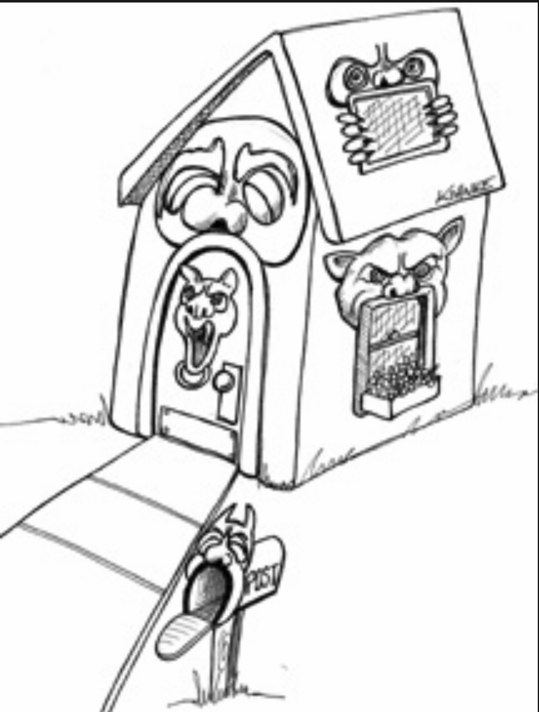

# 21 尖叫架构

---

 

想象你正在查看一栋建筑的蓝图。
这份由建筑师准备的文档，提供了该建筑的规划方案。
这些规划告诉了你什么？

如果你正在查看的是一栋独户住宅的蓝图，那么你很可能会看到一个前门入口、一个通向起居室的门厅，可能还有一个餐厅。
很可能在距离不远的地方有一个厨房，靠近餐厅。
也许厨房旁边有一个小餐区，附近可能还有一个家庭活动室。
当你查看这些规划时，毫无疑问你看到的是独户住宅。
该架构会尖叫出：“家”。

现在假设你正在查看一座图书馆的架构。
你很可能会看到一个宏伟的入口、一个办理借还书的区域、阅读区、小会议室，以及一个接一个能够容纳图书馆所有书籍的书架的陈列室。
该架构会尖叫出：“图书馆”。

那么，你的应用程序的架构会尖叫出什么？
当你查看顶层目录结构以及最高层包中的源文件时，它们尖叫出的是 “医疗保健系统”、“会计系统” 还是 “库存管理系统”？
还是它们尖叫出的是“Rails”、“Spring/Hibernate”或“ASP”？

## 架构的主题

回过头去读 Ivar Jacobson 关于软件架构的开创性著作：《面向对象软件工程》。
请注意该书的副标题：一种用例驱动的方法。
<ins>在这本书中，Jacobson 指出，软件架构是支持系统用例的结构</ins>。
正如房屋或图书馆的蓝图尖叫着关于那些建筑的用例一样，软件应用程序的架构也应当尖叫着关于该应用程序的用例。

<ins>架构不是（或不应是）关于框架的。
架构不应由框架提供。
框架是要使用的工具，而不是要屈从的架构。
如果你的架构是基于框架的，那么它就不可能基于你的用例</ins>。

## 架构的目的

<ins>良好的架构以用例为中心，这样架构师就能安全地描述支持这些用例的结构，而无需承诺使用特定的框架、工具和环境</ins>。
再次考虑房屋的蓝图。建筑师的首要关注点是确保房屋是可用的 —— 而不是确保房屋是用砖块建造的。
实际上，建筑师会煞费苦心地确保在蓝图满足用例之后，房主可以稍后再决定外部材料（砖、石材或雪松）。

<ins>良好的软件架构允许关于框架、数据库、Web 服务器以及其他环境问题和工具的决策被推迟和延后</ins>。
*框架是要保留的选项* 。
良好的架构使得没有必要立刻决定使用 Rails、Spring、Hibernate、Tomcat 或 MySQL，直到项目后期。
良好的架构也使得改变关于这些决策的想法变得容易。
良好的架构强调用例，并将它们与外围关注点解耦。

## 那 Web 呢？

Web 是一种架构吗？
你的系统通过 Web 交付这一事实是否决定了你的系统架构？
当然不是！
<ins>Web 是一种交付机制 ——一种 IO 设备—— 你的应用程序架构应该这样看待它</ins>。
你的应用程序通过 Web 交付这一事实是一个细节，不应主导你的系统结构。
实际上，关于你的应用程序将通过 Web 交付的决策，是你应该推迟的决策之一。
你的系统架构应该尽可能对其交付方式保持无知。
你应该能够在不过度复杂或更改基本架构的情况下，将其交付为控制台应用、Web 应用、胖客户端应用，甚至 Web 服务应用。

## 框架是工具，不是生活方式

框架可能非常强大且非常有用。
框架作者往往对自己的框架深信不疑。
他们编写的关于如何使用其框架的示例，是从信徒的角度讲述的。
其他撰写该框架的作者也往往是该真信仰的信徒。
他们展示了使用该框架的方式。
通常他们持有一个包罗万象、无处不在、让框架包办一切的立场。

> 这不是你想要采取的立场。

用挑剔的眼光看待每一个框架。
以怀疑的态度审视它。
是的，它可能有帮助，但代价是什么？
问问自己应该如何使用它，以及如何保护自己免受它的影响。
<ins>思考怎样让架构始终以业务用例为重心。
制定一个策略，防止框架接管该架构</ins>。

## 可测试的架构

如果你的系统架构完全围绕用例，并且你与框架保持了距离，那么你应该能够在没有任何框架的情况下对所有这些用例进行单元测试。
你不需要运行 Web 服务器来运行测试。
你不需要连接数据库来运行测试。
你的实体对象应该是普通的旧对象，不依赖于框架、数据库或其他复杂因素。
你的用例对象应该协调你的实体对象。
最后，所有这些都应该能够在现场进行测试，而无需框架的任何复杂因素。

## 结论

你的架构应该向读者讲述关于系统的信息，而不是关于你在系统中使用的框架。
如果你正在构建一个医疗保健系统，那么当新程序员查看源代码仓库时，他们的第一印象应该是：“哦，这是一个医疗保健系统。”
那些新程序员应该能够了解该系统的所有用例，但仍然不知道系统是如何交付的。
他们可能会来找你问：

“我们看到一些看起来像模型的东西 —— 但是视图和控制器在哪里？”

而你应该回答：

“哦，那些是细节，目前不必关心。我们稍后再决定。”
