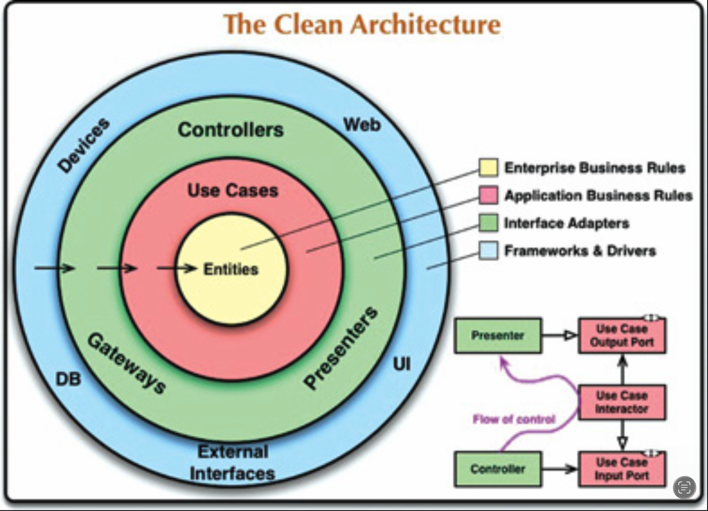
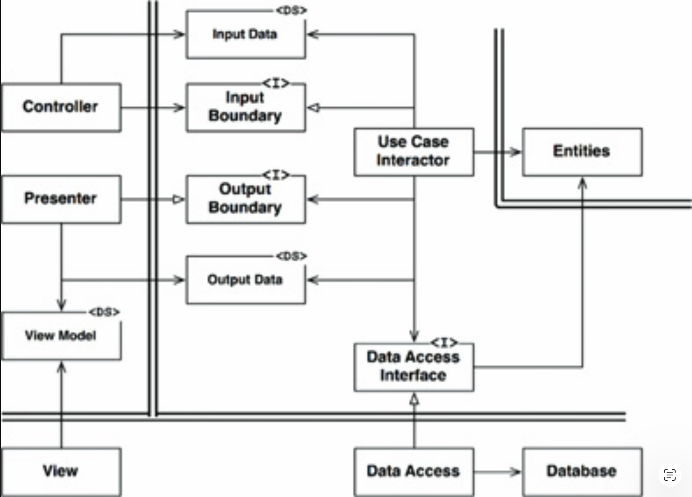

# 22 整洁架构

---

 

在过去的几十年里，我们看到了一系列关于系统架构的想法。
这些包括：

- **六边形架构**（也称为端口与适配器），由 Alistair Cockburn 开发，并被 Steve Freeman 和 Nat Pryce 在其精彩的著作《测试驱动的面向对象软件开发》中所采用。

- **DCI**，来自 James Coplien 和 Trygve Reenskaug。

- **BCE**，由 Ivar Jacobson 在其著作《面向对象软件工程：一种用例驱动的方法》中引入。

<ins>尽管这些架构在细节上各有不同，但它们非常相似。
它们都有相同的目标，即关注点分离。
它们都通过将软件划分为层来实现这种分离。
每个架构都至少有一层用于业务规则，另一层用于用户和系统接口</ins>。

<ins>这些架构中的每一种都能产生具有以下特征的系统</ins>：

- *独立于框架*。
该架构不依赖于某个功能丰富的软件库的存在。
这允许你将此类框架用作工具，而不是迫使你将系统塞入它们有限的约束中。

- *可测试*。
业务规则可以在没有 UI、数据库、Web 服务器或任何其他外部元素的情况下进行测试。

- *独立于 UI*。
UI 可以轻松更改，而无需更改系统的其余部分。
例如，Web UI 可以被控制台 (console) UI 替换，而无需更改业务规则。

- *独立于数据库*。
你可以将 Oracle 或 SQL Server 替换为 Mongo、BigTable、CouchDB 或其他数据库。
你的业务规则不绑定到数据库。

- *独立于任何外部代理 (agency)*。
实际上，你的业务规则对外部世界的接口一无所知。

[Fig 22.1](#fig-221) 中的图 (diagram) 试图将所有上述架构整合为一个单一可行的思想。

#### Fig 22.1
 
*Fig 22.1 整洁架构*

## 依赖规则

[Fig 22.1](#fig-221) 中的同心圆代表了软件的不同区域。
<ins>一般来说，越往内层走，软件的层次就越高。
外层是机制。
内层是策略</ins>。

使该架构工作的首要规则是 *依赖规则 (Dependency Rule)* ：

> <ins>源代码依赖关系必须只能指向内层，即指向更高层的策略</ins>。

<ins>内层中的任何东西都不能知道外层中的任何东西。
特别是，外层中声明的某些东西的名称，不得被内层中的代码提及。
这包括函数、类、变量或任何其他命名的软件实体</ins>。

<ins>同样，外层中声明的数据格式不应被内层使用，尤其是当这些格式是由外层中的框架生成时。
我们不希望外层中的任何东西影响内层</ins>。

### 实体

<ins>实体 (Entities) 封装了企业范围内的关键业务规则</ins>。
一个实体可以是一个带有方法的对象，也可以是一组数据结构和函数。
只要这些实体能够被企业中的许多不同应用程序所使用，具体形式并不重要。

如果你没有企业，只编写一个单一的应用程序，那么这些实体就是该应用程序的业务对象。
它们封装了最通用、最高层的规则。
当外部事物发生变化时，它们最不可能受到影响。
例如，你不希望这些对象受到页面导航或安全变更的影响。
任何特定应用程序的运行变更都不应影响实体层。

### 用例

<ins>用例层中的软件包含了 *特定应用的 (application-specific)* 业务规则。
它封装并实现了系统的所有用例。
这些用例编排数据进出实体的流程，并指导这些实体使用其关键业务规则来实现用例的目标</ins>。

<ins>我们不期望该层中的变化会影响实体。
我们也不期望该层受到外部因素（如数据库、UI 或任何常见框架）变化的影响。
用例层与这些关注点隔离开</ins>。

然而，我们确实期望应用程序操作的变化会影响用例，从而影响该层中的软件。
如果某个用例的细节发生变化，那么该层中的某些代码肯定会受到影响。

## 接口适配器

<ins>接口适配器层中的软件是一组适配器，负责将数据从最方便用例和实体的格式，转换为最方便某些外部代理 (agency)（如数据库或 Web）的格式。
例如，正是这一层将完整包含 GUI 的 MVC 架构。
呈现器（Presenter）、视图（View）和控制器（Controller）都属于接口适配器层。
模型很可能只是数据结构，从控制器传递到用例、再从用例传回呈现器和视图的</ins>。

<ins>同样，在这一层中，数据从最方便实体和用例的格式，转换为最方便所使用的任何持久化框架（即数据库）的格式。
该圆内部的代码不应知道数据库的任何信息。
如果数据库是 SQL 数据库，那么所有 SQL 都应限制在这一层 —— 特别是该层中与数据库相关的部分</ins>。

同样在这一层中的还有任何其他必要的适配器，用于将数据从某种外部形式（例如外部服务）转换为用例和实体所使用的内部形式。

## 框架与驱动器

<ins>[Fig 22.1](#fig-221) 模型的最外层通常由框架和工具组成，例如数据库和 Web 框架</ins>。
一般来说，除了与内层通信的胶水代码之外，你在这层中不会编写太多代码。

框架与驱动层是所有细节所在之处。
Web 是一个细节。
数据库是一个细节。
我们将这些事物放在外部，在那里它们不会造成太大伤害。

## 只有四个圆？

<ins>[Fig 22.1](#fig-221) 中的圆是示意性的：你可能会发现需要不止这四个。
没有规定说你必须总是只有这四个。
然而，依赖规则始终适用。
源代码依赖关系始终指向内部</ins>。
当你向内移动时，抽象和策略的层次会提高。
最外层由低层的具体细节组成。
当你向内移动时，软件变得更加抽象，并封装更高层的策略。
最内层是最通用、最高层的。

## 跨越边界

<ins>[Fig 22.1](#fig-221) 右下角展示了一个如何跨越圆边界的示例。
它显示了控制器和呈现器与下一层的用例进行通信。
注意控制流：它从控制器开始，经过用例，然后最终在呈现器中执行</ins>。
还要注意源代码依赖关系：每一个都向内指向用例。

我们通常通过使用依赖反转原则来解决这个明显的矛盾。
例如，在像 Java 这样的语言中，我们会安排接口和继承关系，使得源代码依赖关系在跨越边界的恰当位置与控制流方向相反。

例如，假设用例需要调用呈现器。
这种调用不能是直接的，因为那将违反依赖规则：内层不能提及外层中的任何名称。
因此，我们让用例调用内层中的一个接口（在 [Fig 22.1](#fig-221) 中显示为 “use case output port”），并让外层中的呈现器实现它。

<ins>同样的技术被用于跨越架构中的所有边界。
我们利用动态多态来创建与控制流方向相反的源代码依赖关系，以便无论控制流走向哪个方向，我们都能遵守依赖规则</ins>。

## 哪些数据跨越边界

通常，跨越边界的数据由简单的数据结构组成。
如果愿意，你可以使用基本的结构体或简单的数据传输对象。
或者，数据也可以只是函数调用中的参数。
你也可以将其打包到哈希映射中，或构造为一个对象。
重要的是，隔离的、简单的数据结构被跨越边界传递。
<ins>我们不想作弊，传递实体对象或数据库行。
我们不希望数据结构具有任何违反依赖规则的依赖关系</ins>。

例如，许多数据库框架在响应查询时返回一种方便的数据格式，我们可以称之为 “行结构 (row structure)”。
<ins>我们不希望将该行结构向内传递跨越边界。这样做会违反依赖规则，因为这会迫使内层知道外层的一些东西</ins>。

<ins>因此，当我们跨越边界传递数据时，它总是以最方便内层的形式</ins>。

## 典型场景

[Fig 22.2](#fig-222) 展示了一个使用数据库的基于 Web 的 Java 系统的典型场景。
Web 服务器从用户那里收集输入数据，并将其交给左上角的 `Controller`。
`Controller` 将该数据打包成一个普通的 Java 对象，并通过 `InputBoundary` 将该对象传递给 `UseCaseInteractor`。
`UseCaseInteractor` 解释该数据，并使用它来控制实体的 “舞蹈”。
它还使用 `DataAccessInterface` 将那些实体所使用的数据从 `Database` 加载到内存中。
完成后，`UseCaseInteractor` 从实体收集数据，并将 `OutputData` 构造为另一个普通的 Java 对象。
然后 `OutputData` 通过 `OutputBoundary` 接口传递给 `Presenter`。

#### Fig 22.2
 
*Fig 22.2 一个使用数据库的基于 Web 的 Java 系统的典型场景*

`Presenter` 的工作是将 `OutputData` 重新打包为可视图形式，即 `ViewModel`，这又是另一个普通的 Java 对象。
`ViewModel` 主要包含 `View` 用来显示数据的字符串和标志。
<ins>虽然 `OutputData` 可能包含 `Date` 对象，但 `Presenter` 会将已经为用户正确格式化的相应字符串加载到 `ViewModel` 中。
`Currency` 对象或任何其他与业务相关的数据也是如此。
`Button` 和 `MenuItem` 的名称被放入 `ViewModel` 中，同时还有告诉 `View` 这些按钮和菜单项是否应置灰的标志</ins>。

这使得 `View` 几乎无事可做，除了将数据从 `ViewModel` 移动到 HTML 页面之外。

<ins>注意依赖关系的方向。
所有依赖关系都跨越边界线指向内层，遵循依赖规则</ins>。

## 结论

遵循这些简单的规则并不困难，而且它将为你省去未来许多麻烦。
<ins>通过将软件划分为层并遵守依赖规则，你将创建一个本质上可测试的系统，并享受由此带来的所有好处</ins>。
当系统的任何外部部分（如数据库或 Web 框架）过时时，你可以以最小的麻烦替换那些过时的元素。

