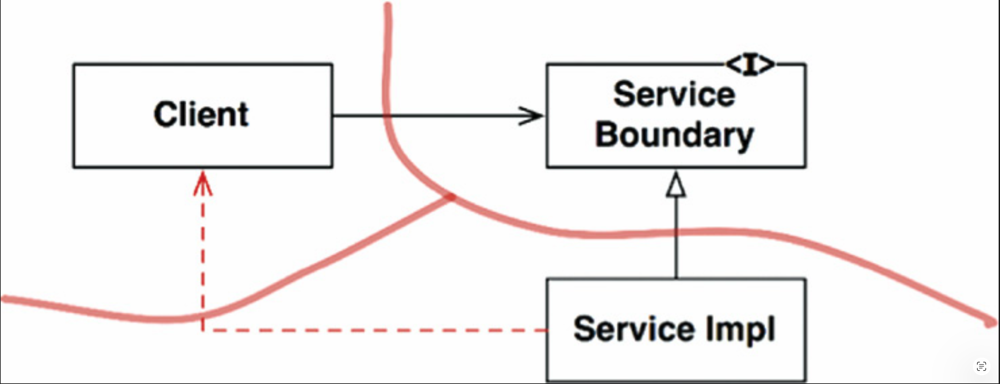
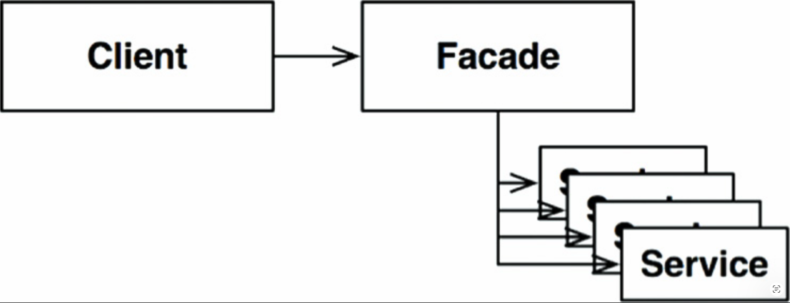

# 24 部分边界

---

 

<ins>完整的架构边界是昂贵的。
它们需要相互的多态边界接口、输入和输出数据结构，以及将两侧隔离为独立可编译和可部署组件所需的所有依赖管理。
这需要大量的工作。
维护起来也需要大量的工作</ins>。

在许多情况下，优秀的架构师可能会判断这样的边界成本太高 —— 但仍可能希望为这样的边界保留一个位置，以防将来需要。

这种预期性设计在敏捷社区中常常受到反对，被视为违反了 YAGNI：“你不会需要它 (You Aren’t Going to Need It.)”。
然而，架构师有时会看到问题并想：“是的，但我可能会需要。”
在这种情况下，他们可能会实现一个部分边界。

## 跳过最后一步

<ins>构建部分边界的一种方法是：完成创建独立可编译和可部署组件所需的所有工作，然后只是简单地将它们保持在一起，放在同一个组件中</ins>。
相互的接口已经存在，输入/输出数据结构已经存在，一切都已准备就绪 —— 但我们将其全部编译并部署为一个单一组件。

显然，这种部分边界需要与完整边界相同数量的代码和预备设计工作。
然而，它不需要管理多个组件。
没有版本号跟踪或发布管理的负担。
这个区别不应被轻视。

这正是 FitNesse 早期背后的策略。
FitNesse 的 Web 服务器组件被设计为可与 FitNesse 的 wiki 和测试部分分离。
当时的想法是，我们可能想通过使用该 Web 组件来创建其他基于 Web 的应用程序。
同时，我们不希望用户必须下载两个组件。
回想一下，我们的设计目标之一是 “下载即运行”。
我们的意图是用户下载一个 jar 文件并执行它，而无需寻找其他 jar 文件、解决版本兼容性问题等等。

FitNesse 的故事也指出了这种方法的一个危险。
随着时间的推移，当越来越明显永远不需要一个单独的 Web 组件时，Web 组件和 wiki 组件之间的分离开始削弱。
依赖关系开始以错误的方向跨越界限。
如今，重新将它们分离将是一件相当麻烦的事。

## 一维边界

完整的架构边界使用相互的边界接口来保持两个方向的隔离。
在两个方向上保持分离，在初始设置和持续维护方面都很昂贵。

一种更简单的结构，用于为以后扩展为完整边界保留位置，如 [Fig 24.1](#fig-241) 所示。
它体现了传统的 *策略模式 (Strategy pattern)* 。
一个 `ServiceBoundary` 接口被客户端使用，并由 `ServiceImpl` 类实现。

#### Fig 24.1
 
*Fig 24.1 策略模式*

应该清楚的是，这为未来的架构边界奠定了基础。
必要的依赖反转已经到位，试图将 `Client` 与 `ServiceImpl` 隔离开。
同样清楚的是，这种分离可能会迅速退化，如图中险恶的虚线箭头所示。
如果没有相互的接口，除了开发人员和架构师的勤勉与纪律之外，没有什么能阻止这种 “后门通道”。
*「反方向是 ServiceImpl 回调 Client 的接口，这就是完整的双向隔离」*

## FACADES

一种更简单的边界是 *外观模式 (Facade pattern)* ，如 [Fig 24.2](#fig-242) 所示。
在这种情况下，连依赖反转也被牺牲了。
边界仅由 `Facade` 类定义，该类将所有服务列为方法，并将服务调用委托给客户端不应访问的类。

#### Fig 24.2
 
*Fig 24.2 外观模式*

但请注意，`Client` 对所有那些服务类具有传递性依赖。
在静态语言中，更改某个 `Service` 类的源代码将强制 `Client` 重新编译。
此外，你可以想象在这种结构中创建 “后门通道” 是多么容易。

## 结论

我们已经看到了三种部分实现架构边界的简单方法。
当然，还有许多其他方法。
这三种策略只是作为示例提供。

每种方法都有其自身的成本和收益集合。
在特定上下文中，每种方法都适合作为最终完整边界的占位符。
如果该边界从未实现，每种方法也都可以退化。

决定架构边界可能有一天会存在于何处，以及是完整还是部分地实现该边界，是架构师的职能之一。
