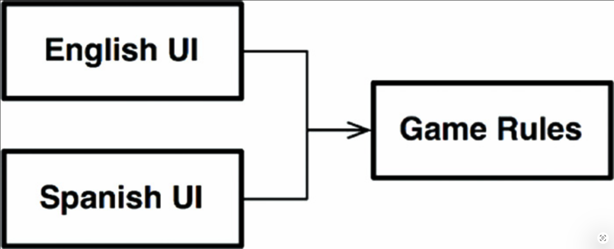
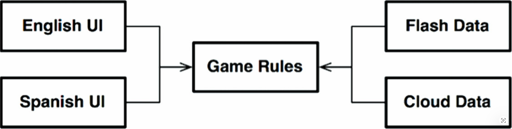
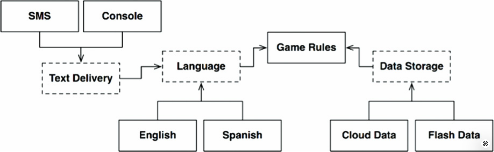
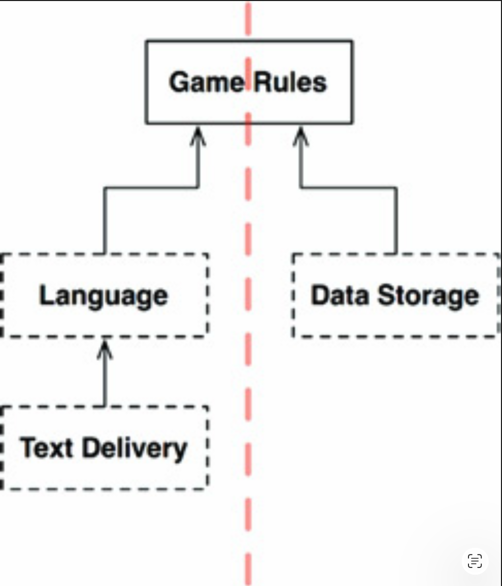
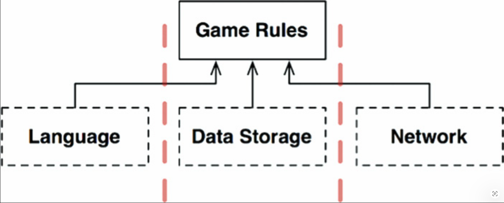
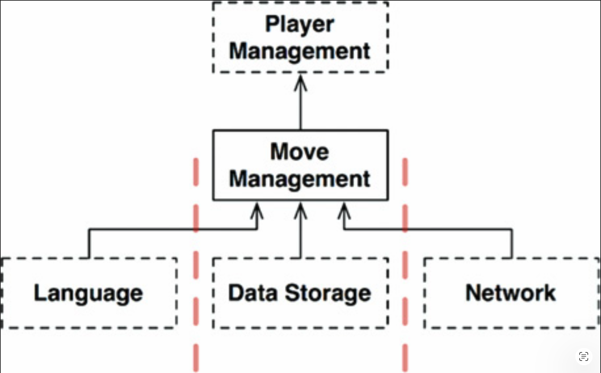
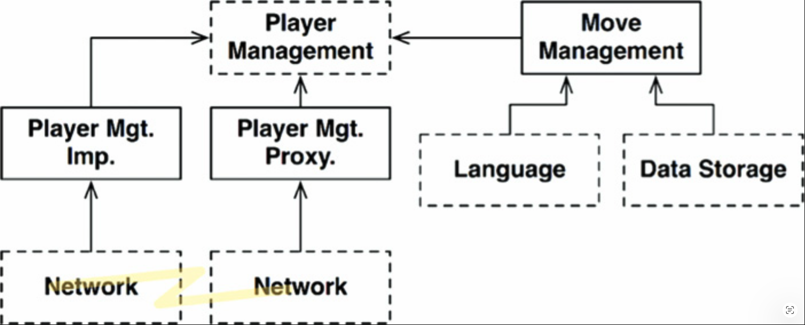

# 25 层与边界

---

 

人们很容易将系统想象为由三个组件组成：UI、业务规则和数据库。
对于某些简单的系统来说，这就足够了。
然而，对于大多数系统来说，组件的数量远不止这些。

例如，考虑一个简单的电脑游戏。
很容易想象这三个组件。
UI 处理来自玩家的所有消息到游戏规则。
游戏规则将游戏状态存储在某种持久数据结构中。
但就这些吗？

## Hunt the Wumpus

让我们给这些骨架添上血肉。
假设这个游戏是 1972 年那款古老的冒险游戏 Hunt the Wumpus。
这款基于文本的游戏使用非常简单的命令，如 `GO EAST` 和 `SHOOT WEST`。
玩家输入一条命令，计算机以玩家看到、闻到、听到和体验到的内容作为响应。
玩家在洞穴系统中猎杀一头 Wumpus，并必须避开陷阱、深坑和其他潜伏的危险。
如果你感兴趣，游戏的规则很容易在网上找到。

假设我们将保留基于文本的 UI，但将其与游戏规则解耦，以便我们的版本可以在不同市场使用不同的语言。
游戏规则将使用一种独立于语言的 API 与 UI 组件通信，而 UI 将把该 API 翻译成适当的人类语言。

如果源代码依赖关系得到恰当管理，如 [Fig 25.1](#fig-251) 所示，那么任意数量的 UI 组件都可以复用相同的游戏规则。
游戏规则不知道、也不关心正在使用哪种人类语言。

#### Fig 25.1
 
*Fig 25.1 任意数量的 UI 组件都可以复用游戏规则*

我们还假设游戏状态保存在某种持久存储上 —— 可能是在闪存中、可能在云端、或者只是在 RAM 中。
在任何一种情况下，我们都不希望游戏规则知道这些细节。
因此，我们再次创建一个游戏规则可以用来与数据存储组件通信的 API。

我们不希望游戏规则知道关于不同类型数据存储的任何信息，因此依赖关系必须按照依赖规则正确地指向，如 [Fig 25.2](#fig-252) 所示。

#### Fig 25.2
 
*Fig 25.2 遵循依赖规则*

## 整洁架构？

显然，我们可以轻松地在此上下文中应用整洁架构方法，[1](#1) 包括所有用例、边界、实体和相应的数据结构。
但我们真的找到了所有重要的架构边界吗？

例如，语言并不是 UI 的唯一变化轴。
我们可能还想改变我们传递文本的机制。
例如，我们可能想使用普通的 shell 窗口，或短信，或聊天应用程序。
存在许多不同的可能性。

这意味着由这个变化轴定义了一个潜在的架构边界。
也许我们应该构建一个跨越该边界的 API，将语言与通信机制隔离开；这个想法如 [Fig 25.3](#fig-253) 所示。

#### Fig 25.3
 
*Fig 25.3 修订后的图*

[Fig 25.3](#fig-253) 中的图变得有些复杂了，但应该不会让人意外。
虚线轮廓表示定义 API 的抽象组件，该 API 由其上方或下方的组件实现。
例如，`Language API` 由 `English` 和 `Spanish` 实现。

`GameRules` 通过一个由 `GameRules` 定义、由 `Language` 实现的 API 与 `Language` 通信。
`Language` 使用一个由 `Language` 定义、但由 `TextDelivery` 实现的 API 与 `TextDelivery` 通信。
<ins>API 由使用者定义和拥有，而不是由实现者定义和拥有</ins>。

如果我们查看 `GameRules` 内部，我们会发现多态边界接口，它们由 `GameRules` 内部的代码使用，并由 `Language` 组件内部的代码实现。
我们还会发现由 `Language` 使用的、并由 `GameRules` 内部代码实现的多态边界接口。

如果我们查看 `Language` 内部，我们会发现同样的情况：
由 `TextDelivery` 内部的代码实现的多态边界接口，以及由 `TextDelivery` 使用的、并由 `Language` 实现的多态边界接口。

在每种情况下，由这些边界接口定义的 API 都是由上游组件拥有的。

各种变体，如 `English`、`SMS` 和 `CloudData`，由在抽象 API 组件中定义、并由为其服务的具体组件实现的多态接口提供。
例如，我们期望在 `Language` 中定义的多态接口由 `English` 和 `Spanish` 实现。

我们可以通过消除所有变体并只关注 API 组件来简化此图。
[Fig 25.4](#fig-254) 展示了这个简化的图。

#### Fig 25.4
 
*Fig 25.4 简化图*

注意，[Fig 25.4](#fig-254) 中的方向是让所有箭头朝上。
这使得 `GameRules` 位于顶部。
这种方向是有道理的，因为 `GameRules` 是包含最高层策略的组件。

考虑信息流的方向。
所有输入都来自用户，通过左下角的 `TextDelivery` 组件进入。
该信息向上穿过 `Language` 组件，被翻译成发送给 `GameRules` 的命令。
`GameRules` 处理用户输入，并将适当的数据向下发送到右下角的 `DataStorage`。

然后 `GameRules` 将输出向下发送回 `Language`，`Language` 将 API 翻译回适当的语言，然后通过 `TextDelivery` 将该语言传递给用户。

这种组织方式有效地将数据流分为两条流。[3](#3) 
左侧的流关注与用户通信，右侧的流关注数据持久化。
两条流在顶部 [3](#3) 的 `GameRules` 处汇合，`GameRules` 是流经两条流的数据的最终处理器。

## 跨越数据流

是否总是像这个例子中有两条数据流？
不，完全不是。
想象一下，我们想在网络上与多个玩家一起玩 Hunt the Wumpus。
在这种情况下，我们需要一个网络组件，如 [Fig 25.5](#fig-255) 所示。
这种组织方式将数据流分为三条流，全部由 `GameRules` 控制。

#### Fig 25.5
 
*Fig 25.5 添加网络组件*

因此，随着系统变得越来越复杂，组件结构可能会分裂成许多这样的流。

## 分流

此时你可能会想，所有的流最终都在顶部的某个单一组件中汇合。
要是生活如此简单就好了！当然，现实要复杂得多。

考虑 Hunt the Wumpus 的 `GameRules` 组件。
一部分游戏规则处理地图的机制。
它们知道洞穴如何连接，以及每个洞穴中存放了哪些物品。
它们知道如何将玩家从一个洞穴移动到另一个洞穴，以及如何确定玩家必须处理的事件。

但还有另一组处于更高层次的策略 —— 这些策略知道玩家的健康状况，以及特定事件的代价或收益。
这些策略可能导致玩家逐渐失去健康，或通过发现食物来增加健康。
较低层次的机制策略会向这个更高层次的策略声明事件，例如 `FoundFood` 或 `FellInPit`。
然后更高层次的策略将管理玩家的状态（如 [Fig 25.6](#fig-256) 所示）。
最终该策略将决定玩家是赢是输。

#### Fig 25.6
 
*Fig 25.6 更高层次的策略管理玩家*

这是一个架构边界吗？
我们是否需要将 `MoveManagement` 与 `PlayerManagement` 分离开的 API？
好吧，让我们给这件事增加一点趣味，并添加微服务。

假设我们有一个大规模多人在线版本的 Hunt the Wumpus。
`MoveManagement` 在玩家本地计算机上处理，而 `PlayerManagement` 由服务器处理。
`PlayerManagement` 向所有连接的 `MoveManagement` 组件提供一个微服务 API。

[Fig 25.7](#fig-257) 以某种简化的方式描绘了这个场景。
`Network` 元素比图中描绘的要复杂一些 —— 但你很可能仍然能理解这个想法。
在这种情况下，`MoveManagement` 和 `PlayerManagement` 之间存在一个完整的架构边界。

#### Fig 25.7
 
*Fig 25.7 添加微服务 API*

## 结论

这一切意味着什么？
为什么我要拿这个荒谬的简单程序（可以用 200 行 Kornshell 实现）来外推所有这些疯狂的架构边界？

<ins>这个例子旨在表明架构边界无处不在。
作为架构师，我们必须小心地识别何时需要它们。
我们还必须意识到，这样的边界在完全实现时是昂贵的。
同时，我们必须认识到，当这样的边界被忽视时，之后添加它们的代价非常高昂 —— 即使存在全面的测试套件和重构纪律也是如此</ins>。

那么我们这些架构师该怎么办？
答案并不令人满意。
一方面，多年来一些非常聪明的人告诉我们，我们不应该预期对抽象的需求。
这是 YAGNI 的哲学：“You aren’t going to need it.” 。
这个信息有其智慧之处，因为过度工程往往比工程不足糟糕得多。
另一方面，当你发现你确实需要一个架构边界，但该边界不存在时，添加这样一个边界的成本和风险可能非常高。

所以，情况就是这样。<ins>哦，软件架构师，你必须预见未来。
你必须 ——明智地—— 猜测。
你必须权衡成本，确定架构边界位于何处，哪些应该完整实现，哪些应该部分实现，哪些应该被忽略</ins>。

但这不是一次性的决策。
<ins>你不能在项目开始时简单地决定实现哪些边界、忽略哪些边界。
相反，你要 *观察 (watch)* 。
你要随着系统的演变而保持关注。
你注意到哪里可能需要边界，然后仔细留意因为那些边界不存在而产生的第一个摩擦迹象</ins>。

<ins>到那时，你要权衡实现这些边界的成本与忽略它们的成本 —— 并且你要频繁地重新审视该决策。
你的目标是在实现成本低于忽略成本的那个拐点处，恰当地实现边界</ins>。

这需要一双警觉的眼睛。

---
#### 1
同样清楚的是，我们不会将整洁架构方法应用于像这个游戏这样琐碎的东西。
毕竟，整个程序可能只需 200 行或更少的代码即可编写。
在这种情况下，我们使用一个简单的程序作为具有重要架构边界的更大系统的代理。

#### 2
如果你对箭头的方向感到困惑，请记住它们指向源代码依赖的方向，而不是数据流的方向。

#### 3
在过去的日子里，我们会将那个顶层组件称为 “中央变换”。
参见 Practical Guide to Structured Systems Design 第二版，Meilir Page-Jones，1988 年。
