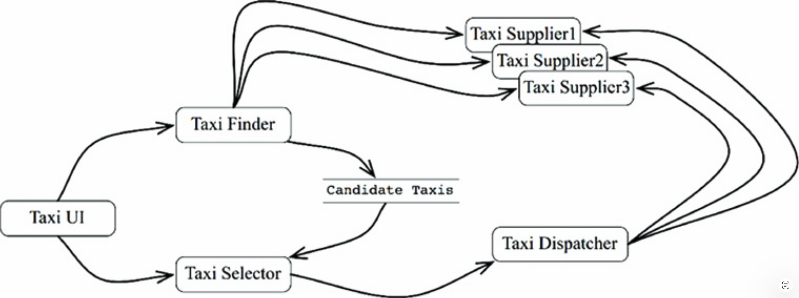
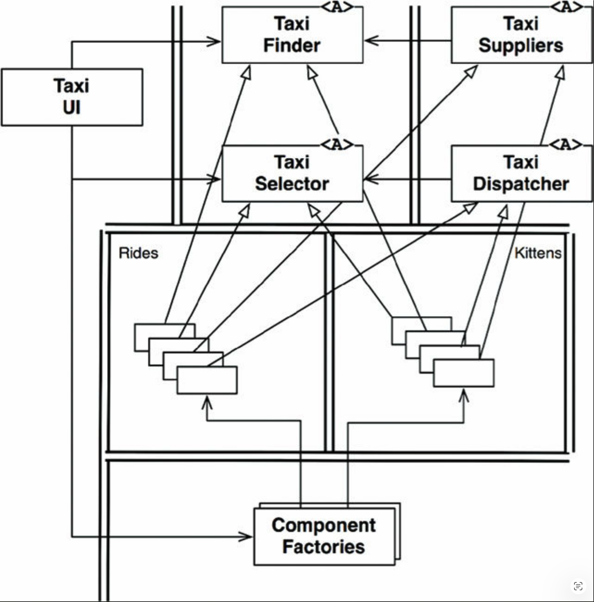
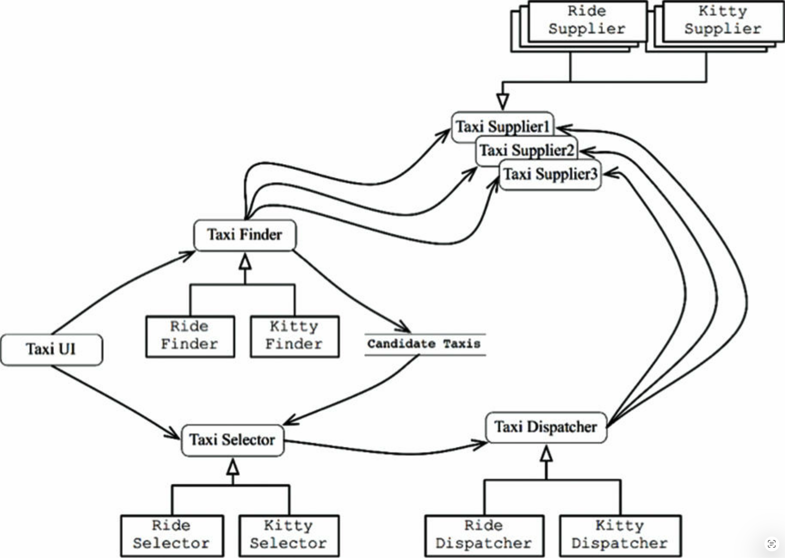
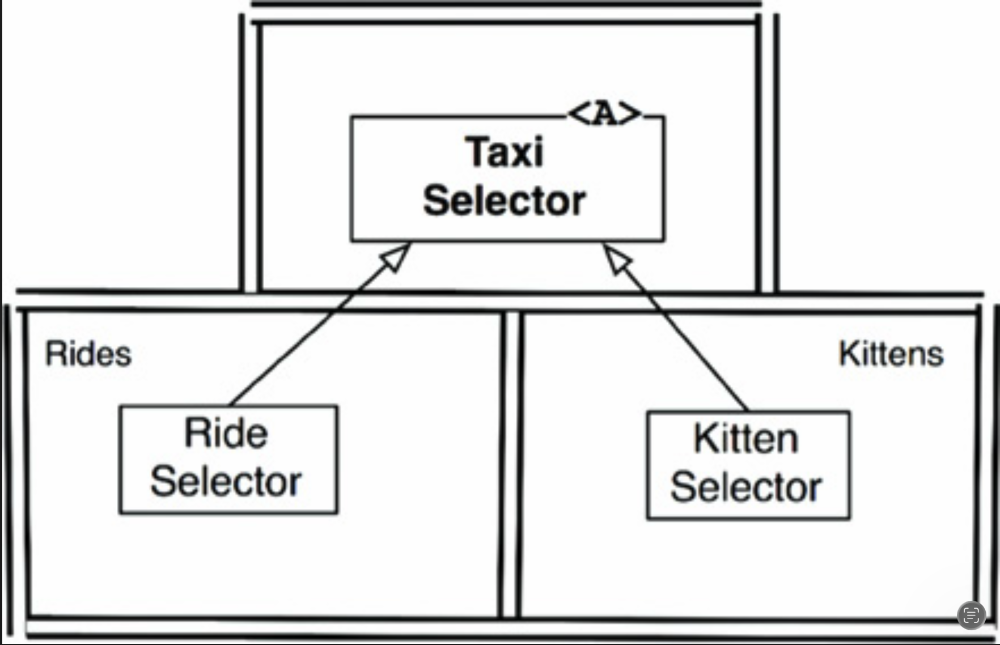

# 27 服务：大的与小的

---

 

面向服务的 “架构” 和微服务 “架构” 近年来变得非常流行。
它们之所以流行，原因包括：

- 服务之间似乎具有很强的解耦性。
正如我们将会看到的，这仅部分成立。

- 服务看起来支持独立开发和部署。
同样，正如我们将会看到的，这也仅部分成立。

## 服务架构？

首先，让我们考虑这样一种观点：使用服务本身，本质上就是一种架构。
这显然是不正确的。
系统的架构是由那些将高层策略与低层细节分离、并遵循依赖规则的边界所定义的。
<ins>那些仅仅分离了应用程序行为的服务，不过是一些昂贵的函数调用，并不一定具有架构上的重要性</ins>。

这并不是说所有服务都应该具有架构上的重要性。
在进程和平台之间创建服务以分离功能，通常能带来巨大的好处 —— 无论它们是否遵循依赖规则。
只是，服务本身并不定义架构。

一个有用的类比是函数的组织方式。
<ins>单体系统或基于组件的系统的架构，是由某些跨越架构边界并遵循依赖规则的函数调用所定义的。
然而，这些系统中的许多其他函数仅仅是将一个行为与另一个行为分离，并不具有架构上的重要性</ins>。

服务也是如此。
毕竟，服务只是跨进程和/或平台边界的函数调用。
其中一些服务具有架构上的重要性，另一些则没有。
在本章中，我们关注的是前者。

## 服务的好处？

前面标题中的问号表示，本节将挑战当前流行的服务架构正统观念。
让我们逐一审视这些好处。

### 解耦的谬误

将系统拆分为服务的一大所谓好处，是服务之间具有很强的解耦性。
毕竟，每个服务运行在不同的进程甚至不同的处理器中；
因此这些服务无法访问彼此的变量。
而且，每个服务的接口必须被良好地定义。

这其中确实有几分道理 —— 但并不多。
<ins>是的，服务在单个变量的层面上是解耦的。
然而，它们仍然可能通过同一处理器或网络中的共享资源而耦合在一起。
更重要的是，它们通过共享的数据而紧密耦合</ins>。

例如，如果在服务之间传递的数据记录中新增了一个字段，那么所有操作该新字段的服务都必须进行修改。
这些服务还必须就对该字段中数据的解释达成强烈的一致。
因此，这些服务与数据记录紧密耦合，进而彼此之间也间接耦合。

至于接口被良好定义这一点，这当然没错 —— 但对函数来说也同样如此。
服务接口并不比函数接口更形式化、更严谨或定义得更好。
显然，这种好处在某种程度上是一种错觉。

### 独立开发与部署的谬误

服务的另一个所谓好处是，它们可以由一个专门的团队拥有和运营。
该团队可以负责编写、维护和运营该服务，作为 dev-ops 策略的一部分。
这种独立开发和部署的能力被认为具有可扩展性。
人们认为，大型企业系统可以由数十、数百甚至数千个可独立开发和部署的服务构建而成。
系统的开发、维护和运营可以在相应数量的独立团队之间划分。

这种看法有几分道理 —— 但仅仅只有几分。
<ins>首先，历史表明，大型企业系统既可以从单体架构和基于组件的系统构建，也可以从基于服务的系统构建。
因此，服务并不是构建可扩展系统的唯一选择</ins>。

<ins>其次，解耦的谬误意味着服务并不总是可以独立开发、部署和运营。
只要它们通过数据或行为耦合在一起，开发、部署和运营就必须进行协调</ins>。

## 小猫问题

作为这两个谬误的示例，让我们再次看看我们的出租车聚合系统。
请记住，该系统了解某个给定城市中的许多出租车供应商，并允许客户叫车。
假设客户基于若干标准来选择出租车，例如接驾时间、费用、豪华程度和司机经验。

我们希望系统具有可扩展性，因此选择将其构建为许多小型微服务。
我们将开发人员细分为许多小型团队，每个团队负责开发、维护和运营相应数量的小型服务。[1](#1)

[Fig 27.1](#fig-271) 展示了我们虚构的架构师如何安排服务来实现此应用。
TaxiUI 服务处理使用移动设备叫车的客户。
TaxiFinder 服务检查各个 TaxiSupplier 的库存，确定哪些出租车可能是该用户的候选车辆。
它会将这些候选车辆存入与该用户关联的短期数据记录中。
TaxiSelector 服务根据用户关于费用、时间、豪华程度等标准，从候选车辆中选出一辆合适的出租车。
然后将该出租车交给 TaxiDispatcher 服务，该服务负责预订相应的出租车。

#### Fig 27.1
 
*Fig 27.1 为实现出租车聚合系统而安排的服务*

现在假设该系统已投入运行超过一年。
我们的开发团队一直在愉快地开发新功能，同时维护和运营所有这些服务。

在一个阳光明媚的日子，市场部门与开发团队召开了一次会议。
在会议上，他们宣布计划向该城市提供小猫配送服务。
用户可以订购小猫，将其送到家中或工作场所。

公司将在全市设立若干小猫收集点。
当收到小猫订单时，会选择一辆附近的出租车从一个收集点取走小猫，然后将其送到相应地址。

已有一家出租车供应商同意参与该计划。
其他供应商可能也会跟进。
还有一些供应商可能会拒绝参与。

当然，有些司机可能对猫过敏，因此这些司机永远不应被选为该服务派单。
同样，一些客户无疑也有类似的过敏，因此一辆在过去 3 天内被用于配送小猫的车辆，不应被选给那些声明有此类过敏的客户。

看看那张服务图。
要实现该功能，其中有多少服务需要修改？
*全部都要修改* 。
显然，小猫功能的开发和部署必须进行非常仔细的协调。

<ins>换句话说，这些服务都是耦合的，无法独立开发、部署和维护</ins>。

这就是横切关注点的问题。
每个软件系统都必须面对这个问题，无论是否面向服务。
如 [Fig 27.1](#fig-271) 中服务图所示的那种功能分解，非常容易受到横跨所有这些功能行为的新功能的影响。

## 对象来救场

在基于组件的架构中，我们本该如何解决这个问题呢？
仔细考虑 SOLID 设计原则会促使我们创建一组类，这些类可以通过多态扩展来处理新功能。

[Fig 27.2](#fig-272) 展示了该策略。
该图中的类大致对应于 [Fig 27.1](#fig-271) 中展示的服务。
但是，请注意其中的边界。
还要注意，依赖关系遵循依赖规则。

原始服务的大部分逻辑保留在对象模型的基类中。
然而，那些特定于出行的那部分逻辑已被提取到 Rides 组件中。
针对小猫的新功能被放入 Kittens 组件中。
这两个组件通过模板方法或策略等模式，覆盖了原始组件中的抽象基类。

再次注意，两个新组件 Rides 和 Kittens 遵循了依赖规则。
还要注意，实现这些功能的类由 UI 控制下的工厂创建。

显然，在此方案中，当 Kitty 功能实现时，TaxiUI 必须变更。
但其他任何部分都不需要修改。
而是将一个新的 jar 文件、Gem 或 DLL 添加到系统中，并在运行时动态加载。

因此 Kitty 功能是解耦的，并且可以独立开发和部署。

#### Fig 27.2
 
*Fig 27.2 使用面向对象方法处理横切关注点*

## 基于组件的服务

显而易见的问题是：我们能否为服务这样做？
答案是，当然可以！
服务不必是小单体。
相反，服务可以使用 SOLID 原则进行设计，并赋予其组件结构，以便在不更改服务内现有组件的情况下，向其中添加新组件。

可以把 Java 中的服务看作是一个或多个 jar 文件中的一组抽象类。
把每个新功能或功能扩展看作是另一个 jar 文件，其中包含扩展了第一批 jar 文件中抽象类的类。
部署新功能于是不再是重新部署服务的问题，而仅仅是将新 jar 文件添加到这些服务的加载路径中。
换句话说，添加新功能符合开闭原则。

[Fig 27.3](#fig-273) 中的服务图展示了该结构。
服务仍然像以前一样存在，但每个服务都有其内部的组件设计，允许将新功能作为新的派生类添加。
这些派生类位于它们自己的组件中。

#### Fig 27.3
 
*Fig 27.3 每个服务都有自己的内部组件设计，使得新功能可以作为新的派生类添加。*

## 横切关注点

<ins>我们学到的教训是：架构边界并不位于服务之间。
相反，这些边界贯穿服务内部，将其划分为组件</ins>。

为了应对所有重要系统都面临的横切关注点，服务必须以遵循依赖规则的内部组件架构进行设计，如 [Fig 27.4](#fig-274) 所示。
<ins>这些服务并不定义系统的架构边界；
相反，是服务内部的组件定义了这些边界</ins>。

#### Fig 27.4
 
*Fig 27.4 服务必须以遵循依赖规则的内部组件架构进行设计*

## 结论

<ins>尽管服务对于系统的可扩展性和可开发性很有用，但它们本身并不是具有架构意义的重要元素。
系统的架构是由系统内部所绘制的边界以及跨越这些边界的依赖关系所定义的。
该架构不是由元素通信和执行的物理机制来定义的</ins>。

一个服务可能是一个单独的组件，完全被一个架构边界所包围。
或者，一个服务可能由多个被架构边界分隔的组件组成。
在极少数情况下，客户端和服务之间可能会耦合得如此紧密，以至于完全没有任何架构意义。

---

#### 1
因此，微服务的数量将大致等于程序员的数量。

#### 2
我们希望它们很少见。
不幸的是，经验表明事实并非如此。
