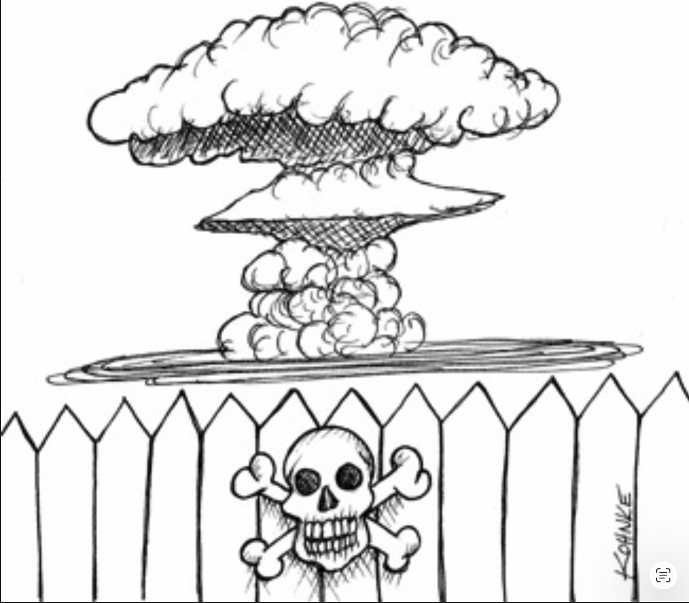

# 28 测试边界

---

 

是的，没错：测试是系统的一部分，它们像系统中的其他所有部分一样参与到架构中。
在某些方面，这种参与相当普通；在另一些方面，则可能相当独特。

## 测试作为系统组件

关于测试存在很大的困惑。
它们是系统的一部分吗？
它们与系统是分开的吗？
有哪几种类型的测试？
单元测试和集成测试是不同的东西吗？
验收测试、功能测试、Cucumber 测试、TDD 测试、BDD 测试、组件测试等等呢？

本书的角色并不是要卷入那场特定的争论，而且幸运的是这也没有必要。
从架构的角度来看，所有测试都是一样的。
无论是 TDD 创建的那些很小的测试，还是大型的 FitNesse、Cucumber、SpecFlow 或 JBehave 测试，它们在架构上是等价的。

<ins>测试，按其本质，遵循依赖规则；它们非常详细且具体；并且它们总是向内依赖于被测试的代码。
事实上，你可以把测试看作是架构中最外层的圆环。
系统内部没有任何东西依赖于测试，而测试总是向内依赖于系统的各个组件</ins>。

测试也是可独立部署的。
事实上，大多数时候它们被部署在测试系统中，而不是生产系统中。
因此，即使在那些原本不需要独立部署的系统中，测试也仍然会被独立部署。

测试是最孤立无援的系统组件。
它们对系统运行来说不是必需的。
没有用户依赖于它们。
它们的作用是支持开发，而非运行。
然而，它们和其他任何组件一样，都是系统组件的一部分。
事实上，在许多方面，它们代表了所有其他系统组件应该遵循的模型。

## 为可测试性而设计

测试的极端孤立性，加上它们通常不被部署的事实，常常导致开发人员认为测试在系统设计之外。
这是一种灾难性的观点。
<ins>没有很好地集成到系统设计中的测试往往是脆弱的，并且它们会使系统变得僵化且难以更改</ins>。

<ins>问题当然是耦合。
与系统紧密耦合的测试必须随系统一起变化</ins>。
即使是对系统组件进行最微不足道的更改，也可能导致许多耦合的测试失败或需要进行修改。

这种情况可能变得严重。
<ins>对常见系统组件的更改可能导致数百甚至数千个测试失败。
这就是所谓的脆弱测试问题</ins>。

不难看出这是如何发生的。
例如，设想一组使用 GUI 来验证业务规则的测试。
这类测试可能从登录屏幕开始，然后浏览页面结构，直到它们能够检查特定的业务规则。
对登录页面或导航结构的任何更改，都可能导致大量测试失败。

脆弱的测试常常会产生使系统变得僵化的反常效果。
当开发人员意识到对系统的简单更改可能导致大量测试失败时，他们可能会抵制进行这些更改。
例如，想象一下开发团队与市场团队之间的对话，市场团队要求对页面导航结构进行一项简单的更改，而这将导致 1000 个测试失败。

<ins>解决方案是为可测试性设计。
软件设计的第一条规则 ——无论是为了可测试性还是任何其他原因—— 始终是相同的： *不要依赖于易变的东西* </ins>。
GUI 是易变的。
通过 GUI 来操作系统的测试套件必然是脆弱的。
<ins>因此，要设计系统和测试，使得业务规则可以在不借助 GUI 的情况下被测试</ins>。

## 测试 API

<ins>实现这一目标的方法是创建一个特定的 API，供测试用于验证所有业务规则</ins>。
该 API 应具有超级能力，允许测试绕过安全约束、绕过昂贵的资源（如数据库），并将系统强制进入特定的可测试状态。
该 API 将是用户界面所使用的 `interactors` 套件和 `interface adapters` 套件的一个超集。

测试 API 的目的是将测试与应用程序解耦。
这种解耦不仅仅是把测试与 UI 分离；目标是解耦测试的结构与应用程序的结构。
*「测试 API 光讲了原则，没讲实践啊！」*

### 结构耦合

结构耦合是测试耦合中最强、也最隐蔽的形式之一。
设想一个测试套件，其中每个生产类都有一个对应的测试类，每个生产方法都有一组对应的测试方法。
这样的测试套件与应用程序的结构紧密耦合。

当这些生产方法或类中的某一个发生更改时，大量的测试也必须随之更改。
因此，测试是脆弱的，并且它们使生产代码变得僵化。

<ins>测试 API 的作用是向测试隐藏应用程序的结构。
这使得生产代码可以以不影响测试的方式进行重构和演进。
同时也使得测试可以以不影响生产代码的方式进行重构和演进</ins>。

这种演进的分离是必要的，因为随着时间的推移，测试往往会变得越来越具体和明确。
相比之下，生产代码往往会变得越来越抽象和通用。
强大的结构耦合会阻止 ——或至少阻碍—— 这种必要的演进，并阻止生产代码达到其本可以达到的通用性和灵活性。

### 安全

<ins>如果测试 API 的超级能力被部署到生产系统中，可能会带来危险</ins>。
如果存在这种担忧，那么测试 API 及其实现中的危险部分应该被保存在一个独立的、可独立部署的组件中。

## 结论

<ins>测试并不在系统之外；相反，它们是系统的一部分，如果想要提供稳定性和回归测试所带来的预期收益，就必须对其进行良好的设计。
那些没有被作为系统的一部分来设计的测试，往往会变得脆弱且难以维护</ins>。
这类测试最终常常会被丢在维护室的角落里 —— 因为太难维护而被丢弃。
