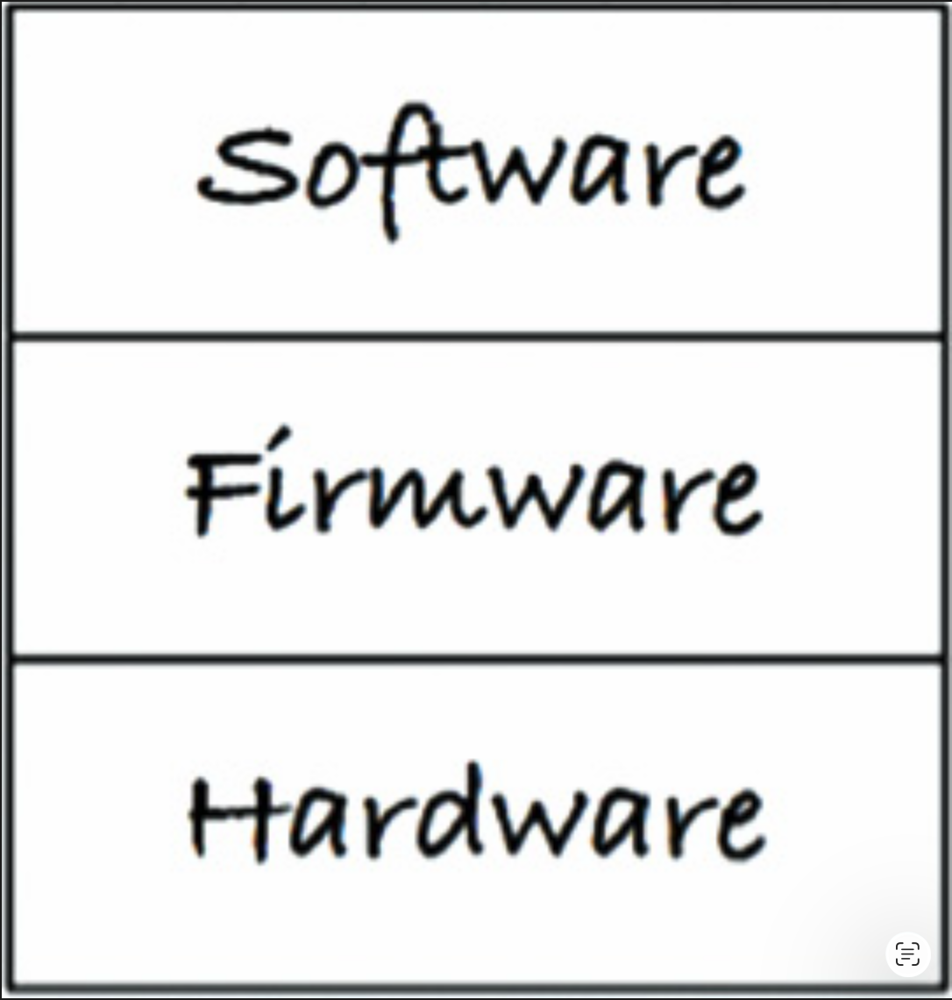
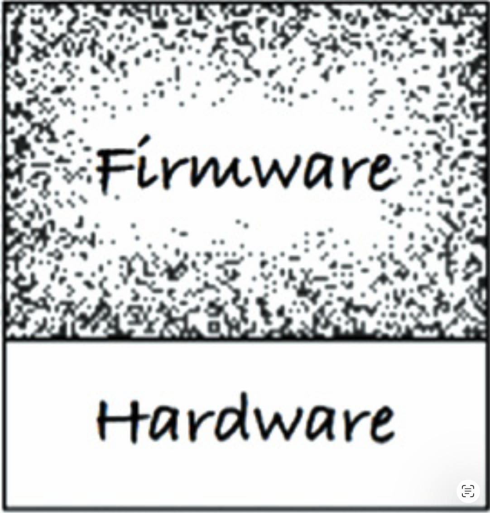
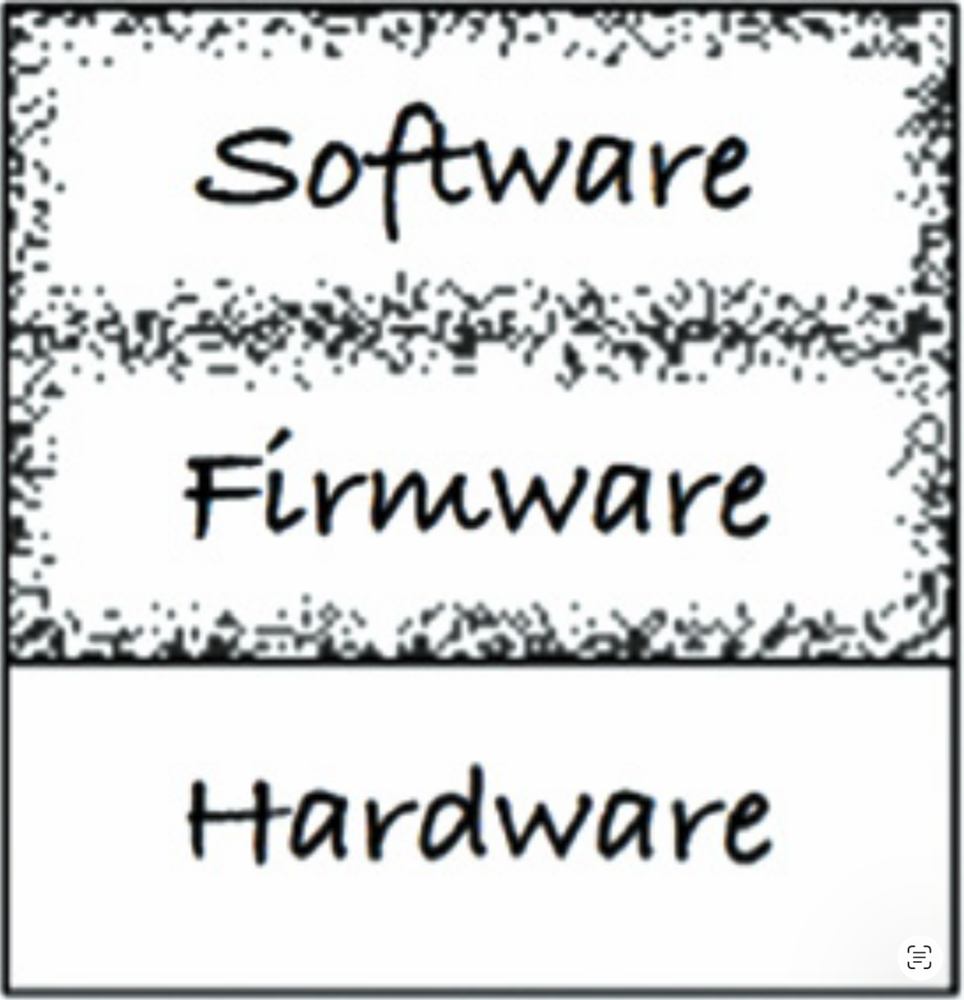
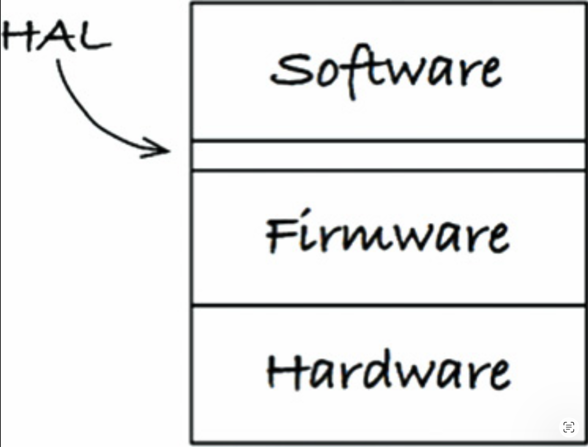
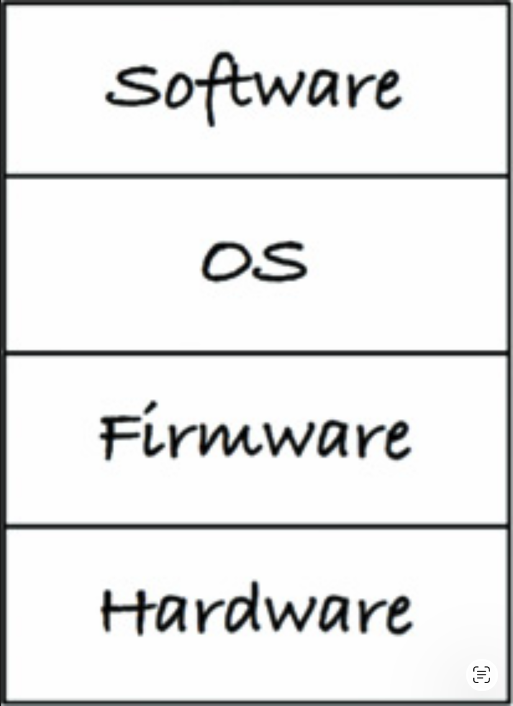
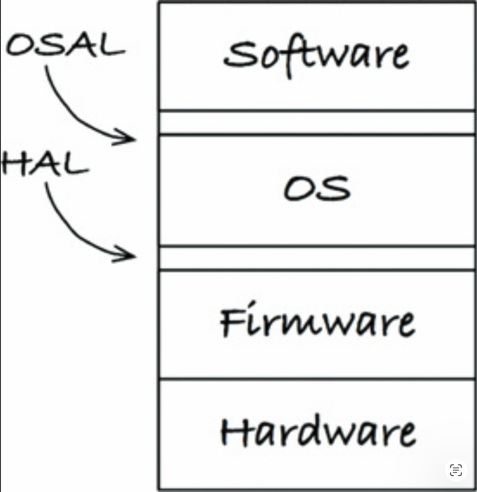

# 29 整洁嵌入式架构

作者：James Grenning

---
<center></center><br/>

不久前，我在 Doug Schmidt 的博客上读到一篇文章，题为《为美国国防部维护软件的重要性日益增长》 <sup>[1](#1)</sup> 。
Doug 提出了以下主张：

> “虽然软件不会磨损，但固件和硬件会过时，从而需要修改软件。”

这对我来说是一个澄清性的时刻。
Doug 提到了两个我以为显而易见 —— 但也许并非如此的术语。
软件是可以拥有较长使用寿命的东西，但 *固件 (firmware)* 会随着硬件的发展而变得过时。
如果你在嵌入式系统开发中投入过任何时间，你就会知道硬件在不断地演进和改进。
与此同时，新功能被添加到新的 “软件” 中，其复杂性也在不断地增长。

我想在 Doug 的陈述基础上补充一点：

> 虽然软件不会磨损，但它可能由于对固件和硬件无管理的依赖而从内部被破坏。

嵌入式软件因被硬件依赖所感染而被剥夺潜在的长寿命，这种情况并不少见。

我喜欢 Doug 对固件的定义，但让我们看看还有哪些其他定义
。我找到了这些替代定义：

- “固件保存在非易失性存储设备中，如 ROM、EPROM 或闪存。”（ https://en.wikipedia.org/wiki/Firmware ）
- “固件是在硬件设备上编程的软件程序或指令集。”（ https://techterms.com/definition/firmware ）
- “固件是嵌入在硬件中的软件。”（ https://www.lifewire.com/what-is-firmware-2625881 ）
- 固件是 “写入只读存储器（ROM）的软件（程序或数据）。”（ http://www.webopedia.com/TERM/F/firmware.html ）

<ins>Doug 的陈述让我意识到，这些对固件的公认定义是错误的，或者至少是过时的</ins>。
固件并不意味着代码驻留在 ROM 中。
它之所以是固件，不是因为存储在哪里，而是因为它依赖于什么，以及随着硬件的发展它有多难以改变。
硬件确实在演进（停下来看看你的手机就能证明这一点），因此我们应该在构建嵌入式代码时考虑到这一现实。

我并不反对固件，也不反对固件工程师（我自己也曾写过一些固件）。
但我们真正需要的是更少的固件和更多的软件。
实际上，让我失望的是固件工程师写了太多的固件！

非嵌入式工程师也在写固件！
当你们将 SQL 埋藏在代码中，或者将平台依赖散布在整个代码中时，你们这些非嵌入式开发者实质上就是在写固件。
Android 应用开发者在不将业务逻辑与 Android API 分离时，也在写固件。

我曾参与过许多项目，在这些项目中，产品代码（软件）与产品硬件交互代码（固件）之间的界限模糊到了不存在的程度。
例如，在 1990 年代末，我有幸帮助重新设计一个通信子系统，该系统正在从时分复用（TDM）过渡到 IP 语音（VOIP）。
VOIP 是现在的主流做法，但 TDM 在 1950 和 1960 年代被认为是尖端技术，并在 1980 和 1990 年代被广泛部署。

每当我们向系统工程师询问呼叫在某种特定情况下应如何反应时，他就会消失一会儿，然后带着非常详细的答案回来。
“他从哪里得到那个答案？” 我们问。
“从当前产品的代码中，” 他回答。
那些杂乱无章的遗留代码就是新产品的规格说明！
现有的实现在 TDM 和呼叫的业务逻辑之间没有分离。
整个产品从上到下都依赖于硬件/技术，无法解开。
整个产品实质上已经变成了固件。

再考虑另一个例子：命令消息通过串行端口到达该系统。
毫不意外，有一个消息处理器/分发器。
消息处理器知道消息的格式，能够解析它们，然后将消息分发给可以处理请求的代码。
这些都不令人意外，除了消息处理器/分发器与操作 UART <sup>[2](#2)</sup> 硬件的代码位于同一个文件中。
消息处理器被 UART 的细节污染了。
消息处理器本可以是具有潜在长寿命的软件，但相反它却成了固件。
消息处理器被剥夺了成为软件的机会 —— 这实在是不应该！

我早已知道并理解将软件与硬件分离的必要性，但 Doug 的话阐明了如何将软件和固件这两个术语关联起来使用。

对于工程师和程序员来说，信息很明确：<ins>停止编写那么多的固件，给你的代码一个拥有长寿命的机会</ins>。
当然，光靠要求是做不到的。
<ins>让我们来看看如何保持嵌入式软件架构的整洁，让软件有机会拥有长久而有用的生命</ins>。

## 应用能力测试

<ins>为什么有如此多的潜在嵌入式软件变成了固件？
似乎大部分的精力都放在让嵌入式代码能够运行上，而没有太多精力放在为其长期有效生命周期而构建结构上</ins>。
<ins>Kent Beck 描述了构建软件时的三种活动（引号内是 Kent 的原话，斜体部分是我的注释）</ins>：

1. <ins>“首先让它能工作。”  *如果它不能工作，你就没戏了* </ins>。
2. <ins>“然后让它正确。”  *重构代码，以便你和他人能够理解它，并随着需求的变化或更深入的理解而演进它* </ins>。
3. <ins>“然后让它快。”  *为了 “所需的” 性能而重构代码* </ins>。

我在实际中看到的许多嵌入式系统软件，似乎都是以 "让它能工作" 为出发点编写的 —— 也许还带有对 "让它快" 目标的痴迷，通过抓住每一个机会添加微优化来实现。
在《人月神话》中，Fred Brooks 建议我们 "计划扔掉一个"。
Kent 和 Fred 实际上给出了相同的建议：先学会什么是能用的，然后做出更好的解决方案。

面对这些问题时，嵌入式软件并不特殊。
大多数非嵌入式应用程序的构建也只是为了能工作，很少考虑使代码适合长期使用。

<ins>让应用程序能够工作，就是我所说的程序员的 “应用能力测试 (App-titude test)”</ins> 。
无论是否是嵌入式程序员，如果只关心让他们的应用程序能够工作，那都是在损害他们的产品和雇主。
编程远不止是让应用程序能工作。

作为通过 "应用能力测试" 时产生代码的一个例子，请看下面这些位于一个小型嵌入式系统某个文件中的函数：

```c
ISR(TIMER1_vect) { ... }
ISR(INT2_vect) { ... }
void btn_Handler(void) { ... }
float calc_RPM(void) { ... }
static char Read_RawData(void) { ... }
void Do_Average(void) { ... }
void Get_Next_Measurement(void) { ... }
void Zero_Sensor_1(void) { ... }
void Zero_Sensor_2(void) { ... }
void Dev_Control(char Activation) { ... }
char Load_FLASH_Setup(void) { ... }
void Save_FLASH_Setup(void) { ... }
void Store_DataSet(void) { ... }
float bytes2float(char bytes[4]) { ... }
void Recall_DataSet(void) { ... }
void Sensor_init(void) { ... }
void uC_Sleep(void) { ... }
```

这份函数列表是按照我在源文件中找到它们的顺序排列的。
现在我将它们分开，并按关注点分组：

- 具有领域逻辑的函数

```c
float calc_RPM(void) { ... }
void Do_Average(void) { ... }
void Get_Next_Measurement(void) { ... }
void Zero_Sensor_1(void) { ... }
void Zero_Sensor_2(void) { ... }
```

- 用于设置硬件平台的函数

```c
ISR(TIMER1_vect) { ... }*
ISR(INT2_vect) { ... }
void uC_Sleep(void) { ... }
Functions that react to the on off button press
void btn_Handler(void) { ... }
void Dev_Control(char Activation) { ... }
A Function that can get A/D input readings from the hardware
static char Read_RawData(void) { ... }
```

- 用于将值存储到持久化存储中的函数

```c
char Load_FLASH_Setup(void) { ... }
void Save_FLASH_Setup(void) { ... }
void Store_DataSet(void) { ... }
float bytes2float(char bytes[4]) { ... }
void Recall_DataSet(void) { ... }
```

- 做了与其名称含义不符的事情的函数

```c
void Sensor_init(void) { ... }
```

查看此应用程序中的其他一些文件，我发现了许多妨碍理解代码的障碍。
我还发现了一种文件结构，它暗示测试这些代码的唯一方法是在嵌入式目标设备上进行。
几乎每一段代码都知道自己处于一种特殊的微处理器架构中，使用了将代码绑定到特定工具链和微处理器的 “扩展” C 语言结构 <sup>[3](#3)</sup>。
除非产品永远不需要移植到不同的硬件环境，否则这段代码不可能拥有长寿命。

这个应用程序是能工作的：工程师通过了 “应用能力测试”。
但这个应用并不能说拥有整洁的嵌入式架构。

## 目标硬件瓶颈

嵌入式开发者必须处理许多非嵌入式开发者不需要处理的特有问题 —— 例如，有限的内存空间、实时约束和截止期限、有限的 IO、非常规的用户界面，以及传感器和与现实世界的连接。
大多数情况下，硬件是与软件和固件同时开发的。
作为为此类系统开发代码的工程师，你可能无处运行代码。
如果这还不够糟糕的话，一旦你拿到硬件，硬件本身很可能也有缺陷，使得软件开发进展比平时更加缓慢。

是的，嵌入式是特殊的。
嵌入式工程师是特殊的。
但嵌入式开发并没有特殊到本书中的原则不适用于嵌入式系统。

<ins>嵌入式的一个特殊问题是 *目标硬件瓶颈 (target-hardware bottleneck)* 。
当嵌入式代码在结构上未应用整洁架构的原则和实践时，你经常会面临只能在目标设备上测试代码的情况。
如果目标设备是唯一可以进行测试的地方，那么目标硬件瓶颈就会拖慢你的速度</ins>。

### 整洁嵌入式架构是可测试的嵌入式架构

让我们看看如何将一些架构原则应用于嵌入式软件和固件，以帮助你消除目标硬件瓶颈。

**分层**

分层有多种形式。
让我们从三个层开始，如 [Fig 29.1](#fig-291) 所示。
在最底部是硬件。
正如 Doug 所警告的，由于技术进步和摩尔定律，硬件会发生改变。
部件会过时，新部件功耗更低、性能更好或价格更便宜。
无论原因是什么，作为一名嵌入式工程师，当不可避免的硬件变更最终发生时，我不希望自己的工作量变的更多。

#### Fig 29.1
<br/>
*Fig 29.1 三个层*

硬件与系统其余部分之间的分离是理所当然的 —— 至少在硬件被定义之后是这样（ [Fig 29.2](#fig-292) ）。
当你在试图通过 “应用能力测试” 时，问题往往就从此处开始。
没有什么能阻止硬件知识污染所有代码。
如果你不谨慎地安排代码放置的位置，以及一个模块可以了解另一个模块的什么内容，那么代码将会非常难以更改。
我指的不只是硬件变更的时候，还包括用户要求变更时，或者需要修复 bug 时。

#### Fig 29.2
<br/>
*Fig 29.2 硬件必须与系统其余部分分离*

<ins>软件与固件混杂是一种反模式。
表现出这种反模式的代码将抵制变更</ins>。
此外，变更将是危险的，常常导致意想不到的后果。
微小的更改也需要对整个系统进行完整的回归测试。
如果你没有创建外部仪器化的测试，那么你很可能会对手工测试感到厌倦 —— 然后你就可以期待新的 bug 报告了。

**硬件是细节**

软件与固件之间的界限通常不像代码与硬件之间的界限那样定义明确，如 [Fig 29.3](#fig-293) 所示。

#### Fig 29.3
<br/>
*Fig 29.3 软件与固件之间的界限比代码与硬件之间的界限要模糊一些*

<ins>作为一名嵌入式软件开发人员，你的工作之一就是明确那条界限。
软件与固件之间的边界名称叫做硬件抽象层（hardware abstraction layer, HAL）（ [Fig 29.4](#fig-294) ）</ins>。
这不是一个新想法：早在 Windows 出现之前，它就已经存在于 PC 中了。

#### Fig 29.4
<br/>
*Fig 29.4 硬件抽象层*

<ins>HAL 为位于其之上的软件而存在，其 API 应针对该软件的需求进行定制</ins>。
例如，固件可以将字节和字节数组存入闪存中。
相比之下，应用程序需要将名称/值对存储到某种持久化机制中并进行读取。
软件不应该关心这些名称/值对是存储在闪存、旋转磁盘、云端还是磁芯存储器中。
HAL 提供服务，并且不向软件透露它是如何做到的。
闪存实现是一个应该对软件隐藏的细节。

再举一个例子，一个 LED 连接到一个 GPIO 位。
固件可能提供对 GPIO 位的访问，而 HAL 可能提供 `Led_TurnOn(5)`。
这是一个相当低层次的硬件抽象层。
<ins>让我们考虑将抽象层次从硬件视角提升到软件/产品视角</ins>。
这个 LED 指示什么？
假设它指示电池电量不足。
在某些层次上，固件（或板级支持包）可以提供 `Led_TurnOn(5)`，而 HAL 则提供 `Indicate_LowBattery()`。
<ins>你可以看到 HAL 表达的是应用程序所需的服务。
你也可以看到层中可以包含层。
这更像是一种重复出现的分形模式，而不是一组有限的预定义层次</ins>。
GPIO 分配是应该对软件隐藏的细节。

### 不要向 HAL 的使用者暴露硬件细节

<ins>整洁嵌入式架构的软件可以在脱离目标硬件的情况下进行测试。
一个成功的 HAL 提供了那个接缝或一组替换点，从而方便了脱离目标的测试</ins>。

**处理器是细节**

当你的嵌入式应用使用专用的工具链时，它通常会提供头文件来 \<i>帮助你\</i>。<sup>[4](#4)</sup>
这些编译器常常对 C 语言随意扩展，添加新的关键字来访问其处理器特性。
代码看起来像 C，但已不再是 C。

有时，供应商提供的 C 编译器会提供一些看起来像全局变量的东西，以便直接访问处理器寄存器、IO 端口、时钟定时器、IO 位、中断控制器和其他处理器功能。
能够轻松访问这些东西是有帮助的，但要知道，任何使用了这些便利设施的代码都不再是 C 语言了。
它无法为另一个处理器编译，甚至可能无法为同一处理器的另一个编译器编译。

我不愿认为芯片和工具供应商是出于恶意，将你的产品绑定到编译器上。
让我们假定供应商是真心想要提供帮助，先给予信任。
但现在你该如何使用这种帮助，使之不会在未来造成伤害，就取决于你了。
你必须限制哪些文件被允许了解这些 C 扩展。

让我们来看看这个为 ACME 系列 DSP 设计的头文件 —— 你知道的，就是 Wile E. Coyote 用的那种：

```c
#ifndef _ACME_STD_TYPES
#define _ACME_STD_TYPES

#if defined(_ACME_X42)
    typedef unsigned int        Uint_32;
    typedef unsigned short      Uint_16;
    typedef unsigned char       Uint_8;
 
    typedef int                 Int_32;
    typedef short               Int_16;
    typedef char                Int_8;
 
#elif defined(_ACME_A42)
    typedef unsigned long       Uint_32;
    typedef unsigned int        Uint_16;
    typedef unsigned char       Uint_8;
 
    typedef long                Int_32;
    typedef int                 Int_16;
    typedef char                Int_8;
#else
    #error <acmetypes.h> is not supported for this environment
#endif
 
#endif
```

`acmetypes.h` 头文件不应该被直接使用。
如果这样做了，你的代码就会被绑定到某款 ACME DSP 上。
你会说，你正在使用 ACME DSP，那又有什么害处呢？
不包含这个头文件，你的代码就无法编译。
如果你使用了这个头文件并定义了 `_ACME_X42` 或 `_ACME_A42`，那么当你试图在脱离目标的环境下测试代码时，你的整数大小就会出错。
如果这还不够糟糕的话，有一天你会想把你的应用移植到另一个处理器上，
而由于你没有选择可移植性，也没有限制哪些文件了解 ACME，你将会使这项任务变得更加困难。

与其使用 `acmetypes.h`，你应该尝试遵循更标准化的路径，使用 `stdint.h`。
但如果目标编译器不提供 `stdint.h` 呢？
你可以自己编写这个头文件。
针对目标编译时，你为目标构建编写的 `stdint.h`，使用 `acmetypes.h`，就像这样：

```c
#ifndef _STDINT_H_
#define _STDINT_H_
 
#include <acmetypes.h>
 
typedef Uint_32 uint32_t;
typedef Uint_16 uint16_t;
typedef Uint_8  uint8_t;
 
typedef Int_32  int32_t;
typedef Int_16  int16_t;
typedef Int_8   int8_t;
 
#endif
```

<ins>让你的嵌入式软件和固件使用 `stdint.h` 有助于保持代码整洁和可移植。
当然，所有的软件都应该是处理器无关的，但并非所有固件都能如此</ins>。
接下来的这段代码利用了 C 语言的特殊扩展，让你的代码能够访问微控制器中的外设。
你的产品很可能使用了这款微控制器，以便利用其集成的外设。
该函数向串行输出端口输出一行 “hi” 的字符串。（此示例基于实际代码修改而来。）

```c
void say_hi()
{

  IE = 0b11000000;
  SBUF0 = (0x68);
  while(TI_0 == 0);
  TI_0 = 0;
  SBUF0 = (0x69);
  while(TI_0 == 0);
  TI_0 = 0;
  SBUF0 = (0x0a);
  while(TI_0 == 0);
  TI_0 = 0;
  SBUF0 = (0x0d);
  while(TI_0 == 0);
  TI_0 = 0;
  IE = 0b11010000;
}
```

这个简短函数存在许多问题。
其中一个可能让你注意的是 `0b11000000` 的出现。
这种二进制表示法很酷；C 语言能做到吗？
很遗憾，不能。
另外一些问题与此代码直接使用自定义 C 扩展有关的：

`IE`：中断使能位。

`SBUF0`：串行输出缓冲区。

`TI_0`：串行发送缓冲区空中断。
读取到 1 表示缓冲区为空。

这些大写变量实际上是在访问微控制器内置的外设。
如果你想控制中断和输出字符，就必须使用这些外设。
是的，这很方便 —— 但它不是 C 语言。

<ins>一个整洁的嵌入式架构会在极少的地方直接使用这些设备访问寄存器，并将它们完全限制在固件中。
任何知道这些寄存器的代码都变成了固件，因而被绑定到芯片上</ins>。
当你希望在稳定硬件之前，让代码运行起来时，将代码绑定到处理器会对你造成伤害。
当你将嵌入式应用移植到新的处理器时，它同样会对你造成伤害。

<ins>如果使用这样的微控制器，你的固件可以通过某种形式的处理器抽象层（processor abstraction layer, PAL）来隔离这些底层功能。
位于 PAL 之上的固件可以在脱离目标的环境下进行测试，从而使其 “固” 化程度降低一些</ins>。

**操作系统是细节**

HAL 是必要的，但它足够吗？
在裸机嵌入式系统中，一个 HAL 可能就足以防止你的代码过度依赖操作环境。
但对于那些使用实时操作系统（RTOS）或某种嵌入式 Linux 或 Windows 版本的嵌入式系统呢？

<ins>为了使嵌入式代码有良好的机会获得长寿命，你必须将操作系统视为一个细节，并防范对操作系统的依赖</ins>。

软件通过操作系统访问操作环境的服务。
操作系统是一个将软件与固件分离的层（ [Fig 29.5](#fig-295) ）。
直接使用操作系统可能会引发问题。
例如，如果你的 RTOS 供应商被另一家公司收购，导致授权费用上涨，或质量下降，怎么办？
如果你的需求发生变化，而你的 RTOS 不再具备你所需的能力，怎么办？
你将不得不修改大量代码。
这些不仅仅是因新操作系统 API 不同而导致的简单语法变更，还可能必须在语义上适应新操作系统不同的能力和原语。

#### Fig 29.5
<br/>
*Fig 29.5 加入操作系统*

<ins>整洁的嵌入式架构通过 *操作系统抽象层（operating system abstraction layer, OSAL）* 将软件与操作系统隔离开来（ [Fig 29.6](#fig-295) ）。
在某些情况下，实现这一层可能简单到只是更改一个函数的名称。在其他情况下，则可能需要将多个函数封装在一起</ins>。

#### Fig 29.6
<br/>
*Fig 29.6 操作系统抽象层*

如果你曾经将软件从一个 RTOS 移植到另一个，你就会知道这很痛苦。
如果你的软件依赖于 OSAL 而不是直接依赖于操作系统，那么你主要的工作将是编写一个新的、与旧 OSAL 兼容的 OSAL。
你更愿意做哪一个：修改一堆复杂的现有代码，还是按照定义的接口和行为编写新代码？
这不是一个陷阱题。
我选择后者。

你现在可能会开始担心代码膨胀的问题。
但实际上，这个层反而成为了隔离使用操作系统时产生的许多重复代码的地方。
这种重复并不一定带来很大的开销。
如果你定义了一个 OSAL，你还可以鼓励应用程序具有共同的结构。
你可以提供消息传递机制，而不是让每个线程都手工打造自己的并发模型。

<ins>OSAL 可以帮助提供测试点，使得软件层中有价值的应用程序代码可以在脱离目标和脱离操作系统的环境下进行测试。
整洁的嵌入式架构的软件可以在脱离目标操作系统的情况下进行测试。
一个成功的 OSAL 提供了那个接缝或一组替换点，从而方便了脱离目标的测试</ins>。

### 面向接口编程和可替换性

除了在每个主要层（软件、操作系统、固件和硬件）内部添加 HAL 和可能的 OSAL 之外，你还可以 ——而且应该—— 应用本书通篇描述的原则。
这些原则鼓励关注点分离、面向接口编程和可替换性。

<ins>分层架构的理念建立在面向接口编程的基础之上。
当一个模块通过接口与另一个模块交互时，你可以用一个服务提供者替换另一个</ins>。
许多读者都曾编写过自己的小版本 printf 用于目标部署。
只要你的 printf 接口与标准版本的 printf 相同，你就可以用一个服务覆盖另一个。

<ins>一条基本经验法则是使用头文件作为接口定义。
然而，这样做时，你必须小心头文件中包含什么内容。
将头文件内容限制为函数声明以及函数所需的常量和结构体名称</ins>。

<ins>不要在接口头文件中塞入仅实现所需的数据结构、常量和 typedef</ins>。
这不仅仅是杂乱的问题：这种杂乱会导致不必要的依赖。
限制实现细节的可见性。
要预期实现细节会发生变化。
知道这些细节的代码越少，需要追踪和修改的代码就越少。

整洁的嵌入式架构在各层内部是可测试的，因为模块通过接口进行交互。
每个接口都提供了那个接缝或替换点，从而方便了脱离目标的测试。

### DRY 条件编译指令

可替换性的一个经常被忽视的用途，与嵌入式 C 和 C++ 程序如何处理不同目标或操作系统有关。
人们倾向于使用条件编译来开启或关闭代码段。
我回想起一个特别棘手的情况，在一个电信应用中，`#ifdef BOARD_V2` 语句出现了数千次。

这种代码重复违反了 “不要重复自己”（DRY）原则。 <sup>[5](#5)</sup>
如果我只看到一次 `#ifdef BOARD_V2`，那其实不算什么问题。
但六千次就是一个极端的问题。
在嵌入式系统中，用于标识目标硬件类型的条件编译经常被重复。
但我们还能做什么呢？

如果有一个硬件抽象层呢？
硬件类型将成为隐藏在 HAL 下的一个细节。
<ins>如果 HAL 提供了一组接口，我们可以使用链接器或某种形式的运行时绑定来将软件连接到硬件，而不是使用条件编译</ins>。
*「具体怎么做呢？给个参考链接也可以啊」*

## 结论

开发嵌入式软件的人可以从嵌入式软件之外的许多经验中学习。
如果你是一名拿起这本书的嵌入式开发者，你会在这些文字和思想中找到丰富的软件开发智慧。

让所有代码都变成固件，对你的产品长期健康不利。
只能在目标硬件上进行测试，对你的产品长期健康不利。
整洁的嵌入式架构对你的产品长期健康有利。

---
#### 1
https://insights.sei.cmu.edu/sei_blog/2011/08/the-growing-importance-of-sustaining-software-for-thedod.html

#### 2
控制串行端口的硬件设备。

#### 3
一些芯片供应商向 C 语言添加了关键字，以便从 C 中简单地访问寄存器和 IO 端口。
不幸的是，一旦这样做，代码就不再是 C 了。

#### 4
此语句有意使用 HTML。

#### 5
Hunt 和 Thomas，The Pragmatic Programmer。
