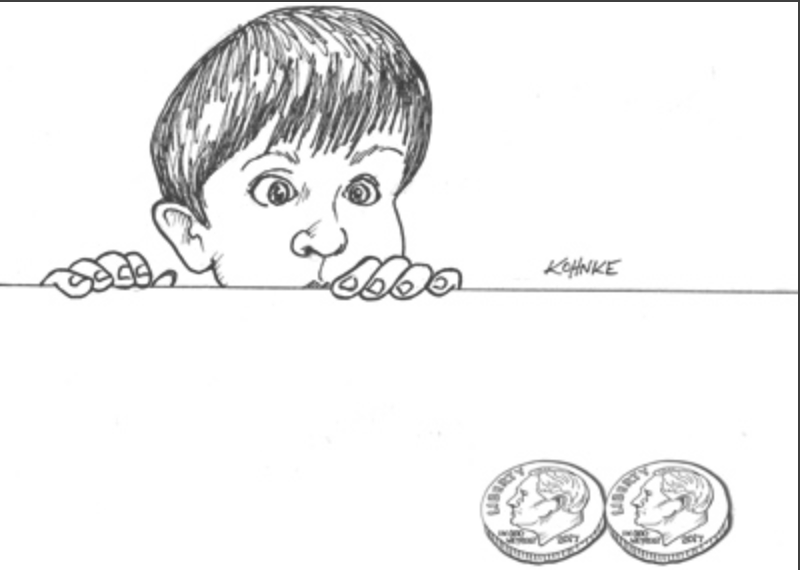

# 3 范式概述

---

 

本章概述中涉及的三个范式分别是：结构化编程、面向对象编程和函数式编程。

## 结构化编程

第一个被采用的范式（虽然不是第一个被发明的）是结构化编程，由 Edsger Wybe Dijkstra 于 1968 年发现。
Dijkstra 表明，不加限制地使用跳转（goto 语句）对程序结构是有害的。
正如我们在后续章节中会看到的，他用更熟悉的 if/then/else 和 do/while/until 结构取代了那些跳转。

我们可以将结构化编程范式总结如下：

> 结构化编程对直接转移控制权施加了约束。

## 面向对象编程

第二个被采用的范式实际上更早两年被发现，即 1966 年，由 Ole Johan Dahl 和 lKristen Nygaard 提出。
这两位程序员注意到，ALGOL 语言中的函数调用栈帧可以被移动到堆上，从而允许函数所声明的局部变量在函数返回之后仍能长时间存在。
函数因此成为了类的构造函数，局部变量变成了实例变量，而嵌套函数则变成了方法。
这最终通过对函数指针的规范化使用，导向了多态性的发现。

我们可以将面向对象编程范式总结如下：

> 面向对象编程对间接转移控制权施加了约束。

## 函数式编程

第三个范式虽然直到最近才开始被采用，却是第一个被发明的。
事实上，它的发明甚至早于计算机编程本身。
函数式编程是 Alonzo Church 工作的直接成果，他于 1936 年发明了 λ 演算，当时他正在研究同一个激励着 Alan Turing 的数学问题。
他的 λ 演算是 LISP 语言的基础，LISP 由 John McCarthy 于 1958 年发明。
λ 演算的一个基本概念是不可变性 —— 即符号的值不会改变。
这实际上意味着函数式语言没有赋值语句。
大多数函数式语言确实有某种方式来改变变量的值，但必须遵循非常严格的约束。

我们可以将函数式编程范式总结如下：

> 函数式编程对赋值施加了约束。

## 值得深思

<ins>请注意我在介绍这三个编程范式时有意设定的模式：每个范式都剥夺了程序员的一些能力。
它们都没有增加新的能力</ins>。
每个范式都施加了某种额外的约束，其意图是 “否定性” 的。
范式告诉我们不该做什么，多于告诉我们该做什么。

换个角度来看这个问题，可以认为每个范式都从我们这里拿走了某些东西。
这三个范式共同去掉了 goto 语句、函数指针和赋值。
还有什么可以拿走的吗？

大概没有了。
因此，这三个范式很可能就是我们仅能见到的三个 —— 至少是仅有的三个 “否定性” 的范式。
进一步的证据是，它们都是在 1958 年至 1968 年这十年间被发现的。
在随后的几十年里，没有新的范式被增加。

## 结论

这段关于范式的历史课与架构有什么关系？
息息相关。
我们使用多态作为跨越架构边界的机制；
我们使用函数式编程来对数据的位置和访问施加约束；
我们使用结构化编程作为模块的算法基础。

请注意，这三者与架构的三个主要关注点 ——功能、组件分离以及数据管理—— 是多么完美地对应。
