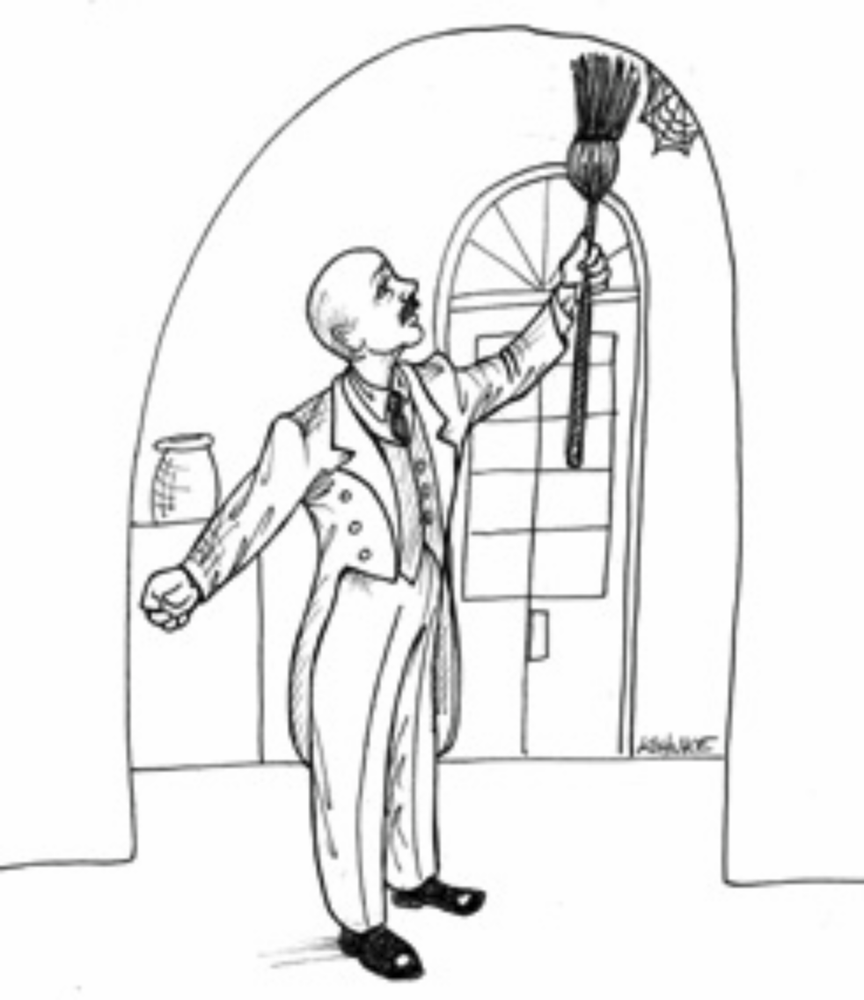

# 31 Web 是细节

---

 

你是 1990 年代的开发者吗？
你还记得 Web 如何改变了一切吗？
你还记得面对 Web 这项闪亮的新技术时，我们是如何带着鄙夷看待旧的客户端-服务器架构的吗？

实际上，Web 并没有改变任何东西。
或者至少，它本不应该改变。
Web 只是我们行业自 1960 年代以来经历的一系列周期性震荡中最新的一个。
这些震荡在 “将所有计算能力集中在中央服务器” 和 “将所有计算能力放在终端” 之间来回摆动。

仅在过去大约十年，自 Web 变得突出以来，我们就已经见证了这样的几次振荡。
起初，我们认为所有计算能力都将放在服务器集群 (server farms) 中，而放在浏览器则是愚蠢的。
然后我们开始将小程序 (applet) 放入浏览器。
但我们不喜欢那样，所以我们将动态内容移回了服务器。
但后来我们又不喜欢那样，于是我们发明了 Web 2.0，并通过 Ajax 和 JavaScript 将大量处理移回了浏览器。
我们甚至创建了庞大的应用程序，完全在浏览器中执行。
而现在，我们正兴奋于通过 Node 将那些 JavaScript 拉回服务器。

（叹气。）

## 无尽的钟摆

当然，认为这些振荡开始于 Web 是不正确的。
在 Web 之前，有客户端-服务器架构。
在此之前，有配备大量哑终端的小型中央计算机。
在此之前，有配备智能绿屏终端（与现代浏览器非常相似）的大型机。
再往前，有计算机房和打孔卡……

故事就是这样。
我们似乎无法确定我们想要把计算能力放在哪里。
我们在集中式和分布式之间来回摇摆。
而且，我想，这些振荡在未来一段时间内仍将继续。

当你从 IT 历史的整体范围来看时，Web 根本没有改变任何东西。
Web 只是在我们大多数人出生之前就已开始、在我们大多数人退休之后仍将继续的一场斗争中众多振荡之一。

<ins>然而，作为架构师，我们必须着眼于长期。
这些振荡只是短期的、我们希望将其推离业务规则核心的问题</ins>。

让我给你讲一下 Q 公司的故事。
Q 公司构建了一个非常受欢迎的个人理财系统。
它是一个桌面应用，带有非常有用的 GUI。
我很喜欢用它。

然后 Web 来了。
在下一个版本中，Q 公司将 GUI 的外观和行为改得像个浏览器。
我震惊了！
到底是哪个营销天才决定，运行在桌面上的个人理财软件，应该具有 Web 浏览器的外观和感觉？

当然，我讨厌这个新界面。
显然其他人也都讨厌 —— 因为经过几个版本之后，Q 公司逐渐去掉了那种类似浏览器的感觉，并将其个人理财系统变回了普通的桌面 GUI。

现在想象一下你是 Q 公司的一名软件架构师。
想象一下某个营销天才说服了上层管理，认为整个 UI 都必须改变，以看起来更像 Web。
你会怎么做？
或者更确切地说，在此之前你应该做些什么，来保护你的应用免受那个营销天才的影响？

你应该将你的业务规则与 UI 解耦。
我不知道 Q 公司的架构师是否做到了这一点。
有一天我很想听听他们的故事。
如果我当时在那里，我一定会极力主张将业务规则与 GUI 隔离开来，因为你永远不知道那些营销天才下一步会做什么。

现在考虑 A 公司，它生产了一款可爱的智能手机。
最近它发布了一个升级版的 “操作系统”（我们能在手机上谈论操作系统，这真是奇怪）。
除其他事项外，那个 “操作系统” 升级完全改变了所有应用程序的外观和感觉。
为什么？
我想，是某个营销天才说了算。

我不是该设备软件的专家，所以我不知道这一变化是否给在 A 公司手机上运行的应用程序的程序员带来了任何重大困难。
<ins>我确实希望 A 公司的架构师，以及这些应用的架构师，将他们的 UI 和业务规则彼此隔离，
因为总有一些营销天才潜伏在周围，只等着扑向你制造出的下一丁点耦合</ins>。

## 要点

<ins>要点很简单：GUI 是一个细节。
Web 是一个 GUI。
所以 Web 是一个细节。
而且，作为架构师，你希望将这样的细节放在边界之后，使它们与你的核心业务逻辑保持分离</ins>。

这样想：WEB 是一个 IO 设备。
在 1960 年代，我们学会了编写设备无关应用程序的价值。
这种独立性的动机并没有改变。
Web 也不是这条规则的例外。

难道不是吗？
有人可能会争辩说，像 Web 这样的 GUI 是如此独特和丰富，以至于追求设备无关的架构是荒谬的。
当你考虑到 JavaScript 验证或拖拽 AJAX 调用的复杂性，
或者你能放在网页上的众多其他小部件和工具中的任何一个时，很容易争辩说设备无关是不切实际的。

在某种程度上，这是真的。
应用程序与 GUI 之间的交互是 “啰嗦的”，其方式非常特定于你所拥有的 GUI 类型。
浏览器与 Web 应用程序之间的 “舞蹈”，不同于桌面 GUI 与其应用程序之间的 “舞蹈”。
试图抽象出那种 “舞蹈”，就像 UNIX 抽象出设备那样，似乎不太可能。

<ins>但 UI 与应用程序之间的另一条边界可以被抽象出来。
业务逻辑可以被看作是一组用例，每个用例代表用户执行某些功能。
每个用例都可以根据输入数据、执行的处理和输出数据来描述</ins>。

<ins>在 UI 与应用程序之间的 “舞蹈” 中的某个时刻，可以认为输入数据已经完整，从而允许执行用例。
执行完成后，结果数据可以被反馈回 UI 与应用程序之间的 “舞蹈” 中</ins>。

<ins>完整的输入数据和产生的结果数据可以被放入数据结构中，并作为执行用例的流程的输入值和输出值。
通过这种方式，我们可以认为每个用例都在以设备无关的方式操作 UI 的 IO 设备</ins>。

## 结论

这种抽象并不容易，可能需要多次迭代才能恰到好处。
但它是可能的。
而且，既然世界上充满了营销天才，要说明这往往是很有必要的，并不难。
