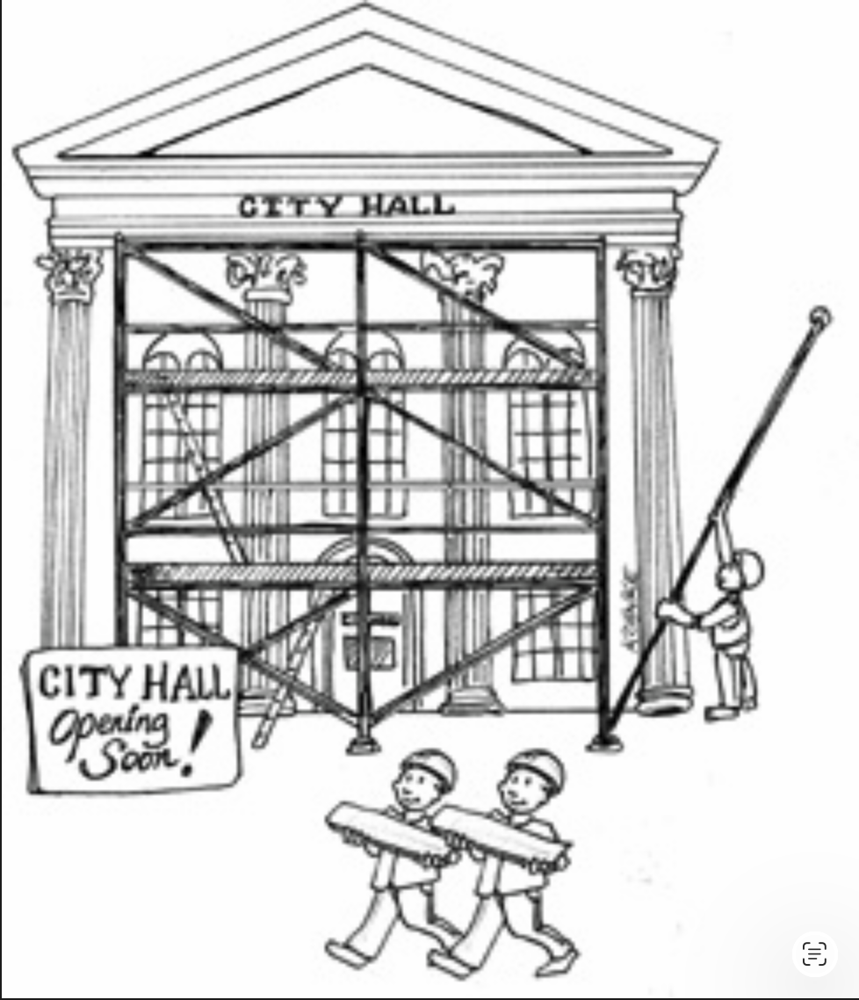

# 32 框架是细节

---

 

框架 (frameworks) 已经变得相当流行。
总的来说，这是一件好事。
市面上有许多免费、强大且有用的框架。

<ins>然而，框架不是架构 —— 尽管有些试图成为架构</ins>。

## 框架作者

大多数框架作者免费提供他们的作品，是因为他们希望对社区有所帮助。
他们想要回馈。
这是值得称赞的。
然而，无论他们的动机多么高尚，这些作者并不会把你们的利益放在心上。
他们不能，因为他们不认识你，也不知道你的问题。

框架作者知道他们自己的问题，以及他们同事和朋友的问题。
他们编写框架是为了解决那些问题 —— 而不是你的问题。

当然，你的问题很可能与那些问题有相当大的重叠。
如果不是这样，框架就不会如此受欢迎了。
在这种重叠存在的范围内，框架确实可以非常有用。

## 不对称的联姻

<ins>你和框架作者之间的关系是极度不对称的。
你必须对框架做出巨大的承诺，而框架作者对你却不做任何承诺</ins>。

请仔细思考这一点。
当你使用一个框架时，你会阅读该框架作者提供的文档。
在那些文档中，作者和该框架的其他用户会建议你如何将你的软件与框架集成。
通常，这意味着将你的架构包裹在该框架周围。
作者建议你从框架的基类派生，并将框架的工具导入到你的业务对象中。
作者敦促你尽可能紧密地将你的应用程序耦合到框架上。

对于框架作者来说，耦合到他或她自己的框架并不是风险。
作者希望耦合到该框架，因为作者对该框架拥有绝对的控制权。

而且，作者希望你耦合到框架，因为一旦以这种方式耦合，就很难脱离。
<ins>对框架作者来说，没有什么比看到一群用户愿意不可分割地从其基类派生更感到自我肯定的了</ins>。

实际上，作者是在要求你嫁给这个框架 —— 对这个框架做出巨大的、长期的承诺。
然而，在任何情况下，作者都不会对你做出相应的承诺。
<ins>这是一个单向的婚姻。
你承担了所有的风险和负担；框架作者则什么都不承担</ins>。

## 风险

风险是什么？以下只是供你考虑的其中几个。

- 框架的架构通常并不十分整洁。
框架往往违反依赖规则。
它们要求你将它们的代码继承到你的业务对象中 —— 你的实体 (Entities)！
它们希望将它们的框架耦合到最内层的圆环中。
一旦进入，那个框架就不会再出来了。
婚戒已经戴在你手指上了；而且它会一直戴在那里。

- 框架可能在应用开发的某些早期功能上对你有所帮助。
然而，随着产品的成熟，它可能会超出框架功能的范围。
如果你戴上了那枚婚戒，随着时间的推移，你会越来越多地发现框架在与你对抗。

- 框架可能朝着对你无益的方向演进。
你可能会被困在升级到对你没有帮助的新版本中。
你甚至可能发现你曾经使用的旧功能正在消失，或以你难以跟上的方式发生变化。

- 可能会出现一个你希望切换到的、更新更好的框架。

## 解决方案

解决方案是什么？

> 不要嫁给框架！

哦，你可以使用框架 —— 只是不要耦合到它。
与它保持一定的距离。
<ins>将框架视为一个属于架构最外圈的细节。
不要让它进入内圈</ins>。

<ins>如果框架想要你从它的基类派生你的业务对象，请说不！
而是派生代理，并将那些代理保存在作为你业务规则插件的组件中</ins>。

不要让框架进入你的核心代码。
相反，将它们集成到遵循依赖规则、插入你核心代码的组件中。

例如，也许你喜欢 Spring。
Spring 是一个不错的依赖注入框架。
也许你使用 Spring 来自动装配你的依赖。
<ins>这没问题，但你不应该在你的业务对象中到处散布 `@autowired` 注解。
你的业务对象不应该知道 Spring</ins>。

<ins>相反，你可以使用 Spring 将依赖注入到你的 Main 组件中。
让 Main 知道 Spring 是可以的，因为 Main 是架构中最脏、最低层的组件</ins>。

## 我现在宣布你们……

<ins>有些框架你根本绕不开</ins>。
例如，如果你使用 C++，你可能将不得不嫁给 STL —— 很难避免。
如果你使用 Java，你几乎肯定要嫁给标准库。

这很正常 —— 但这仍然应该是一个决策。
<ins>你必须明白，当你将一个框架绑定到你的应用程序时，你将在该应用程序的整个生命周期内被那个框架束缚</ins>。
无论好坏，无论疾病还是健康，无论富有还是贫穷，抛弃所有其他，你都将使用那个框架。
这不是一个可以轻率做出的承诺。

## 结论

当面对一个框架时，尽量不要立即与之结合。
看看是否有可能在冒险投入之前先 “约会” 一段时间。
<ins>如果可能的话，尽可能长时间地将框架保持在架构边界之后。
也许你能找到一种不买牛就能喝到奶的方法</ins>。
