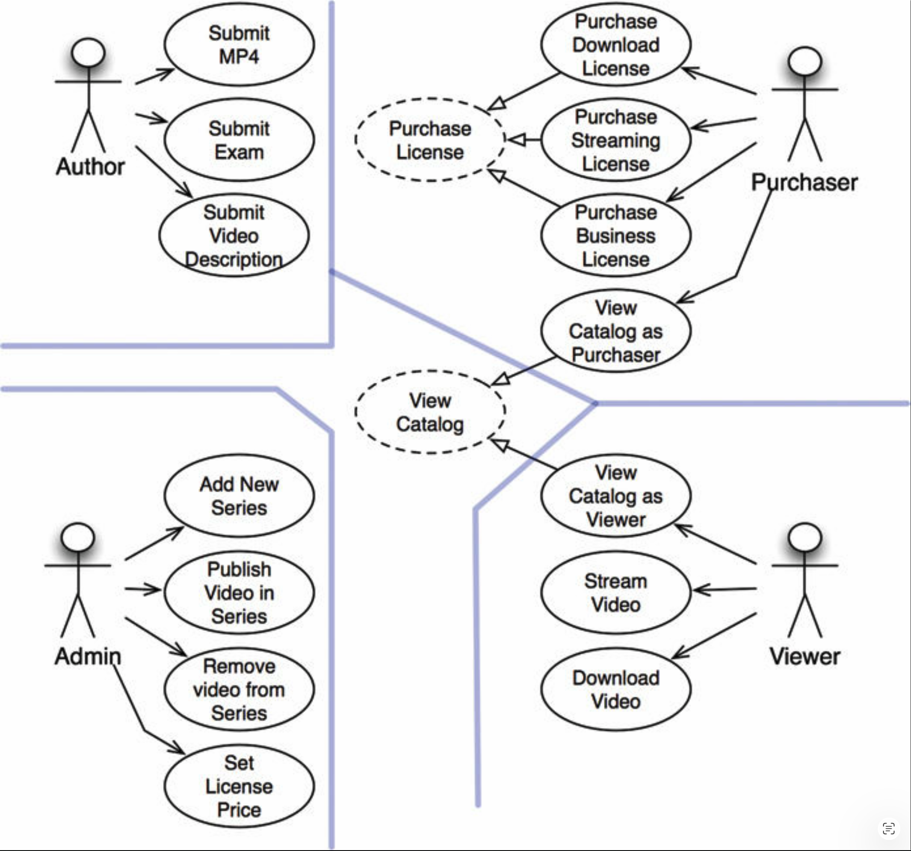
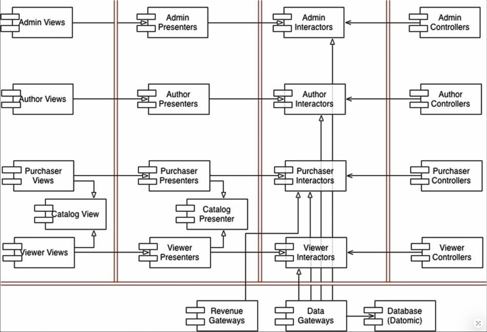

# 33 案例研究：视频销售

---

 

现在是将这些关于架构的规则和想法整合到一个案例研究中的时候了。
这个案例研究将简短而简单，但将同时描绘优秀架构师所使用的过程以及他们所做的决策。

## 产品

对于这个案例研究，我选择了一个我相当熟悉的产品：一个销售视频的网站软件。
当然，这让人想起 cleancoders.com，也就是我销售软件教学视频的网站。

基本概念很简单。
我们有一批要出售的视频。
我们在网上将它们销售给个人和企业。
个人可以支付一个价格以流媒体方式观看视频，也可以支付另一个更高的价格来下载并永久拥有这些视频。
企业许可证仅限于流媒体，并以批量形式购买，允许数量折扣。

个人通常既是观看者也是购买者。
相比之下，企业通常有购买视频的人，而由其他人来观看。

视频作者需要提供他们的视频文件、书面描述以及带有考试、问题、解决方案、源代码和其他材料的辅助文件。

管理员需要添加新的视频系列，在系列中添加和删除视频，并为各种许可证设定价格。

<ins>我们在确定系统初始架构时的第一步是识别参与者和用例</ins>。

## 用例分析

[Fig 33.1](#fig-331) 展示了一个典型的用例分析。

#### Fig 33.1
 
*Fig 33.1 一个典型的用例分析*

四个主要参与者显而易见。
根据单一职责原则，这四个参与者将是系统变更的四个主要来源。
每当添加某个新功能，或更改某个现有功能时，该步骤都是为了服务于这些参与者中的某一位。
因此，我们希望划分系统，使得对某个参与者的变更不会影响到任何其他参与者。

[Fig 33.1](#fig-331) 中显示的用例并不是一个完整的列表。
例如，你不会找到登录或注销用例。
省略的原因是只是为了控制本书中问题的规模。
如果我要包含所有不同的用例，那么本章就不得不变成一本独立的书了。

注意 [Fig 33.1](#fig-331) 中心带虚线的用例。
它们是抽象用例。[1](#1)
抽象用例是指定了一个通用策略，由另一个用例来具体化的用例。
正如你所看到的，作为观看者浏览目录和作为购买者浏览目录这两个用例都继承自 “浏览目录” 这个抽象用例。

一方面，创建那个抽象用例对我来说并非严格必要。
我本可以将该抽象用例从图中省略，而不会影响整个产品的任何功能。
另一方面，这两个用例如此相似，我认为明智的做法是识别这种相似性，并在分析早期找到统一它们的方法。

## 组件架构

现在我们知道了参与者 (actor) 和用例，就可以创建初步的组件架构了（ [Fig 33.2](#fig-332) ）。

图中的双线一如既往地代表架构边界。
你可以看到视图、展示器、交互器和控制器的典型划分。你也可以看到我已经按相应的参与者将这些类别分别拆分。

[Fig 33.2](#fig-332) 中的每个组件都代表一个潜在的 `.jar` 文件或 `.dll` 文件。
这些组件中的每一个都将包含分配给它视图、展示器、交互器和控制器。

注意 `Catelog View` 和 `Catelog Presenter` 的特殊组件。
这就是我处理抽象 “浏览目录 (View Catalog)” 用例的方式。
我假设这些视图和展示器将被编码为这些组件中的抽象类，而继承组件将包含从那些抽象类继承的视图和展示器类。

#### Fig 33.2
 
*Fig 33.2 一个初步的组件架构*

我真的会把系统拆分成所有这些组件，并将它们作为 `.jar` 或 `.dll` 文件交付吗？
是也不是。
我当然会把编译和构建环境按这种方式拆分，以便我可以构建像那样的独立可交付产物。
我还会保留在必要时将所有那些可交付产物合并成更少数量的可交付产物的权利。
例如，鉴于 [Fig 33.2](#fig-332) 中的划分，将它们合并成五个 `.jar` 文件是很简单的 —— 分别对应视图、展示器、交互器、控制器和工具类。
然后我就可以独立部署那些最可能彼此独立变动的组件。

另一种可能的分组方式是将视图和展示器放在同一个 `.jar` 文件中，并将交互器、控制器和工具类放在它们自己的 `.jar` 文件中。
还有一个更原始的分组方式是创建两个 `.jar` 文件，视图和展示器放在一个文件中，其他所有东西放在另一个文件中。

保持这些选项的开放性，将使我们能够根据系统随时间变化的方式，来调整我们部署系统的方式。

## 依赖管理

在 [Fig 33.2](#fig-332) 中，控制流从右向左进行。
输入发生在控制器处，该输入由交互器处理成结果。
然后展示器对结果进行格式化，视图显示那些呈现结果。

请注意，箭头并非全部从右向左流动。
事实上，它们大多从左向右指向。
这是因为架构遵循依赖规则。
所有依赖都单向地跨越边界线，并且它们总是指向包含高层策略的组件。

还要注意，使用 (using) 关系（空心箭头）与控制流方向一致，而继承关系（实心箭头）与控制流方向相反。
这描绘了我们对开闭原则的使用，以确保依赖流向正确的方向，并且对低层细节的更改不会向上波及影响高层策略。

## 结论

[Fig 33.2](#fig-332) 中的架构图包含了两个维度的分离。
第一个是基于单一职责原则对参与者 (actors) 的分离；
第二个是依赖规则。
两者的目标都是分离那些因不同原因、以不同速率变动的组件。
不同的原因对应于参与者；
不同的速率对应于不同的策略层次。

一旦你以这种方式构建了代码，你就可以混合搭配出你实际想要部署系统的方式。
你可以以任何有意义的方式将组件分组为可部署的可交付产物，并在条件变化时轻松更改那种分组。

---

#### 1
这是我自己对 “抽象” 用例的标记方式。
使用如 `<<abstract>>` 这样的 UML 构造型会更标准，但如今我发现遵守这类标准并不十分有用。
