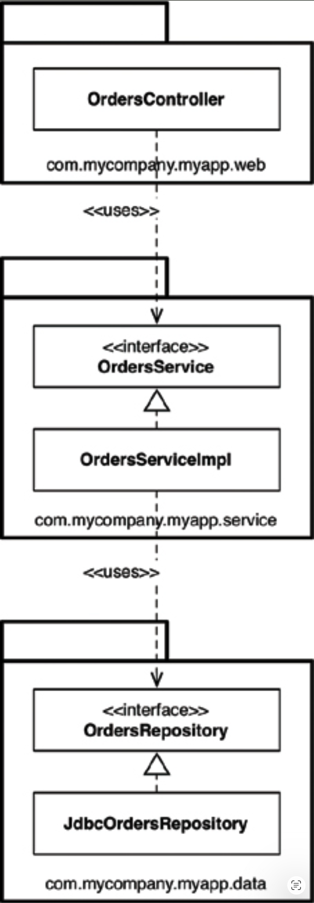
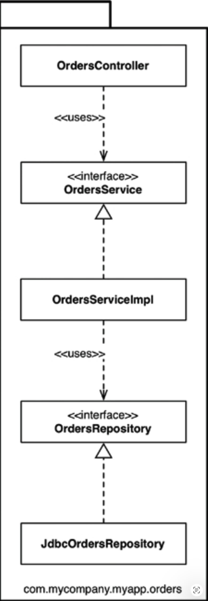
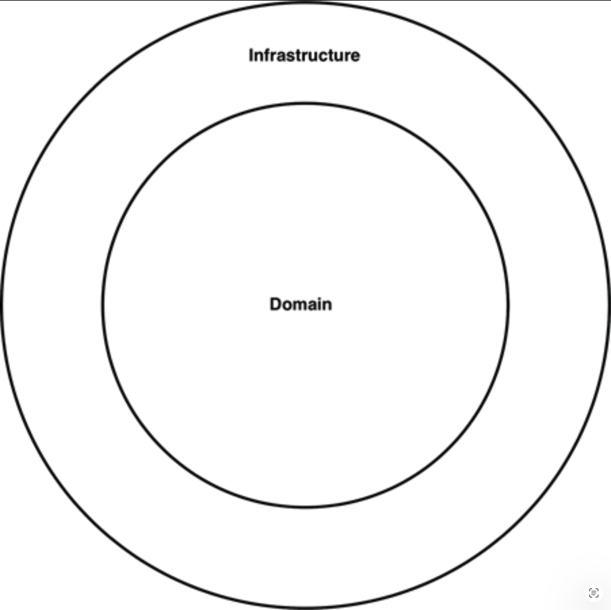
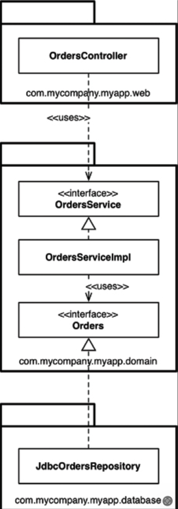
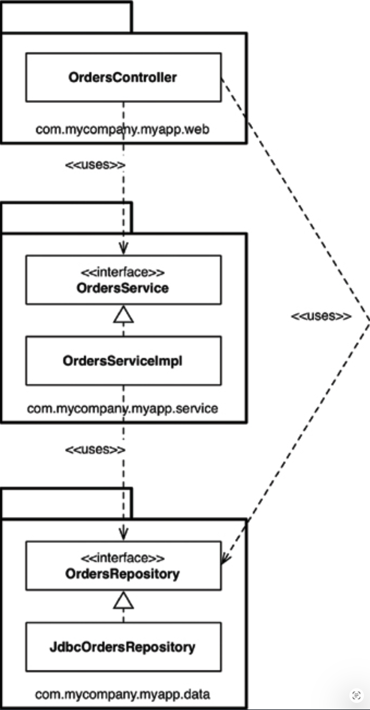
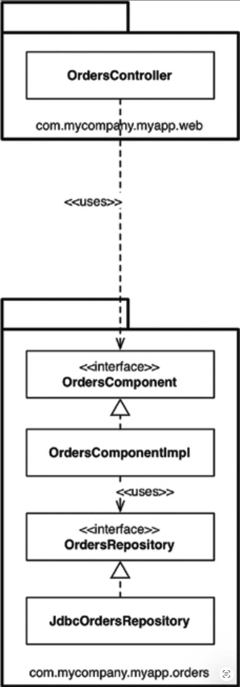
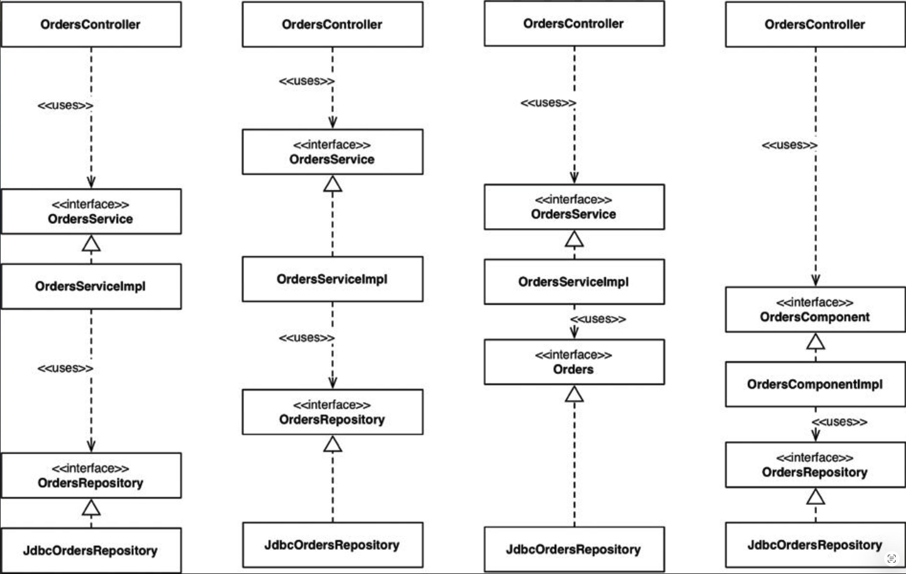
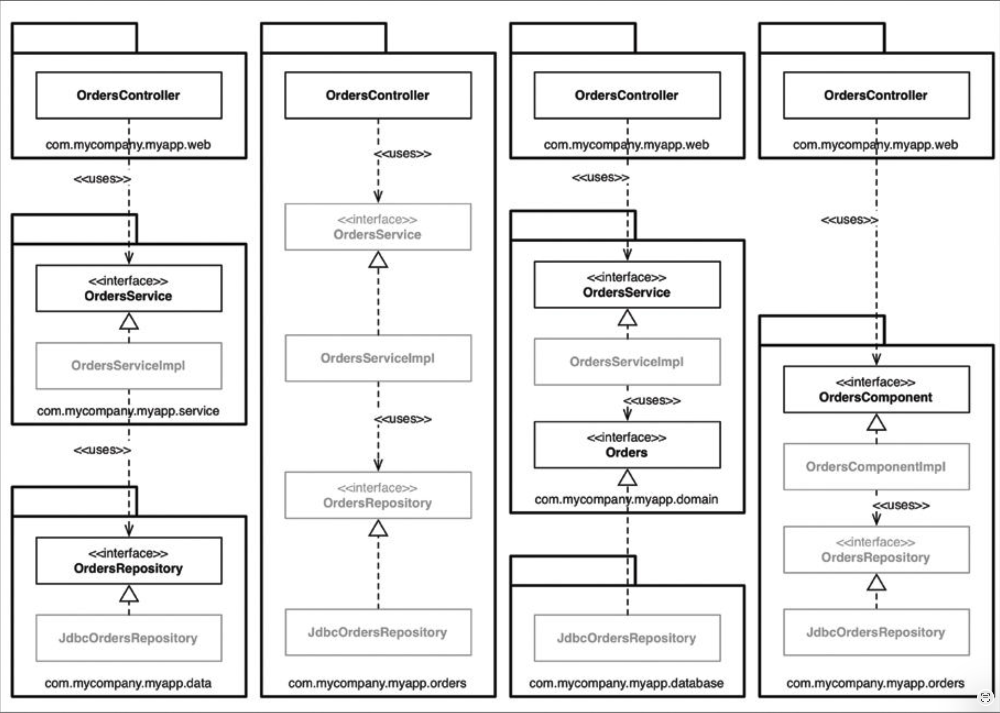
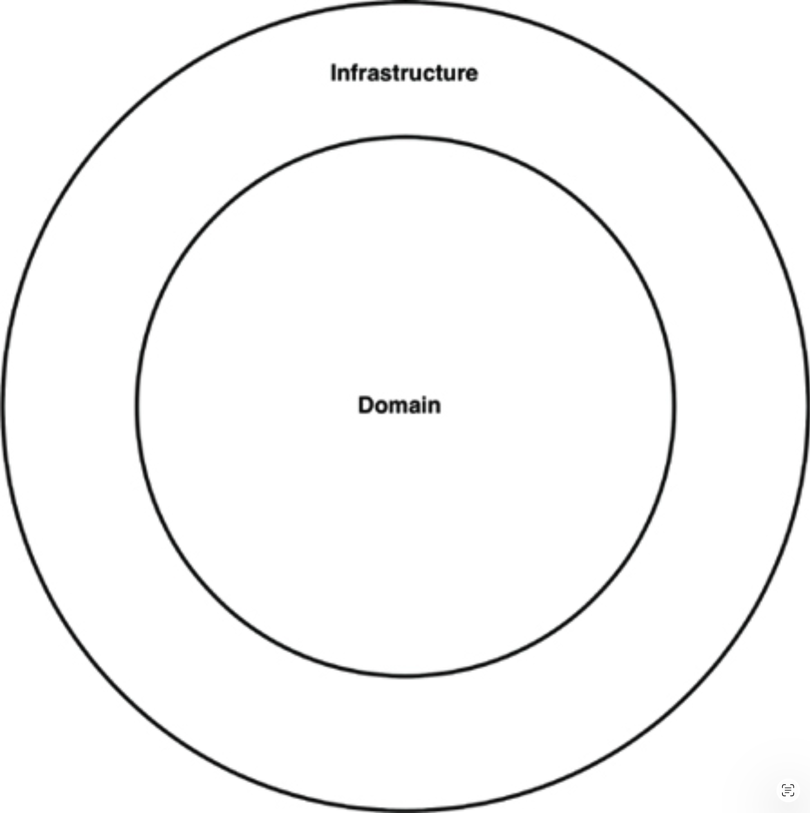

# 34 缺失的章节

作者：Simon Brown

---

 

到目前为止，你读到的所有建议肯定会帮助你设计出更好的软件，
这些软件由类和组件组成，具有明确定义的边界、清晰的职责和受控的依赖关系。
但事实证明，魔鬼在于实现细节，如果你不对此加以思考，在最后一道关卡前跌倒也是非常容易的。

让我们想象一下，我们正在构建一个在线书店，而我们需要实现的一个用例是让客户能够查看他们的订单状态。
尽管这是一个 Java 示例，但这些原则同样适用于其他编程语言。
让我们暂时把整洁架构放在一边，看看几种设计和代码组织的方法。

## 按层分包

第一种，也许是最简单的设计方法是传统的水平分层架构，我们根据代码在技术层面上做什么来分离代码。
这通常被称为 “按层分包 (package by layer)”。
[Fig 34.1](#fig-341) 展示了这在 UML 类图中可能的样子。

在这种典型的分层架构中，我们有一层用于 Web 代码，一层用于我们的 “业务逻辑”，还有一层用于持久化。
换句话说，代码被水平切割成层，这些层被用作对相似类型事物进行分组的方式。
在 “严格的分层架构” 中，层应该只依赖于相邻的下一层。
在 Java 中，层通常被实现为包。
如 [Fig 34.1](#fig-341) 所示，层（包）之间的所有依赖关系都指向下方。
在此示例中，我们有以下 Java 类型：

- `OrdersController`：一个 Web 控制器，类似于 Spring MVC 控制器，处理来自 Web 的请求。
- `OrdersService`：一个定义了与订单相关的 “业务逻辑” 的接口。
- `OrdersServiceImpl`：订单服务的实现。[1](#1)
- `OrdersRepository`：一个定义了我们如何访问持久化订单信息的接口。
- `JdbcOrdersRepository`：该 Repository 接口的实现。

#### Fig 34.1
 
*Fig 34.1 按层分包*

在 “表示-领域-数据分层” [2](#2) 中，Martin Fowler 表示采用这样的分层架构是开始的好方法。
他并不是唯一这样认为的人。
你会发现许多书籍、教程、培训课程和示例代码也会指引你走上创建分层架构的道路。
这是一种在不引入巨大复杂性的情况下快速让某件事启动并运行的非常快捷的方法。
<ins>问题在于，正如 Martin 所指出的，
一旦你的软件在规模和复杂性上增长，你会很快发现拥有三个大桶的代码是不够的，你将需要考虑进一步模块化</ins>。

<ins>另一个问题是，正如 Uncle Bob 已经说过的，分层架构对业务领域没有任何 “尖叫”</ins>。
将来自两个截然不同的业务领域的两个分层架构的代码放在一起，它们看起来可能会惊人地相似：Web、服务和 Repository。
分层架构还有另一个巨大的问题，但我们稍后会讲到。

## 按功能分包

组织代码的另一种选择是采用 “按功能分包 (package by feature)” 的风格。
这是一种垂直切片，基于相关的特性、领域概念或聚合根（使用领域驱动设计的术语）。
在我见过的典型实现中，所有类型都被放入一个单独的 Java 包中，该包的命名反映了被分组的概念。

采用这种方法，如 [Fig 34.2](#fig-342) 所示，我们拥有与之前相同的接口和类，但它们都被放入一个单独的 Java 包中，而不是分散在三个包中。
这是对 “按层分包” 风格的一个非常简单的重构，但代码的顶层组织现在对业务领域有了某种 “尖叫”。
我们现在可以看到，这个代码库与订单有关，而不是与 Web、服务和 Repository 有关。
另一个好处是，在 “查看订单” 用例发生变化时，可能更容易找到你需要修改的所有代码。
它们都位于一个单独的 Java 包中，而不是分散在各处。[3](#3)

我经常看到软件开发团队意识到他们在水平分层（“按层分包”）方面存在问题，于是转而采用垂直分层（“按功能分包”）。
在我看来，两者都不是最优的。
如果你已经读到了本书的这里，你可能会想，我们可以做得更好 —— 而且你是对的。

#### Fig 34.2
 
*Fig 34.2 按功能分包*

## 端口与适配器

正如 Uncle Bob 所说，“端口与适配器 (ports and adapters)”、“六边形架构 (hexagonal architecture)”、“边界-控制器-实体” 等方法旨在创建这样一种架构：
以业务/领域为中心的代码独立于框架和数据库等技术实现细节，并与它们分离开来。
总而言之，你经常看到这样的代码库由一个 “内部”（领域）和一个 “外部”（基础设施）组成，如 [Fig 34.3](#fig-343) 所示。

#### Fig 34.3
 
*Fig 34.3 具有内部和外部的代码库*

“内部” 区域包含所有领域概念，而 “外部” 区域包含与外部世界的交互（例如 UI、数据库、第三方集成）。
这里的主要规则是，“外部” 依赖于 “内部” —— 绝不允许反过来。
[Fig 34.4](#fig-344) 展示了 “查看订单” 用例可能实现的一个版本。

这里的 `com.mycompany.myapp.domain` 包是 “内部”，其他包是 “外部”。
注意依赖关系如何流向 “内部”。
敏锐的读者会注意到，之前图中的 `OrdersRepository` 已被重命名为简单的 `Orders`。
这来自领域驱动设计的世界，其中建议 “内部” 所有事物的命名都应基于 “通用领域语言 (ubiquitous domain language)”。
换句话说，当我们讨论领域时，我们谈论的是 “订单”，而不是 “Orders Repository”。

#### Fig 34.4
 
*Fig 34.4 查看订单用例*

<ins>同样值得指出的是，这是 UML 类图可能呈现的简化版本，
因为它缺少像交互器（interactors）和用于跨依赖边界编组数据的对象等元素</ins>。

## 按组件分包

尽管我完全赞同关于 SOLID、REP、CCP 和 CRP 的讨论以及本书中的大部分建议，但我在如何组织代码方面得出了一个略有不同的结论。
因此，我在这里提出另一种选择，我称之为 “按组件分包”。
给你一些背景信息，我职业生涯的大部分时间都在构建企业软件，主要使用 Java，涉及多个不同的业务领域。
这些软件系统也差异很大。
其中大量是基于 Web 的，但也有客户端-服务器 [4](#4) 、分布式、基于消息或其他类型的。
尽管技术不同，共同的主题是这些软件系统大多数都是基于传统的分层架构。

我已经提到了分层架构应该被认为不好的几个原因，但这还不是全部。
分层架构的目的是分离具有相似功能的代码。
Web 相关的东西与业务逻辑分离，而业务逻辑又与数据访问分离。
正如我们从 UML 类图中看到的，从实现的角度来看，一层通常等同于一个 Java 包。
从代码可访问性的角度来看，为了让 `OrdersController` 能够依赖 `OrdersService` 接口，`OrdersService` 接口需要被标记为 `public`，因为它们在不同的包中。
同样，`OrdersRepository` 接口需要被标记为 `public`，以便 `OrdersServiceImpl` 类能够在 repository 包之外看到它。

在严格的分层架构中，依赖箭头应始终指向下方，层只依赖于相邻的下一层。
这又回到了创建良好、清晰、无环依赖图的问题上，而这是通过引入一些关于代码库中元素应如何相互依赖的规则来实现的。
这里的大问题在于，我们可以通过引入一些不受欢迎的依赖关系来作弊，却仍然能创建一个良好、无环的依赖图。

假设你雇佣了一位新成员加入你的团队，你给这位新人分配了另一个与订单相关的用例来实现。
由于是新人，他想给人留下深刻印象，并尽快实现这个用例。
坐下来喝了几分钟咖啡后，这位新人发现了一个现有的 `OrdersController` 类，于是他决定新订单相关网页的代码应该放在那里。
但它需要从数据库中获取一些订单数据。
新人有了顿悟：“哦，`OrdersRepository` 接口也已经构建好了。
我可以简单地将实现依赖注入到我的控制器中。
完美！” 又过了几分钟的编写，网页已经开始工作。
但由此产生的 UML 图却变成了 [Fig 34.5](#fig-345) 。

依赖箭头仍然指向下方，但 `OrdersController` 现在在某些用例中额外绕过了 `OrdersService`。
这种组织方式通常被称为 *宽松的分层架构 (relaxed layered architecture)* ，因为层被允许跳过相邻的层。
在某些情况下，这是预期的结果 —— 例如，如果你正试图遵循 CQRS [5](#5) 模式。
但在许多其他情况下，绕过业务逻辑层是不可取的，尤其是在该业务逻辑负责确保对单个记录进行授权访问的情况下。

虽然新的用例可以工作，但它可能并没有按照我们所期望的方式实现。
作为顾问，我在访问团队时经常看到这种情况，通常在团队开始（往往是第一次）可视化他们的代码库实际看起来是什么样子时，这个问题就会暴露出来。

#### Fig 34.5
 
*Fig 34.5 宽松的分层架构*

我们在这里需要的是一个指导原则 ——一种架构原则—— 它大致是说：“Web 控制器永远不应直接访问 Repository。”
当然，问题在于如何强制执行。
我遇到的许多团队只是说：“我们通过良好的纪律和代码审查来强制执行这一原则，因为我们信任我们的开发人员。”
这种信心听上去很好，但我们都知道当预算和截止日期日益临近时会发生什么。

极少数团队告诉我，他们使用静态分析工具（例如 NDepend、Structure101、Checkstyle）在构建时检查并自动强制执行架构违规。
你可能自己也见过这样的规则；
它们通常表现为正则表达式或通配符字符串，声明“`**/web` 包中的类型不应访问 `**/data` 包中的类型”；
并在编译步骤之后执行。

这种方法有点粗暴，但它可以完成工作，报告你作为团队所定义的架构原则的违规情况，并且（希望如此）导致构建失败。
这两种方法的问题在于它们都有缺陷，且反馈周期比应有的要长。
如果不加以控制，这种做法可能会将代码库变成一团 “泥球” [6](#6) 。
我个人希望尽可能使用编译器来强制执行我的架构。

这就引出了 “按组件分包” 选项。
这是对我们迄今为止所见一切的一种混合方法，目标是将与单个粗粒度组件相关的所有职责打包到一个 Java 包中。
这是关于对软件系统采取以服务为中心的视角，这也是我们在微服务架构中所看到的。
就像端口和适配器将 Web 视为另一种交付机制一样，“按组件分包” 将用户界面与这些粗粒度组件分离开。
[Fig 34.6](#fig-346) 展示了 “查看订单” 用例可能的样子。

本质上，这种方法将 “业务逻辑” 和持久化代码打包成一个单一的东西，我称之为 “组件”。
Uncle Bob 在本书前面给出了他对 “组件” 的定义，说：

> 组件是部署的单元。
它们是作为系统的一部分可以部署的最小实体。
在 Java 中，它们是 jar 文件。

#### Fig 34.6
 
*Fig 34.6 查看订单用例*

我对组件的定义略有不同：“在一个整洁、清晰的接口背后的相关功能的组合，它驻留在一个执行环境（如应用程序）内部。”
这个定义来自我的 “C4 软件架构模型” [7](#7)，
这是一种以容器、组件和类（或代码）来思考软件系统静态结构的简单分层方式。
它表明一个软件系统由一个或多个容器（例如 Web 应用程序、移动应用、独立应用程序、数据库、文件系统）组成
，每个容器包含一个或多个组件，而每个组件又由一个或多个类（或代码）实现。
每个组件是否驻留在单独的 jar 文件中则是一个正交的关注点。

“按组件分包” 方法的一个关键好处是，如果你正在编写需要处理订单的代码，只有一个地方可以去 —— `OrdersComponent`。
在组件内部，关注点分离仍然得以保持，因此业务逻辑与数据持久化是分开的，但这是一个组件实现细节，使用者不需要知道。
这类似于如果你采用微服务或面向服务架构最终可能得到的结果 —— 一个独立的 `OrdersService`，它封装了与处理订单相关的所有内容。
关键的区别在于 *解耦模式* 。
你可以将单体应用中定义良好的组件视为通往微服务架构的垫脚石。

## 魔鬼在于实现细节

从表面上看，这四种方法看起来确实像是组织代码的不同方式，因此可以被认为是不同的架构风格。
然而，如果你把实现细节搞错了，这种看法很快就会瓦解。

我经常看到的是在 Java 等语言中过度自由地使用 `public` 访问修饰符。
几乎就像我们这些开发人员本能地使用 `public` 关键字而不假思索。
这已经刻在了我们的肌肉记忆里。
如果你不相信我，可以看看 GitHub 上书籍、教程和开源框架的代码示例。
无论代码库旨在采用哪种架构风格——水平分层、垂直分层、端口与适配器，还是其他风格 —— 这种趋势都很明显。
将所有类型都标记为 `public` 意味着你没有利用编程语言在封装方面提供的便利。
在某些情况下，没有任何东西能阻止某人编写代码直接实例化一个具体实现类，从而违反预期的架构风格。

## 组织与封装

换个角度看这个问题，如果你将 Java 应用程序中的所有类型都设为 `public`，
那么这些包仅仅是一种组织机制（一种分组，类似于文件夹），而不是用于封装。
由于公共类型可以从代码库的任何地方使用，你可以有效地忽略这些包，因为它们提供的实际价值非常少。
最终结果是，如果你忽略这些包（因为它们不提供任何封装和隐藏的手段），那么你打算创建哪种架构风格实际上并不重要。
如果我们回顾之前的 UML 示例图，当所有类型都被标记为 `public` 时，Java 包就变成了一个无关紧要的细节。
从本质上讲，当我们过度使用这个修饰符时，本章前面介绍的所有四种架构方法都完全相同（ [Fig 34.7](#fig-347) ）。

仔细看 [Fig 34.7](#fig-347) 中每种类型之间的箭头：无论你试图采用哪种架构方法，它们都是完全相同的。
概念上这些方法非常不同，但在语法上它们完全相同。
此外，你可以说，当你把所有类型都设为 `public` 时，你实际上只是有了四种描述传统水平分层架构的方式。
这是一个巧妙的把戏，当然没有人会把他们所有的 Java 类型都设为 `public`。
除非他们真的这么做了。
而我就见过这种情况。

Java 中的访问修饰符并不完美，[8](#8) 但忽略它们就是自找麻烦。
Java 类型放入包的方式，当 Java 的访问修饰符被恰当地应用时，实际上可以对这些类型的可访问性（或不可访问性）产生巨大的影响。
如果我把这些包拿回来，并（通过图形淡化）标记那些访问修饰符可以变得更严格的类型，
这幅图就变得相当有趣了（ [Fig 34.8](#fig-348) ）。

#### Fig 34.7
 
*Fig 34.7 所有四种架构方法都是相同的*

从左向右移动，在 “按层分包” 方法中，`OrdersService` 和 `OrdersRepository` 接口需要是 `public` 的，因为它们有来自其定义包之外的类的入站依赖。
相比之下，实现类（`OrdersServiceImpl` 和 `JdbcOrdersRepository`）可以被限制得更严格（package protected）。
没有人需要知道它们；它们是实现细节。

在 “按特性分包” 方法中，`OrdersController` 提供了进入该包的唯一点，
因此其他所有内容都可以设置为 package protected 。
这里的大问题是，除非通过控制器，否则代码库中该包之外的任何内容都无法访问与订单相关的信息。
这可能合乎需要，也可能不合乎需要。

在端口与适配器方法中，`OrdersService` 和 `Orders` 接口有来自其他包的入站依赖，因此它们需要是 `public` 的。
同样，实现类可以设置为 package protected，并在运行时进行依赖注入。

#### Fig 34.8
 
*Fig 34.8 灰色类型表示访问修饰符可以变得更严格*

最后，在“按组件分包”方法中，`OrdersComponent` 接口有来自控制器的入站依赖，但其他所有内容都可以设置为包保护。
你拥有的 `public` 类型越少，潜在依赖的数量就越少。
现在没有办法 [9](#9) 让这个包之外的代码直接使用 `OrdersRepository` 接口或实现，
因此我们可以依靠编译器来强制执行这一架构原则。
你可以在 .NET 中使用 `internal` 关键字做同样的事情，尽管你需要为每个组件创建一个单独的 assembly 。

为了绝对清楚，我这里描述的是关于单体应用程序的，其中所有代码都驻留在单一的源代码树中。
如果你正在构建这样的应用程序（很多人都在这样做），我当然会鼓励你依靠编译器来强制执行你的架构原则，而不是依赖于自律和编译后工具。

## 其他解耦模式

除了你正在使用的编程语言之外，通常还有其他方法可以解耦你的源代码依赖关系。
在 Java 中，你有像 OSGi 和新的 Java 9 模块系统这样的模块框架。
使用模块系统时，如果使用得当，你可以区分 `public` 类型和 `published`（已发布）类型。
例如，你可以创建一个 `Orders` 模块，其中所有类型都标记为 `public`，但只发布其中一小部分供外部使用。
虽然等待了很长时间，但我对 Java 9 模块系统将为我们提供另一个构建更好软件的工具，并重新激发人们对设计思维的兴趣感到充满热情。

另一种选择是在源代码级别解耦你的依赖关系，即将代码拆分到不同的源代码树中。
如果我们以端口和适配器为例，我们可以有三个源代码树：

- 业务和领域的源代码（即所有独立于技术和框架选择的内容）：`OrdersService`、`OrdersServiceImpl` 和 `Orders`。
- Web 的源代码：`OrdersController`。
- 数据持久化的源代码：`JdbcOrdersRepository`。

后两个源代码树对业务和领域代码具有编译时依赖，而业务和领域代码本身对 Web 或数据持久化代码一无所知。
从实现的角度来看，你可以通过在构建工具（例如 Maven、Gradle、MSBuild）中配置单独的模块或项目来实现这一点。
理想情况下，你会重复这种模式，为应用程序中的每个组件都设置一个单独的源代码树。
然而，这非常理想化，因为以这种方式拆分源代码会带来现实世界的性能、复杂性和维护问题。

一些人遵循的更简单的端口和适配器代码方法是只使用两个源代码树：
- 领域代码（“内部”）
- 基础设施代码（“外部”）

这与许多人用来总结端口和适配器架构的图（ [Fig 34.9](#fig-349) ）很好地对应，并且存在从基础设施到领域的编译时依赖。

#### Fig 34.9
 
*Fig 34.9 领域和基础设施代码*

这种组织源代码的方法也能工作，但要注意潜在的权衡。
这就是我所说的 *端口和适配器的环城公路反模式 (Périphérique anti-pattern of ports and adapters)* 。
法国巴黎市有一条名为 Boulevard Périphérique 的环城公路，它允许你绕过巴黎而不进入市区的复杂道路。
将所有基础设施代码放在一个源代码树中意味着，你应用程序中某个区域（例如 Web 控制器）的基础设施代码有可能直接调用另一个区域（例如数据库 Repository）的代码，而无需经过领域层。
如果你忘记对该代码应用适当的访问修饰符，这一点尤其明显。

## 结论：缺失的建议

<ins>本章的全部要点是强调，如果你不考虑实现策略的细微之处，你最好的设计意图可能会在瞬间被摧毁</ins>。
思考如何将你期望的设计映射到代码结构上，如何组织该代码，以及在运行时和编译时应用哪些解耦模式。
在适用的情况下保留选项，但要务实，
并考虑你的团队规模、他们的技能水平、解决方案的复杂性，以及你的时间和预算限制。
还要考虑使用编译器来帮助强制执行你选择的架构风格，并注意其他领域（如数据模型）的耦合。
魔鬼在于实现细节。

---

#### 1
这可以说是一种糟糕的类命名方式，但正如我们稍后将看到的，也许这并不真的重要。

#### 2
https://martinfowler.com/bliki/PresentationDomainDataLayering.html .

#### 3
这种好处在现代 IDE 的导航功能下已不那么相关，但似乎有回归轻量级文本编辑器的复兴趋势，原因显然是我太老了无法理解。

#### 4
我 1996 年大学毕业后的第一份工作是用一种叫 PowerBuilder 的技术构建客户端-服务器桌面应用程序，这是一种超高效的 4GL，擅长构建数据库驱动的应用程序。
几年后，我用 Java 构建客户端-服务器应用程序，我们必须自己构建数据库连接（当时还没有 JDBC），并在 AWT 之上构建自己的 GUI 工具包。
这就是所谓的 “进步”！

#### 5
在命令查询职责分离（CQRS）模式中，更新数据和读取数据有单独的模式。

#### 6
http://www.laputan.org/mud/

#### 7
更多信息请参见 https://www.structurizr.com/help/c4 。

#### 8
例如，在 Java 中，尽管我们倾向于认为包是层次结构的，但不可能基于包和子包关系创建访问限制。
你创建的任何层次结构都仅仅存在于那些包的名称和磁盘上的目录结构之中。

#### 9
除非你作弊，使用 Java 的反射机制，但请不要那样做！
