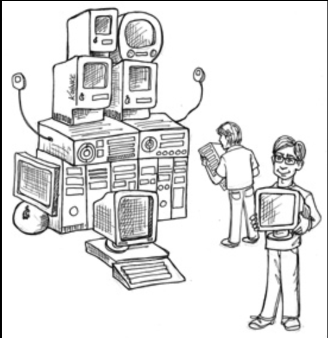

# 4 结构化编程

---

 

Edsger Wybe Dijkstra 于 1930 年出生在 Rotterdam 。
他在二战期间 Rotterdam 大轰炸及德国对荷兰的占领中幸存下来，并于 1948 年以数学、物理、化学和生物学科的最高成绩从高中毕业。
1952 年 3 月，21 岁的 Dijkstra（恰好在我出生前 9 个月）进入 Amsterdam 数学中心工作，成为荷兰史上第一位程序员。

1955年，在他担任程序员三年之后，当时他仍是一名学生，Dijkstra 得出结论：编程所带来的智力挑战比理论物理学的智力挑战更为艰巨。
因此，他选择将编程作为自己的长期职业。

1957年，Dijkstra 与 Maria Debets 结婚。
当时在 Netherlands，你必须在婚礼仪式中说明自己的职业。
荷兰当局不愿接受 “程序员” 作为 Dijkstra 的职业 —— 他们从未听说过这样一个职业。
为了让他们满意，Dijkstra 只好将自己的职位定为 “理论物理学家”。

在决定将编程作为自己的职业时，Dijkstra 曾与他的上司 Adriaan van Wijngaarden 商议。
Dijkstra 担心，由于没有人定义过编程的学科或科学，他将因此不被认真对待。
他的上司回答说，Dijkstra 很有可能正是能够发现这些学科的人之一，从而将软件发展为一门科学。

Dijkstra 的职业生涯始于电子管时代，那时的计算机庞大、脆弱、缓慢、不可靠，并且（按今天的标准）极为有限。
在那些早期岁月里，程序是用二进制或非常原始的汇编语言编写的。
输入采用纸带或穿孔卡片的物理形式。
编辑/编译/测试的循环长达数小时，甚至数天。

正是在这种原始的环境中，Dijkstra 做出了他的伟大发现。

## 证明

Dijkstra 很早就认识到的问题是：编程很难，而且程序员做得并不好。
任何复杂的程序都包含太多细节，人类大脑在没有帮助的情况下无法驾驭。
只要忽略一个微小的细节，就会导致程序看起来可能能运行，但会以出人意料的方式失败。

Dijkstra 的解决方案是运用数学中的证明方法。
他的构想是建立一个类似欧几里得几何的公理、定理、推论和引理的层级结构。
Dijkstra 认为程序员可以像数学家那样使用这种层级结构。
换句话说，程序员将使用已被证明的结构，并用自己随后会证明为正确的代码将它们串联起来。

当然，为了实现这一点，Dijkstra 意识到他必须演示为简单算法编写基本证明的技术。
他发现这相当具有挑战性。

在研究过程中，Dijkstra 发现，goto 语句的某些用法会阻止模块被递归地分解为越来越小的单元，从而无法使用合理的证明所必需的 “分而治之” 方法。

然而，goto 的其他用法并没有这个问题。
Dijkstra 意识到，这些 “好的” goto 用法对应的是简单的选择结构和迭代控制结构，例如 if/then/else 和 do/while。
只使用这类控制结构的模块可以被递归地细分为可证明的单元。

Dijkstra 知道，这些控制结构在与顺序执行结合使用时具有特殊性。
两年前，Böhm 和 Jacopini 已经指出了这一点，他们证明所有程序都可以仅由三种结构构造而成：顺序、选择和迭代。

这一发现非同寻常：那些使模块可被证明的控制结构，恰好也是构造所有程序所需的最小控制结构集。
结构化编程由此诞生。

Dijkstra 展示了顺序语句可以通过简单的枚举法来证明其正确性。
这种方法在数学上追踪顺序结构的输入到输出。
这种做法与任何常规的数学证明无异。

Dijkstra 通过重复应用枚举法来处理选择结构。
选择结构中的每条路径都被逐一枚举。
如果两条路径最终都产生恰当的数学结果，那么证明就是稳固的。

迭代则稍有不同。
为了证明迭代的正确性，Dijkstra 不得不使用归纳法。
他通过枚举法证明了初始情况（1 次循环）的正确性。
然后他证明，如果假设 N 次循环是正确的，那么 N+1 次循环也是正确的，这同样通过枚举法完成。
他还通过枚举法证明了迭代的起始条件和终止条件。

这类证明虽然繁琐且复杂，但它们毕竟是证明。
随着这些证明方法的发展，构建一个类似于欧几里得层级结构的定理体系的构想似乎变得可以企及。

## 一篇有害的宣言

1968 年，Dijkstra 给 CACM 的编辑写了一封信，发表在当年三月刊上。
信的标题是 “Go To 语句被视为有害”。
这篇文章概述了他关于三种控制结构的立场。

随后，编程界炸开了锅。那时我们还没有互联网，所以人们无法在网上发布 Dijkstra 的恶搞表情包，也无法在网上对他进行攻击。
但他们可以 ——也确实这样做了—— 给许多已出版期刊的编辑写信。

那些信件并不全都彬彬有礼。有些极其负面；另一些则强烈支持他的立场。
于是，这场论战开始了，最终持续了大约十年。

最终，这场争论逐渐平息。
原因很简单：Dijkstra 赢了。
随着计算机语言的发展，goto 语句逐渐退居幕后，直至几乎消失。
大多数现代语言都没有 goto 语句——当然，LISP 从来就没有过。

如今，我们都是结构化程序员，尽管这不一定是出于我们的选择。
只不过我们的语言不再提供使用无纪律的直接控制转移的选项。

有人可能会指出 Java 中的带标签的 break 或异常（exceptions）类似于 goto。
事实上，这些结构并不像 Fortran 或 COBOL 等旧语言曾经拥有的那种完全无限制的控制转移。
实际上，即使是那些仍然支持 goto 关键字的语言，通常也将其目标限制在当前函数的作用域内。

## 功能分解

结构化编程允许模块被递归地分解为可证明的单元，这反过来意味着模块可以进行功能分解。
也就是说，你可以拿一个大范围的问题陈述，将其分解为高层函数。
这些函数中的每一个又可以进一步分解为更低层的函数，如此往复。
此外，每一个被分解出来的函数都可以使用结构化编程所限定的控制结构来表示。

在此基础之上，诸如结构化分析和结构化设计等学科在 20 世纪 70 年代末至整个 80 年代变得流行起来。
Ed Yourdon、Larry Constantine、Tom DeMarco 以及 Meilir Page-Jones 等人在这一时期推广并普及了这些技术。
遵循这些学科方法，程序员可以将大型的拟建系统分解为模块和组件，而这些模块和组件又可以进一步分解为微小的可证明的函数。

## 没有形式化证明

但那些证明始终没有到来。
欧几里得式的定理层级体系从未建立起来。
广大程序员也从未看到通过繁复的过程来形式化证明每一个微小函数正确性的好处。
最终，Dijkstra 的梦想逐渐消逝并破灭了。
如今很少有程序员相信形式化证明是生产高质量软件的恰当方法。

当然，欧几里得风格的、形式化的数学证明并不是证明某物正确的唯一策略。
另一个非常成功的策略是科学方法。

## 科学来救援

科学与数学有着根本的不同，因为科学理论和定律无法被证明为正确。
我无法向你证明牛顿第二运动定律 \( F = ma \)，或者万有引力定律 \( F = G\frac{m_1 m_2}{r^2} \) 是正确的。
我可以向你演示这些定律，我也可以进行测量，在多位小数精度上证明它们正确，但我无法在数学证明的意义上证明它们。
无论我做了多少实验，收集了多少经验证据，总有可能某个实验会表明这些运动定律和万有引力定律是不正确的。

这就是科学理论和定律的本质：它们可以被证伪，但无法被证明。

然而我们每天都将生命押注在这些定律之上。
每次你坐进汽车，你就是在拿生命打赌 \( F = ma \) 是对世界运作方式的可靠描述。
每次你迈出一步，你就是在拿自己的健康和安全打赌 \( F = G\frac{m_1 m_2}{r^2} \) 是正确的。

科学并不通过证明陈述为真来运作，而是通过证明陈述为假来运作。
那些我们经过大量努力仍无法证明为假的陈述，我们就认为在其目的范围内足够为真。

当然，并非所有陈述都是可证明的。“这句话是谎话” 这个陈述既不为真也不为假。
它是不可证明的陈述中最简单的例子之一。

归根结底，我们可以说数学是证明可证明的陈述为真的学科。
而科学则是证明可证明的陈述为假的学科。

## 测试

<ins>Dijkstra 曾说过：“测试能证明 bug 的存在，而不能证明 bug 不存在。”
换句话说，一个测试可以证明程序是错误的，但无法证明它是正确的</ins>。
测试所能做的，只是在经过充分的测试努力之后，让我们认为该程序在我们的目的范围内足够正确。

这一事实的含义是惊人的。
软件开发并不是一项数学事业，尽管它看起来似乎在操作数学结构。
相反，软件更像是一门科学。
我们通过尽最大努力仍无法证明其不正确，来展示其正确性。

这种对不正确性的证明只能应用于可证明的程序。
一个不可证明的程序 ——例如由于无限制地使用 goto—— 无论对它进行多少次测试，都无法被认定为正确。

结构化编程迫使我们递归地将程序分解为一组小的、可证明的函数。
然后我们可以使用测试来试图证明这些小的可证明函数是不正确的。
如果这些测试未能证明其不正确，那么我们就认为这些函数在我们的目的范围内足够正确。

## **结论**

正是这种创建可证伪的编程单元的能力，使得结构化编程在今天仍然具有价值。
这就是为什么现代语言通常不支持无限制的 goto 语句。
此外，在架构层面，这也是为什么我们仍然将功能分解视为最佳实践之一。

从最小的函数到最大的组件，在每一个层面上，软件都像是一门科学，因此由可证伪性所驱动。
<ins>软件架构师致力于定义易于证伪（即可测试）的模块、组件和服务</ins>。
为此，他们采用类似于结构化编程的限制性规范，尽管是在更高的层次上。

正是这些限制性规范，我们将在接下来的章节中做较为详细的探讨。

