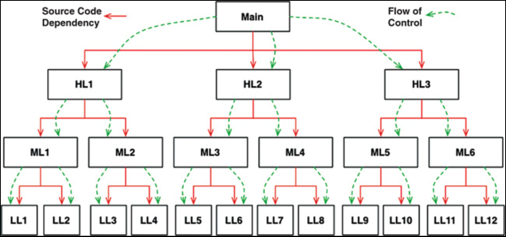
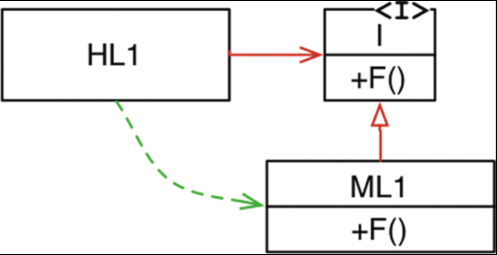
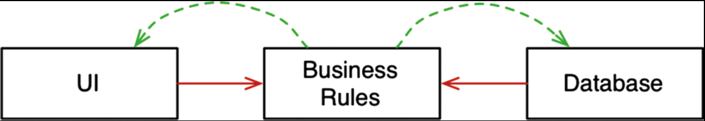

# 5 面向对象编程

---
<center></center><br/>

正如我们将会看到的，良好架构的基础在于理解并应用面向对象设计的原则。
但究竟什么是面向对象呢？

<ins>对这个问题的其中一个回答是：“数据与函数的组合”。
尽管这个说法常被引用，但它是一个令人非常不满意的答案，因为它暗示了 `o.f()` 与 `f(o)` 在某种意义上是不同的</ins>。
这显然是荒谬的。早在 1966 年之前，程序员就已经在将数据结构传递给函数了 —— 而正是在 1966 年，Dahl 和 Nygaard 将函数调用栈 (call stack frame) 移动到了堆上，从而发明了面向对象编程。

<ins>对这个问题的另一个常见回答是：“一种对现实世界建模的方式”</ins>。
这充其量只是一种回避性的答案。
“对现实世界建模” 究竟意味着什么？
为什么我们想要这样做？
<ins>也许这种说法是想暗示面向对象让软件更容易理解，因为它与现实世界有更紧密的联系 —— 但即便如此，这种说法仍然是回避性的，而且定义过于模糊。
它并没有告诉我们什么是面向对象</ins>。

有些人会借助三个神奇的词来解释面向对象的本质：封装、继承和多态。
其含义是，面向对象是这三者的恰当混合，或者至少，一门面向对象的语言必须支持这三者。

接下来，让我们逐一审视这些概念。

## 封装？

封装 (encapsulation) 之所以被列为面向对象定义的一部分，是因为面向对象语言提供了对数据和函数的简单而有效的封装。
因此，我们可以围绕一组内聚的数据和函数画出一条边界。
在这条边界之外，数据是隐藏的，只有部分函数是可见的。
我们在类的私有数据成员和公有成员函数中可以看到这一概念的实际应用。

<ins>这种想法当然并非面向对象所独有。
实际上，在 C 语言中我们就已经有了完美的封装</ins>。
考虑下面这个简单的 C 程序：

point.h
> ---
```c
struct Point;
struct Point* makePoint(double x, double y);
double distance (struct Point *p1, struct Point *p2);
```

point.c
> ---
```c
#include "point.h"
#include <stdlib.h>
#include <math.h>
 
struct Point {
  double x,y;
};
 
struct Point* makepoint(double x, double y) {
  struct Point* p = malloc(sizeof(struct Point));
  p->x = x;
  p->y = y;
  return p;
}
 
double distance(struct Point* p1, struct Point* p2) {
  double dx = p1->x - p2->x;
  double dy = p1->y - p2->y;
  return sqrt(dx*dx+dy*dy);
}
```

`point.h` 的用户无法以任何方式访问 `struct Point` 的成员。
他们可以调用 `makePoint()` 函数和 `distance()` 函数，但对 `Point` 数据结构或这些函数的实现细节一无所知。

这是完美的封装 —— 而且是在一门非面向对象的语言中。
C 语言程序员过去一直这样做。
我们会在头文件中前置声明 (forward declare) 数据结构和函数，然后在实现文件中实现它们。
我们的用户永远无法访问那些实现文件中的元素。

<ins>但后来，以 C++ 形式出现的面向对象打破了 C 语言的完美封装</ins>。

由于技术原因 <sup>[1](#1)</sup>，C++ 编译器需要将类的成员变量声明在该类的头文件中。
因此，我们的 `Point` 程序变成了下面这样：

point.h
> ---
```cpp
class Point {
public:
  Point(double x, double y);
  double distance(const Point& p) const;
 
private:
  double x;
  double y;
};
```

point\.cc
> ---
```cpp
#include "point.h"
#include <math.h>
 
Point::Point(double x, double y)
: x(x), y(y)
{}


double Point::distance(const Point& p) const {
  double dx = x-p.x;
  double dy = y-p.y;
  return sqrt(dx*dx + dy*dy);
}
```

`point.h` 头文件的客户端知道了成员变量 `x` 和 `y` 的存在！
编译器会阻止对它们的访问，但客户端仍然知道它们存在。
例如，如果这些成员变量的名称发生了更改，`point.cc` 文件就必须重新编译！
<ins>封装被打破了</ins>。

事实上，部分修复这种封装的方式是在语言中引入 `public`、`private` 和 `protected` 关键字。
然而，这只是由于编译器需要在头文件中看到那些变量而被迫采用的一种权宜之计。

<ins>Java 和 C# 则干脆彻底取消了头文件与实现文件的分离，从而进一步削弱了封装</ins>。
在这些语言中，无法将类的声明和定义分离开来。

基于这些原因，很难接受面向对象依赖于强封装这一说法。
实际上，许多面向对象语言 <sup>[2](#2)</sup> 很少甚至没有强制性的封装。

面向对象当然依赖于这样一种理念：程序员行为良好，不会去绕过封装好的数据。
<ins>即便如此，那些声称提供面向对象的语言，实际上只是削弱了我们曾经在 C 语言中享有的完美封装</ins>。

## 继承？

如果说面向对象语言没有给我们带来更好的封装，那么它们确实给我们带来了继承。

嗯 —— 算是吧。
继承只不过是在一个封闭作用域内重新声明一组变量和函数。
早在面向对象语言出现之前，C 语言程序员 <sup>[3](#3)</sup> 就已经能够手动做到这一点了。

请在我们原先的 point.h C 程序中增加如下内容：

namedPoint.h
> ---
```c
struct NamedPoint;
 
struct NamedPoint* makeNamedPoint(double x, double y, char* name);
void setName(struct NamedPoint* np, char* name);
char* getName(struct NamedPoint* np);
```

namedPoint.c
> ---
```c
#include "namedPoint.h"
#include <stdlib.h>
 
struct NamedPoint {
  double x,y;
  char* name;
};
 
struct NamedPoint* makeNamedPoint(double x, double y, char* name) {
  struct NamedPoint* p = malloc(sizeof(struct NamedPoint));
  p->x = x;
  p->y = y;
  p->name = name;
  return p;
}
 
void setName(struct NamedPoint* np, char* name) {
  np->name = name;
}
 
char* getName(struct NamedPoint* np) {
  return np->name;
}
```

main.c
> ---
```c
#include "point.h"
#include "namedPoint.h"
#include <stdio.h>
 
int main(int ac, char** av) {
  struct NamedPoint* origin = makeNamedPoint(0.0, 0.0, "origin");
  struct NamedPoint* upperRight = makeNamedPoint  (1.0, 1.0, "upperRight");
  printf("distance=%f\n",
    distance(
             (struct Point*) origin, 
             (struct Point*) upperRight));
}
```

如果你仔细查看 `main` 程序，会发现 `NamedPoint` 数据结构的表现就像是 `Point` 数据结构的派生类。
这是因为 `NamedPoint` 中前两个字段的顺序与 `Point` 相同。
<ins>简而言之，`NamedPoint` 可以伪装成 `Point`，因为 `NamedPoint` 是 `Point` 的纯粹超集，并且保持了与 `Point` 对应的成员顺序</ins>。

这种技巧在面向对象出现之前是程序员们常用的做法 <sup>[4](#4)</sup> 。
事实上，C++ 实现单继承的方式正是这种技巧。

因此，我们可能会说，早在面向对象语言被发明之前，我们就已经有了一种继承。
不过，这种说法并不完全正确。
我们拥有的只是一种技巧，远不如真正的继承那样便利。
此外，通过这种技巧来实现多重继承要困难得多。

另外需要注意的是，在 `main.c` 中，我被迫将 `NamedPoint` 的参数强制转换为 `Point` 类型。
而在真正的面向对象语言中，这种向上转型会是隐式的。

<ins>可以公平地说，虽然面向对象语言并没有带给我们全新的事物，但它确实使数据结构的伪装变得显著更加方便</ins>。

回顾一下：在封装方面，我们不能给面向对象加分；在继承方面，或许可以给半分。
到目前为止，这个分数并不高。

但还有一个属性需要考虑。

## 多态？

在面向对象语言之前，我们是否拥有多态行为？当然有。
考虑下面这个简单的 C 语言复制程序。

```c
#include <stdio.h>


void copy() {
  int c;
  while ((c=getchar()) != EOF)
    putchar(c);
}
```

函数 `getchar()` 从 `STDIN` 读取数据。
但 `STDIN` 是哪个设备？
函数 `putchar()` 向 `STDOUT` 写入数据。
但那个设备又是什么？
这些函数是多态的 —— 它们的行为取决于 `STDIN` 和 `STDOUT` 的类型。

就好像 `STDIN` 和 `STDOUT` 是 Java 风格的接口，每个设备都有对应的实现。
当然，在这个 C 语言示例程序中没有接口 —— 那么对 `getchar()` 的调用究竟是如何传递到读取字符的设备驱动程序的呢？

这个问题的答案相当直接。
UNIX 操作系统要求每个 IO 设备驱动程序提供五个标准函数 <sup>[5](#5)</sup> ：`open`、`close`、`read`、`write` 和 `seek`。
对于每个 IO 驱动程序，这些函数的签名必须完全相同。

`FILE` 数据结构包含了五个指向函数的指针。
在我们的示例中，它可能看起来像这样：

```c
struct FILE {
  void (*open)(char* name, int mode);
  void (*close)();
  int (*read)();
  void (*write)(char);
  void (*seek)(long index, int mode);
};
```

控制台 (console) 的 IO 驱动程序会定义这些函数，并将它们的地址加载到一个 `FILE` 数据结构中——大致如下所示：

```c
#include "file.h"
 
void open(char* name, int mode) {/*...*/}
void close() {/*...*/};
int read() {int c;/*...*/ return c;}
void write(char c) {/*...*/}
void seek(long index, int mode) {/*...*/}
 
struct FILE console = {open, close, read, write, seek};
```

如果 `STDIN` 被定义为 `FILE*` 类型，并且它指向控制台的数据结构，那么 `getchar()` 的实现方式可能是这样的：

```c
extern struct FILE* STDIN;
 
int getchar() {
  return STDIN->read();
}
```

换句话说，`getchar()` 仅仅是调用了由 `STDIN` 所指向的 `FILE` 数据结构中的 `read` 指针所指向的函数。

这个简单的技巧是面向对象中所有多态的基础。
例如，在 C++ 中，类中的每个虚函数都在一个称为 `vtable`（虚函数表）的表中有一个指针，所有对虚函数的调用都通过该表进行。
派生类的构造函数只需将自己的那些函数版本加载到正在创建的对象 的 `vtable` 中即可。

<ins>归根结底，多态就是函数指针的一种应用</ins>。
自 20 世纪 40 年代末冯·诺依曼架构首次实现以来，程序员就一直在使用函数指针来实现多态行为。
<ins>换句话说，面向对象并没有提供任何新东西</ins>。

<ins>啊，但这并不完全正确。
面向对象语言或许没有赐予我们多态，但它们使多态变得更加安全、更加便利</ins>。

显式使用函数指针来创建多态行为的问题在于，函数指针是危险的。
这种使用方式依赖于一套手动的约定。
你必须记住遵循约定来初始化那些指针。
你必须记住遵循约定，通过那些指针来调用你所有的函数。
如果有任何程序员未能记住这些约定，由此产生的 bug 可能会极其难以追踪和消除。

面向对象语言消除了这些约定，从而也消除了这些危险。
使用面向对象语言让多态变得微不足道。
这一事实提供了巨大的能力，这是老一代 C 语言程序员只能梦想的。
<ins>基于这一点，我们可以得出结论：面向对象对间接控制转移施加了规范</ins>。

### 多态的威力

多态究竟好在哪里？
为了更好地领略其魅力，让我们重新审视前面那个复制的示例程序。
如果一个新的 IO 设备被创建出来，那个程序会发生什么？
假设我们想用这个复制程序将数据从一个手写识别设备复制到一个语音合成设备：我们需要如何修改复制程序才能让它与这些新设备协同工作？

我们根本不需要做任何修改！
实际上，我们甚至不需要重新编译复制程序。
为什么呢？
因为复制程序的源代码并不依赖于 IO 驱动程序的源代码。
只要那些 IO 驱动程序实现了 `FILE` 所定义的五个标准函数，复制程序就会乐意使用它们。

简而言之，IO 设备已经成为了复制程序的插件。

为什么 UNIX 操作系统要让 IO 设备成为插件？
因为我们在 20 世纪 50 年代末就已经认识到，我们的程序应该与设备无关。
为什么？
因为我们编写了大量依赖特定设备的程序，结果却发现我们真正想要的是让这些程序完成同样的工作，但使用不同的设备。

例如，我们经常编写程序从一堆卡片中 <sup>[6](#6)</sup> 读取输入数据，然后打出新的卡片作为输出。
后来，我们的客户不再给我们卡片，而是开始给我们磁带卷。
这非常不方便，因为这意味着要重写原始程序的大部分内容。
如果同一个程序能够不加修改地同时用于卡片和磁带，那将会非常便利。

插件架构正是为了支持这种 IO 设备独立性而发明的，并且自其问世以来，几乎已被应用到每一个操作系统中。
<ins>即便如此，大多数程序员并没有将这个想法扩展到他们自己的程序里，因为使用函数指针是危险的</ins>。

<ins>面向对象使得插件架构可以在任何地方、为任何目的而使用</ins>。

### 依赖反转 (Dependency inversion)

想象一下，在安全且便捷的多态机制出现之前，软件是什么样子。
在典型的调用树中，`main` 函数调用高层函数，高层函数调用中层函数，中层函数调用底层函数。
然而，在这种调用树中，源代码的依赖不可避免地跟随控制流的方向（见 [Fig 5.1](#fig-51) ）。

#### Fig 5.1
<br/>
*Fig 5.1 源代码依赖与控制流*

为了让 `main` 函数调用某个高层函数，它必须提及包含该函数的模块的名称。
在 C 语言中，这通过 `#include` 实现；在 Java 中，通过 `import` 语句；在 C# 中，通过 `using` 语句。
实际上，每个调用者都被迫要提及包含被调用者的模块名称。

这一要求给软件架构师留下的选择极少（如果说有的话）。
控制流由系统的行为决定，而源代码依赖则是由该控制流决定的。

<ins>然而，当多态被引入之后，完全不同的情况便可能发生（见 [Fig 5.2](#fig-52) ）</ins>。

#### Fig 5.2
<br/>
*Fig 5.2 依赖反转*

在 [Fig 5.2](#fig-52) 中，模块 `HL1` 调用了模块 `ML1` 中的 `F()` 函数。
它通过一个接口来调用这个函数，这其实是一种源代码层面的人为安排。
在运行时，这个接口并不存在。
`HL1` 只是直接调用了 `ML1` 内部的 `F()`。<sup>[7](#7)</sup>

<ins>但请注意，`ML1` 与接口 `I` 之间的源代码依赖（即继承关系）与控制流的方向是相反的。
这被称为 *依赖反转 (dependency inversion)*，它对软件架构师的影响是深远的</ins>。

<ins>面向对象语言提供了安全且便捷的多态机制，这一事实意味着： *任何源代码依赖 ——无论它位于何处—— 都可以被反转* </ins>。

现在再回过头看 [Fig 5.1](#fig-51) 中的那个调用树及其众多的源代码依赖。
通过在它们之间插入接口，其中的任何一条源代码依赖都可以被反转。

通过这种方法，使用面向对象语言编写系统的软件架构师，可以对系统中所有源代码依赖的方向拥有绝对的控制权。
他们不必将这些依赖与控制流保持一致。
无论哪个模块调用、哪个模块被调用，软件架构师都可以将源代码依赖指向任意一个方向。

<ins>这就是力量！
这就是面向对象所提供的力量。
这也就是面向对象的真正意义所在 —— 至少从架构师的角度来看是如此</ins>。

你能用这股力量做什么？
举个例子，你可以重新安排系统中源代码的依赖，让数据库和用户界面（UI）依赖于业务规则（图 5.3），而不是反过来。

#### Fig 5.3
<br/>
*Fig 5.3 数据库和用户界面依赖于业务规则*

这意味着 UI 和数据库可以作为业务规则的插件。
这意味着业务规则的源代码永远不会提及 UI 或数据库。

因此，业务规则、UI 和数据库可以被编译成三个独立的组件或部署单元（例如 jar 文件、DLL 或 Gem 文件），它们具有与源代码相同的依赖。
包含业务规则的组件将不会依赖于包含 UI 和数据库的组件。

反过来，业务规则可以独立于 UI 和数据库进行部署。
对 UI 或数据库的更改不需要对业务规则产生任何影响。
这些组件可以分别且独立地部署。

<ins>简而言之，当一个组件中的源代码发生变化时，只有该组件需要重新部署。
这就是 *独立部署能力*</ins>。

<ins>如果你系统中的模块可以独立部署，那么它们就可以由不同的团队独立开发。这就是 *独立开发能力*</ins>。

## 结论

什么是面向对象？
对于这个问题，有许多观点和许多答案。
然而，<ins>对于软件架构师来说，答案很明确：面向对象是通过使用多态，获得对系统中每一条源代码依赖的绝对控制能力</ins>。
它允许架构师创建插件架构，其中包含高层策略的模块独立于包含底层细节的模块。
底层实现细节被封装为插件模块，这些插件可脱离高层策略模块，独立开发与部署。

---
#### 1
这是因为 C++ 编译器需要知道每个类实例的大小。

#### 2
例如 Smalltalk、Python、JavaScript、Lua 和 Ruby。

#### 3
不仅仅是 C 语言程序员：那个时代的大多数语言都有能力将一种数据结构伪装成另一种数据结构。

#### 4
事实上，至今仍然如此。

#### 5
UNIX 系统各有不同；这只是一个示例。

#### 6
穿孔卡片 —— IBM Hollerith 卡片，80 列宽。
我相信你们许多人甚至从未见过这种东西，但在 1950 年代、1960 年代乃至 1970 年代，它们非常普遍。

#### 7
虽然是间接的方式。
