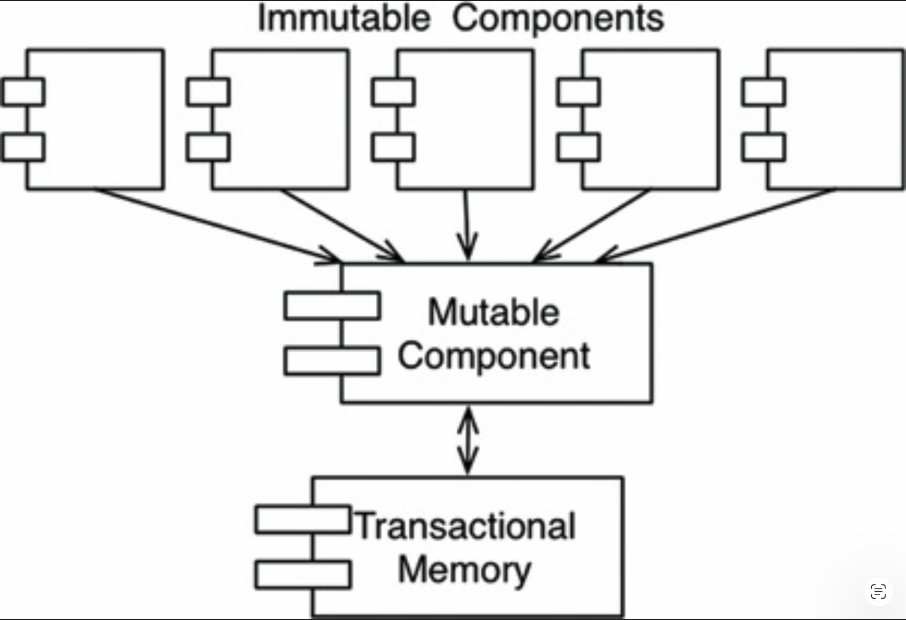

# 6 函数式编程

---
<center></center><br/>

从很多方面来看，函数式编程的概念甚至比编程本身还要古老。
这种范式主要基于 Alonzo Church 在 20 世纪 30 年代发明的 λ 演算。

## 整数的平方

为了解释什么是函数式编程，最好通过一些例子来考察。
让我们研究一个简单的问题：打印前 25 个整数的平方。

在像 Java 这样的语言中，我们可能会这样写：

```Java
public class Squint {
  public static void main(String args[]) {
    for (int i=0; i<25; i++)
      System.out.println(i*i);
  }
}
```

在像 Clojure 这样的语言中（Clojure 是 Lisp 的一个派生语言，且是函数式的），我们可能会这样实现同一个程序：

```Clojure
(println (take 25 (map (fn [x] (* x x)) (range))))
```

如果你不了解 Lisp，那么这段代码可能看起来有点奇怪。
让我重新排版一下，并加上一些注释。

```Clojure
(println ;___________________ Print
  (take 25 ;_________________ the first 25
    (map (fn [x] (* x x)) ;__ squares
      (range)))) ;___________ of Integers
```

应该清楚的是，`println`、`take`、`map` 和 `range` 都是函数。
在 Lisp 中，调用函数的方式是将函数名放在括号内。例如，`(range)` 调用了 `range` 函数。

表达式 `(fn [x] (* x x))` 是一个匿名函数，它调用乘法函数 `*`，将其输入参数传入两次。
换句话说，它计算的是输入的平方。

再次整体来看这段代码，最好从最内层的函数调用开始理解。

- `range` 函数返回一个从 0 开始的无尽整数列表。
- 这个列表被传入 `map` 函数，`map` 对每个元素调用匿名平方函数，生成一个由所有平方数组成的新的无尽列表。
- 平方数列表被传入 `take` 函数，`take` 返回一个仅包含前 25 个元素的新列表。
- `println` 函数打印它的输入，即前 25 个整数的平方数列表。

如果你对 “无尽列表” 这个概念感到害怕，别担心。
这些无尽列表中实际只创建了前 25 个元素。
这是因为无尽列表中的元素只有在被访问时才会被求值。

如果你觉得这一切令人困惑，那么你可以期待一段学习 Clojure 和函数式编程的美好时光。
我在这里的目标并不是教你这些主题。

相反，我在此的目标是指出 Clojure 程序与 Java 程序之间一个非常显著的差异。
Java 程序使用了一个可变变量 —— 一个在程序执行期间会改变状态的变量。
这个变量就是循环控制变量 `i`。
而 Clojure 程序中不存在这样的可变变量。
在 Clojure 程序中，像 `x` 这样的变量被初始化，但从未被修改。

这引出了一个令人惊讶的结论：函数式语言中的变量是 *不会变的*。

## 不可变性与架构

为什么这一点作为架构考虑很重要？
架构师为什么要关心变量的可变性？
<ins>答案简单得荒谬：所有的竞态条件、死锁条件和并发更新问题都是由于可变变量引起的。
如果没有变量被更新，就不可能出现竞态条件或并发更新问题。
没有可变的锁，就不会有死锁</ins>。

换句话说，我们在并发应用中面临的所有问题 ——在需要多线程和多处理器的应用中面临的所有问题—— 如果不存在可变变量，就都不会发生。

作为架构师，你应该对并发问题非常感兴趣。
你要确保你设计的系统在多线程和多处理器环境下是健壮的。
那么，你必须问自己的问题是：不可变性是否可行？

如果你拥有无限的存储和无限的处理器速度，这个答案是肯定的。
但缺乏这些无限资源时，答案则更为微妙。
是的，如果做出某些妥协，不可变性是可以实践的。

让我们来看看其中一些妥协。

## 可变性的隔离

关于不可变性最常见的妥协之一，是将应用程序（或应用程序内的服务）分离为可变组件和不可变组件。
不可变组件以纯粹的函数式方式执行任务，不使用任何可变变量。
不可变组件与一个或多个其他并非纯粹函数式的组件进行通信，并允许变量的状态被改变（ [Fig 6.1](#fig-61) ）。

#### Fig 6.1
<br/>
*Fig 6.1 可变状态与事务内存*

由于可变状态会使这些组件暴露于并发的所有问题，通常的做法是使用某种事务内存来保护可变变量免受并发更新和竞态条件的影响。

事务内存只是将内存中的变量视为数据库处理磁盘上 <sup>[1](#1)</sup> 的记录一样。
它通过基于事务或重试的方案来保护这些变量。

这种方法的一个简单例子是 Clojure 的 atom 机制：

```Clojure
(def counter (atom 0)) ; initialize counter to 0
(swap! counter inc)    ; safely increment counter.
```

在这段代码中，`counter` 变量被定义为一个 atom。
在 Clojure 中，atom 是一种特殊类型的变量，其值允许在非常严格的条件下发生改变，这些条件由 `swap!` 函数强制执行。

上面代码中展示的 `swap!` 函数接受两个参数：要被改变的 atom，以及一个计算新值的函数，该新值将被存储到 atom 中。
在我们的示例代码中，`counter` atom 将被改变为 `inc` 函数计算出的值，`inc` 函数只是将其参数加一。

`swap!` 使用的策略是一种传统的比较并交换算法。
首先读取 `counter` 的值并传递给 `inc`。
当 `inc` 返回时，`counter` 的值被锁定，并与传递给 `inc` 的值进行比较。
如果值相同，则 `inc` 返回的值被存储到 `counter` 中，然后释放锁。
否则，释放锁，并从头开始重试该策略。

atom 机制对于简单的应用是足够的。
不幸的是，当多个相互依赖的变量参与进来时，它无法完全防止并发更新和死锁。
在这些情况下，可以使用更复杂的机制。

<ins>关键在于，结构良好的应用程序应该被划分为不改变变量的组件和会改变变量的组件</ins>。
这种隔离可以通过使用适当的规范来保护那些被改变的变量而得到支持。

<ins>架构师明智的做法是：将尽可能多的处理放入不可变组件中，并将尽可能多的代码从那些必须允许改变的组件中驱除出去</ins>。

## 事件溯源

存储和处理能力的限制正迅速从视野中消退。
如今，处理器每秒执行数十亿条指令、拥有数十亿字节 RAM 已很常见。
我们的内存越多、机器越快，对可变状态的需求就越少。

举一个简单的例子：想象一个银行应用程序，它维护着客户的账户余额。
当执行存款和取款交易时，它会改变这些余额。

现在设想一下，我们不存储账户余额，而只存储交易记录。
每当有人想要查询某个账户的余额时，我们就从最开始时刻起，将该账户的所有交易累加起来。
这种方案不需要任何可变变量。

显然，这种方法听起来很荒谬。
随着时间的推移，交易记录的数量会无限增长，计算总额所需的处理能力也将变得无法忍受。
为了让这个方案永远运作下去，我们需要无限的存储和无限的处理能力。

但也许我们不必让这个方案永远运作下去。
而且也许我们有足够的存储和足够的处理能力，让这个方案在应用程序合理的生命周期内运作。

<ins>这就是 *事件溯源 (event sourcing)* <sup>[2](#2)</sup> 背后的思想。
事件溯源是一种策略，我们存储交易记录，而不存储状态。
当需要状态时，我们只需从头开始应用所有交易记录</ins>。

当然，我们可以采用一些捷径。
例如，我们可以在每天午夜计算并保存状态。
这样，当需要状态信息时，我们只需要计算自午夜以来的交易即可。

现在考虑一下这种方案所需的数据存储：我们需要大量的存储。
实际上，离线数据存储的增长速度如此之快，以至于我们现在认为数万亿字节也算小 —— 所以我们拥有大量的存储空间。

更重要的是，这样的数据存储中没有任何东西会被删除或更新。
因此，我们的应用程序不是 CRUD（增删改查），而只是 CR（增查）。
同时，由于数据存储中既没有更新也没有删除操作，也就不会存在任何并发更新的问题。

如果我们拥有足够的存储和足够的处理器能力，我们就可以让应用程序完全不可变 —— 从而完全是函数式的。

<ins>如果这听起来仍然荒谬，那么请记住：这正是你的源代码控制系统的工作方式，这可能会有所帮助</ins>。

## 结论

总结如下：

- 结构化编程是对直接控制转移施加的规范。
- 面向对象编程是对间接控制转移施加的规范。
- 函数式编程是对变量赋值施加的规范。

这三种范式中的每一种都从我们这里拿走了一些东西。每一种都限制了编写代码的某个方面。没有一种范式增强了我们的能力或功能。

我们在过去半个世纪中学到的是 *不应该做什么* 。

意识到这一点，我们不得不面对一个不受欢迎的事实：软件并不是一门快速发展的技术。软件的规则今天与 1946 年 Alan Turing 编写出第一份在电子计算机上执行的代码时是一样的。<ins>工具变了，硬件变了，但软件的本质保持不变</ins>。

软件 ——计算机程序的构成物—— 由顺序、选择、迭代和间接寻址组成。
仅此而已，不多也不少。

---

#### 1
我知道……什么是磁盘？

#### 2
感谢 Greg Young 教会我这个概念。
