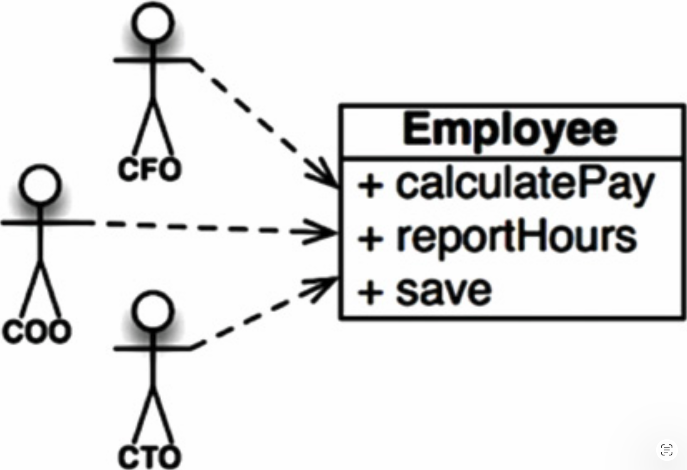
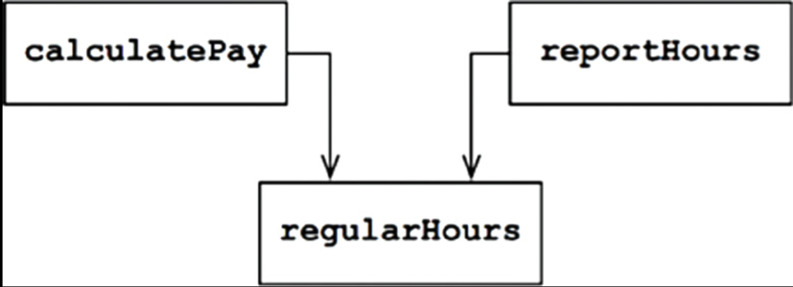
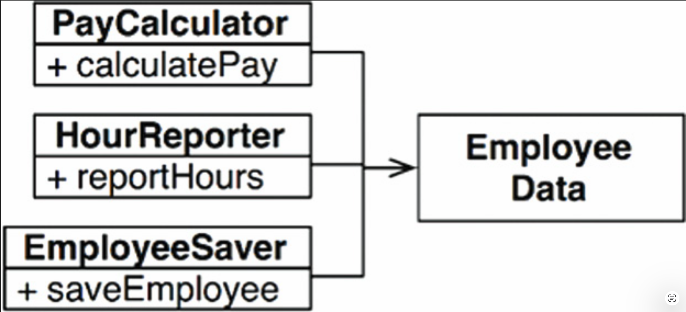
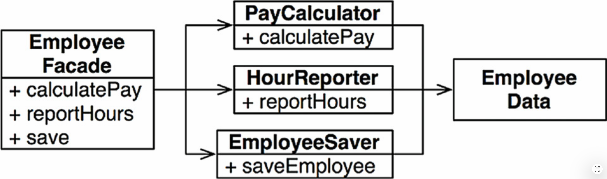
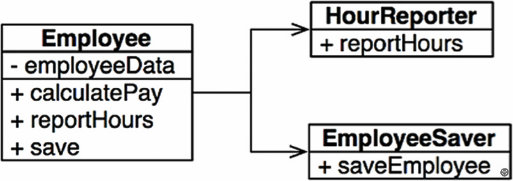

# 7 SRP: 单一职责原则

---

 

在所有的 SOLID 原则中，单一职责原则（SRP）可能是最不被理解的一个。
这很可能是因为它有一个特别不合适的名字。
程序员们很容易听到这个名字，然后就认为它的意思是每个模块都应该只做一件事。

请别搞错，确实存在这样一个原则。
一个函数应该做且只做一件事。
我们在将大函数重构为小函数时使用的就是这个原则；我们在最底层使用它。
但它并不是 SOLID 原则之一 —— 它不是 SRP。

历史上，SRP 曾被这样描述：
> 一个模块应该有且只有一个需要被修改的理由。

软件系统的变更是为了满足用户和利益相关者；
这些用户和利益相关者正是该原则所说的 “需要被修改的理由”。
实际上，我们可以将这一原则重新表述为：
> 一个模块应该对一个且只对一个用户或利益相关者负责。

不幸的是，“用户” 和 “利益相关者” 这两个词在这里并不完全恰当。
很可能会有多个用户或利益相关者希望以同样的方式修改系统。
我们实际上所指的是一群人 —— 一个或多个需要该变更的人。
我们将这一群体称为 “角色”。

因此，SRP 的最终版本是：
> 一个模块应该对一个且只对一个角色负责。

那么，我们所说的 “模块” 一词是什么意思？
最简单的定义就是一个源文件。
大多数情况下，这个定义是适用的。
不过，有些语言和开发环境不使用源文件来存放代码。
在这种情况下，一个模块就是一组内聚的函数和数据结构。

“内聚 (cohesive)” 这个词暗示了 SRP。
内聚 (cohesion) 是将服务于单一角色的代码绑定在一起的力量。

理解这一原则的最佳方式，或许就是看看违反它时会出现的症状。

## 症状一：意外重复

我最喜欢的例子来自一个薪资应用程序中的 Employee 类。它有三个方法：calculatePay()、reportHours() 和 save()（ [Fig 7.1](#fig-71) ）。

#### Fig 7.1
 
*Fig 7.1 Employee 类*

这个类违反了 SRP，因为这三个方法分别服务于三个截然不同的角色。

- calculatePay() 方法由财务部门指定，该部门向 CFO 汇报。
- reportHours() 方法由人力资源部门指定和使用，该部门向 COO 汇报。
- save() 方法由数据库管理员（DBA）指定，他们向 CTO 汇报。

将这三个方法的源代码放在同一个 Employee 类中，开发者就将这些角色相互耦合在了一起。
这种耦合可能导致 CFO 团队的行为影响到 COO 团队所依赖的内容。

例如，假设 calculatePay() 函数和 reportHours() 函数共享了一个用于计算非加班工时的公共算法。
再假设细心的开发者为了避免代码重复，将该算法放入了一个名为 regularHours() 的函数中（ [Fig 7.2](#fig-72) ）。

#### Fig 7.2
 
*Fig 7.2 共享算法*

现在假设 CFO 团队决定需要对非加班工时的计算方式进行微调。而相比之下，HR 部门的 COO 团队并不希望进行这一特定的微调，因为他们使用非加班工时的目的不同。

一位开发者被指派进行修改，并看到了被 calculatePay() 方法调用的那个 convenient regularHours() 函数。不幸的是，这位开发者没有注意到该函数也被 reportHours() 函数调用了。

开发者进行了所需的修改并仔细测试。CFO 团队验证了新的函数按预期工作，系统随即被部署上线。

当然，COO 团队并不知道这一切的发生。
HR 人员继续使用由 reportHours() 函数生成的报告 —— 但现在报告里的数字是错误的。
最终问题被发现，COO 暴跳如雷，因为错误的数据导致他的预算损失了数百万美元。

我们都见过类似的事情发生。
这些问题之所以出现，是因为我们将不同角色所依赖的代码放在了过于靠近的地方。
SRP 要求将不同角色所依赖的代码分离开。

## 症状二：合并冲突

不难想象，在包含许多不同方法的源文件中，合并操作会很常见。
当这些方法服务于不同的角色时，这种情况尤其容易发生。

例如，假设 CTO 手下的 DBA 团队决定需要对数据库中的 Employee 表进行一次简单的 schema 变更。
再假设 COO 手下的 HR 文员团队决定需要修改工时报告的格式。

两位不同的开发者（可能来自两个不同的团队）同时检出 Employee 类并开始进行修改。
不幸的是，他们的修改发生了冲突，结果就是一次合并。

我大概不需要告诉你，合并是有风险的事情。
现在的工具已经相当好了，但没有工具能处理每一种合并情况。
归根结底，风险始终存在。

在我们的例子中，这次合并同时给 CTO 和 COO 带来了风险。
CFO 也并非不可能受到影响。

我们还可以研究许多其他症状，但它们都涉及不同的人因不同的原因更改同一个源文件。

<ins>再次强调，避免这个问题的方法是将支持不同角色的代码分离开来</ins>。

## 解决方案

针对这个问题有许多不同的解决方案。
每种方案都将函数移入不同的类。

或许最显而易见的解决办法是将数据与函数分离。
这三个类共享对 `EmployeeData` 的访问，`EmployeeData` 是一个没有方法的简单数据结构（ [Fig 7.3](#fig-73) ）。
每个类只保留其特定功能所需的源代码。
这三个类不允许相互了解对方。
这样，任何意外的重复都可以避免。

#### Fig 7.3
 
*Fig 7.3 三个类互不知晓*

这种解决方案的缺点在于，开发者现在需要实例化并追踪三个类。
针对这一困境，一个常见的解决方案是使用 *Facade* 模式（ [Fig 7.4](#fig-74) ）。

#### Fig 7.4
 
*Fig 7.4 Facade 模式*

`EmployeeFacade` 包含很少量的代码。
它负责实例化那些包含具体函数的类，并将调用委托给它们。

有些开发者更倾向于将最重要的业务规则放在离数据更近的地方。
这可以通过将最重要的方法保留在原始的 `Employee` 类中，然后将该类作为其他次要功能的外观来实现（图 7.5）。

#### Fig 7.5
 
*Fig 7.5 最重要的方法保留在原始的 `Employee` 类中，并作为其他次要功能的外观*

你可能会反对这些解决方案，理由是每个类只包含一个函数。
但事实并非如此。
计算工资、生成报告或保存数据各自所需的功能函数数量很可能是庞大的。
这些类中的每一个都会包含许多私有方法。

每个包含这样一组方法的类就是一个作用域。
在该作用域之外，没有人知道这组方法的私有成员的存在。

## 结论

单一职责原则关注的是函数和类 —— 但它还会在更高两个层面上以不同形式重现。
在组件层面，它变成了 *共同闭包原则 (Common Closure Principle)* 。
在架构层面，它变成了负责创建 *架构边界 (Architectural Boundaries)* 的 *变化轴 (Axis of Change)* 。
我们将在接下来的章节中研究所有这些概念。
