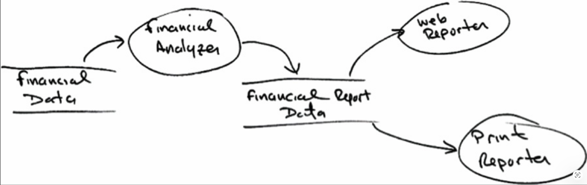
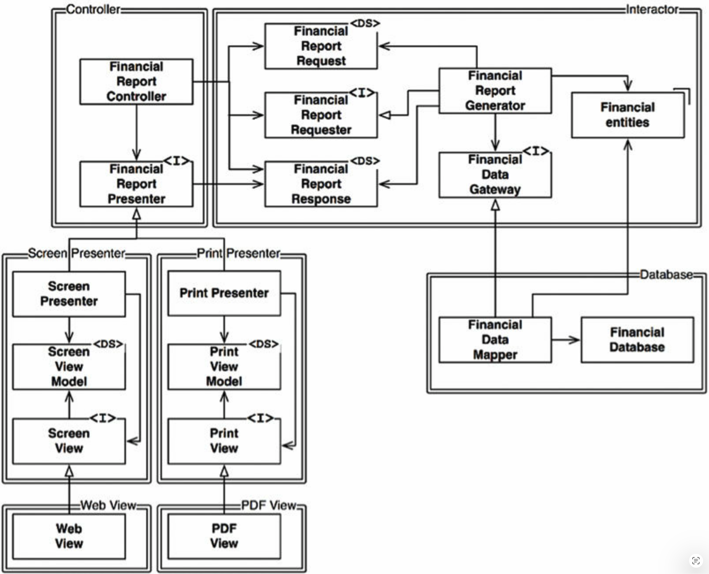
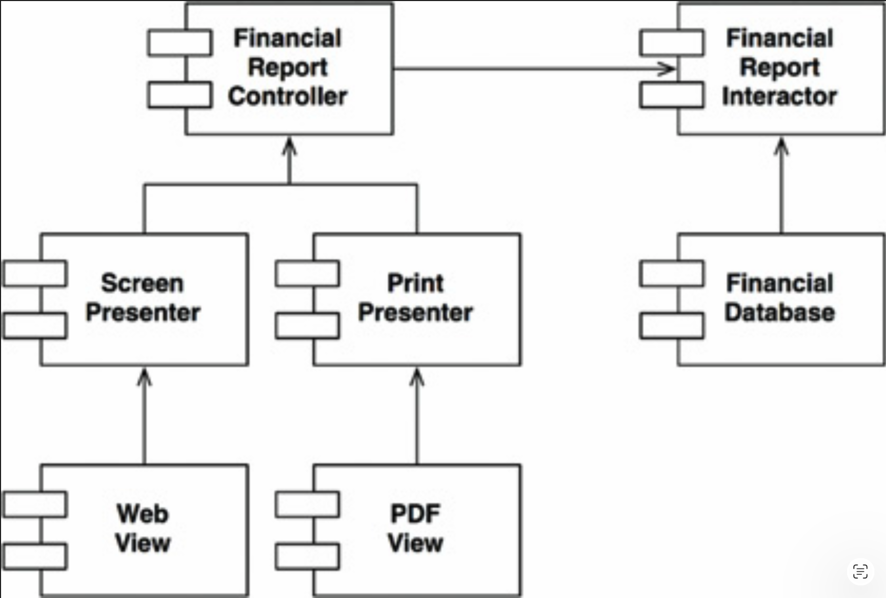

# 8 OCP：开闭原则

---

 

开闭原则（Open-Closed Principle, OCP）由 Bertrand Meyer 于 1988 年提出。[1](#1)
其表述为：

> 一个软件工件应该对扩展开放，对修改关闭。

换句话说，一个软件工件的行为应该是可扩展的，而无需修改该工件本身。

这当然是我们研究软件架构最根本的原因。
显然，如果简单的需求扩展就迫使软件发生大规模修改，那么该软件系统的架构师就遭遇了一次重大的失败。

大多数软件设计的学生将 OCP 视为指导他们设计类和模块的原则。
但当我们将视角提升到架构组件层面时，这一原则具有更为重要的意义。

一个思维实验将阐明这一点。

## 一个思维实验

想象一下，我们有一个系统，可以在网页上显示财务摘要。
页面上的数据可以滚动，负数以红色显示。

现在假设利益相关者要求将这些相同的信息转换为一份报告，并在黑白打印机上打印出来。
该报告应该有合适的分页，包含适当的页眉、页脚和列标签。
负数应该用括号括起来。

显然，必须编写一些新代码。但是有多少旧代码需要修改？

一个好的软件架构会将需要修改的代码量降到最低限度。
理想情况下，为零。

如何做到？
通过恰当地分离因不同原因而变化的部分（单一职责原则），然后正确地组织这些部分之间的依赖关系（依赖反转原则）。

通过应用 SRP，我们可能会得到如 [Fig 8.1](#fig-81) 所示的数据流视图。
某个分析过程检查财务数据并生成可报告的数据，然后由两个报告处理程序分别进行适当的格式化。

#### Fig 8.1
 
*Fig 8.1 应用 SRP*

<ins>这里的关键洞察是：生成报告涉及两个独立的职责 —— 报告数据计算，以及将这些数据分别以适合网页和适合打印的形式呈现</ins>。

<ins>完成这种分离之后，我们需要组织源代码依赖关系，以确保对其中一个职责的更改不会引起另一个职责的更改</ins>。
此外，新的组织方式还应确保行为可以被扩展，而无需过多的修改。

我们通过将过程划分为类，并将这些类分离到不同的组件中来实现这一点，如 [Fig 8.2](#fig-82) 中双线所示。
在该图中，左上角的组件是`Controller`。右上角是`Interactor`。右下角是`Database`。
最后，左下角有四个组件，分别代表`Presenter`和`View`。

#### Fig 8.2
 
*Fig 8.2 将过程划分为类，并将类分离到组件中*

标记为 `<I>` 的类是接口；标记为 `<DS>` 的是数据结构。
开口箭头表示使用关系。
闭口箭头表示实现或继承关系。

首先要注意的是，所有的依赖关系都是源代码依赖关系。
从 A 类指向 B 类的箭头意味着 A 类的源代码提及了 B 类的名称，而 B 类对此一无所知。
因此，在 [Fig 8.2](#fig-82) 中，`FinancialDataMapper` 通过实现关系知道 `FinancialDataGateway`，但 `FinancialGateway` 完全不知道 `FinancialDataMapper` 的存在。

接下来要注意的是，每条双线都只朝一个方向被跨越。
这意味着所有组件关系都是单向的，如 [Fig 8.3](#fig-83) 的组件图所示。
这些箭头指向我们希望保护免于变化的组件。

#### Fig 8.3
 
*Fig 8.3 组件关系是单向的*

<ins>让我再说一次：如果组件 A 应该被保护免受组件 B 变化的影响，那么组件 B 应该依赖于组件 A</ins>。

我们希望保护 `Controller` 免受 `Presenter` 变化的影响。
我们希望保护 `Presenter` 免受 `View` 变化的影响。
我们希望保护 `Interactor` 免受 —— 嗯，任何东西变化的影响。

`Interactor` 处于最符合 `OCP` 的位置。
对 `Database`、或 `Controller`、或 `Presenter`、或 `View` 的更改都不会对 `Interactor` 产生影响。

为什么 `Interactor` 应享有如此特权的位置？
因为它包含业务规则。
`Interactor` 包含了应用程序的最高层策略。
所有其他组件处理的是周边关注点，而 `Interactor` 处理的是核心关注点。

尽管 `Controller` 相对于 `Interactor` 来说是周边的，但相对于 `Presenter` 和 `View` 来说，它仍然是核心的。
而且，尽管 `Presenter` 相对于 `Controller` 可能是周边的，但相对于 `View` 来说，它们又是核心的。

请注意，这如何根据 “层次” 的概念创建了一个保护层次结构。
`Interactor` 是最高层次的概念，因此它们受到最充分的保护。
`View` 是最低层次的概念，因此它们受到的保护最少。
`Presenter` 的层次高于 `View`，但低于 `Controller` 或 `Interactor`。

<ins>这就是 `OCP` 在架构层面上的运作方式。
架构师根据功能变化的方式、原因和时间来分离功能，然后将分离后的功能组织成一个组件层次结构。
在该层次结构中，较高层次的组件受到保护，免受较低层次组件变化的影响</ins>。

## 方向控制

如果你对之前展示的类设计感到恐惧，请再看一遍。
该图中大部分复杂性都是为了确保组件之间的依赖关系指向正确的方向。

例如，`FinancialReportGenerator` 和 `FinancialDataMapper` 之间的 `FinancialDataGateway` 接口的存在，是为了反转原本会从 `Interactor` 组件指向 `Database` 组件的依赖关系。
`FinancialReportPresenter` 接口以及两个 `View` 接口也是同样的情况。

## 信息隐藏

`FinancialReportRequester` 接口则服务于不同的目的。
它的存在是为了保护 `FinancialReportController` 不过多了解 `Interactor` 的内部细节。
如果没有这个接口，`Controller` 就会对 `FinancialEntities` 产生传递性依赖。

传递性依赖违反了软件实体不应依赖它们不直接使用的东西这一通用原则。
在讨论接口隔离原则和共同复用原则时，我们还会再次遇到这一原则。

因此，尽管我们的首要任务是保护 `Interactor` 免受 `Controller` 变化的影响，但我们也希望通过隐藏 `Interactor` 的内部细节来保护 `Controller` 免受 `Interactor` 变化的影响。

## 结论

<ins>`OCP` 是系统架构背后的驱动力之一。
其目标是使系统易于扩展，同时避免变更带来较大的影响。
这一目标通过将系统划分为多个组件，并将这些组件组织成一个依赖层次结构来实现，该层次结构保护了较高层组件免受较低层组件变化的影响</ins>。

---
#### 1
Bertrand Meyer. *Object Oriented Software Construction* , Prentice Hall, 1988, p. 23.
