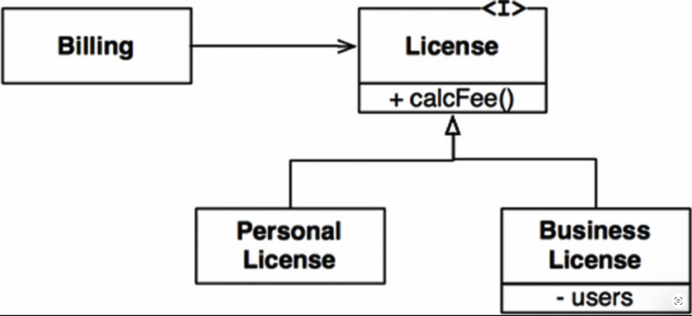
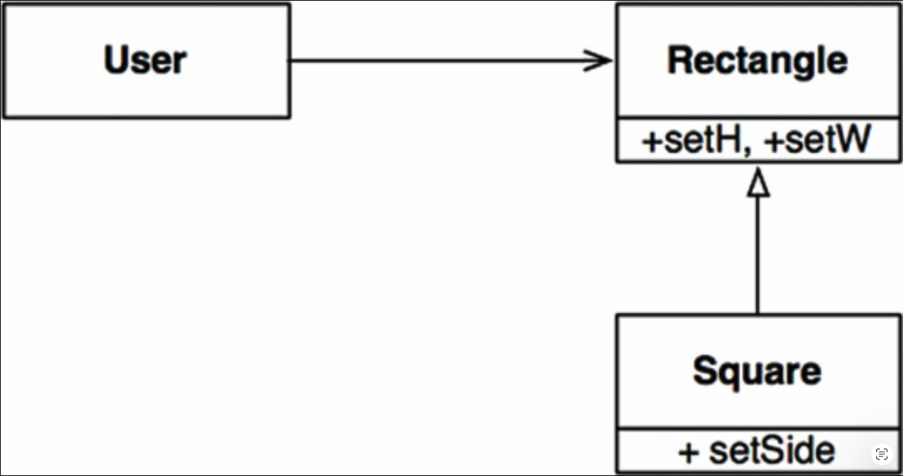

# 9 LSP：里氏替换原则

---
<center></center><br/>

1988 年，Barbara Liskov 提出了以下定义子类型的方式：

> 这里需要的是类似下面这样的替换性质：如果对于类型 S 的每一个对象 o1，都存在一个类型 T 的对象 o2，使得对于所有以 T 定义的程序 P，当 o1 替换掉 o2 时，P 的行为保持不变，那么 S 就是 T 的子类型。<sup>[1](#1)</sup>

为了理解这个被称为里氏替换原则（Liskov Substitution Principle, LSP）的思想，让我们来看一些例子。

## 指导继承的使用

假设我们有一个名为 `License` 的类，如 [Fig 9.1](#fig-91) 所示。
这个类有一个名为 `calcFee()` 的方法，由 `Billing` 应用程序调用。
`License` 有两个 “子类型”：`PersonalLicense` 和 `BusinessLicense`。
它们使用不同的算法来计算许可费用。

#### Fig 9.1
<br/>
*Fig 9.1 `License` 及其派生类符合 `LSP`*

这个设计符合 `LSP`，因为 `Billing` 应用程序的行为完全不依赖于它使用的是哪个子类型。这两个子类型都可以替换 `License` 类型。

## **正方形/矩形问题**

违反 `LSP` 的典型例子是著名的（也有人认为是典型反面）正方形/矩形问题（ [Fig 9.2](#fig-92) ）。

#### Fig 9.2
<br/>
*Fig 9.2 臭名昭著的正方形/矩形问题*

在这个例子中，`Square` 并不是 `Rectangle` 的恰当子类型，因为 `Rectangle` 的 `height` 和 `width` 是可以独立变化的；而相比之下，`Square` 的 `height` 和 `width` 必须同时改变。由于 `User` 认为自己在与 `Rectangle` 通信，它很容易产生困惑。下面的代码说明了原因：

```java
Rectangle r = …

r.setW(5);

r.setH(2);

assert(r.area() == 10);
```

如果上述代码产生了一个 `Square`，那么断言就会失败。

防范这种 `LSP` 违规的唯一方法是在 `User` 中添加某种机制（例如 `if` 语句）来检测 `Rectangle` 实际上是否是一个 `Square`。由于 `User` 的行为依赖于它所使用的类型，这些类型因此是不可替换的。

## LSP 与架构

在面向对象革命的早期，我们认为 `LSP` 是指导继承使用的一种方式，正如前面几节所示。

然而，多年来，`LSP` 已经演变为一个更广泛的软件设计原则，涉及接口及其实现。

这里所说的接口可以有多种形式。
我们可能有一个 Java 风格的接口，由多个类实现；
或者我们可能有几个 Ruby 类共享相同的方法签名；
或者我们可能有一组服务，都响应相同的 `REST` 接口。

在所有这些情况以及更多情况下，`LSP` 都是适用的，因为总有一些用户依赖于定义良好的接口，以及这些接口的实现的可替换性。

<ins>从架构角度理解 `LSP` 的最佳方式是观察当一个系统违反该原则时，其架构会发生什么</ins>。

## 违反 LSP 的示例

假设我们正在为多个出租车调度服务构建一个聚合器 (aggregator)。
客户使用我们的网站来找到最合适的出租车，无论其属于哪家出租车公司。
一旦客户做出决定，我们的系统通过一个 `RESTful` 服务来调度所选出租车。

现在假设 `RESTful` 调度服务的 `URI` 是驾驶员数据库中所包含信息的一部分。
一旦我们的系统选择了适合客户的驾驶员，它就会从驾驶员记录中获取该 `URI`，然后使用它来调度该驾驶员。

假设驾驶员 `Bob` 的调度 `URI` 如下所示：

```
purplecab.com/driver/Bob
```

我们的系统会将调度信息附加到该 `URI` 上，并通过 `PUT` 请求发送，如下所示：

```
purplecab.com/driver/Bob
       /pickupAddress/24 Maple St.
       /pickupTime/153
       /destination/ORD
```

显然，这意味着所有不同公司的调度服务都必须遵循相同的 `REST` 接口。
它们必须以完全相同的方式处理 `pickupAddress`、`pickupTime` 和 `destination` 字段。

现在假设 `Acme` 出租车公司雇佣了一些没有仔细阅读规范的程序员。
他们将 `destination` 字段缩写成了 `dest`。
`Acme` 是我们地区最大的出租车公司，而且 `Acme` CEO 的前妻是我们 CEO 的新妻子，然后……嗯，你懂的。
我们系统的架构会发生什么？

显然，我们需要添加一个特殊处理。
对于任何 `Acme` 驾驶员的调度请求，都必须使用与其他所有驾驶员不同的规则来构造。

实现这一目标最简单的方法是在构造调度命令的模块中添加一个 `if` 语句：

```java
if (driver.getDispatchUri().startsWith("acme.com"))…
```

但是，任何一个称职的架构师都不会允许这样的结构存在于系统之中。
将 `acme` 这个词硬编码到代码中，会为各种可怕而诡异的错误（更不用说安全漏洞）创造机会。

例如，如果 `Acme` 变得更加成功，收购了 `Purple` 出租车公司，会怎么样？
如果合并后的公司保持了独立的品牌和独立的网站，但统一了所有原公司的系统，我们是否需要为 `purple` 再添加一个 `if` 语句？

我们的架构师必须通过创建某种由配置数据库（以调度 `URI` 为键）驱动的调度命令创建模块，来使系统免受此类 bug 的影响。
配置数据可能如下所示：

```plaintext
URI        Dispatch Format
Acme.com   /pickupAddress/%s/pickupTime/%s/dest/%s
*.*        /pickupAddress/%s/pickupTime/%s/destination/%s
```

于是，我们的架构师不得不添加一个庞大而复杂的机制，来处理这些 `RESTful` 服务接口并非全部可替换这一事实。

## 结论

`LSP` 可以而且应该被扩展到架构层面。
一个简单的可替换性违规，就可能导致系统的架构被大量额外的机制所污染。

---
#### 1
Barbara Liskov, “Data Abstraction and Hierarchy,” *SIGPLAN Notices* 23, 5 (May 1988).
