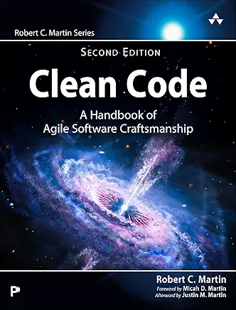

# 整洁代码：敏捷软件工匠手册（中文版）

 

Robert C. Martin (2025)

## 目录
* [序言](./foreword.md)
* [引言](intro.md)
* [引言（来自久远的过去）](./intro-old.md)
* [第 1 章 整洁代码](ch1/0.md)
  - [还是会有代码](ch1/0.md#还是会有代码)
  - [糟糕的代码](ch1/1.md)
  - [整洁代码的艺术？](ch1/2.md)
  - [把这些整合在一起](ch1/3.md)
  - [我们读的比写的多](ch1/4.md)
  - [童子军规则](ch1/5.md)
* [第一部分 代码](part1.md)
  - [第2章 清理那些代码！](ch2/0.md)
    - [清理过程](ch2/1.md)
    - [结论](ch2/2.md)
    - [后记：Future Bob 与 Grok3 的玩耍](ch2/3.md)
    - [后记结论](ch2/4.md)
  - [第 3 章 第一原则](ch3/0.md)
    - [一切都要小、命名良好、组织有序、排列有序](ch3/0.md#一切都要小命名良好组织有序排列有序)
    - [一个更重要的示例](ch3/1.md)
    - [最后的思考](ch3/2.md)
  - [第 4 章 有意义的命名](ch4/0.md)
    - [使用意图明确的命名](ch4/1.md)
    - [最后的忠告](ch4/2.md)
  - [第 5 章 注释](ch5/0.md)
    - [为失败做补偿](ch5/1.md)
    - [好的注释](ch5/2.md)
    - [糟糕的注释](ch5/3.md)
    - [结论](ch5/4.md)
  - [第 6 章 格式](ch6/0.md)
    - [格式化的目的](ch6/0.md#格式化的目的)
    - [垂直格式](ch6/1.md)
    - [水平格式](ch6/2.md)
    - [团队规则](ch6/3.md)
    - [ Uncle Bob 的格式化规则](ch6/4.md)
  - [第 7 章 整洁函数](ch7/0.md)
    - [小！](ch7/1.md)
    - [从上到下阅读代码：步降规则](ch7/2.md)
    - [Switch 语句](ch7/3.md)
    - [整洁函数：更深入的探讨](ch7/4.md)
    - [结论](ch7/5.md)
  - [第 8 章 函数启发法](ch8/0.md)
    - [函数参数](ch8/0.md#函数参数)
    - [命令查询分离](ch8/1.md)
    - [优先使用异常而非返回错误码](ch8/2.md)
    - [DRY：不要重复自己](ch8/3.md)
    - [副作用](ch8/4.md)
    - [结构化编程](ch8/5.md)
    - [太多需要牢记的东西了](ch8/6.md)
    - [结论](ch8/7.md)
  - [第 9 章 整洁方法](ch9/0.md)
    - [让它正确](ch9/1.md)
    - [示例](ch9/2.md)
    - [结论](ch9/3.md)
  - [第 10 章 一件事](ch10/0.md)
    - [提取方法重构](ch10/1.md)
    - [大型函数到底是什么？](ch10/2.md)
    - [结论](ch10/3.md)
  - [第 11 章 礼貌待人](ch11/0.md)
    - [报纸隐喻](ch11/1.md)
    - [步降规则：再来一次](ch11/2.md)
    - [抽象过山车](ch11/3.md)
    - [这是我们编写的方式，但不是我们想要阅读的方式](ch11/4.md)
  - [第 12 章 对象与数据结构](ch12/0.md)
    - [什么是对象？](ch12/1.md)
    - [数据抽象](ch12/2.md)
    - [数据/对象反对称性](ch12/3.md)
    - [迪米特法则 (Law of Demeter)](ch12/4.md)
    - [数据传输对象](ch12/5.md)
    - [Switch 语句](ch12/6.md)
    - [面向对象/过程式的权衡](ch12/7.md)
    - [但性能呢？](ch12/8.md)
    - [结论](ch12/9.md)
  - [第 13 章 整洁类](ch13/0.md)
    - [类与模块 vs 文件](ch13/1.md)
    - [一个类应该包含什么？](ch13/2.md)
  - [第 14 章 测试准则](ch14/0.md)
    - [准则 1：测试驱动开发 (TDD)](ch14/1.md)
    - [准则 2：测试 && 提交 || 还原 (TCR)](ch14/2.md)
    - [准则 3：小捆绑](ch14/3.md)
    - [设计](ch14/4.md)
    - [准则](ch14/5.md)
    - [保持测试整洁](ch14/6.md)
    - [测试赋能](ch14/7.md)
  - [第 15 章 整洁测试](ch15/0.md)
    - [领域特定测试语言](ch15/1.md)
    - [F.I.R.S.T.](ch15/2.md)
    - [测试设计](ch15/3.md)
    - [结论](ch15/4.md)
  - [第 16 章 验收测试](ch16/0.md)
    - [验收测试准则](ch16/1.md)
    - [结论](ch16/2.md)
  - [第 17 章 AI、LLM 与天知道还有什么](ch17/0.md)
    - [通过提示编程](ch17/1.md)
    - [结论](ch17/2.md)
* [第二部分 设计](part2.md)
  - [第 18 章 简单设计](ch18/0.md)
    - [YAGNI](ch18/1.md)
    - [测试覆盖](ch18/2.md)
    - [揭示意图](ch18/3.md)
    - [最小化重复](ch18/4.md)
    - [最小化规模](ch18/5.md)
  - [第 19 章 SOLID 原则](ch19/0.md)
    - [SRP：单一职责原则](ch19/1.md)
    - [OCP：开闭原则](ch19/2.md)
    - [LSP：里氏替换原则](ch19/3.md)
    - [ISP：接口隔离原则](ch19/4.md)
    - [DIP：依赖反转原则](ch19/5.md)
  - [第 20 章 组件原则](ch20/0.md)
    - [组件](ch20/1.md)
    - [组件简史](ch20/2.md)
    - [组件内聚](ch20/3.md)
    - [组件耦合](ch20/4.md)
    - [结论](ch20/5.md)
  - [第 21 章 持续设计](ch21/0.md)
    - [持续变化](ch21/1.md)
    - [持续设计](ch21/2.md)
    - [在持续设计的四个 C 上航行](ch21/3.md)
    - [我们还在什么时候进行设计？](ch21/4.md)
  - [第 22 章 并发](ch22/0.md)
    - [为什么需要并发？](ch22/1.md)
    - [并发防御原则](ch22/2.md)
    - [了解你的语言和库](ch22/3.md)
    - [了解你的执行模型](ch22/4.md)
    - [当心同步方法之间的依赖关系](ch22/5.md)
    - [保持同步部分小](ch22/6.md)
    - [编写正确的启动和关闭代码很难](ch22/7.md)
    - [测试线程代码](ch22/8.md)
    - [2025 年更新与现场报告](ch22/9.md)
    - [结论](ch22/10.md)
* [第三部分 架构](part3.md)
  - [第 23 章 软件的两种价值](ch23/0.md)
  - [第 24 章 独立性](ch24/0.md)
    - [用例](ch24/0.md#用例)
    - [运行](ch24/0.md#运行)
    - [开发](ch24/0.md#开发)
    - [部署](ch24/0.md#部署)
    - [保留选项](ch24/0.md#保留选项)
  - [第 25 章 架构边界](ch25/0.md)
    - [你画哪些线，以及何时画？](ch25/1.md)
    - [插件架构](ch25/2.md)
    - [案例研究：FitNesse](ch25/3.md)
    - [结论](ch25/4.md)
  - [第 26 章 整洁边界](ch26/0.md)
    - [第三方 IoT 框架：多个边界](ch26/1.md)
    - [UI / 应用边界](ch26/2.md)
    - [整洁边界](ch26/3.md)
  - [第 27 章 整洁架构](ch27/0.md)
    - [依赖规则](ch27/1.md)
    - [结论](ch27/2.md)
* [第四部分 工匠精神](part4.md)
  - [第 28 章 伤害](ch28/0.md)
    - [对社会无害](ch28/1.md)
    - [对功能无害](ch28/2.md)
    - [对结构无害](ch28/3.md)
    - [软](ch28/4.md)
    - [测试](ch28/5.md)
  - [第 29 章 行为或结构无缺陷](ch29/0.md)
    - [让它正确](ch29/1.md)
    - [程序员是利益相关者](ch29/2.md)
    - [尽你最大努力](ch29/3.md)
  - [第 30 章 可重复的证明](ch30/0.md)
    - [Dijkstra](ch30/1.md)
    - [结构化编程](ch30/2.md)
    - [功能分解](ch30/3.md)
    - [测试驱动开发等](ch30/4.md)
  - [第 31 章 小周期](ch31/0.md)
    - [源代码控制的历史](ch31/1.md)
    - [持续集成](ch31/2.md)
    - [分支 vs 切换](ch31/3.md)
    - [持续部署](ch31/4.md)
    - [持续构建](ch31/5.md)
  - [第 32 章 不懈改进](ch32/0.md)
    - [测试覆盖率](ch31/0.md#测试覆盖率)
    - [变异测试](ch32/0.md#变异测试)
    - [语义稳定性](ch32/0.md#语义稳定性)
    - [清理](ch32/0.md#清理)
    - [作品](ch32/0.md#作品)
  - [第 33 章 保持高生产力](ch33/0.md)
    - [粘性](ch33/1.md)
    - [管理干扰](ch33/2.md)
    - [时间管理](ch33/3.md)
  - [第 34 章 团队协作](ch34/0.md)
    - [协作编程](ch34/0.md#协作编程)
    - [开放式/虚拟办公室](ch34/0.md#开放式虚拟办公室)
