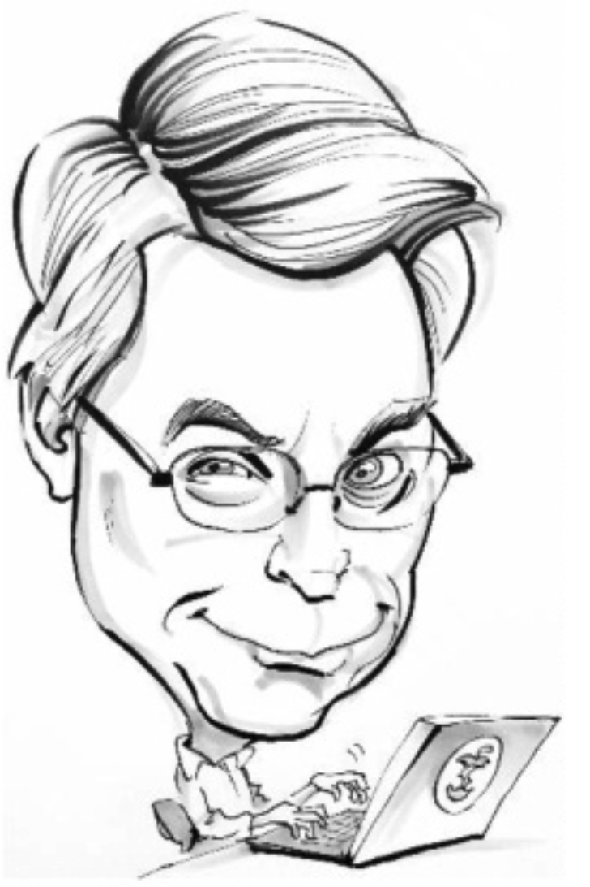
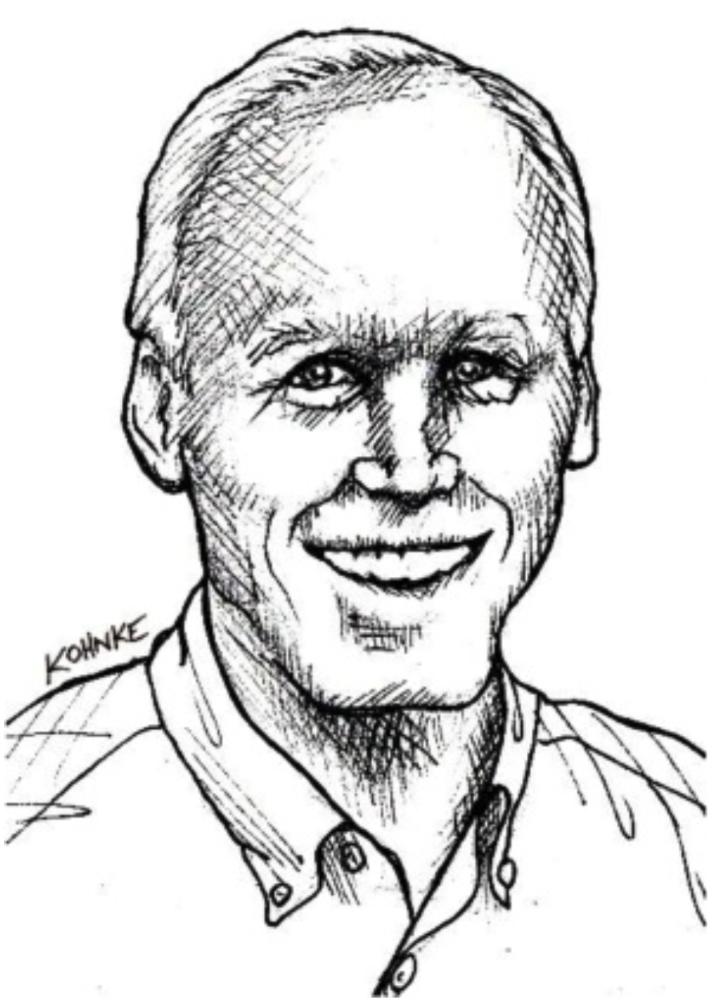

# 附录. 整洁代码辩论

| (Uncle) Bob Martin | Dr. John Kenneth Ousterhout|
|:---|:---|
|||

本文档是 Robert “Uncle Bob” Martin 和 John Ousterhout 在 2024 年 9 月至 2025 年 2 月期间进行的一系列讨论（部分在线，部分面对面）的结果。
如果您想对本次讨论中的任何内容发表评论，我们建议您在 APOSD ¹ 相关的 Google 群组上进行。

¹ [APOSD](../bib.md#aposd) 。
