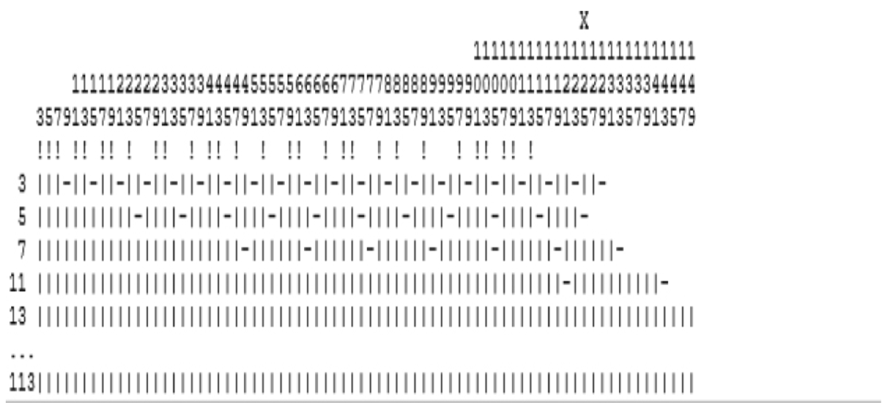

## 注释

**JOHN：**<br/>
让我们转到第二个分歧领域：注释。
在我看来，《Clean Code》关于注释的方法导致代码文档不足，这增加了软件开发成本。
我确信你不同意，所以让我们讨论一下。

这是《Clean Code》关于注释的说法（第 54 页）：

> “注释的正确用途是弥补我们在代码中表达自己的失败。
请注意，我使用了 ‘失败’ 这个词。
我是认真的。
注释总是失败。
我们必须有它们，因为我们并不总能想出不用它们就能表达自己的方法，但它们的使用并不是值得庆祝的理由……每次你写注释时，你都应该做鬼脸，并感受到你表达能力的失败。”

我必须说实话：当我第一次读到这段文字时，我感到震惊，它仍然让我畏缩。
这使得写注释被污名化了。
初级开发人员会想：“如果我写注释，人们可能会认为我失败了，所以最安全的事情是不写注释。”

**UB：**<br/>
那一章以这些话开头：

> “没有什么比一个恰到好处的注释更有帮助的了。”

它接着说注释是一种必要的恶。

读者能推断出他们应该不写注释的唯一方式是，如果他们没有真正读过那一章。
那一章通过一系列注释，有些是坏的，有些是好的。

**JOHN：**<br/>
《CLean Code》更多地关注注释的 “恶” 方面，而不是 “必要” 方面。
你上面引用的句子之后是两句批评注释的句子。
[第 4 章](../ch4/0.md) 花了 4 页谈论好的注释，接着是 15 页谈论坏的注释。
有像 “唯一真正好的注释是你找到方法不写的注释” 这样的冷嘲热讽。
而 “注释总是失败” 是如此引人注目，以至于它是读者最可能从那一章记住的一件事。

**UB：**<br/>
页数的差异是因为写好的注释的方法只有几种，而写坏的注释的方法要多得多。

**JOHN：**<br/>
我不同意；这说明了你对注释的偏见。
如果你看 APOSD 的第 13 章，它会发现比《Clean Code》更多建设性的使用注释的方法。
如果你比较 APOSD 第 13 章和《Clean Code》[第 4 章](../ch4/0.md) 的基调，《Clean Code》对注释的敌意就变得相当明显了。

**UB：**<br/>
我将让你用 “注释” 章中的开头陈述和最后示例来平衡最后一条评论。
它们并不传达 “敌意”。

我一般对注释并不敌视。
我对无理由的注释非常敌视。

你和我很可能都经历过注释绝对必要的时代。
在 70 年代和 80 年代，我是一名汇编语言程序员。
我也写过一些 FORTRAN。
那些语言中没有注释的程序是无法理解的。

结果，默认写注释成了传统智慧。
事实上，计算机科学学生被教导不加批判地写注释。
注释变成了纯粹的好东西。

在《Clean Code》中，我决定与那种心态作斗争。
注释可能真的很坏，也可能很好。

**JOHN：**<br/>
我不同意注释今天比 40 年前更不必要。
注释是至关重要的，并为软件增加了巨大的价值。
问题是，有很多重要的信息根本无法在代码中表达。
通过添加注释来填补这些缺失的信息，开发人员可以极大地提高代码的可读性。
这不像你所说的那样是 “他们表达自己能力的失败”。

**UB：**<br/>
确实有很多重要信息没有被表达出来，或者无法在代码中表达。
那是一种失败。
我们的语言或我们使用它们来表达自己的能力的一种失败。
在每种情况下，注释都是我们使用语言表达意图的能力的失败。

我们经常在这方面失败，所以注释是一种必要的恶 —— 或者，如果你愿意，一种不幸的必然。
如果我们有完美的编程语言™，我们将永远不会再写注释。

**JOHN：**<br/>
我不同意完美的编程语言会消除对注释的需求。
注释和代码服务于非常不同的目的，所以对我来说，我们不应该对两者使用相同的语言。
根据我的经验，英语作为注释的语言效果很好。
你为什么觉得关于程序的信息应该完全用代码表达，而不是用代码和英语的组合？

**UB：**<br/>
我哀叹我们有时必须使用人类语言而不是编程语言的事实。
人类语言是不精确的，充满歧义。
使用人类语言来描述像程序这样精确的东西是非常困难的，并且充满了错误和无意误导的机会。

**JOHN：**<br/>
我同意英语并不总是像代码那样精确，但它仍然可以以精确的方式使用，注释通常不需要像代码那样高的精确度。
注释通常包含定性信息，比如为什么做某事，或某事的整体想法。
对于这些，英语比代码效果更好，因为它是一种更具表达力的语言。

**UB：**<br/>
我对那个说法没有异议。

**JOHN：**<br/>
你是否担心注释会不正确或误导，从而减慢软件开发的速度？
我经常听到人们抱怨过时的注释（通常作为根本不写注释的借口），但在我的职业生涯中，我并没有发现它们是一个重大问题。
不正确的注释确实会发生，但我不经常遇到它们，而且当我遇到时，它们很少花费我很多时间。
相比之下，我因为文档不足而浪费了大量时间；我花 50% 到 80% 的开发时间在代码中摸索，以找出如果代码有适当注释就会显而易见的事情，这并不罕见。

**UB：**<br/>
你和我有一些非常不同的经历。
我当然从恰到好处的注释中得到了帮助。
我也同样肯定地（就在这份文档中）被一个不正确、错位、无理由或其他方面糟糕的注释分散了注意力和混淆了。

**JOHN：**<br/>
我邀请每个阅读此文的人问自己以下问题：
- 你的软件开发速度因不正确的注释而受影响多少？
- 你的软件开发速度因缺少注释而受影响多少？

对我来说，缺少注释的成本很容易是不正确注释成本的 10 到 100 倍。
这就是为什么当我看到《Clean Code》中阻止人们写注释的内容时，我会畏缩。
让我们考虑 PrimeGenerator 类。那段代码中没有一个注释；这对你来说合适吗？

**UB：**<br/>
我认为这对于我编写它的目的是合适的。
它是对大型方法可以分解为包含更小方法的更小类的教训的补充。
添加大量解释性注释会分散那个要点。

然而，总的来说，我在清单 4-8 中使用的注释风格更合适。
那个清单，在 “注释” 章的最后，描述了另一个 PrimeGenerator，具有稍微不同的算法和更好的一组注释。

**JOHN：**<br/>
我不同意添加注释会分散你的要点，而且我认为清单 4-8 也严重缺乏注释。
但我们不要争论这两个问题。
相反，让我们讨论一下如果 PrimeGenerator 代码用于生产，它应该有哪些注释。
我会提出一些建议，你可以同意或不同意。

首先，让我们讨论你对超长名称的使用，比如 `isLeastRelevantMultipleOfLargerPrimeFactor`。
我的理解是，你主张使用这样的名称，而不是使用带有描述性注释的较短名称：你实际上是在把注释移到了代码中。
对我来说，这种方法是有问题的。

- 长名称很尴尬。
开发人员每次调用方法时实际上都必须重新输入方法的文档，长名称浪费水平空间并触发代码中的换行。
这些名称读起来也很尴尬：我的大脑每次读它都想解析每个音节，这拖慢了我的速度。
注意在这讨论中，你我都采用了缩写名称：这表明长名称很尴尬且没有帮助。

- 这些名称难以解析，并且不能像注释那样有效地传达信息。
当学生阅读 PrimeGenerator 时，他们首先抱怨的事情之一就是长名称（学生无法理解它们）。
例如，上面的名称模糊且神秘：“least relevant” 是什么意思，“larger prime factor” 是什么？
即使完全理解了方法中的代码，我也很难理解这个名称。
如果这个名称要消除对注释的需求，它需要更长。

在我看来，使用带有描述性注释的较短名称的传统方法更方便，并能更有效地传达所需信息。
你所主张的方法有什么优势？

**UB：**<br/>
“Megasyllabic”：好词！

我喜欢我的方法名称是适合关键词和赋值语句的句子片段。
这使得代码读起来更自然一些。

```java
if (isTooHot)
    cooler.turnOn();
```

我还遵循一个关于名称长度的简单规则。
方法的作用域越大，它的名称应该越短，反之亦然：作用域越短，名称越长。
在这种情况下，我提取的私有方法存在于非常小的作用域中，因此有较长的名称。
像这样的方法通常只从一个地方调用，所以程序员没有记住一个长名称用于另一个调用的负担。

**JOHN：**<br/>
像 `isTooHot` 这样的名字对我来说完全没问题。
我担心的是像 `isLeastRelevantMultipleOfLargerPrimeFactor` 这样的名字。

有趣的是，随着方法越来越小、越来越窄，你推荐更长的名称。
这对我来说意味着这些函数的接口更复杂，所以需要更多的词来描述它们。
这为我之前关于你越多地拆分一个方法，得到的方法就越浅的断言提供了支持证据。

**UB：**<br/>
变小的不是函数。
变小的是作用域。
一个私有函数比调用它的公共函数的作用域更小。
被那个私有函数调用的函数的作用域甚至更小。
当我们向下进入作用域时，我们也向下进入情境细节。
描述这样的细节通常需要一个长名称，或一个长注释。
我更喜欢使用名称。

至于长名称难以解析，这是一个练习的问题。
代码充满了需要练习才能习惯的东西。

**JOHN：**<br/>
我不接受这一点。
代码可能充满了需要练习才能习惯的东西，但这并不能成为借口。
需要更多练习的方法比需要更少练习的方法更差。
如果习惯长名称需要大量的工作，那么最好有一些补偿性的好处；到目前为止，我没有看到任何好处。
而且我看不到任何理由相信练习会使那些名称更容易消化。

此外，你上面的评论违反了我的一个基本原则，即 “复杂性在读者的眼中”。
如果你写的代码别人认为是复杂的，那么你必须接受代码可能是复杂的（除非你认为读者完全无能）。
找借口或暗示这实际上是读者的问题（“你只是没有足够的练习”）是不可以的。
在我们的讨论中，我稍后也得遵守同样的规则。

**UB：**<br/>
说得对。
至于 `leastRelevant` 的含义，那是一个更大的问题，你和我很快会遇到的。
这与作者对解决方案的亲密程度以及读者缺乏那种亲密程度有关。

**JOHN：**<br/>
你仍然没有回答我的问题：为什么使用超长名称比使用带有描述性注释的较短名称更好？

**UB：**<br/>
这对我来说是一个偏好问题。
我更喜欢长名称而不是注释。
我不信任注释会被维护，我也不信任它们会被阅读。
你有没有注意到许多 IDE 用浅灰色显示注释，以便它们可以很容易地被忽略？
忽略一个名称比忽略一个注释更难。

（顺便说一句，我把我的 IDE 的注释颜色设置为亮红色。）

**JOHN：**<br/>
我不明白为什么一个怪物名称比一个注释更有可能被 “维护”，我也不认为 IDE 鼓励人们忽略注释（这又是你的偏见表现出来了）。
我当前的 IDE（VSCode）不为注释使用更浅的颜色。
我的前一个 IDE（NetBeans）确实用了，但配色方案并没有隐藏注释；它以一种使代码和注释都更容易阅读的方式区分了它们。

现在我们讨论了注释与长方法名称的具体问题，让我们一般性地谈谈注释。
我认为需要注释有两个主要原因。
注释的第一个原因是抽象。
简单地说，没有注释，就没有办法实现抽象或模块化。
抽象是良好软件设计中最重要的组成部分之一。
我将抽象定义为 “一种简化的思考方式，它省略了不重要的细节”。
抽象最明显的例子是一个方法。
应该可以在不阅读其代码的情况下使用一个方法。
我们实现这一点的方式是编写一个头注释，描述方法的接口（某人调用该方法所需的所有信息）。
如果方法设计良好，接口将比方法的代码简单得多（它省略了实现细节），所以注释减少了人们必须在大脑中保存的信息量。

**UB：**<br/>
很久以前，在 1995 年的一本书中，我将抽象定义为 “对本质的放大和对无关事物的消除”。

我当然同意抽象对好的软件设计很重要。
我也同意恰到好处的注释可以增强读者理解我们试图使用的抽象的能力。
我不同意注释是理解那些抽象的唯一方式，甚至是最好的方式。
但有时它们是唯一的选择。

但考虑一下：

```java
addSongToLibrary(String title, String[] authors, int durationInSeconds);
```

在我看来，这似乎是一个非常不错的抽象，我想不出注释怎么能改进它。

**JOHN：**<br/>
我们对抽象的定义非常相似；很高兴看到这一点。
然而，`addSongToLibrary` 的声明（还）不是一个好的抽象，因为它省略了必要的信息。
为了使用 `addSongToLibrary`，开发人员需要以下问题的答案：

- 作者字符串是否有预期的格式，比如“LastName, FirstName”？

- 作者是否应该按字母顺序排列？
如果不是，顺序是否以其他方式重要？

- 如果库中已经有一首具有给定标题但作者不同的歌曲，会发生什么？
它会用新的替换，还是库会保留多首具有相同标题的歌曲？

- 库是如何存储的（例如，它完全在内存中？保存在磁盘上？）？
如果这些信息在别处有记录，比如整个类的文档，那么这里就不需要重复。

因此，`addSongToLibrary` 需要相当多的注释。
有时方法的签名（方法、其参数和返回值的名称和类型）包含了使用它所需的所有信息，但这相当罕见。
只需浏览你最喜欢的库包的文档：在多少情况下，你仅凭签名就能理解如何使用一个方法？

**UB：**<br/>
是的，有时方法的签名是一个不完整的抽象，需要一个注释。
当接口是公共 API 的一部分，或者是一个打算由单独的开发团队使用的 API 时，尤其如此。
然而，在单个开发团队内部，接口上长的描述性注释往往更多是阻碍而不是帮助。
团队对系统的内部有深入的了解，通常仅凭签名就能理解一个接口。

**JOHN：**<br/>
在我们的一次面对面讨论中，你争辩说接口注释是不必要的，因为当一组开发人员在一个代码体上工作时，
他们可以集体将整个代码 “加载” 在他们的脑海中，所以注释是不必要的：如果你有问题，只需问熟悉那段代码的人。
这造成了巨大的认知负荷来保持所有代码在脑海中加载，我很难想象它实际上会工作。
也许你的记忆力比我的好，但我发现我很快就忘记了我几周前写的代码。
在任何规模的项目中，我认为你的方法将导致开发人员花费大量时间阅读代码来重新推导接口，并且可能在此过程中犯错误。
花几分钟记录接口将节省时间，减少认知负荷，并减少错误。

**UB：**<br/>
我认为某些接口需要注释，即使它们对团队是私有的。
但我认为更常见的情况是，团队对系统足够熟悉，命名良好的方法和参数就足够了。

**JOHN：**<br/>
让我们考虑 PrimeGenerator 中的一个具体例子：`isMultipleOfNthPrimeFactor` 方法。
当有人在阅读代码时在 `isNot...` 中遇到对 `isMultiple...` 的调用时，他们需要足够了解 `isMultiple...` 如何工作，以便看到它如何适应 `isNot...` 的代码。
方法名并没有完全记录接口，所以如果没有头注释，那么读者将不得不阅读 `isMultiple` 的代码。
这将迫使读者在脑海中加载更多的信息，这使得在代码中工作更加困难。

以下是我对 `isMultiple` 的头注释的第一次尝试：

```java
/**
 * Returns true if candidate is a multiple of primes[n], false otherwise.
 * May modify multiplesOfPrimeFactors[n].
 * @param candidate
 * Number being tested for primality; must be at least as
 * large as any value passed to this method in the past.
 * @param n
 * Selects a prime number to test against; must be
 * <= multiplesOfPrimeFactors.size().
 */
```

你觉得这个怎么样？

**UB：**<br/>
我认为它是准确的。
如果我遇到它，我不会删除它。
我认为它不应该是 Javadoc。

第一句话与 `isMultipleOfNthPrimeFactor` 这个名字是冗余的，所以可以删除。
关于副作用的警告是有用的。

**JOHN：**<br/>
我同意第一句话在很大程度上与名字重复，我内心也在争论是否保留它。
我决定保留它，因为我认为它比名字更精确一些；它也更容易阅读。
你建议通过删除注释来消除注释和方法名之间的冗余；我会通过缩短方法名来消除冗余。

顺便说一句，你之前抱怨注释不如代码精确，但在这种情况下，注释更精确（方法名不能包含像 `primes[n]` 这样的文本）。

**UB：**<br/>
说得对。
有时精确性更好地在注释中表达。
继续我对你上面注释的批评：`candidate` 这个名字与 “被测试素性的数字” 是同义的。

然而，最终，注释中的所有文字都将不得不留在我的脑海中，直到我理解它们为什么在那里。
我还将不得不担心它们是否准确。
所以我将不得不阅读代码来理解和验证注释。

**JOHN：**<br/>
哇。你刚才听到的响亮声音是我的下巴掉到地上的声音。
帮我更好地理解这一点：在实践中，你遇到的注释中，大约有多少比例是你愿意信任而不阅读代码来验证它们的？

**UB：**<br/>
我把每一个注释都视为潜在的错误信息。
充其量，它们是一种对照代码交叉检查作者意图的方式。
我对注释给予多少信任，很大程度上取决于它们使交叉检查变得多么容易。
当我读到一个不会促使我交叉检查的注释时，我认为它没有价值。
当我看到一个促使我交叉检查的注释，并且当那个交叉检查证明是有价值的时，那才是一个真正好的注释。

换一种说法，最好的注释告诉我一些关于代码的令人惊讶和可验证的事情。
最糟糕的是那些浪费我的时间告诉我显而易见或错误的事情。

**JOHN：**<br/>
听起来你的答案是 0%：你不信任任何注释，除非它已经对照代码验证过。
这对我来说没有意义。
正如我上面所说，绝大多数注释是正确的。
写注释并不难；我软件设计课上的学生在几周内就做得相当好。
随着代码的演进，保持注释更新也不难。
你拒绝信任注释是你对注释的非理性偏见的另一个迹象。

拒绝信任注释会产生非常高的成本。
为了理解如何调用一个方法，你将不得不阅读该方法的全部代码；如果该方法调用其他方法，你还将不得不阅读它们，以及它们调用的方法，递归地。
与阅读（和信任）像我上面写的那样简单的接口注释相比，这是大量的工作。

如果你选择不为方法写接口注释，那么你就让该方法的接口未定义。
即使有人阅读了该方法的代码，他们也无法分辨实现的哪些部分预期保持不变，哪些部分可能会改变（没有办法在代码中指定这个 “契约”）。
这将导致误解和更多的错误。

**UB：**<br/>
嗯，我想我只是比你受过更多伤害。
我经历过太多由虚假注释引发的兔子洞，在无价值的文字沙拉上浪费了太多时间。

当然，我对注释的信任不是二元的。
如果它们在那里，我会读它们；但我不会隐含地信任它们。
我觉得作者越随意，或者作者越不擅长英语，我就越不信任这些注释。

正如我上面所说，我们的 IDE 倾向于用可忽略的颜色显示注释。
我把我的 IDE 注释颜色设置为亮红色，因为当我写注释时，我意图让它被阅读。

同样，我使用长名称作为注释的替代，因为我意图让那些长名称被阅读；程序员很难忽略名称。

**JOHN：**<br/>
我之前提到过需要注释的两个一般原因。
到目前为止，我们一直在讨论第一个原因（抽象）。
注释的第二个一般原因是代码中不明显的重要信息。
PrimeGenerator 中的算法非常不明显，所以需要相当多的注释来帮助读者理解正在发生的事情和原因。
算法的大部分复杂性源于它被设计为高效地计算质数。

- 该算法特意避免除法，这在 Knuth 编写原始版本时相当昂贵（现在不那么昂贵了）。

- 每个新质数的第一个倍数是通过质数的平方计算的，而不是乘以 3。
这是神秘的：为什么跳过中间的奇数是安全的？
此外，看起来这种优化对性能的影响很小，但实际上，它产生了巨大的差异（数量级）。
使用平方有一个副作用，即在测试候选数时，只测试到候选数平方根的质数。
如果使用 3x 作为初始倍数，将测试候选数因子 3 以内的质数；那是更多的测试。
使用平方的这个含义是如此不明显，以至于我是在为这次讨论准备材料时才意识到它；在我与学生讨论代码的许多次中，它从未出现在我的脑海中。

这两个问题都不是从代码中显而易见的；没有注释，读者只能自己琢磨。
我班上的学生在给定的 30 分钟内通常无法理解其中的任何一个，但我认为注释会让他们在几分钟内理解。
回到我的开场白，这是一个信息重要的例子，所以它需要被提供。

你同意应该有注释来解释这两个问题吗？

**UB：**<br/>
我同意这个算法是微妙的。
将第一个质数倍数设置为质数的平方，起初是极其神秘的。
我不得不骑了一个小时的自行车去理解它。

注释会有帮助吗？
也许吧。
然而，我猜没有人读过我们的对话后会从中受益，因为你我现在对解决方案太熟悉了。
你我可以使用符合那种亲密性的词语来讨论那个解决方案；但我们的读者很可能还没有享受到那种契合。

一种解决方案是画一幅画 —— 一图胜千言。
这是我在尝试。

<br/>

我预期我们的读者将不得不盯着这个看一段时间，并查看代码。
但然后他们的大脑中会有一个顿悟，他们会说：“哦！是的！我现在明白了！”

**JOHN：**<br/>
我发现这个图很难理解。
它需要补充英文文本解释所呈现的想法。
即使是语法也不明显：1111111111111111111111111 是什么意思？

也许我们在这里有根本的哲学差异。
我感觉到你很高兴给读者一些线索，然后让他们自己去把线索拼凑起来。
也许你不介意人们不得不盯着某物看一段时间才能理解它。
我不同意这种方法：它导致浪费时间、误解和错误。
我认为软件应该是完全显而易见的，读者不需要聪明或 “盯着这个一段时间” 才能理解事物。
痛苦之后的宣泄对于希腊悲剧来说很好，但对于阅读代码来说则不然。
读者可能有的每一个问题都应该自然地被回答，无论是在代码中还是在注释中。
关键的想法和重要的结论应该明确地陈述出来，而不是留给读者去推导。
理想情况下，即使读者很匆忙，没有非常仔细地阅读代码，他们对事情如何工作（以及为什么）的初步猜测也应该是正确的。
对我来说，那就是整洁代码。

**UB：**<br/>
我不反对你的观点。
好的、整洁的代码应该尽可能易于理解。
我想给我的读者尽可能多的线索，以便代码读起来直观。

那是目标。
正如我们即将看到的，这可能是一个难以实现的目标。

**JOHN：**<br/>
在那种情况下，你仍然坚持你上面画的 “画” 吗？
它似乎与你刚才说的不一致。
如果你真的想给你的读者尽可能多的线索，你会包含更多的注释。

**UB：**<br/>
就其准确性而言，我坚持那幅画。
我认为它是一个很好的交叉检查。
我不幻想它容易理解。

这个算法具有挑战性，需要努力才能理解。
当我在骑自行车时在脑海中画出这幅画，我终于理解了它。
当我回到家，我把它画了出来并呈现出来，希望能帮助那些愿意努力理解它的人。
