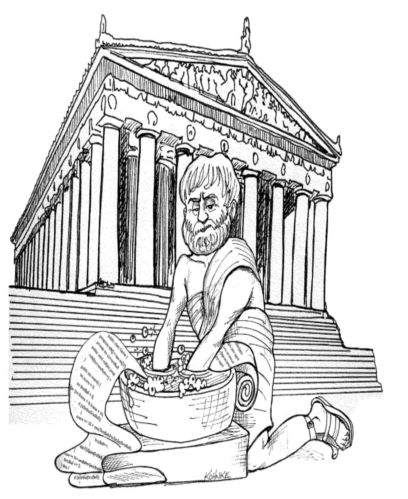

# 第 1 章 整洁代码

 

> “ ‘整洁’ 并不是对任何人的指责。
> 我们对 ‘不整洁’ 的定义，是用来描述那些需要普通开发人员付出更多努力才能理解或维护的代码的一种方式。”
> 
—Jeff Langr

你阅读这本书有两个原因。
首先，你是一名程序员。
其次，你想成为一名更好的程序员。
很好。
我们需要更好的程序员。

这是一本关于优秀编程的书。它充满了代码。
我们将从各个不同的方向审视代码。
我们会从顶部向下看，从底部向上看，从内到外看。
当我们完成时，我们将对代码有很多了解。
更重要的是，我们将能够区分好代码和坏代码。
我们将知道如何编写好代码。
而且我们将知道如何将坏代码转化为好代码。

## 还是会有代码

有人可能会争辩说，一本关于代码的书在某种程度上已经过时了 —— 代码不再是问题；
我们应该关注 AI、大语言模型 (LLM) 和需求。
事实上，有些人认为我们已经接近代码的终结。¹
很快，所有代码都将被生成而不是被编写。
程序员将不再被需要，因为业务人员将从规范 ——或提示—— 生成程序。

¹ 我在 2008 年写下这句话，现在已经是 2024 年了，这真令人啼笑皆非。有些东西从未改变。

胡说！
我们永远不会摆脱代码，
因为代码代表了需求的细节。
在某种程度上，这些细节不能被忽略或抽象化；它们必须被指定。
而以如此详细的方式指定需求以便机器能够执行它们，这就是编程。
这样的规范就是代码。

我期望我们的语言抽象级别将继续提高。
我也期望领域特定语言和强大的 AI 数量将继续增长。
这将是一件好事。
但它不会消除代码。
事实上，所有用这些更高级别和领域特定语言编写的规范，以及所有为指导一个真正好的 AI 而编写的提示，都将是代码！
它们仍然需要是严格的、精确的，并且如此正式和详细，以至于机器能够理解并执行它们。

那些认为代码有一天会消失的人，就像那些希望有一天能发现一种不必形式化的数学的 “数学家” ² 一样。
他们希望有一天能找到一种方法，创造出能做他们想要的而不是他们所说的机器。
这些机器必须能够如此好地理解我们，以至于它们能够将模糊指定的需求转化为完美执行并精确满足这些需求的程序。

² 之所以加引号，是因为没有真正的数学家会希望这样。

这永远不会发生。
即使是人类，凭借他们所有的直觉和创造力，也无法从客户的模糊感觉中创建出成功的系统。
事实上，如果需求规范这个学科教会了我们什么，那就是：规范良好的需求与代码一样形式化，并且可以作为该代码的可执行测试！

请记住，代码实际上是我们最终表达需求的语言。
我们可能会创建更接近需求的语言。
我们可能会创建工具来帮助我们解析这些需求并将其组装成形式化的结构。
但我们永远不会消除必要的精确性和形式性 —— 因此，代码将永远存在。
